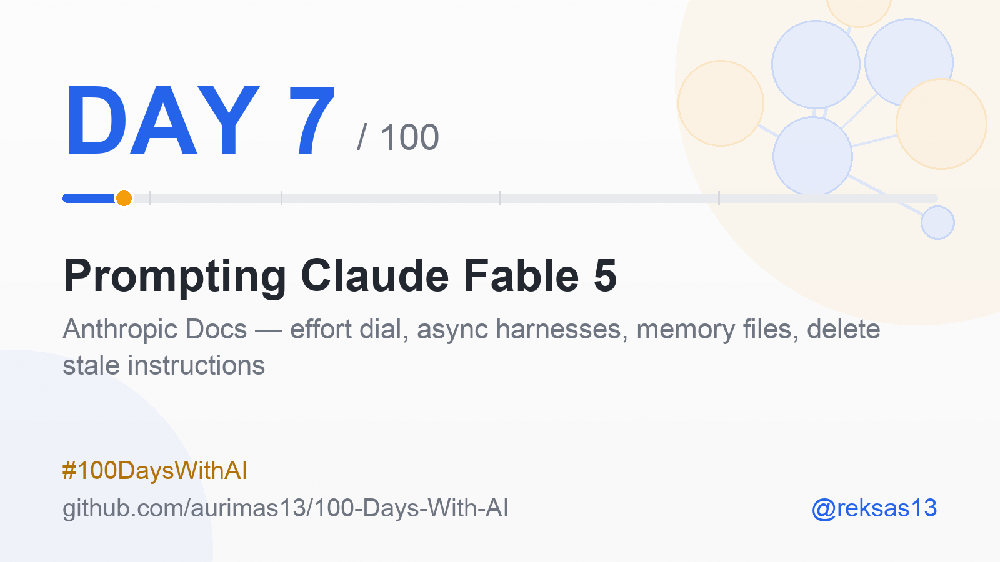
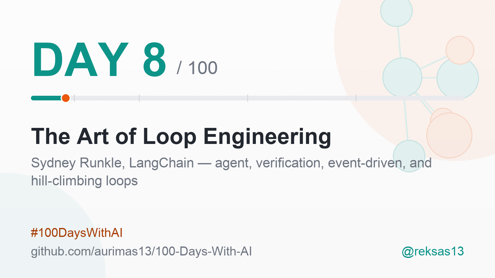
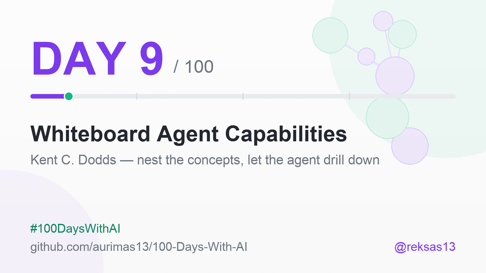
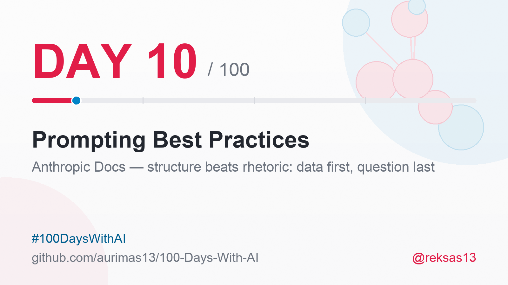
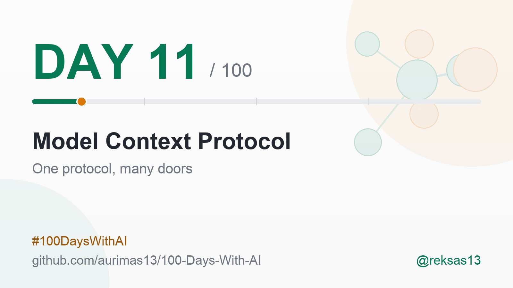
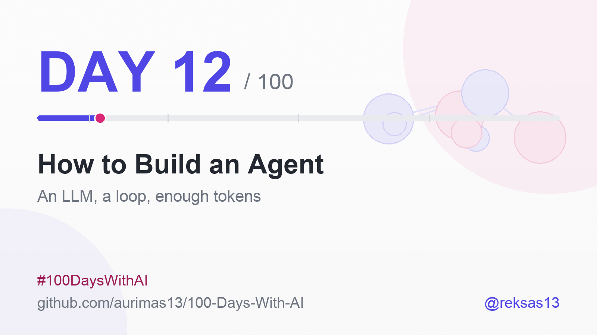
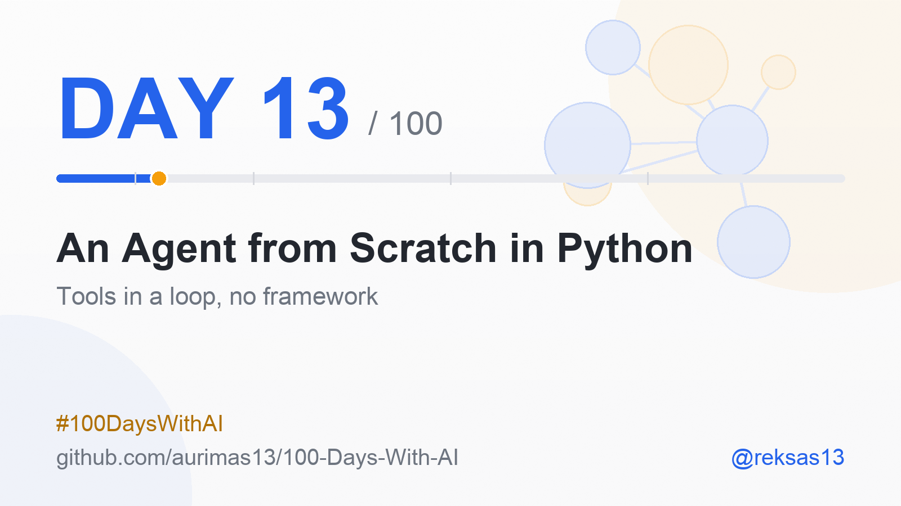

# 100 Days With AI 🤖

### One source a day. One honest note. For 100 days.

A public learning log of modern Artificial Intelligence - transformers, LLMs,
agentic AI, RAG, fine-tuning, evals, MLOps and the rest of it.

<!-- Day badge: bumped by the daily run. If this is stale, the run said so in its log. -->

**[📈 Progress](#-progress)** · **[📚 Day Notes](#-day-notes)** · **[🔗 Connect](#-connect)**

`2026-07-12` ──────────── **Day 13 of 100** ────────────► `2026-10-19`

Every day, one carefully chosen source - a paper, course, repo, post, tool, technical document, other source, mixed <b>[Medium]</b> or <b>[Advanced]</b> - studied and logged: what actually stuck, why it matters, what I tried. Posted ~7:00 EEST under <b>#100DaysWithAI</b>. No skipped numbers. No faked expertise.

---

<b>Why this repo exists</b>

 

Learning in public beats learning alone - and it leaves a receipt.

Most learning disappears the moment the tab closes. This is the opposite: one
entry per day, written the same morning, in the open, whether or not the day
went well. The constraint is the point. A source I do not understand still
gets an honest note saying so.

I am an AI engineer who came to this from chemistry, and that shows up in how
I read these sources - I look for the mechanism, not the headline. Some days
that produces a good metaphor. Most days it just produces a better question.

<b>How each day works</b>

 

1. **One source** - chosen the evening before, marked **[Advanced]** or **[Medium]**.
2. **Studied properly** - not skimmed. Quotes are verbatim or they are not quotes.
3. **Logged here** - a row in [Progress](#-progress), then a [day note](#-day-notes)
   with 3-5 takeaways, why it matters, and what I actually tried.
4. **Shared** - the same note, compressed, goes out on X, Bluesky, Threads and
   LinkedIn at ~7:00 EEST, with the day's card.

Every claim in a post traces back to the source or it does not ship.

<b>What you can take from it</b>

 

- **The sources list** - 100 curated, level-marked entry points into modern AI,
  in [Progress](#-progress). Steal it wholesale; that is what MIT is for.
- **The notes** - what a working engineer actually took away, including the
  parts that did not land.
- **The format** - if you want to run your own 100 days, this repo is a
  working template.

<b>Standing on other shoulders</b>

 

Inspired by [100-Days-Of-ML-Code](https://github.com/aurimas13/100-Days-Of-ML-Code)
for the day-numbered log, and by the resource tables of
[Machine-Learning-Goodness](https://github.com/aurimas13/Machine-Learning-Goodness)
for the shape of the progress table.

---

## 📈 Progress

| Day | Date | Title | Level | Description | Link |
|-----|------|-------|-------|-------------|------|
| 1 | 2026-07-12 | "2025–2035 Is the Decade of Agents" - Andrej Karpathy | Medium | Karpathy's Jan 2025 post: agents are a decade-scale build, with humans as high-level supervisors of low-level automation | [X post](https://x.com/karpathy/status/1882544526033924438) |
| 2 | 2026-07-13 | "Harness Design for Long-Running Application Development" - Prithvi Rajasekaran, Anthropic | Advanced | How Anthropic Labs kept a coding agent productive for 6 hours: context resets with structured handoffs, a GAN-inspired generator/evaluator split, and sprint contracts | [Anthropic Engineering](https://www.anthropic.com/engineering/harness-design-long-running-apps) |
| 3 | 2026-07-14 | "Writing Effective Tools for Agents - with Agents" - Ken Aizawa et al., Anthropic | Medium | Tools as contracts between deterministic systems and non-deterministic agents: fewer consolidated tools, semantic names over UUIDs, token budgets, and evals that let Claude refactor its own tools | [Anthropic Engineering](https://www.anthropic.com/engineering/writing-tools-for-agents) |
| 4 | 2026-07-15 | "Effective Context Engineering for AI Agents" - Anthropic Applied AI | Medium | Context as a finite attention budget: context rot, right-altitude system prompts, just-in-time retrieval, and compaction / notes / sub-agents for long-horizon work | [Anthropic Engineering](https://www.anthropic.com/engineering/effective-context-engineering-for-ai-agents) |
| 5 | 2026-07-16 | "A Practical Guide to Building Agents" - OpenAI | Medium | OpenAI's build-your-first-agent field guide: model + tools + instructions in a loop, single agent before multi-agent, manager vs decentralized patterns, layered guardrails with human handoff | [OpenAI guide](https://openai.com/business/guides-and-resources/a-practical-guide-to-building-ai-agents/) |
| 6 | 2026-07-17 | "Model Guidance: GPT-5.6" - OpenAI Developer Docs | Medium | OpenAI's GPT-5.6 migration guide: a reasoning-effort dial, pro mode, programmatic tool calling, 1.25× cache-write billing - and leaner prompts that score higher while costing a third less | [OpenAI Docs](https://developers.openai.com/api/docs/guides/latest-model) |
| 7 | 2026-07-18 | "Prompting Claude Fable 5" - Anthropic Docs | Medium | Migrating to the newest Claude: an effort dial, hours-long autonomous turns, grounded progress claims, memory files - and deleting the over-prescriptive prompts written for older models | [Anthropic Docs](https://platform.claude.com/docs/en/build-with-claude/prompt-engineering/prompting-claude-fable-5) |
| 8 | 2026-07-19 | "The Art of Loop Engineering" - Sydney Runkle, LangChain | Medium | Four stacked agent loops - agent, verification, event-driven, hill-climbing - with human oversight at every level; value compounds in the loops that embed and improve the agent, not the agent itself | [X post](https://x.com/sydneyrunkle/status/2066928783534289358) |
| 9 | 2026-07-20 | "How do you build an agent over hundreds of data models?" - Kent C. Dodds | Medium | A crowdsourced architecture thread where two people independently land on the same answer - nest the concepts into a hierarchy and expose it as tools the agent drills down through - while Kent's own lean is to start direct and simple, and divide only once that stops working | [X thread](https://x.com/kentcdodds/status/1969482734642086301) |
| 10 | 2026-07-21 | "Prompting Best Practices" - Anthropic Docs | Medium | Structure over rhetoric: longform data at the top and the query at the bottom (reported up to 30% better responses), XML tags as boundaries, quote-grounding for long documents, and the reason behind a rule beating the rule alone | [Anthropic Docs](https://platform.claude.com/docs/en/build-with-claude/prompt-engineering/claude-prompting-best-practices) |
| 11 | 2026-07-22 | "What Is MCP? Model Context Protocol in Agentic AI, Explained" - Ksenia Se, Turing Post | Medium | The integration layer for agents: one open protocol replaces a custom connector per tool, turning an N×M wiring problem into N+M, with runtime discovery, a clear split from A2A, and an honest list of what it does not solve | [Turing Post](https://www.turingpost.com/p/mcp) |
| 12 | 2026-07-23 | "How to Build an Agent" - Thorsten Ball, Amp | Medium | A working code-editing agent in under 400 lines of Go - an LLM, a loop, and three file tools; the argument that the core of every coding agent is small and the real engineering lives in the refinement around it | [Amp](https://ampcode.com/notes/how-to-build-an-agent) |
| 13 | 2026-07-24 | "Building an AI Agent from Scratch in Python" - Leonie Monigatti | Medium | The Day 12 loop rebuilt in Python against the raw Anthropic API - an agent class, message-list memory, one schema'd calculator tool, and a run loop that pauses at tool_use, feeds the result back, and stops at a ten-turn cap | [leoniemonigatti.com](https://www.leoniemonigatti.com/blog/ai-agent-from-scratch-in-python.html) |

---

## 📚 Day Notes

*Each day gets a section here: what the source is, 1–5 takeaways, why
it matters, and what I learned or tried.*

### Day 1 — "2025–2035 Is the Decade of Agents" (Andrej Karpathy, X, 2025-01-23)

Source: [x.com/karpathy/status/1882544526033924438](https://x.com/karpathy/status/1882544526033924438)
*(The live post is behind X's wall for automated readers; this note is
grounded in the post's full text.)*

**Takeaways:**

- Computer-use agents (like OpenAI's) are to the digital world
  what humanoid robots are to the physical one: a single general
  interface built for humans - monitor, keyboard, mouse vs. the human
  body - that can gradually take on arbitrarily general tasks.
- The result is a *mixed-autonomy* world: humans become high-level
  supervisors of low-level automation, like a driver monitoring the
  Autopilot. It arrives in the digital world first, because flipping
  bits is roughly 1000× cheaper than moving atoms.
- Sequencing beats vision: early OpenAI already attempted this
  (Universe, World of Bits) and it failed because LLMs had to happen
  first. A right idea at the wrong layer of the stack is still a wrong
  bet.
- Even in 2025, the stack wasn't obviously ready - multimodality was
  freshly bolted on via adapters, and very long task horizons remain
  unexplored territory. Karpathy suspected stuffing everything into
  context windows won't be enough; a breakthrough or two was needed.
- Hence the reframe: not "2025 was the year of agents" but **2025 – 2035
  is the decade of agents** - ending in a picture where you spin up
  organizations of agents and act as a CEO monitoring ten of them,
  dropping into the trenches to unblock.

**Why it matters:** this post sets the honest timescale for everything
this campaign covers - agent-building is a decade of engineering work
(context, evals, guardrails, orchestration), not a hype cycle to catch.

**What I learned/tried:** I picked this as Day 1 deliberately - it
recalibrated my expectations from "agents any month now" to a
decade-long build, and the next 99 days of sources (context
engineering, evals, guardrails, safety, multi-agent design, etc.) all live inside
that decade. Day 1 of 100 starts where the decade does.

### Day 2 — "Harness Design for Long-Running Application Development" (Prithvi Rajasekaran, Anthropic Engineering, 2026-03-24)

Source: [anthropic.com/engineering/harness-design-long-running-apps](https://www.anthropic.com/engineering/harness-design-long-running-apps)

**Takeaways:**

- Models exhibit **"context anxiety"** - they "begin wrapping up work
  prematurely as they approach what they believe is their context
  limit." The harness answer is a full **context reset with a
  structured handoff file**, not compaction: "While compaction preserves
  continuity, it doesn't give the agent a clean slate, which means
  context anxiety can still persist."
- **Self-evaluation fails.** "When asked to evaluate work they've
  produced, agents tend to respond by confidently praising the work -
  even when, to a human observer, the quality is obviously mediocre."
  The fix is GAN-inspired: split the **generator** from a standalone
  **evaluator tuned toward skepticism**.
- The evaluator scores four weighted criteria - design quality,
  originality, craft, functionality - deliberately weighted toward
  design and originality, because models already do craft and
  Functionality well; the weighting steers away from template output.
- The full-stack harness is **three agents**: a planner expanding the
  brief into a specification, a generator sprinting feature-by-feature, and a
  Playwright-based evaluator testing like a user. Each sprint starts
  with a **sprint contract** - generator and evaluator agree what
  "done" means *before* any code is written.
- The trade-off in numbers: a solo run took 20 min and $9 (non-working
  output); the full harness took 6 hr and $200 (working app). With a
  newer model, the harness was rebuilt *simpler* - sprints removed -
  at 3 hr 50 min and $124.70. "Every component in a harness encodes an
  assumption about what the model can't do on its own, and those
  assumptions are worth stress testing… they can quickly go stale as
  models improve."

**Why it matters:** long-running autonomy isn't a bigger context
window - it's architecture: resets over compaction, adversarial
evaluation over self-grading, contracts over vibes. And the harness
itself is a depreciating asset that must shrink as models improve.

**What I learned/tried:** I went deep on this one. The idea that stuck
hardest: every component I built onto an agent pipeline is a claim about
what the model *can't* do - so each one deserves a periodic
stress-test, or my scaffolding outlives its reason. I started auditing
my own automation pipelines this way.

### Day 3 — "Writing Effective Tools for Agents — with Agents" (Ken Aizawa et al., Anthropic Engineering, 2025-09-11)

Source: [anthropic.com/engineering/writing-tools-for-agents](https://www.anthropic.com/engineering/writing-tools-for-agents)

**Takeaways:**

- Tools are a new kind of software: "a contract between deterministic
  systems and non-deterministic agents." Designing them is closer to
  prompt engineering than to classic API design.
- More tools can hurt - "too many tools or overlapping tools can also
  distract agents from pursuing efficient strategies." Consolidate:
  one `schedule_event` (find slot + create) beats separate
  `list_events` + `create_event`; `search_contacts` beats
  `list_contacts`.
- Return meaning, not UUIDs: merely resolving arbitrary alphanumeric
  UUIDs to semantically meaningful names significantly improve
  Claude's retrieval precision by reducing hallucinations.
- Budget every token: a `response_format` enum cuts a Slack response
  from 206 tokens ("detailed") to 72 ("concise"); Claude Code truncates
  tool responses at 25,000 tokens by default; errors should return
  actionable guidance, not opaque tracebacks.
- Close the loop with agents themselves: prototype (quick local MCP
  server) → evaluate (realistic multi-step tasks; track accuracy,
  runtime, token use, tool errors) → optimize by concatenating eval
  transcripts into Claude Code and letting it refactor the tools,
  validated on held-out tasks. Refining tool descriptions alone took
  Claude Sonnet 3.5 to state-of-the-art on SWE-bench Verified.

**Why it matters:** tool quality, not model quality, is often the
ceiling on an agent's performance - and it is the part every builder
fully controls.

**What I learned/tried:** I checked these rules against the small agent
pipelines I run daily - fewer entry points, meaningful names,
token-lean outputs are exactly the discipline they demand. The detail
that surprised me most: even word order in a tool name (namespacing
like `asana_projects_search` vs `asana_search_projects`) has
non-trivial, model-dependent effects on evals. Words are
infrastructure now.

### Day 4 — "Effective Context Engineering for AI Agents" (Rajasekaran, Dixon, Ryan & Hadfield, Anthropic Engineering, 2025-09-29)

Source: [anthropic.com/engineering/effective-context-engineering-for-ai-agents](https://www.anthropic.com/engineering/effective-context-engineering-for-ai-agents)

**Takeaways:**

- Context engineering is the superset of prompt engineering: "the set
  of strategies for curating and maintaining the optimal set of tokens
  (information) during LLM inference" - not just writing a good prompt.
- **Context rot** is real and architectural: "as the number of tokens
  in the context window increases, the model's ability to accurately
  recall information from that context decreases." Transformers give
  every token attention to every other token - n² pairwise
  relationships - so context "must be treated as a finite resource
  with diminishing marginal returns."
- Bigger windows won't fix it: "context windows of all sizes will be
  subject to context pollution and information relevance concerns."
  The guiding heuristic instead: "find the smallest set of high-signal
  tokens that maximize the likelihood of your desired outcome."
- System prompts belong at the right altitude - a "Goldilocks zone"
  between brittle hardcoded if-else logic and vague guidance; tools
  stay self-contained and non-overlapping; a few diverse canonical
  examples beat exhaustive edge-case rules.
- Retrieval is moving just-in-time: keep lightweight identifiers
  (file paths, queries, links) and load data at runtime (Claude Code's
  hybrid: CLAUDE.md dropped in up front, grep/glob at runtime). For
  long-horizon work the trio is **compaction** (distill and
  reinitialize), **structured note-taking** (persistent NOTES.md-style
  memory), and **sub-agents** that explore with tens of thousands of
  tokens but return condensed 1,000–2,000-token summaries.

**Why it matters:** agents rarely fail because the model is weak -
they fail because attention is spent on low-signal tokens. Curating
the context is the highest-leverage engineering surface an agent
builder controls.

**What I learned/tried:** three days converged on one law from three
angles - Day 2's context resets, Day 3's token-lean tools, today's
attention budget. My own automation pipelines keep structured notes
and logs between runs the way this piece prescribes; now I can name
why that works: the budget is attention, and notes spend it only when
needed.

---

### Day 5 — "A Practical Guide to Building Agents" (OpenAI, Business Guides & Resources)

Source: [openai.com - A practical guide to building agents](https://openai.com/business/guides-and-resources/a-practical-guide-to-building-ai-agents/)
([PDF version](https://cdn.openai.com/business-guides-and-resources/a-practical-guide-to-building-agents.pdf))

**Takeaways:**

- The definition is the filter: "Agents are systems that independently
  accomplish tasks on your behalf." Apps that merely integrate an LLM
  without letting it control workflow execution - chatbots, single-turn
  LLMs and classifiers are not agents.
- Build one for only three kinds of workflow: complex decision-making,
  difficult-to-maintain rule sets, and heavy reliance on unstructured
  data. "Otherwise, a deterministic solution may suffice."
- Foundations are three components - model, tools, instructions - run
  in a loop until an exit condition (final-output tool, no-tool-call
  response, error, or max turns). Prototype with the most capable
  model to set a baseline, then swap in smaller models where they hold.
- Go multi-agent late: "maximize a single agent's capabilities first."
  The tool-overload signal is overlap, not count - some implementations
  "successfully manage more than 15 well-defined, distinct tools while
  others struggle with fewer than 10 overlapping tools." When you do
  split: manager pattern (agents as tools, one agent owns the user) or
  decentralized pattern (peer handoffs that transfer execution).
- Guardrails are a layered defense - relevance and safety classifiers,
  PII filters, moderation, rules-based blocks, output validation, and
  tool risk ratings (read-only vs write, reversibility, financial
  impact) - with human intervention on two triggers: exceeded failure
  thresholds and high-risk actions.

**Why it matters:** this is the sober baseline for the agent hype
cycle - most workflows don't need an agent, most agents don't need a
fleet, and the ones that ship well start small and grow on evals.

**What I learned/tried:** the tool-overlap number stopped me: 15+
distinct tools can work while 10 overlapping ones fail - the same
lesson as Day 3's consolidation rule, now with field numbers. My own
single-agent pipelines with a handful of distinct tools sit exactly in
the pattern this guide recommends; the discipline is in resisting the
fleet until a single agent demonstrably fails.

---

### Day 6 — "Model Guidance: GPT-5.6" (OpenAI Developer Docs)

Source: [developers.openai.com/api/docs/guides/latest-model](https://developers.openai.com/api/docs/guides/latest-model)

**Takeaways:**

- GPT-5.6 comes in three variants - `gpt-5.6-sol` (flagship),
  `gpt-5.6-terra` (balanced), `gpt-5.6-luna` (high-volume); the bare
  `gpt-5.6` alias routes to `-sol`. Reasoning effort is a six-step
  dial: "GPT-5.6 supports `none`, `low`, `medium`, `high`, `xhigh`,
  and `max`" - and the migration advice is to keep your baseline, then
  test one level lower.
- The economics headline: "In a sample of internal coding-agent eval
  runs, configurations with leaner system prompts improved evaluation
  scores by roughly 10–15% while reducing total tokens by 41–66% and
  cost by 33–67%." Less prompt, better output, smaller invoice.
- Corollary worth engraving: "Removing repeated instructions and
  examples and simplifying tool descriptions can improve task
  performance and token efficiency." Verbosity is not diligence.
- Caching is now an explicit investment decision: "OpenAI bills cache
  writes at 1.25× the uncached input rate, while cache reads remain
  discounted" - use breakpoints deliberately and watch
  `cached_tokens` vs `cache_write_tokens`.
- Two execution modes reshape the cost/quality trade: **pro mode**
  ("applies more model work to a request before returning a single
  final answer… can improve reliability on difficult tasks") buys
  reliability with latency and tokens, while **Programmatic Tool
  Calling** removes the model from the loop "for bounded, tool-heavy
  workflows that do not require fresh model judgment between each
  step." Persisted reasoning (`reasoning.context: all_turns`) reuses
  thinking across turns.

**Why it matters:** model docs now read like unit economics - the
quality dial, the caching ledger, and the leaner-prompt numbers all
say the same thing: token spend is a design decision, and the cheapest
configuration is often also the best one.

**What I learned/tried:** the week compounds - Day 3 said simplify
tool descriptions, Day 4 said curate the smallest high-signal context,
and today OpenAI puts numbers on it: 10–15% better at 33–67% cheaper.
I'm taking the 41–66% token figure as a standing dare to re-read my
own pipelines' prompts with a red pen.

---

### Day 7 — "Prompting Claude Fable 5" (Anthropic Documentation)

Source: [platform.claude.com — Prompting Claude Fable 5](https://platform.claude.com/docs/en/build-with-claude/prompt-engineering/prompting-claude-fable-5)

**Takeaways:**

- The headline migration advice is subtraction: "Skills developed for
  prior models are often too prescriptive for Claude Fable 5 and can
  degrade output quality." Capability improvements are "a good prompt
  to re-evaluate which instructions, tools, and guardrails are still
  needed" - the same lesson as Day 2's stale harness assumptions, now
  from the model vendor itself.
- Turns got longer by design: individual requests on hard tasks "can
  run for many minutes" and autonomous runs "can extend for hours" -
  adjust client timeouts and restructure harnesses to check on runs
  asynchronously (scheduled jobs) rather than blocking.
- Effort is the primary intelligence/latency/cost control (`high`
  default, `xhigh` for capability-sensitive work) - and "lower effort
  settings on Claude Fable 5 still perform well and often exceed
  `xhigh` performance on prior models."
- Trust in long runs is promptable: instructing the model to audit
  each progress claim against an actual tool result "nearly eliminated
  fabricated status reports even on tasks designed to elicit them."
- Two scaffolding patterns worth copying: a memory system (one lesson
  per file, referenced across runs) and a `send_to_user` tool so long
  asynchronous agents can surface verbatim content mid-run - paired
  with explicit elicitation language, since defining the tool alone
  isn't enough. Fresh-context verifier subagents "tend to outperform
  self-critique" (Day 2's GAN lesson again).

**Why it matters:** model generations now change how you *scaffold*,
not just what you get - and the counterintuitive direction of travel
is that better models need fewer guardrails, shorter prompts, and more
trust, verified by evals rather than enforced by enumeration.

**What I learned/tried:** my own daily pipelines run on this exact
model, so this was a manual for machinery I already operate. The
deletion advice hit home - several of my automation prompts still
enumerate behaviors one brief instruction now covers. I'm taking the
"mostly red diff" approach to my own scaffolding next.

---

### Day 8 — "The Art of Loop Engineering" (Sydney Runkle, LangChain, X, 2026-06-16)

Source: [x.com/sydneyrunkle/status/2066928783534289358](https://x.com/sydneyrunkle/status/2066928783534289358)
*(X is behind a wall for automated readers; this note is grounded in
the post's full text.)*

**Takeaways:**

- The core loop is deliberately simple: "give the LLM context and let
  it call tools in a loop until it's done." Everything else is
  stacking - what swyx calls "loopcraft: the art of stacking loops."
- **Loop 2, verification:** wrap the agent with a grader that scores
  output against a rubric (deterministic checks or LLM-as-judge) and
  feeds failures back. Costs latency and money; "worth it when quality
  matters more than speed, which is most production use cases."
- **Loop 3, event-driven:** crons, webhooks, and channels make the
  agent "a component running continuously inside a larger system"
  rather than something you invoke - the integration layer where
  agents start working at scale.
- **Loop 4, hill-climbing:** an analysis agent runs over production
  traces and rewrites the harness configuration - prompts, tools,
  graders. "The return arrow doesn't just loop back to the top - it
  reaches inside and updates the agent loop directly." For open-weight
  models it can even feed RL fine-tuning.
- Humans stay in every loop where judgment matters: "an automated
  grader can check whether links resolve; it takes a human to notice
  the framing is wrong for the audience" - and sensitive actions get
  live review. The strategic pivot: "focus should pivot to loops 3 and
  4 where value compounds."

**Why it matters:** the field keeps converging on the same law from
different directions - the model is the smallest part of the system.
This piece names where the leverage actually sits: in loops that
embed the agent into your ecosystem and make it improve itself.

**What I learned/tried:** chemistry has a word for loop 4 -
autocatalysis, a reaction whose product accelerates the reaction. My
own daily pipelines already run loops 1–3 (tool loops, verification
against locked packages, cron triggers); the honest gap is loop 4 -
my run logs are traces nobody analyzes yet. Noted as the dare.

---

### Day 9 — Whiteboard Agent Capabilities (Kent C. Dodds, X, 2025-09-20)

Source: [x.com/kentcdodds/status/1969482734642086301](https://x.com/kentcdodds/status/1969482734642086301)
Supporting: [Agentic Loop — Jimi Vaubien / bitswired](https://github.com/bitswired/demos/blob/main/projects/agentic-loop/README.md)

*(X is walled to automated readers - the URL returns 402, and the archive
search API refuses this session's auth. The root post below came through
the X API; the replies are quoted from the thread as read in a browser.
Three replies were cut off by "Show more" and are not completed here.)*

**The question, verbatim:**

> "You're tasked with building an agent that allows users to use natural
> language to control a large and complex system that has hundreds of data
> models covering thousands of use cases. How do you go about doing this?"

Kent didn't answer it. He posted it to ~32k views and then cross-examined
everyone who did - "I'm not asking for code examples. I'm asking for high
level architecture." The thread is the artifact, not the post.

**Takeaways:**

- **Two people arrived at the same answer independently, and that is the
  headline.** dax (@thdxr): "the dumbest approach that will definitely work
  is to structure your stuff into a hierarchy… group related concepts, nest
  them under other groups, try not to have too many concepts in the same
  group… then expose this as tools the llm can selectively drill down
  into." Tommy D. Rossi (@__morse), separately: "hierarchical decision
  tree. split all the data models into a tree, start from the root to find
  each model that needs to be considered for a task. turn O(N) into O(log
  N)." Same shape, two directions.
- **The convergence is the evidence.** dax's own test, quoting Rossi: "you
  can tell this is the right answer because it's very specific + someone
  else independently said the same thing." Specific *and* independently
  duplicated - that is a cheap, sharp heuristic for reading any thread full
  of confident architecture opinions, this one included.
- **Kent's lean is to start blunter than that.** Replying to Shaun Smith
  (@evalstate) - "we give an LLM fairly direct access to those apis, then
  give our agent access to that. if that's still too much we divide and
  orchestrate. then we see what people ask, what the model does and
  optimise" - Kent said: "Yes. This is what I think I would explore first."
  Not a finished architecture; a starting move. Point it at the APIs
  directly, divide only when that stops working, and let observed usage
  drive the optimization.
- **The two answers aren't rivals, they're ordered.** Shaun's is where you
  begin, dax's is what you do when "that's still too much." The hierarchy
  is the response to a measured failure, not the opening bid - which is
  what keeps it from being architecture astronautics.
- **Latency is an architectural input, and it got asked about first.**
  dax's opening question was "does it have to feel fast/interactive?" Kent:
  "Happy to start with no, but let's assume… your users will be happier if
  it is as fast as possible." Drill-down costs round trips; that answer is
  what makes the depth of the tree a real decision.
- **The rest of the thread maps the alternatives.** Matt Pocock
  (@mattpocockuk) starts from evals, not architecture: "First, build a
  dataset of desired input/output pairs." Ken Wheeler (@kenwheeler) wants
  "a state machine interface for its operational flow… sub agents as tools
  for pulling docs and workflows into task based context sub branches."
  Juan Cruz Martinez (@jcmartinezdev) proposes a top-level agent
  orchestrating tailored MCP servers per system. Doug Day (@dougrday) says
  spec plus RAG - and drew the thread's best question back from Kent: "How
  do you avoid overloading the context window or confusing it with too many
  options?" It went unanswered.

**Why it matters:** the reflex answer to hundreds of data models is one
tool per model, and it fails for a reason the thread names precisely - too
many concepts in one group. Every tool spends context on the way in and
selection accuracy on the way out. Hierarchy doesn't shrink the system; it
shrinks *how much of it the model must hold at once*, which is the only
quantity that was ever the problem. Progressive disclosure, arrived at from
two directions by people who weren't talking to each other.

**What I learned/tried:** I'd have answered with a flat tool list, and the
thread is a decent mirror for why - flat is what you build when you design
from the schema instead of from what the agent must do. Took a system I
know and tried grouping its models into a tree instead: the top level came
out at six or seven verbs, and the rest nested underneath cleanly enough to
be embarrassing. The chemistry instinct was right there too - you don't
model every molecule, you find the class the reaction runs on. What I have
*not* done is measure it. Rossi's "O(N) into O(log N)" is an analogy, not a
benchmark, and nobody in the thread posted numbers.

**A note on reading threads like this:** dax's heuristic is the portable
part. Specificity plus independent convergence beats confidence - and this
thread contains several confident, entirely un-duplicated answers that read
just as well.

---

### Day 10 — "Prompting Best Practices" (Anthropic Documentation) — milestone

Source: [platform.claude.com — Prompting best practices](https://platform.claude.com/docs/en/build-with-claude/prompt-engineering/claude-prompting-best-practices)

*(Day 7 covered "Prompting Claude Fable 5" from the same docs family; that
day's lesson was subtraction - deleting over-prescriptive prompts. This
page is the general reference, and this note deliberately takes the
structural half of it instead: where things go in a prompt, not how much to
say.)*

**Takeaways:**

- **Position is an instruction.** For inputs of 20k+ tokens: "Put longform
  data at the top" - documents above the query, instructions and examples.
  The docs report that "queries at the end can improve response quality by
  up to 30 percent in tests, especially with complex, multidocument
  inputs." No benchmark is named; it is the vendor's own figure.
- **Mark the boundaries.** XML tags (`<instructions>`, `<context>`,
  `<input>`, nested `<document>` / `<document_content>` / `<source>`) let
  the model tell content types apart when a prompt mixes them. Consistent,
  descriptive tag names; nest when the content has a hierarchy.
- **Ground long-document work in quotes.** Ask the model to pull the
  relevant passages into `<quotes>` tags *before* it does the task - "this
  helps Claude focus on the relevant content and ignore the rest of the
  document."
- **Give the reason, not just the rule.** "NEVER use ellipses" is weaker
  than "your response will be read aloud by a text-to-speech engine, so
  never use ellipses since the text-to-speech engine will not know how to
  pronounce them." The stated principle: "Claude is smart enough to
  generalize from the explanation."
- **Examples carry format better than description does.** 3–5 examples,
  wrapped in `<example>` tags, chosen to be relevant *and* diverse - the
  diversity is what stops the model latching onto an unintended pattern.
- **The golden rule for any prompt:** "Show your prompt to a colleague with
  minimal context on the task and ask them to follow it. If they'd be
  confused, Claude will be too."

**Why it matters:** ten days of sources have all pointed outside the model
- to harnesses, tools, context budgets, loops. This page moves the same
finding *inside* the prompt: the layout of the text is doing measurable
work that no amount of rewording replaces. Prompting is closer to
information architecture than to rhetoric, which is good news, because
architecture is teachable and rhetoric is taste.

**What I learned/tried:** reordered one of my own long prompts - documents
first, question last - and left the wording alone. I have not measured it,
so I am not claiming the 30%; that number is theirs, from unnamed tests,
and borrowing it would be exactly the kind of unearned claim this log is
supposed to avoid. Recorded as an experiment to run properly, with my own
before-and-after, rather than a result.

**Milestone note (Day 10/100):** the streak is intact - ten entries, ten X
posts, ten LinkedIn posts. The through-line so far: every source, from
Karpathy's decade-of-agents to today's docs page, locates the leverage
somewhere other than the model's cleverness. Ninety days left to find a
source that argues the opposite.

---

### Day 11 — "What Is MCP? Model Context Protocol in Agentic AI, Explained" (Turing Post)

- **The argument is combinatorial, not cosmetic.** Wiring every agent to every tool by hand is an N×M problem - each pairing carries its own authentication, data format and quirks. MCP makes it N+M: each agent speaks one protocol, each tool exposes one server. That arithmetic, more than any feature, explains why a protocol published in November 2024 to a quiet reception surged months later.
- **Discovery happens at runtime.** An agent detects available MCP servers and their capabilities without hard-coded integration, so a connector stood up today is usable by an agent written last month. The standardisation is model-facing rather than developer-facing - the difference from a framework's tool interface, which standardises how a developer registers a tool in code.
- **MCP and A2A answer different questions.** MCP connects a model to tools, data, files and APIs; A2A (Agent2Agent) connects agents to each other so they can discover, message and coordinate. The source's own image: MCP is the agents' hands, A2A is their language. They are layers of the same stack, not competitors.
- **It standardises access, not judgement.** Stated plainly in the source: expanding a model's toolset does not mean the model will choose well, and success still rests on the quality of each tool's description. Structured specs help; they do not decide.
- **The limits are real and listed.** Overhead from running and maintaining multiple servers; an initial design aimed at local and desktop use that is still growing into distributed, multi-user deployments; breaking changes while the standard matures; first-class support inside Anthropic's ecosystem but uneven support beyond it; and plain overkill when an agent needs one or two straightforward APIs. Security needs real authentication and permission controls, since the protocol sits between the model and everything it can reach.

**Why it matters:** this is the layer that decides whether an agent is a demo or a system. Reasoning and planning have had most of the attention; the thing that kept agents from production was the bespoke glue between them and real business data. A standard here does for tool access roughly what USB or HTTP did for their domains - the comparison the source makes itself, and the bet it is placing.

**What I learned:** the sharpest correction for me was where MCP sits. It is not a planner, not an orchestrator, not an agent framework - it occupies the Action layer, the standardised path from a decision to an effect in the world. It complements orchestration rather than replacing it: the orchestrator still decides when and why a tool is used, MCP defines how it is called. I have used MCP servers but have not built one, so the N+M claim here is the source's framing and my reading of it, not a benchmark I ran.

---

### Day 12 — "How to Build an Agent" (Amp)

- **The whole architecture is a loop.** Keep the conversation as a growing list of messages, send it to the model, and when the reply asks for a tool, run it and append the result; repeat until there is nothing left to do. Ball's summary is the thesis: "It's an LLM, a loop, and enough tokens."
- **Three tools make it a code editor.** read_file, list_files, and edit_file - the last doing string replacement and creating a file when it does not exist. With just those, the model reads a project, navigates it, and changes it.
- **Tool use is a request, not a command.** The program ships tool definitions with every request; the model signals when it wants one, and the program executes locally and reports back. Nothing dispatches automatically - the model decides when a tool helps, steered only by each tool's description, which is why the description quality mattered so much back on Day 3.
- **The subtitle carries the argument - "or: The Emperor Has No Clothes".** There is no secret architecture inside code-editing agents: "you can do it in less than 400 lines of code, most of which is boilerplate." The real engineering - context management, safety, reliability, UX - lives around the loop, not inside it.

**Why it matters:** if the core is this small, understanding agents stops being a spectator sport - anyone who can write a loop can hold the whole design in their head. It also relocates the differentiation: products can't compete on the loop, so they compete on the layers this campaign keeps meeting - tool contracts (Day 3), context engineering (Day 4), the field-guide patterns (Day 5), protocols (Day 11).

**What I learned:** Day 5 gave me the field guide; this gave me the mechanism, and the two snapped together - "model + tools + instructions in a loop" is no longer a diagram but code I can read. It also reframes yesterday's MCP note: MCP standardises exactly the tool wiring this loop does by hand, one protocol in place of a bespoke read/list/edit trio per agent. I have read the code rather than typed it in yet - running the loop myself is the obvious next exercise, and the post is written to make that a one-evening job.

### Day 13 — "Building an AI Agent from Scratch in Python" (Leonie Monigatti)

- **Four components, built in isolation first.** An LLM with system instructions, conversation memory as a plain message list, a calculator tool with its JSON schema, and the agent loop that wires them together - the tutorial constructs each separately before composing them, which is what makes the design inspectable.
- **The loop pivots on one field.** When the model wants a tool it returns stop_reason set to tool_use; the program executes the tool, appends the result to the conversation, and calls the API again - repeating until a response arrives with no tool call in it. Multi-step arithmetic works precisely because each result is fed back in.
- **Memory is just the list.** Keeping the growing message history is what turns isolated single-turn calls into a conversation the agent can reason across - drop it and every turn starts from nothing.
- **Safety is a counter.** The loop is capped at ten iterations - a plain runaway guard, the from-scratch version of the limits frameworks bury in configuration.
- **The framework question is answered by omission.** Following Anthropic's advice to start with direct API calls, the dependencies are the anthropic SDK and dotenv - nothing else. One honest caveat the source wears openly: the demo tool evaluates expressions with Python's eval(), fine for a tutorial calculator and exactly the kind of thing you replace before shipping.

**Why it matters:** paired with Day 12 this closes the demystification. The same four parts appeared yesterday in Go and today in Python, so the design is a language-independent pattern, not an architecture you buy - small enough to hold in your head and to host in whatever stack you already run.

**What I learned:** the distance between reading and running dropped to zero - this one is in the language I use daily, against the SDK I already know, and Colab-runnable. The eval() calculator is the quiet second lesson: the loop is the easy part, and tools that are safe to hand a model are the actual work - Day 3's tool-contract argument arriving from the opposite direction.

---

## 🔗 Connect

**The day note goes out on all four, every morning at ~7:00 EEST.**

| | Where | What you get |
|---|---|---|
| 𝕏 | **[@reksas13](https://x.com/reksas13)** | The day's takeaway in one post, with the card - daily, ~7:00 EEST |
| 🦋 | **[@reksas13.bsky.social](https://bsky.app/profile/reksas13.bsky.social)** | The same note, mirrored - daily, ~7:00 EEST |
| 🧵 | **[@reksas13](https://www.threads.com/@reksas13)** | The same note, mirrored - daily, ~7:00 EEST |
| in | **[Aurimas Nausėdas](https://www.linkedin.com/in/aurimasnausedas/)** | The long form - the personal angle, the takeaways, what I tried |
| 📬 | **[Molecule To Machine](https://moleculetomachine.substack.com)** | Weekly newsletter, where chemistry meets AI, Robotics, Music |
| 📚 | **[Machine-Learning-Goodness](https://github.com/aurimas13/Machine-Learning-Goodness)** | The bigger resource collection this table's format came from |

 
Building something in AI, hiring, or running your own 100 days? The fastest way to reach me is a DM on any of the four.

## 📄 License

[MIT](LICENSE) - take the sources list, run your own 100 days.

 
<b>Day 13 of 100.</b> Next entry tomorrow, ~7:00 EEST.

