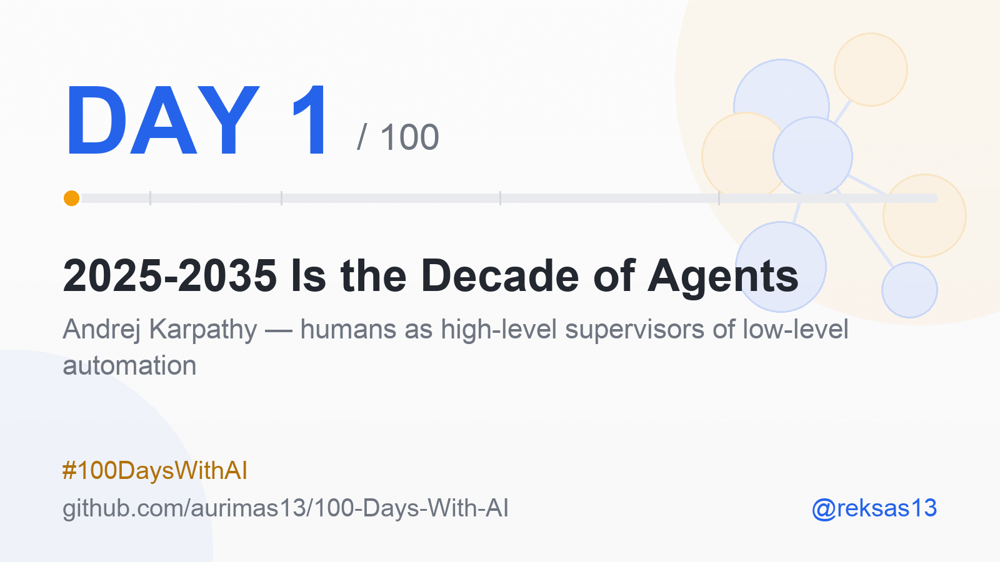
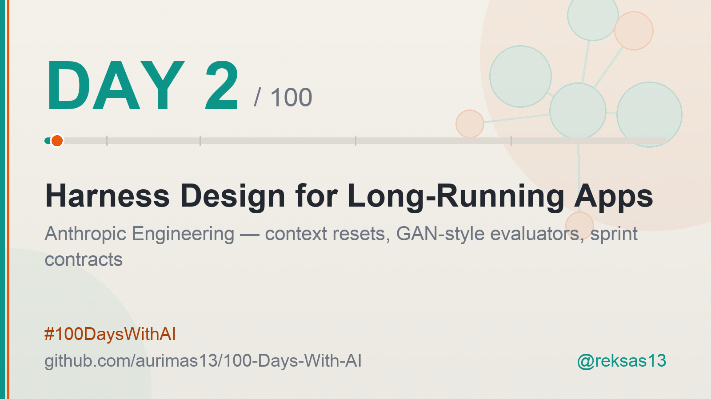
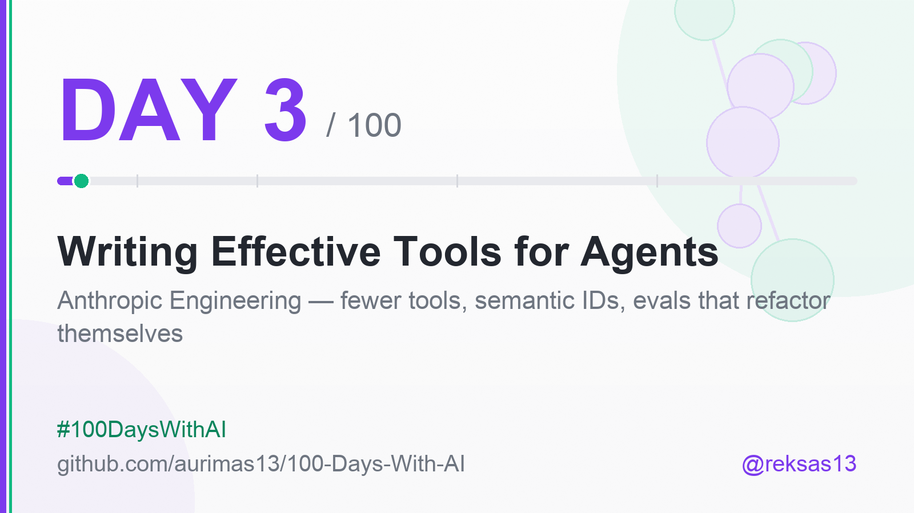
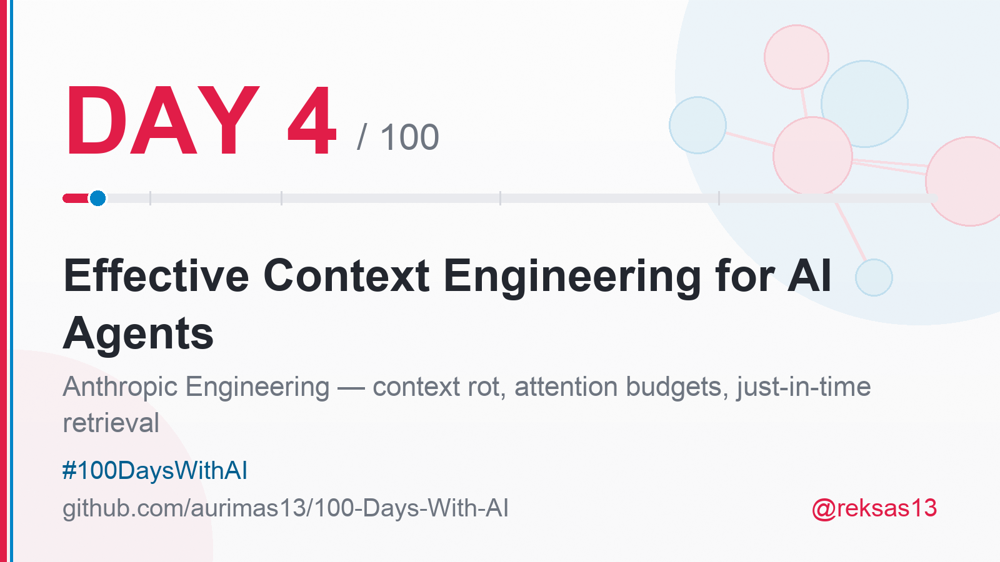
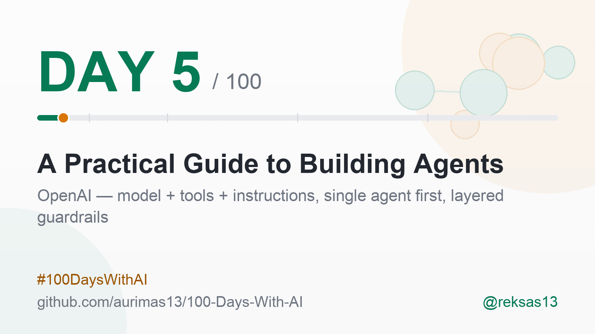
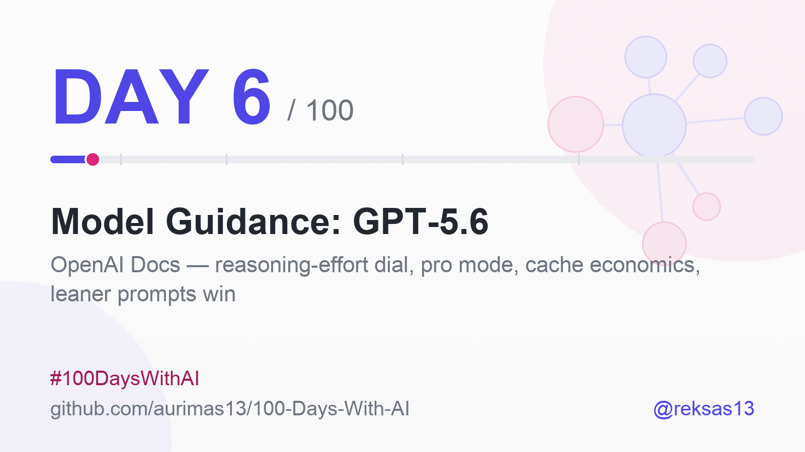

# 100 Days With AI 🤖

### One source a day. One honest note. For 100 days.

A public learning log of modern Artificial Intelligence - transformers, LLMs,
agentic AI, RAG, fine-tuning, evals, MLOps and the rest of it.

<!-- Day badge: bumped by the daily run. If this is stale, the run said so in its log. -->

**[📈 Progress](#-progress)** · **[📚 Day Notes](#-day-notes)** · **[🔗 Connect](#-connect)**

`2026-07-12` ──────────── **Day 6 of 100** ────────────► `2026-10-19`

Every day, one carefully chosen source - a paper, course, repo, post or tool, mixed <b>[Advanced]</b> and <b>[Medium]</b> - studied and logged: what actually stuck, why it matters, what I tried. Posted ~9:00 EEST under <b>#100DaysWithAI</b>. No skipped numbers. No faked expertise.

---

<b>Why this repo exists</b>

 

Learning in public beats learning alone - and it leaves a receipt.

Most learning disappears the moment the tab closes. This is the opposite: one
entry per day, written the same morning, in the open, whether or not the day
went well. The constraint is the point. A source I do not understand still
gets an honest note saying so.

I am an AI engineer who came to this from chemistry, and that shows up in how
I read these sources - I look for the mechanism, not the headline. Some days
that produces a good metaphor. Most days it just produces a better question.

<b>How each day works</b>

 

1. **One source** - chosen the evening before, marked **[Advanced]** or **[Medium]**.
2. **Studied properly** - not skimmed. Quotes are verbatim or they are not quotes.
3. **Logged here** - a row in [Progress](#-progress), then a [day note](#-day-notes)
   with 3-5 takeaways, why it matters, and what I actually tried.
4. **Shared** - the same note, compressed, goes out on X, Bluesky, Threads and
   LinkedIn at ~9:00 EEST, with the day's card.

Every claim in a post traces back to the source or it does not ship.

<b>What you can take from it</b>

 

- **The sources list** - 100 curated, level-marked entry points into modern AI,
  in [Progress](#-progress). Steal it wholesale; that is what MIT is for.
- **The notes** - what a working engineer actually took away, including the
  parts that did not land.
- **The format** - if you want to run your own 100 days, this repo is a
  working template.

<b>Standing on other shoulders</b>

 

Inspired by [100-Days-Of-ML-Code](https://github.com/aurimas13/100-Days-Of-ML-Code)
for the day-numbered log, and by the resource tables of
[Machine-Learning-Goodness](https://github.com/aurimas13/Machine-Learning-Goodness)
for the shape of the progress table.

---

## 📈 Progress

| Day | Date | Title | Level | Description | Link |
|-----|------|-------|-------|-------------|------|
| 1 | 2026-07-12 | "2025–2035 Is the Decade of Agents" — Andrej Karpathy | Medium | Karpathy's Jan 2025 post: agents are a decade-scale build, with humans as high-level supervisors of low-level automation | [X post](https://x.com/karpathy/status/1882544526033924438) |
| 2 | 2026-07-13 | "Harness Design for Long-Running Application Development" — Prithvi Rajasekaran, Anthropic | Advanced | How Anthropic Labs kept a coding agent productive for 6 hours: context resets with structured handoffs, a GAN-inspired generator/evaluator split, and sprint contracts | [Anthropic Engineering](https://www.anthropic.com/engineering/harness-design-long-running-apps) |
| 3 | 2026-07-14 | "Writing Effective Tools for Agents — with Agents" — Ken Aizawa et al., Anthropic | Medium | Tools as contracts between deterministic systems and non-deterministic agents: fewer consolidated tools, semantic names over UUIDs, token budgets, and evals that let Claude refactor its own tools | [Anthropic Engineering](https://www.anthropic.com/engineering/writing-tools-for-agents) |
| 4 | 2026-07-15 | "Effective Context Engineering for AI Agents" — Anthropic Applied AI | Medium | Context as a finite attention budget: context rot, right-altitude system prompts, just-in-time retrieval, and compaction / notes / sub-agents for long-horizon work | [Anthropic Engineering](https://www.anthropic.com/engineering/effective-context-engineering-for-ai-agents) |
| 5 | 2026-07-16 | "A Practical Guide to Building Agents" — OpenAI | Medium | OpenAI's build-your-first-agent field guide: model + tools + instructions in a loop, single agent before multi-agent, manager vs decentralized patterns, layered guardrails with human handoff | [OpenAI guide](https://openai.com/business/guides-and-resources/a-practical-guide-to-building-ai-agents/) |
| 6 | 2026-07-17 | "Model Guidance: GPT-5.6" — OpenAI Developer Docs | Medium | OpenAI's GPT-5.6 migration guide: a reasoning-effort dial, pro mode, programmatic tool calling, 1.25× cache-write billing - and leaner prompts that score higher while costing a third less | [OpenAI Docs](https://developers.openai.com/api/docs/guides/latest-model) |

---

## 📚 Day Notes

*Each day gets a section here: what the source is, 1–5 takeaways, why
it matters, and what I learned or tried.*

### Day 1 — "2025–2035 Is the Decade of Agents" (Andrej Karpathy, X, 2025-01-23)

Source: [x.com/karpathy/status/1882544526033924438](https://x.com/karpathy/status/1882544526033924438)
*(The live post is behind X's wall for automated readers; this note is
grounded in the post's full text.)*

**Takeaways:**

- Computer-use agents (like OpenAI's) are to the digital world
  what humanoid robots are to the physical one: a single general
  interface built for humans - monitor, keyboard, mouse vs. the human
  body - that can gradually take on arbitrarily general tasks.
- The result is a *mixed-autonomy* world: humans become high-level
  supervisors of low-level automation, like a driver monitoring the
  Autopilot. It arrives in the digital world first, because flipping
  bits is roughly 1000× cheaper than moving atoms.
- Sequencing beats vision: early OpenAI already attempted this
  (Universe, World of Bits) and it failed because LLMs had to happen
  first. A right idea at the wrong layer of the stack is still a wrong
  bet.
- Even in 2025, the stack wasn't obviously ready - multimodality was
  freshly bolted on via adapters, and very long task horizons remain
  unexplored territory. Karpathy suspected stuffing everything into
  context windows won't be enough; a breakthrough or two was needed.
- Hence the reframe: not "2025 was the year of agents" but **2025 – 2035
  is the decade of agents** - ending in a picture where you spin up
  organizations of agents and act as a CEO monitoring ten of them,
  dropping into the trenches to unblock.

**Why it matters:** this post sets the honest timescale for everything
this campaign covers - agent-building is a decade of engineering work
(context, evals, guardrails, orchestration), not a hype cycle to catch.

**What I learned/tried:** I picked this as Day 1 deliberately - it
recalibrated my expectations from "agents any month now" to a
decade-long build, and the next 99 days of sources (context
engineering, evals, guardrails, safety, multi-agent design, etc.) all live inside
that decade. Day 1 of 100 starts where the decade does.

### Day 2 — "Harness Design for Long-Running Application Development" (Prithvi Rajasekaran, Anthropic Engineering, 2026-03-24)

Source: [anthropic.com/engineering/harness-design-long-running-apps](https://www.anthropic.com/engineering/harness-design-long-running-apps)

**Takeaways:**

- Models exhibit **"context anxiety"** - they "begin wrapping up work
  prematurely as they approach what they believe is their context
  limit." The harness answer is a full **context reset with a
  structured handoff file**, not compaction: "While compaction preserves
  continuity, it doesn't give the agent a clean slate, which means
  context anxiety can still persist."
- **Self-evaluation fails.** "When asked to evaluate work they've
  produced, agents tend to respond by confidently praising the work -
  even when, to a human observer, the quality is obviously mediocre."
  The fix is GAN-inspired: split the **generator** from a standalone
  **evaluator tuned toward skepticism**.
- The evaluator scores four weighted criteria - design quality,
  originality, craft, functionality - deliberately weighted toward
  design and originality, because models already do craft and
  Functionality well; the weighting steers away from template output.
- The full-stack harness is **three agents**: a planner expanding the
  brief into a specification, a generator sprinting feature-by-feature, and a
  Playwright-based evaluator testing like a user. Each sprint starts
  with a **sprint contract** - generator and evaluator agree what
  "done" means *before* any code is written.
- The trade-off in numbers: a solo run took 20 min and $9 (non-working
  output); the full harness took 6 hr and $200 (working app). With a
  newer model, the harness was rebuilt *simpler* - sprints removed -
  at 3 hr 50 min and $124.70. "Every component in a harness encodes an
  assumption about what the model can't do on its own, and those
  assumptions are worth stress testing… they can quickly go stale as
  models improve."

**Why it matters:** long-running autonomy isn't a bigger context
window - it's architecture: resets over compaction, adversarial
evaluation over self-grading, contracts over vibes. And the harness
itself is a depreciating asset that must shrink as models improve.

**What I learned/tried:** I went deep on this one. The idea that stuck
hardest: every component I built onto an agent pipeline is a claim about
what the model *can't* do - so each one deserves a periodic
stress-test, or my scaffolding outlives its reason. I started auditing
my own automation pipelines this way.

### Day 3 — "Writing Effective Tools for Agents — with Agents" (Ken Aizawa et al., Anthropic Engineering, 2025-09-11)

Source: [anthropic.com/engineering/writing-tools-for-agents](https://www.anthropic.com/engineering/writing-tools-for-agents)

**Takeaways:**

- Tools are a new kind of software: "a contract between deterministic
  systems and non-deterministic agents." Designing them is closer to
  prompt engineering than to classic API design.
- More tools can hurt - "too many tools or overlapping tools can also
  distract agents from pursuing efficient strategies." Consolidate:
  one `schedule_event` (find slot + create) beats separate
  `list_events` + `create_event`; `search_contacts` beats
  `list_contacts`.
- Return meaning, not UUIDs: merely resolving arbitrary alphanumeric
  UUIDs to semantically meaningful names significantly improve
  Claude's retrieval precision by reducing hallucinations.
- Budget every token: a `response_format` enum cuts a Slack response
  from 206 tokens ("detailed") to 72 ("concise"); Claude Code truncates
  tool responses at 25,000 tokens by default; errors should return
  actionable guidance, not opaque tracebacks.
- Close the loop with agents themselves: prototype (quick local MCP
  server) → evaluate (realistic multi-step tasks; track accuracy,
  runtime, token use, tool errors) → optimize by concatenating eval
  transcripts into Claude Code and letting it refactor the tools,
  validated on held-out tasks. Refining tool descriptions alone took
  Claude Sonnet 3.5 to state-of-the-art on SWE-bench Verified.

**Why it matters:** tool quality, not model quality, is often the
ceiling on an agent's performance - and it is the part every builder
fully controls.

**What I learned/tried:** I checked these rules against the small agent
pipelines I run daily - fewer entry points, meaningful names,
token-lean outputs are exactly the discipline they demand. The detail
that surprised me most: even word order in a tool name (namespacing
like `asana_projects_search` vs `asana_search_projects`) has
non-trivial, model-dependent effects on evals. Words are
infrastructure now.

### Day 4 — "Effective Context Engineering for AI Agents" (Rajasekaran, Dixon, Ryan & Hadfield, Anthropic Engineering, 2025-09-29)

Source: [anthropic.com/engineering/effective-context-engineering-for-ai-agents](https://www.anthropic.com/engineering/effective-context-engineering-for-ai-agents)

**Takeaways:**

- Context engineering is the superset of prompt engineering: "the set
  of strategies for curating and maintaining the optimal set of tokens
  (information) during LLM inference" - not just writing a good prompt.
- **Context rot** is real and architectural: "as the number of tokens
  in the context window increases, the model's ability to accurately
  recall information from that context decreases." Transformers give
  every token attention to every other token - n² pairwise
  relationships - so context "must be treated as a finite resource
  with diminishing marginal returns."
- Bigger windows won't fix it: "context windows of all sizes will be
  subject to context pollution and information relevance concerns."
  The guiding heuristic instead: "find the smallest set of high-signal
  tokens that maximize the likelihood of your desired outcome."
- System prompts belong at the right altitude - a "Goldilocks zone"
  between brittle hardcoded if-else logic and vague guidance; tools
  stay self-contained and non-overlapping; a few diverse canonical
  examples beat exhaustive edge-case rules.
- Retrieval is moving just-in-time: keep lightweight identifiers
  (file paths, queries, links) and load data at runtime (Claude Code's
  hybrid: CLAUDE.md dropped in up front, grep/glob at runtime). For
  long-horizon work the trio is **compaction** (distill and
  reinitialize), **structured note-taking** (persistent NOTES.md-style
  memory), and **sub-agents** that explore with tens of thousands of
  tokens but return condensed 1,000–2,000-token summaries.

**Why it matters:** agents rarely fail because the model is weak -
they fail because attention is spent on low-signal tokens. Curating
the context is the highest-leverage engineering surface an agent
builder controls.

**What I learned/tried:** three days converged on one law from three
angles - Day 2's context resets, Day 3's token-lean tools, today's
attention budget. My own automation pipelines keep structured notes
and logs between runs the way this piece prescribes; now I can name
why that works: the budget is attention, and notes spend it only when
needed.

---

### Day 5 — "A Practical Guide to Building Agents" (OpenAI, Business Guides & Resources)

Source: [openai.com - A practical guide to building agents](https://openai.com/business/guides-and-resources/a-practical-guide-to-building-ai-agents/)
([PDF version](https://cdn.openai.com/business-guides-and-resources/a-practical-guide-to-building-agents.pdf))

**Takeaways:**

- The definition is the filter: "Agents are systems that independently
  accomplish tasks on your behalf." Apps that merely integrate an LLM
  without letting it control workflow execution - chatbots, single-turn
  LLMs and classifiers are not agents.
- Build one for only three kinds of workflow: complex decision-making,
  difficult-to-maintain rule sets, and heavy reliance on unstructured
  data. "Otherwise, a deterministic solution may suffice."
- Foundations are three components - model, tools, instructions - run
  in a loop until an exit condition (final-output tool, no-tool-call
  response, error, or max turns). Prototype with the most capable
  model to set a baseline, then swap in smaller models where they hold.
- Go multi-agent late: "maximize a single agent's capabilities first."
  The tool-overload signal is overlap, not count - some implementations
  "successfully manage more than 15 well-defined, distinct tools while
  others struggle with fewer than 10 overlapping tools." When you do
  split: manager pattern (agents as tools, one agent owns the user) or
  decentralized pattern (peer handoffs that transfer execution).
- Guardrails are a layered defense - relevance and safety classifiers,
  PII filters, moderation, rules-based blocks, output validation, and
  tool risk ratings (read-only vs write, reversibility, financial
  impact) - with human intervention on two triggers: exceeded failure
  thresholds and high-risk actions.

**Why it matters:** this is the sober baseline for the agent hype
cycle - most workflows don't need an agent, most agents don't need a
fleet, and the ones that ship well start small and grow on evals.

**What I learned/tried:** the tool-overlap number stopped me: 15+
distinct tools can work while 10 overlapping ones fail - the same
lesson as Day 3's consolidation rule, now with field numbers. My own
single-agent pipelines with a handful of distinct tools sit exactly in
the pattern this guide recommends; the discipline is in resisting the
fleet until a single agent demonstrably fails.

---

### Day 6 — "Model Guidance: GPT-5.6" (OpenAI Developer Docs)

Source: [developers.openai.com/api/docs/guides/latest-model](https://developers.openai.com/api/docs/guides/latest-model)

**Takeaways:**

- GPT-5.6 comes in three variants - `gpt-5.6-sol` (flagship),
  `gpt-5.6-terra` (balanced), `gpt-5.6-luna` (high-volume); the bare
  `gpt-5.6` alias routes to `-sol`. Reasoning effort is a six-step
  dial: "GPT-5.6 supports `none`, `low`, `medium`, `high`, `xhigh`,
  and `max`" - and the migration advice is to keep your baseline, then
  test one level lower.
- The economics headline: "In a sample of internal coding-agent eval
  runs, configurations with leaner system prompts improved evaluation
  scores by roughly 10–15% while reducing total tokens by 41–66% and
  cost by 33–67%." Less prompt, better output, smaller invoice.
- Corollary worth engraving: "Removing repeated instructions and
  examples and simplifying tool descriptions can improve task
  performance and token efficiency." Verbosity is not diligence.
- Caching is now an explicit investment decision: "OpenAI bills cache
  writes at 1.25× the uncached input rate, while cache reads remain
  discounted" - use breakpoints deliberately and watch
  `cached_tokens` vs `cache_write_tokens`.
- Two execution modes reshape the cost/quality trade: **pro mode**
  ("applies more model work to a request before returning a single
  final answer… can improve reliability on difficult tasks") buys
  reliability with latency and tokens, while **Programmatic Tool
  Calling** removes the model from the loop "for bounded, tool-heavy
  workflows that do not require fresh model judgment between each
  step." Persisted reasoning (`reasoning.context: all_turns`) reuses
  thinking across turns.

**Why it matters:** model docs now read like unit economics - the
quality dial, the caching ledger, and the leaner-prompt numbers all
say the same thing: token spend is a design decision, and the cheapest
configuration is often also the best one.

**What I learned/tried:** the week compounds - Day 3 said simplify
tool descriptions, Day 4 said curate the smallest high-signal context,
and today OpenAI puts numbers on it: 10–15% better at 33–67% cheaper.
I'm taking the 41–66% token figure as a standing dare to re-read my
own pipelines' prompts with a red pen.

---

## 🔗 Connect

**The day note goes out on all four, every morning at ~9:00 EEST.**

| | Where | What you get |
|---|---|---|
| 𝕏 | **[@reksas13](https://x.com/reksas13)** | The day's takeaway in one post, with the card - daily, ~9:00 EEST |
| 🦋 | **[@reksas13.bsky.social](https://bsky.app/profile/reksas13.bsky.social)** | The same note, mirrored - daily, ~9:00 EEST |
| 🧵 | **[@reksas13](https://www.threads.com/@reksas13)** | The same note, under the **AI Threads** topic - daily, ~9:00 EEST |
| in | **[Aurimas Nausėdas](https://www.linkedin.com/in/aurimasnausedas/)** | The long form - the personal angle, the takeaways, what I tried |
| 📬 | **[Molecule To Machine](https://moleculetomachine.substack.com)** | Weekly newsletter, where chemistry meets AI |
| 📚 | **[Machine-Learning-Goodness](https://github.com/aurimas13/Machine-Learning-Goodness)** | The bigger resource collection this table's format came from |

 
Building something in AI, hiring, or running your own 100 days? The fastest way to reach me is a DM on any of the four.

## 📄 License

[MIT](LICENSE) - take the sources list, run your own 100 days.

 
<b>Day 6 of 100.</b> Next entry tomorrow, ~9:00 EEST.

