

# 100 Days With AI 🤖

### One source a day. One honest note. For 100 days.

A public learning log of modern Artificial Intelligence - transformers, LLMs,
agentic AI, RAG, fine-tuning, evals, MLOps and the rest of it.

<!-- Day badge: bumped by the daily run. If this is stale, the run said so in its log. -->

**[📈 Progress](#-progress)** · **[📚 Day Notes](#-day-notes)** · **[🤝 AI Collaboration](#-ai-collaboration)** · **[🔗 Connect](#-connect)**

`2026-07-12` ──────────── **Day 53 of 100** ────────────► `2026-10-19`

Every day, one carefully chosen source - a paper, course, repo, post, tool, technical document, other source, mixed <b>[Medium]</b> or <b>[Advanced]</b> - studied and logged: what actually stuck, why it matters, what I tried. Posted ~7:00 EEST under <b>#100DaysWithAI</b>. No skipped numbers. No faked expertise.

---

<b>Why this repo exists</b>

 

Learning in public beats learning alone - and it leaves a receipt.

Most learning disappears the moment the tab closes. This is the opposite: one
entry per day, written the same morning, in the open, whether or not the day
went well. The constraint is the point. A source I do not understand still
gets an honest note saying so.

I am an AI engineer who came to this from chemistry, and that shows up in how
I read these sources - I look for the mechanism, not the headline. Some days
that produces a good metaphor. Most days it just produces a better question.

<b>How each day works</b>

 

1. **One source** - chosen the evening before, marked **[Advanced]** or **[Medium]**.
2. **Studied properly** - not skimmed. Quotes are verbatim or they are not quotes.
3. **Logged here** - a row in [Progress](#-progress), then a [day note](#-day-notes)
   with 3-5 takeaways, why it matters, and what I actually tried.
4. **Shared** - the same note, compressed, goes out on X, Bluesky, Threads and
   LinkedIn at ~7:00 EEST, with the day's card.

Every claim in a post traces back to the source or it does not ship.

<b>What you can take from it</b>

 

- **The sources list** - 100 curated, level-marked entry points into modern AI,
  in [Progress](#-progress). Steal it wholesale; that is what MIT is for.
- **The notes** - what a working engineer actually took away, including the
  parts that did not land.
- **The format** - if you want to run your own 100 days, this repo is a
  working template.

<b>Standing on other shoulders</b>

 

Inspired by [100-Days-Of-ML-Code](https://github.com/aurimas13/100-Days-Of-ML-Code)
for the day-numbered log, and by the resource tables of
[Machine-Learning-Goodness](https://github.com/aurimas13/Machine-Learning-Goodness)
for the shape of the progress table.

---

## 📈 Progress

| Day | Date | Title | Level | Description | Link |
|-----|------|-------|-------|-------------|------|
| 1 | 2026-07-12 | "2025–2035 Is the Decade of Agents" - Andrej Karpathy | Medium | Karpathy's Jan 2025 post: agents are a decade-scale build, with humans as high-level supervisors of low-level automation | [X post](https://x.com/karpathy/status/1882544526033924438) |
| 2 | 2026-07-13 | "Harness Design for Long-Running Application Development" - Prithvi Rajasekaran, Anthropic | Advanced | How Anthropic Labs kept a coding agent productive for 6 hours: context resets with structured handoffs, a GAN-inspired generator/evaluator split, and sprint contracts | [Anthropic Engineering](https://www.anthropic.com/engineering/harness-design-long-running-apps) |
| 3 | 2026-07-14 | "Writing Effective Tools for Agents - with Agents" - Ken Aizawa et al., Anthropic | Medium | Tools as contracts between deterministic systems and non-deterministic agents: fewer consolidated tools, semantic names over UUIDs, token budgets, and evals that let Claude refactor its own tools | [Anthropic Engineering](https://www.anthropic.com/engineering/writing-tools-for-agents) |
| 4 | 2026-07-15 | "Effective Context Engineering for AI Agents" - Anthropic Applied AI | Medium | Context as a finite attention budget: context rot, right-altitude system prompts, just-in-time retrieval, and compaction / notes / sub-agents for long-horizon work | [Anthropic Engineering](https://www.anthropic.com/engineering/effective-context-engineering-for-ai-agents) |
| 5 | 2026-07-16 | "A Practical Guide to Building Agents" - OpenAI | Medium | OpenAI's build-your-first-agent field guide: model + tools + instructions in a loop, single agent before multi-agent, manager vs decentralized patterns, layered guardrails with human handoff | [OpenAI guide](https://openai.com/business/guides-and-resources/a-practical-guide-to-building-ai-agents/) |
| 6 | 2026-07-17 | "Model Guidance: GPT-5.6" - OpenAI Developer Docs | Medium | OpenAI's GPT-5.6 migration guide: a reasoning-effort dial, pro mode, programmatic tool calling, 1.25× cache-write billing - and leaner prompts that score higher while costing a third less | [OpenAI Docs](https://developers.openai.com/api/docs/guides/latest-model) |
| 7 | 2026-07-18 | "Prompting Claude Fable 5" - Anthropic Docs | Medium | Migrating to the newest Claude: an effort dial, hours-long autonomous turns, grounded progress claims, memory files - and deleting the over-prescriptive prompts written for older models | [Anthropic Docs](https://platform.claude.com/docs/en/build-with-claude/prompt-engineering/prompting-claude-fable-5) |
| 8 | 2026-07-19 | "The Art of Loop Engineering" - Sydney Runkle, LangChain | Medium | Four stacked agent loops - agent, verification, event-driven, hill-climbing - with human oversight at every level; value compounds in the loops that embed and improve the agent, not the agent itself | [X post](https://x.com/sydneyrunkle/status/2066928783534289358) |
| 9 | 2026-07-20 | "How do you build an agent over hundreds of data models?" - Kent C. Dodds | Medium | A crowdsourced architecture thread where two people independently land on the same answer - nest the concepts into a hierarchy and expose it as tools the agent drills down through - while Kent's own lean is to start direct and simple, and divide only once that stops working | [X thread](https://x.com/kentcdodds/status/1969482734642086301) |
| 10 | 2026-07-21 | "Prompting Best Practices" - Anthropic Docs | Medium | Structure over rhetoric: longform data at the top and the query at the bottom (reported up to 30% better responses), XML tags as boundaries, quote-grounding for long documents, and the reason behind a rule beating the rule alone | [Anthropic Docs](https://platform.claude.com/docs/en/build-with-claude/prompt-engineering/claude-prompting-best-practices) |
| 11 | 2026-07-22 | "What Is MCP? Model Context Protocol in Agentic AI, Explained" - Ksenia Se, Turing Post | Medium | The integration layer for agents: one open protocol replaces a custom connector per tool, turning an N×M wiring problem into N+M, with runtime discovery, a clear split from A2A, and an honest list of what it does not solve | [Turing Post](https://www.turingpost.com/p/mcp) |
| 12 | 2026-07-23 | "How to Build an Agent" - Thorsten Ball, Amp | Medium | A working code-editing agent in under 400 lines of Go - an LLM, a loop, and three file tools; the argument that the core of every coding agent is small and the real engineering lives in the refinement around it | [Amp](https://ampcode.com/notes/how-to-build-an-agent) |
| 13 | 2026-07-24 | "Building an AI Agent from Scratch in Python" - Leonie Monigatti | Medium | The Day 12 loop rebuilt in Python against the raw Anthropic API - an agent class, message-list memory, one schema'd calculator tool, and a run loop that pauses at tool_use, feeds the result back, and stops at a ten-turn cap | [leoniemonigatti.com](https://www.leoniemonigatti.com/blog/ai-agent-from-scratch-in-python.html) |
| 14 | 2026-07-25 | "Building Effective Agents" - Anthropic (Schluntz & Zhang) | Medium | The workflows-vs-agents distinction and five composable patterns - prompt chaining, routing, parallelisation, orchestrator-workers, evaluator-optimiser - with the standing advice to start simple and reach for autonomy only when the steps can't be predicted; the claude-cookbooks patterns/agents notebooks are the runnable companion | [anthropic.com](https://www.anthropic.com/engineering/building-effective-agents) |
| 15 | 2026-07-26 | "How to Build an AI Agent from Scratch Using Claude API" - Dextra Labs (dev.to) | Medium | A third from-scratch build, set apart by two things the first two skipped - an AgentWithMemory class that carries conversation history across queries, and an explicit production roadmap (streaming, retries, async, Pydantic structured outputs) that refuses to pass the minimal code off as production-ready | [dev.to](https://dev.to/dextralabs/how-to-build-an-ai-agent-from-scratch-using-claude-api-with-full-code-4b40) |
| 16 | 2026-07-27 | "API Key Best Practices" - Anthropic Help Center | Medium | The unglamorous discipline that keeps everything else safe - keys out of code and into env vars or a secrets manager, .env in .gitignore, one key per environment, scheduled rotation, secret scanning in CI, usage monitoring, and immediate revocation of a suspected leak | [support.claude.com](https://support.claude.com/en/articles/9767949-api-key-best-practices-keeping-your-keys-safe-and-secure) |
| 17 | 2026-07-28 | "Tool use with Claude" - Anthropic Docs | Medium | The canonical model behind the hand-built loop - where tool code executes (client tools in your app vs server tools on Anthropic's infrastructure), the tool_use to tool_result round trip, the input_schema contract, and steering with tool_choice, a system-prompt nudge, and strict schema conformance | [platform.claude.com](https://platform.claude.com/docs/en/agents-and-tools/tool-use/overview) |
| 18 | 2026-07-29 | "Streaming messages" - Anthropic Docs | Medium | How a response arrives incrementally over server-sent events - the message and content-block lifecycle, the typed deltas (text, partial-JSON tool input, thinking), and the practical catch that very large max_tokens needs streaming to avoid HTTP timeouts, with SDK helpers that accumulate the events back into one Message | [platform.claude.com](https://platform.claude.com/docs/en/build-with-claude/streaming) |
| 19 | 2026-07-30 | "Claude Agent SDK Demos" - Anthropic (GitHub) | Medium | The official example apps for the Claude Agent SDK - the hand-rolled loop handed back as send()/stream()/query() with session persistence and subagents, shown through real demos: a parallel-subagent research agent, an IMAP email assistant, and a resume generator | [github.com](https://github.com/anthropics/claude-agent-sdk-demos) |
| 20 | 2026-07-31 | "Securely deploying AI agents" - Claude Agent SDK Docs | Medium | Why yesterday's demos are local-dev only, and how you would harden them - prompt injection as the core deployment threat, then defence in depth: isolation (sandbox / container / gVisor / VM), least privilege (read-only mounts, network allowlists, dropped Linux capabilities), and a proxy that injects credentials the agent never sees | [code.claude.com](https://code.claude.com/docs/en/agent-sdk/secure-deployment.md) |
| 21 | 2026-08-01 | "Request context" - Mastra Docs | Medium | Dependency injection for agents - one agent configured per request instead of one agent per case: instructions, model, tools and memory each become a sync or async function reading a typed RequestContext, populated in code or from request headers in server middleware, with schema validation and reserved keys for multi-tenant isolation | [mastra.ai](https://mastra.ai/docs/server/request-context) |
| 22 | 2026-08-02 | "OWASP Top 10 for Agentic Applications" - OWASP GenAI Security Project | Advanced | The first agent-specific risk list, released 9 Dec 2025 after a year of work by 100+ contributors - ten risks from goal hijack and tool misuse through memory poisoning and insecure inter-agent communication to cascading failures and rogue agents, marking the shift from preventing bad outputs to containing bad autonomy | [genai.owasp.org](https://genai.owasp.org/resource/owasp-top-10-for-agentic-applications-for-2026/) |
| 23 | 2026-08-03 | "AgentDojo: A Dynamic Environment to Evaluate Prompt Injection Attacks and Defenses for LLM Agents" - Debenedetti et al. | Advanced | The measurement layer under agent security - an extensible environment rather than a fixed test suite, with 97 realistic tasks and 629 security cases across workspace, Slack, banking and travel, scoring benign utility, utility under attack and targeted attack success rate, and finding that leading models fail many tasks even with no adversary present | [arXiv 2406.13352](https://arxiv.org/abs/2406.13352) |
| 24 | 2026-08-04 | "Defeating Prompt Injections by Design" (CaMeL) - Debenedetti et al., Google DeepMind | Advanced | A defence that assumes the model will be fooled and removes its ability to matter - a privileged LLM sees only the user's query and emits code, a quarantined LLM parses untrusted data with tool-calling stripped, and a custom interpreter tracks provenance so capability policies can block unauthorised flows at tool-call time, scoring 77% of AgentDojo tasks with provable security against 84% undefended | [arXiv 2503.18813](https://arxiv.org/abs/2503.18813) |
| 25 | 2026-08-05 | "Design Patterns for Securing LLM Agents against Prompt Injections" - Beurer-Kellner et al. | Advanced | The synthesis the first quarter was building toward - six patterns that trade agency for provable safety: action-selector, plan-then-execute, LLM map-reduce, dual LLM, code-then-execute and context-minimisation, each constraining an agent so that ingested untrusted input cannot trigger consequential action, with the trade-offs and case studies made explicit | [arXiv 2506.08837](https://arxiv.org/abs/2506.08837) |
| 26 | 2026-08-06 | "A Benchmark to Understand the Role of Knowledge Graphs on Large Language Model's Accuracy for Question Answering on Enterprise SQL Databases" - Sequeda, Allemang & Jacob | Advanced | The meaning layer, measured - 43 enterprise questions over an insurance schema, answered by GPT-4 twice: straight against the SQL tables, and against a knowledge graph built from those same tables with an ontology and mappings. 16.7% correct becomes 54.2%, and on normalised schemas raw SQL scores 0% | [arXiv 2311.07509](https://arxiv.org/abs/2311.07509) |
| 27 | 2026-08-07 | "Key Considerations for Domain Expert Involvement in LLM Design and Evaluation: An Ethnographic Study" - Szymanski, Anuyah, Li & Metoyer | Advanced | Twelve weeks inside a team building a pedagogical chatbot, watching what actually happens when developers try to get expert knowledge into an LLM system - four practices they fell into, and three obstacles that were about motivation, participation and ownership rather than technique | [arXiv 2602.14357](https://arxiv.org/abs/2602.14357) |
| 28 | 2026-08-08 | "Future of Work with AI Agents: Auditing Automation and Augmentation Potential across the U.S. Workforce" - Shao, Zope, Jiang, Pei, Nguyen, Brynjolfsson & Yang | Advanced | An audit of which work people actually want automated, set against what AI can actually do - 1,500 workers, 104 occupations, 844 O*NET tasks, a Human Agency Scale for how much human involvement each task should keep, and four zones including the one where capability and desire point in opposite directions | [arXiv 2506.06576](https://arxiv.org/abs/2506.06576) |
| 29 | 2026-08-09 | "Effective context engineering for AI agents" - Anthropic Applied AI team | Advanced | Context treated as a finite attention budget rather than storage - why performance degrades as the window fills, what belongs in a system prompt, tools and examples, just-in-time retrieval instead of pre-loading, and the three techniques that keep long-horizon agents coherent: compaction, structured note-taking outside the window, and sub-agents with clean contexts | [anthropic.com](https://www.anthropic.com/engineering/effective-context-engineering-for-ai-agents) |
| 30 | 2026-08-10 | "The New Code" - Sean Grove (OpenAI), AI Engineer World's Fair 2025 | Advanced | The argument that the specification, not the code, is the durable artefact - code as a lossy projection of intent, OpenAI's Model Spec as a living markdown document whose clauses carry IDs and example prompts that function as unit tests, and the claim that writing code is only 10-20% of where an engineer's value sits | [YouTube](https://www.youtube.com/watch?v=8rABwKRsec4) |
| 31 | 2026-08-11 | "Asymmetry of verification and verifier's law" - Jason Wei | Advanced | Why some tasks are far easier to check than to solve, the five properties that make a task cheap to verify, and the rule that follows - the ease of training AI to do something is proportional to how verifiable it is. Paired with the organisational half: verification is the only phase of the work with no natural owner, and giving it one is the decision that makes the rest compound | [jasonwei.net](https://www.jasonwei.net/blog/asymmetry-of-verification-and-verifiers-law) |
| 32 | 2026-08-12 | "Reflections on Palantir" - Nabeel S. Qureshi | Advanced | A first-hand account of the forward deployed engineer model from eight years inside the company that invented it - FDEs onsite at the customer three or four days a week solving the specific problem badly and fast, a separate product team generalising whatever they built, and the observation that deployments died of organisational politics far more often than of engineering | [nabeelqu.co](https://nabeelqu.co/reflections-on-palantir) |
| 33 | 2026-08-13 | "The GenAI Divide: State of AI in Business 2025" - MIT NANDA | Advanced | The origin of the "95% of AI pilots deliver no measurable P&L impact" figure that half the industry now quotes - what the report actually surveyed, what it concluded about the learning gap between tools and organisations, and the substantial methodological criticism it drew once the number went viral | [report PDF](https://mlq.ai/media/quarterly_decks/v0.1_State_of_AI_in_Business_2025_Report.pdf) |
| 34 | 2026-08-14 | "The Rise of the AI Engineer" - Shawn "swyx" Wang | Medium | The essay that named the role, three years before the current wave of titles - applied AI splitting off from ML research because foundation models made capability available through an API, and why the job that resulted is an engineering job rather than a research one | [latent.space](https://www.latent.space/p/ai-engineer) |
| 35 | 2026-08-15 | "A Practical Guide to Agentic AI Transition in Organizations" - Bandara et al. | Advanced | Seven principles for moving an organisation to agentic workflows, built around keeping the human as orchestrator rather than executor - decomposing manual processes into agents with defined inputs and outputs, teams of no more than three or four, business-domain representatives as core members, and interaction boundaries decided in advance rather than discovered | [arXiv 2602.10122](https://arxiv.org/abs/2602.10122) |
| 36 | 2026-08-16 | "Tutorial: Build a tool-using agent" - Anthropic Docs | Medium | The build path behind Day 17's reference map - five standalone rings that go from one tool call to a working agent, adding exactly one idea each: the tool_use to tool_result round trip, the while loop over stop_reason, parallel tool blocks returned in a single user message, failures returned as is_error results rather than raised, and finally the SDK tool runner that deletes the loop you just wrote | [platform.claude.com](https://platform.claude.com/docs/en/agents-and-tools/tool-use/build-a-tool-using-agent) |
| 37 | 2026-08-17 | "Define tools" - Anthropic Docs | Medium | The other half of yesterday's build - what actually goes in a tool definition and why the description carries more weight than the schema: a stated floor of 3-4 sentences covering when not to use a tool and what it does not return, consolidation of related operations behind one action parameter, service namespacing in tool names, responses shaped to return only high-signal fields, optional input_examples for nested inputs, and the four tool_choice modes with their caching and prefill side effects | [platform.claude.com](https://platform.claude.com/docs/en/agents-and-tools/tool-use/define-tools) |
| 38 | 2026-08-18 | "Agent SDK overview" - Claude Agent SDK Docs | Medium | The SDK's front door, and mostly a decision table: Claude Code handed over as a library with the same tools, agent loop and context management in Python or TypeScript, set against the CLI, the Client SDK where you write the loop yourself, and hosted Managed Agents where Anthropic runs the sandbox; a capability list that is Claude Code's own (hooks, subagents, MCP, permissions, sessions, plugins) with skills, commands and memory loading from `.claude/` exactly as they do in the terminal; and three non-code constraints - API-key authentication only, branding rules, commercial terms - that decide whether what you build can ship | [code.claude.com](https://code.claude.com/docs/en/agent-sdk/overview.md) |
| 39 | 2026-08-19 | "12-Factor Agents" - Dex Horthy (HumanLayer) | Medium | A reliability manifesto that borrows its form from 12 Factor Apps and its evidence from at least 100 SaaS builders: most products calling themselves AI agents are mostly deterministic code with LLM steps placed at the few points that matter, and the twelve factors are the software constraints that follow - three of them beginning with the verb own (your prompts, your context window, your control flow), the rest structural rather than clever, plus an honourable-mention thirteenth on pre-fetching context; the failure it keeps returning to is the 80% wall, where the framework that got you there fast is the thing you must reverse-engineer to get any further | [github.com/humanlayer](https://github.com/humanlayer/12-factor-agents) |
| 40 | 2026-08-20 | "The 7 Skills You Need to Build AI Agents" - IBM Technology | Medium | A survey of what building production agents actually demands, framed by a job advertisement that asks one prompt engineer to cover distributed systems, API design, machine learning operations, security engineering and product management: system design, tool and contract design, retrieval engineering, reliability engineering, security and safety, evaluation and observability, and product thinking - four of the seven presented as existing disciplines transplanted rather than as anything new, with the closing instruction that when an agent fails the root cause is usually the system rather than the wording | [YouTube](https://www.youtube.com/watch?v=mtiOK2QG9Q0) |
| 41 | 2026-08-21 | "IBM Bob" - IBM | Medium | An enterprise coding agent read as a pair of pages, the marketing one and the documentation one: three purpose-built modes (agent, ask, plan), subagents spawned as parallel workstreams, a terminal companion, MCP for custom tools, usage analytics, and legacy modernisation in Java, RPG and COBOL as a headline use case - set against a landing page whose evidence is a single client migration reported as roughly 90% faster delivery and a claim that the product will not hallucinate on topics outside its knowledge, neither of which carries a method | [bob.ibm.com](https://bob.ibm.com/) |
| 42 | 2026-08-22 | "Cline" - Cline (open source, Apache 2.0) | Medium | An open-source coding agent whose defining decision is a default rather than a capability: every file write and every command waits for explicit approval, and plan mode cannot write at all until you switch out of it, with the permission boundary expressed as a mode instead of a setting - available as an editor extension, a command-line tool and an embeddable SDK, running against any major model provider or your own endpoint, key or weights, and offering, a few paragraphs later in the same documentation, fully headless automation for continuous integration, which is where the promise of always being in control turns out to be a property of how you ran it | [cline.bot](https://cline.bot/) |
| 43 | 2026-08-23 | "opencode" - anomalyco (open source, MIT) | Medium | A terminal-first coding agent whose two built-in agents are the point: build, the default full-access agent for development work, and plan, a read-only agent that denies file edits and asks permission before running shell commands, switched with a single keystroke, alongside a general subagent for wide searches, a terminal interface as the primary surface with a desktop application still in beta, and installation through every package manager a developer already has - read as the closing day of three consecutive days on coding agents, where an enterprise product, an editor extension and a terminal binary turn out to have independently converged on the same primitive of one mode that may write and one that may only read | [github.com/anomalyco](https://github.com/anomalyco/opencode) |
| 44 | 2026-08-24 | "Claude Academy" - Anthropic | Medium | Anthropic's course platform, read first as a catalogue and then as three certificates finished in four days and added to LinkedIn - AI Fluency: Framework & Foundations, AI Fluency for Builders, and Introduction to Agent Skills - whose 4D framework of Delegation, Description, Discernment and Diligence names in its fourth competency the disclosure practice this project has carried on every post since Day 41, recorded here with its honest limit: a certificate attests that the lessons were completed and a final assessment passed, not that the holder is competent | [academy.claude.com](https://academy.claude.com/courses) |
| 45 | 2026-08-25 | "Skills For Real Engineers" - Matt Pocock | Medium | Twenty-five MIT-licensed agent skills taken straight from a working engineer's `.agents` directory, sorted on a single axis - who is allowed to invoke them - with user-invoked skills orchestrating, model-invoked skills holding the reusable discipline, and one call-graph rule holding the layer together: a user-invoked skill may invoke model-invoked skills but never another user-invoked one; the collection's argument is that agent failures are old software-engineering failures running faster, and it anchors each of its four named failure modes to a book that predates the agent era | [github.com/mattpocock/skills](https://github.com/mattpocock/skills/tree/main) |
| 46 | 2026-08-26 | "Scaling Domain Data Repetition in LLM Pretraining" - Li, Gu, Dai, Hao, Xu, Wu, Zheng & Zhang (Tsinghua University and ByteDance Seed) | Advanced | A pretraining study of how many times high-quality domain data can be repeated before repetition stops helping, whose central result is a reversal caused by an experimental convention rather than by new evidence: holding the training-set size fixed across model scales makes the optimal repetition count fall as models grow, while holding the tokens-per-parameter ratio fixed - so the token budget grows with the model, as it does in practice - makes it rise, with both behaviours shown in one figure from the same runs and each derived as a theorem, and with the safe repetition count predicted almost entirely by how well the model already does on the domain (Pearson -0.944 against minimum validation loss) rather than by how much unique data is held (0.018); arXiv:2608.14071v1, a preprint, not peer reviewed | [arXiv 2608.14071](https://arxiv.org/abs/2608.14071) |
| 47 | 2026-08-27 | "How Long Contexts Fail" - Drew Breunig | Advanced | A working taxonomy of long-context degradation, splitting what is usually treated as one problem into four failure modes separated by mechanism rather than by symptom - poisoning, where an error entering the context is then repeatedly referenced; distraction, where the context grows long enough that the model over-focuses on it and neglects its training; confusion, where superfluous content is used and drags the answer down; and clash, where accumulated information and tools contradict each other - and assembling the evidence from five other groups' results rather than the author's own, the sharpest being a Databricks finding that correctness began to fall around 32k for Llama 3.1 405b and earlier for smaller models, and a GeoEngine result where a quantised Llama 3.1 8b failed with 46 tools and succeeded with 19 while comfortably inside its 16k window; the article names no fixes, deferring them to a follow-up post | [dbreunig.com](https://www.dbreunig.com/2025/06/22/how-contexts-fail-and-how-to-fix-them.html) |
| 48 | 2026-08-28 | "AI Systems Out-Persuade Expert Humans" - Kobi Hackenburg et al. | Advanced | Four preregistered experiments covering 18,978 conversations with 6,923 people, pitting frontier AI against five classes of human persuader - random laypeople, tournament-selected laypeople, professional canvassers paid £140 an hour, 56 elite competitive debaters including four world champions and eleven continental champions, and those same debaters after coaching against the AI that had beaten them - and finding AI ahead of every class, by 8.2 points over random laypeople and 4.6 over elite debaters, with coaching adding a statistically insignificant 1.0 point despite the debaters writing 19% more words and making 54% more fact-checkable claims; the decisive result is the constraint arm, where capping the AI to human message length and human reply speed collapsed its advantage over the strongest human group to 0.0 points, identifying information throughput rather than rhetorical skill as the source of the edge, and a fourth study found the advantage carried into real-money charitable giving | [arxiv.org](https://arxiv.org/abs/2606.16475) |
| 49 | 2026-08-29 | "Training AI Scientists to Replicate Research" - Damon Falck et al. (Inherent Laboratories) | Advanced | A training setup for agents that reproduce published results, built on Replica, an automatically generated space of 310 figure-replication tasks drawn from 100 machine learning and AI-for-science papers spanning 1990 to 2026, where each task hands the agent a paper with one results figure irreversibly redacted, 60 minutes and a one-seventh MIG slice of an H200 GPU, and asks for the missing plot; because replication has no verifiable reward, the authors auto-generate a per-task rubric with the original figure hidden from the rubric writer so it grades the paper's claim rather than the plot's cosmetics, and use a coding agent with workspace access as the judge so it can re-run the code it is scoring; the resulting agent, Faraday, is Qwen3.6-27B post-trained with a turn-level credit variant of GRPO and using a frontier coding agent as a tool, and it wins on 73% of in-distribution tasks and 60% of held-out ones, with the sharpest comparison being that the same base model in the same harness with the same tool scores 0.554 on the held-out set against Faraday's 0.791 | [arxiv.org](https://arxiv.org/abs/2608.13331) |
| 50 | 2026-08-30 | "Context Engineering for Agents" - Lance Martin | Advanced | A practitioner's map of context engineering, sorting what is usually a pile of tactics into four moves defined by where the tokens go: write context, saving it outside the window in scratchpads and memories; select context, pulling only the relevant part back in; compress context, keeping just the tokens the task needs; and isolate context, splitting it across sub-agents, sandboxes or state objects so most of it never enters a window at all; the compression half is the concrete one, with Claude Code running an "auto-compact" after 95% of the window is used, Cognition reportedly fine-tuning a model purely to summarise agent-to-agent handoffs, and trimming offered as the cheaper alternative, either by hard-coded heuristics or by a trained pruner such as Provence; the isolation half carries the honest counterweight, that many agents with their own windows beat a single agent on Anthropic's research task while using up to 15 times more tokens than chat; published June 2025 as a blog post, a synthesis of other people's systems rather than an evaluation, with LangGraph and LangChain as its worked examples | [rlancemartin.github.io](https://rlancemartin.github.io/2025/06/23/context_engineering/) |
| 51 | 2026-08-31 | "Active Flow Expansion for Out-of-Distribution Discovery: from Theory to Molecules" - Riccardo De Santi et al. | Advanced | A method for pushing a pre-trained generative model past the data it was fitted to, resting on a reframing: judge a flow model not by how well it matches the training distribution but by its generable set, formally the region where the terminal density clears a threshold, which is the part of the design space it can actually reach under a finite sampling budget; the central observation is that this set is a tiny fraction of the valid design space, so discovery is a coverage problem rather than a fidelity one, and the paper proposes generable set expansion as a learning principle in its own right; ActFlow implements it as continued pre-training with verifier feedback, repeatedly sampling where a learned uncertainty estimate is highest while a KL term keeps proposals near the current model, querying a black-box validity checker, and fine-tuning on what returns, with an optional negative gradient on rejections, and it explores inside the velocity network's own representation at an intermediate noise level rather than in data space; the theory contributes what the authors call first-of-their-kind statistical learning guarantees for out-of-distribution flow modelling, framed as a local-to-global reachability process; the empirical claim is coverage rather than quality, with valid clusters rising from 35.89 to 144.30 on GEOM-Drugs and from 44.33 to 358.33 on therapeutic peptides, while the standard filtered self-training baseline raises validity and leaves coverage flat, moving 1.16% to 1.1% in the two-dimensional illustration; ETH Zurich, Penn, Caltech and FutureHouse, June 2026, with the authors noting that no real-world discovery has yet been demonstrated | [arxiv.org](https://arxiv.org/abs/2606.08802) |
| 52 | 2026-09-01 | "AI Job Search" - Mads Lorentzen | Medium | A job-application framework built on Claude Code, and a more interesting piece of agent architecture than its subject matter suggests: `/apply` parses a posting, scores fit against a stored profile, drafts a CV and cover letter in LaTeX, and then hands the drafts to "a second Claude agent, spawned with a fresh context" which researches the company and critiques them before the drafter revises; the pairing is deliberately asymmetric, because the same README also records that "the reviewer agent receives drafts inline rather than re-reading them", so the critic is handed the artefact without the reasoning that produced it, which is the structural difference between a review and a model marking its own homework; verification is then aimed at the consumer rather than the author, compiling with lualatex and xelatex and reading the rendered pages until "the CV is exactly 2 pages with no orphaned entry titles", then extracting the text layer with `pdftotext` to check contact details, reading order and keyword coverage "the way an ATS parser sees it"; the honesty constraint is a hard rule rather than a disclaimer - "the system never fabricates skills or experience", and a keyword the profile does not support "is acknowledged as a gap, never stuffed in" - and the security scope is stated with equal frankness, postings being "treated as untrusted input" while "agentic defenses are instruction-level, not a sandbox"; the author reports "sixty-nine tailored applications, twenty first interviews, and one signed contract" from using it on his own search | [github.com](https://github.com/MadsLorentzen/ai-job-search) |
| 53 | 2026-09-02 | "MIT Says AI Is Forcing A Rethink Of College Itself" - Ron Schmelzer | Medium | Coverage of the report of MIT's Ad Hoc Committee on AI Use in Teaching, Learning, and Research Training, charged in January 2026 and released on 25 August 2026, and a document whose interest is in the shape of its answer rather than its subject: the accompanying letter from the president, chancellor, provost and faculty chair states that generative AI's opportunities and risks "now constitute such a watershed for MIT" that the response must be "a lot of practical changes, from reevaluating how we assess what students have learned, to reemphasizing hands-on learning", which is an institution conceding that the problem is measurement rather than misconduct; the central mechanism is a declaration rather than a detector, every course stating up front whether students must use AI, may use it, or must avoid it entirely, so that the AI condition of a piece of work is defined before it is produced instead of inferred afterwards, and the supporting recommendations are correspondingly unglamorous - AI leads, faculty fellows, an implementation team, a pilot fund, protection for sensitive data with an explicit policy on what instructor auditing is permitted, and permanent machinery for revision rather than treating the first policy as settled doctrine; the letter grounds all of it in the Institute's founding purpose, "to help human beings develop their own powers of discovery, problem solving, and invention", while conceding that AI "presents itself to us as a kind of superpower, with both extraordinary potential and disturbing risks"; it is a governance document and not a study, and it reports no learning outcomes | [forbes.com](https://www.forbes.com/sites/ronschmelzer/2026/08/25/mit-says-ai-is-forcing-a-rethink-of-college-itself/) |

---

## 📚 Day Notes

*Each day gets a section here: what the source is, 1–5 takeaways, why
it matters, and what I learned or tried.*

### Day 1 - "2025–2035 Is the Decade of Agents" (Andrej Karpathy, X, 2025-01-23)

Source: [x.com/karpathy/status/1882544526033924438](https://x.com/karpathy/status/1882544526033924438)
*(The live post is behind X's wall for automated readers; this note is
grounded in the post's full text.)*

**Takeaways:**

- Computer-use agents (like OpenAI's) are to the digital world
  what humanoid robots are to the physical one: a single general
  interface built for humans - monitor, keyboard, mouse vs. the human
  body - that can gradually take on arbitrarily general tasks.
- The result is a *mixed-autonomy* world: humans become high-level
  supervisors of low-level automation, like a driver monitoring the
  Autopilot. It arrives in the digital world first, because flipping
  bits is roughly 1000× cheaper than moving atoms.
- Sequencing beats vision: early OpenAI already attempted this
  (Universe, World of Bits) and it failed because LLMs had to happen
  first. A right idea at the wrong layer of the stack is still a wrong
  bet.
- Even in 2025, the stack wasn't obviously ready - multimodality was
  freshly bolted on via adapters, and very long task horizons remain
  unexplored territory. Karpathy suspected stuffing everything into
  context windows won't be enough; a breakthrough or two was needed.
- Hence the reframe: not "2025 was the year of agents" but **2025 – 2035
  is the decade of agents** - ending in a picture where you spin up
  organizations of agents and act as a CEO monitoring ten of them,
  dropping into the trenches to unblock.

**Why it matters:** this post sets the honest timescale for everything
this campaign covers - agent-building is a decade of engineering work
(context, evals, guardrails, orchestration), not a hype cycle to catch.

**What I learned/tried:** I picked this as Day 1 deliberately - it
recalibrated my expectations from "agents any month now" to a
decade-long build, and the next 99 days of sources (context
engineering, evals, guardrails, safety, multi-agent design, etc.) all live inside
that decade. Day 1 of 100 starts where the decade does.

🤝 <b>AI collaboration:</b> researched, drafted and illustrated with Claude Code; reviewed, edited and approved by me before publishing - see <a href="#-ai-collaboration">AI Collaboration</a>.

### Day 2 - "Harness Design for Long-Running Application Development" (Prithvi Rajasekaran, Anthropic Engineering, 2026-03-24)

Source: [anthropic.com/engineering/harness-design-long-running-apps](https://www.anthropic.com/engineering/harness-design-long-running-apps)

**Takeaways:**

- Models exhibit **"context anxiety"** - they "begin wrapping up work
  prematurely as they approach what they believe is their context
  limit." The harness answer is a full **context reset with a
  structured handoff file**, not compaction: "While compaction preserves
  continuity, it doesn't give the agent a clean slate, which means
  context anxiety can still persist."
- **Self-evaluation fails.** "When asked to evaluate work they've
  produced, agents tend to respond by confidently praising the work -
  even when, to a human observer, the quality is obviously mediocre."
  The fix is GAN-inspired: split the **generator** from a standalone
  **evaluator tuned toward skepticism**.
- The evaluator scores four weighted criteria - design quality,
  originality, craft, functionality - deliberately weighted toward
  design and originality, because models already do craft and
  Functionality well; the weighting steers away from template output.
- The full-stack harness is **three agents**: a planner expanding the
  brief into a specification, a generator sprinting feature-by-feature, and a
  Playwright-based evaluator testing like a user. Each sprint starts
  with a **sprint contract** - generator and evaluator agree what
  "done" means *before* any code is written.
- The trade-off in numbers: a solo run took 20 min and $9 (non-working
  output); the full harness took 6 hr and $200 (working app). With a
  newer model, the harness was rebuilt *simpler* - sprints removed -
  at 3 hr 50 min and $124.70. "Every component in a harness encodes an
  assumption about what the model can't do on its own, and those
  assumptions are worth stress testing… they can quickly go stale as
  models improve."

**Why it matters:** long-running autonomy isn't a bigger context
window - it's architecture: resets over compaction, adversarial
evaluation over self-grading, contracts over vibes. And the harness
itself is a depreciating asset that must shrink as models improve.

**What I learned/tried:** I went deep on this one. The idea that stuck
hardest: every component I built onto an agent pipeline is a claim about
what the model *can't* do - so each one deserves a periodic
stress-test, or my scaffolding outlives its reason. I started auditing
my own automation pipelines this way.

🤝 <b>AI collaboration:</b> researched, drafted and illustrated with Claude Code; reviewed, edited and approved by me before publishing - see <a href="#-ai-collaboration">AI Collaboration</a>.

### Day 3 - "Writing Effective Tools for Agents — with Agents" (Ken Aizawa et al., Anthropic Engineering, 2025-09-11)

Source: [anthropic.com/engineering/writing-tools-for-agents](https://www.anthropic.com/engineering/writing-tools-for-agents)

**Takeaways:**

- Tools are a new kind of software: "a contract between deterministic
  systems and non-deterministic agents." Designing them is closer to
  prompt engineering than to classic API design.
- More tools can hurt - "too many tools or overlapping tools can also
  distract agents from pursuing efficient strategies." Consolidate:
  one `schedule_event` (find slot + create) beats separate
  `list_events` + `create_event`; `search_contacts` beats
  `list_contacts`.
- Return meaning, not UUIDs: merely resolving arbitrary alphanumeric
  UUIDs to semantically meaningful names significantly improve
  Claude's retrieval precision by reducing hallucinations.
- Budget every token: a `response_format` enum cuts a Slack response
  from 206 tokens ("detailed") to 72 ("concise"); Claude Code truncates
  tool responses at 25,000 tokens by default; errors should return
  actionable guidance, not opaque tracebacks.
- Close the loop with agents themselves: prototype (quick local MCP
  server) → evaluate (realistic multi-step tasks; track accuracy,
  runtime, token use, tool errors) → optimize by concatenating eval
  transcripts into Claude Code and letting it refactor the tools,
  validated on held-out tasks. Refining tool descriptions alone took
  Claude Sonnet 3.5 to state-of-the-art on SWE-bench Verified.

**Why it matters:** tool quality, not model quality, is often the
ceiling on an agent's performance - and it is the part every builder
fully controls.

**What I learned/tried:** I checked these rules against the small agent
pipelines I run daily - fewer entry points, meaningful names,
token-lean outputs are exactly the discipline they demand. The detail
that surprised me most: even word order in a tool name (namespacing
like `asana_projects_search` vs `asana_search_projects`) has
non-trivial, model-dependent effects on evals. Words are
infrastructure now.

🤝 <b>AI collaboration:</b> researched, drafted and illustrated with Claude Code; reviewed, edited and approved by me before publishing - see <a href="#-ai-collaboration">AI Collaboration</a>.

### Day 4 - "Effective Context Engineering for AI Agents" (Rajasekaran, Dixon, Ryan & Hadfield, Anthropic Engineering, 2025-09-29)

Source: [anthropic.com/engineering/effective-context-engineering-for-ai-agents](https://www.anthropic.com/engineering/effective-context-engineering-for-ai-agents)

**Takeaways:**

- Context engineering is the superset of prompt engineering: "the set
  of strategies for curating and maintaining the optimal set of tokens
  (information) during LLM inference" - not just writing a good prompt.
- **Context rot** is real and architectural: "as the number of tokens
  in the context window increases, the model's ability to accurately
  recall information from that context decreases." Transformers give
  every token attention to every other token - n² pairwise
  relationships - so context "must be treated as a finite resource
  with diminishing marginal returns."
- Bigger windows won't fix it: "context windows of all sizes will be
  subject to context pollution and information relevance concerns."
  The guiding heuristic instead: "find the smallest set of high-signal
  tokens that maximize the likelihood of your desired outcome."
- System prompts belong at the right altitude - a "Goldilocks zone"
  between brittle hardcoded if-else logic and vague guidance; tools
  stay self-contained and non-overlapping; a few diverse canonical
  examples beat exhaustive edge-case rules.
- Retrieval is moving just-in-time: keep lightweight identifiers
  (file paths, queries, links) and load data at runtime (Claude Code's
  hybrid: CLAUDE.md dropped in up front, grep/glob at runtime). For
  long-horizon work the trio is **compaction** (distill and
  reinitialize), **structured note-taking** (persistent NOTES.md-style
  memory), and **sub-agents** that explore with tens of thousands of
  tokens but return condensed 1,000–2,000-token summaries.

**Why it matters:** agents rarely fail because the model is weak -
they fail because attention is spent on low-signal tokens. Curating
the context is the highest-leverage engineering surface an agent
builder controls.

**What I learned/tried:** three days converged on one law from three
angles - Day 2's context resets, Day 3's token-lean tools, today's
attention budget. My own automation pipelines keep structured notes
and logs between runs the way this piece prescribes; now I can name
why that works: the budget is attention, and notes spend it only when
needed.

---

🤝 <b>AI collaboration:</b> researched, drafted and illustrated with Claude Code; reviewed, edited and approved by me before publishing - see <a href="#-ai-collaboration">AI Collaboration</a>.

### Day 5 - "A Practical Guide to Building Agents" (OpenAI, Business Guides & Resources)

Source: [openai.com - A practical guide to building agents](https://openai.com/business/guides-and-resources/a-practical-guide-to-building-ai-agents/)
([PDF version](https://cdn.openai.com/business-guides-and-resources/a-practical-guide-to-building-agents.pdf))

**Takeaways:**

- The definition is the filter: "Agents are systems that independently
  accomplish tasks on your behalf." Apps that merely integrate an LLM
  without letting it control workflow execution - chatbots, single-turn
  LLMs and classifiers are not agents.
- Build one for only three kinds of workflow: complex decision-making,
  difficult-to-maintain rule sets, and heavy reliance on unstructured
  data. "Otherwise, a deterministic solution may suffice."
- Foundations are three components - model, tools, instructions - run
  in a loop until an exit condition (final-output tool, no-tool-call
  response, error, or max turns). Prototype with the most capable
  model to set a baseline, then swap in smaller models where they hold.
- Go multi-agent late: "maximize a single agent's capabilities first."
  The tool-overload signal is overlap, not count - some implementations
  "successfully manage more than 15 well-defined, distinct tools while
  others struggle with fewer than 10 overlapping tools." When you do
  split: manager pattern (agents as tools, one agent owns the user) or
  decentralized pattern (peer handoffs that transfer execution).
- Guardrails are a layered defense - relevance and safety classifiers,
  PII filters, moderation, rules-based blocks, output validation, and
  tool risk ratings (read-only vs write, reversibility, financial
  impact) - with human intervention on two triggers: exceeded failure
  thresholds and high-risk actions.

**Why it matters:** this is the sober baseline for the agent hype
cycle - most workflows don't need an agent, most agents don't need a
fleet, and the ones that ship well start small and grow on evals.

**What I learned/tried:** the tool-overlap number stopped me: 15+
distinct tools can work while 10 overlapping ones fail - the same
lesson as Day 3's consolidation rule, now with field numbers. My own
single-agent pipelines with a handful of distinct tools sit exactly in
the pattern this guide recommends; the discipline is in resisting the
fleet until a single agent demonstrably fails.

---

🤝 <b>AI collaboration:</b> researched, drafted and illustrated with Claude Code; reviewed, edited and approved by me before publishing - see <a href="#-ai-collaboration">AI Collaboration</a>.

### Day 6 - "Model Guidance: GPT-5.6" (OpenAI Developer Docs)

Source: [developers.openai.com/api/docs/guides/latest-model](https://developers.openai.com/api/docs/guides/latest-model)

**Takeaways:**

- GPT-5.6 comes in three variants - `gpt-5.6-sol` (flagship),
  `gpt-5.6-terra` (balanced), `gpt-5.6-luna` (high-volume); the bare
  `gpt-5.6` alias routes to `-sol`. Reasoning effort is a six-step
  dial: "GPT-5.6 supports `none`, `low`, `medium`, `high`, `xhigh`,
  and `max`" - and the migration advice is to keep your baseline, then
  test one level lower.
- The economics headline: "In a sample of internal coding-agent eval
  runs, configurations with leaner system prompts improved evaluation
  scores by roughly 10–15% while reducing total tokens by 41–66% and
  cost by 33–67%." Less prompt, better output, smaller invoice.
- Corollary worth engraving: "Removing repeated instructions and
  examples and simplifying tool descriptions can improve task
  performance and token efficiency." Verbosity is not diligence.
- Caching is now an explicit investment decision: "OpenAI bills cache
  writes at 1.25× the uncached input rate, while cache reads remain
  discounted" - use breakpoints deliberately and watch
  `cached_tokens` vs `cache_write_tokens`.
- Two execution modes reshape the cost/quality trade: **pro mode**
  ("applies more model work to a request before returning a single
  final answer… can improve reliability on difficult tasks") buys
  reliability with latency and tokens, while **Programmatic Tool
  Calling** removes the model from the loop "for bounded, tool-heavy
  workflows that do not require fresh model judgment between each
  step." Persisted reasoning (`reasoning.context: all_turns`) reuses
  thinking across turns.

**Why it matters:** model docs now read like unit economics - the
quality dial, the caching ledger, and the leaner-prompt numbers all
say the same thing: token spend is a design decision, and the cheapest
configuration is often also the best one.

**What I learned/tried:** the week compounds - Day 3 said simplify
tool descriptions, Day 4 said curate the smallest high-signal context,
and today OpenAI puts numbers on it: 10–15% better at 33–67% cheaper.
I'm taking the 41–66% token figure as a standing dare to re-read my
own pipelines' prompts with a red pen.

---

🤝 <b>AI collaboration:</b> researched, drafted and illustrated with Claude Code; reviewed, edited and approved by me before publishing - see <a href="#-ai-collaboration">AI Collaboration</a>.

### Day 7 - "Prompting Claude Fable 5" (Anthropic Documentation)

Source: [platform.claude.com — Prompting Claude Fable 5](https://platform.claude.com/docs/en/build-with-claude/prompt-engineering/prompting-claude-fable-5)

**Takeaways:**

- The headline migration advice is subtraction: "Skills developed for
  prior models are often too prescriptive for Claude Fable 5 and can
  degrade output quality." Capability improvements are "a good prompt
  to re-evaluate which instructions, tools, and guardrails are still
  needed" - the same lesson as Day 2's stale harness assumptions, now
  from the model vendor itself.
- Turns got longer by design: individual requests on hard tasks "can
  run for many minutes" and autonomous runs "can extend for hours" -
  adjust client timeouts and restructure harnesses to check on runs
  asynchronously (scheduled jobs) rather than blocking.
- Effort is the primary intelligence/latency/cost control (`high`
  default, `xhigh` for capability-sensitive work) - and "lower effort
  settings on Claude Fable 5 still perform well and often exceed
  `xhigh` performance on prior models."
- Trust in long runs is promptable: instructing the model to audit
  each progress claim against an actual tool result "nearly eliminated
  fabricated status reports even on tasks designed to elicit them."
- Two scaffolding patterns worth copying: a memory system (one lesson
  per file, referenced across runs) and a `send_to_user` tool so long
  asynchronous agents can surface verbatim content mid-run - paired
  with explicit elicitation language, since defining the tool alone
  isn't enough. Fresh-context verifier subagents "tend to outperform
  self-critique" (Day 2's GAN lesson again).

**Why it matters:** model generations now change how you *scaffold*,
not just what you get - and the counterintuitive direction of travel
is that better models need fewer guardrails, shorter prompts, and more
trust, verified by evals rather than enforced by enumeration.

**What I learned/tried:** my own daily pipelines run on this exact
model, so this was a manual for machinery I already operate. The
deletion advice hit home - several of my automation prompts still
enumerate behaviors one brief instruction now covers. I'm taking the
"mostly red diff" approach to my own scaffolding next.

---

🤝 <b>AI collaboration:</b> researched, drafted and illustrated with Claude Code; reviewed, edited and approved by me before publishing - see <a href="#-ai-collaboration">AI Collaboration</a>.

### Day 8 - "The Art of Loop Engineering" (Sydney Runkle, LangChain, X, 2026-06-16)

Source: [x.com/sydneyrunkle/status/2066928783534289358](https://x.com/sydneyrunkle/status/2066928783534289358)
*(X is behind a wall for automated readers; this note is grounded in
the post's full text.)*

**Takeaways:**

- The core loop is deliberately simple: "give the LLM context and let
  it call tools in a loop until it's done." Everything else is
  stacking - what swyx calls "loopcraft: the art of stacking loops."
- **Loop 2, verification:** wrap the agent with a grader that scores
  output against a rubric (deterministic checks or LLM-as-judge) and
  feeds failures back. Costs latency and money; "worth it when quality
  matters more than speed, which is most production use cases."
- **Loop 3, event-driven:** crons, webhooks, and channels make the
  agent "a component running continuously inside a larger system"
  rather than something you invoke - the integration layer where
  agents start working at scale.
- **Loop 4, hill-climbing:** an analysis agent runs over production
  traces and rewrites the harness configuration - prompts, tools,
  graders. "The return arrow doesn't just loop back to the top - it
  reaches inside and updates the agent loop directly." For open-weight
  models it can even feed RL fine-tuning.
- Humans stay in every loop where judgment matters: "an automated
  grader can check whether links resolve; it takes a human to notice
  the framing is wrong for the audience" - and sensitive actions get
  live review. The strategic pivot: "focus should pivot to loops 3 and
  4 where value compounds."

**Why it matters:** the field keeps converging on the same law from
different directions - the model is the smallest part of the system.
This piece names where the leverage actually sits: in loops that
embed the agent into your ecosystem and make it improve itself.

**What I learned/tried:** chemistry has a word for loop 4 -
autocatalysis, a reaction whose product accelerates the reaction. My
own daily pipelines already run loops 1–3 (tool loops, verification
against locked packages, cron triggers); the honest gap is loop 4 -
my run logs are traces nobody analyzes yet. Noted as the dare.

---

🤝 <b>AI collaboration:</b> researched, drafted and illustrated with Claude Code; reviewed, edited and approved by me before publishing - see <a href="#-ai-collaboration">AI Collaboration</a>.

### Day 9 - Whiteboard Agent Capabilities (Kent C. Dodds, X, 2025-09-20)

Source: [x.com/kentcdodds/status/1969482734642086301](https://x.com/kentcdodds/status/1969482734642086301)
Supporting: [Agentic Loop — Jimi Vaubien / bitswired](https://github.com/bitswired/demos/blob/main/projects/agentic-loop/README.md)

*(X is walled to automated readers - the URL returns 402, and the archive
search API refuses this session's auth. The root post below came through
the X API; the replies are quoted from the thread as read in a browser.
Three replies were cut off by "Show more" and are not completed here.)*

**The question, verbatim:**

> "You're tasked with building an agent that allows users to use natural
> language to control a large and complex system that has hundreds of data
> models covering thousands of use cases. How do you go about doing this?"

Kent didn't answer it. He posted it to ~32k views and then cross-examined
everyone who did - "I'm not asking for code examples. I'm asking for high
level architecture." The thread is the artifact, not the post.

**Takeaways:**

- **Two people arrived at the same answer independently, and that is the
  headline.** dax (@thdxr): "the dumbest approach that will definitely work
  is to structure your stuff into a hierarchy… group related concepts, nest
  them under other groups, try not to have too many concepts in the same
  group… then expose this as tools the llm can selectively drill down
  into." Tommy D. Rossi (@__morse), separately: "hierarchical decision
  tree. split all the data models into a tree, start from the root to find
  each model that needs to be considered for a task. turn O(N) into O(log
  N)." Same shape, two directions.
- **The convergence is the evidence.** dax's own test, quoting Rossi: "you
  can tell this is the right answer because it's very specific + someone
  else independently said the same thing." Specific *and* independently
  duplicated - that is a cheap, sharp heuristic for reading any thread full
  of confident architecture opinions, this one included.
- **Kent's lean is to start blunter than that.** Replying to Shaun Smith
  (@evalstate) - "we give an LLM fairly direct access to those apis, then
  give our agent access to that. if that's still too much we divide and
  orchestrate. then we see what people ask, what the model does and
  optimise" - Kent said: "Yes. This is what I think I would explore first."
  Not a finished architecture; a starting move. Point it at the APIs
  directly, divide only when that stops working, and let observed usage
  drive the optimization.
- **The two answers aren't rivals, they're ordered.** Shaun's is where you
  begin, dax's is what you do when "that's still too much." The hierarchy
  is the response to a measured failure, not the opening bid - which is
  what keeps it from being architecture astronautics.
- **Latency is an architectural input, and it got asked about first.**
  dax's opening question was "does it have to feel fast/interactive?" Kent:
  "Happy to start with no, but let's assume… your users will be happier if
  it is as fast as possible." Drill-down costs round trips; that answer is
  what makes the depth of the tree a real decision.
- **The rest of the thread maps the alternatives.** Matt Pocock
  (@mattpocockuk) starts from evals, not architecture: "First, build a
  dataset of desired input/output pairs." Ken Wheeler (@kenwheeler) wants
  "a state machine interface for its operational flow… sub agents as tools
  for pulling docs and workflows into task based context sub branches."
  Juan Cruz Martinez (@jcmartinezdev) proposes a top-level agent
  orchestrating tailored MCP servers per system. Doug Day (@dougrday) says
  spec plus RAG - and drew the thread's best question back from Kent: "How
  do you avoid overloading the context window or confusing it with too many
  options?" It went unanswered.

**Why it matters:** the reflex answer to hundreds of data models is one
tool per model, and it fails for a reason the thread names precisely - too
many concepts in one group. Every tool spends context on the way in and
selection accuracy on the way out. Hierarchy doesn't shrink the system; it
shrinks *how much of it the model must hold at once*, which is the only
quantity that was ever the problem. Progressive disclosure, arrived at from
two directions by people who weren't talking to each other.

**What I learned/tried:** I'd have answered with a flat tool list, and the
thread is a decent mirror for why - flat is what you build when you design
from the schema instead of from what the agent must do. Took a system I
know and tried grouping its models into a tree instead: the top level came
out at six or seven verbs, and the rest nested underneath cleanly enough to
be embarrassing. The chemistry instinct was right there too - you don't
model every molecule, you find the class the reaction runs on. What I have
*not* done is measure it. Rossi's "O(N) into O(log N)" is an analogy, not a
benchmark, and nobody in the thread posted numbers.

**A note on reading threads like this:** dax's heuristic is the portable
part. Specificity plus independent convergence beats confidence - and this
thread contains several confident, entirely un-duplicated answers that read
just as well.

---

🤝 <b>AI collaboration:</b> researched, drafted and illustrated with Claude Code; reviewed, edited and approved by me before publishing - see <a href="#-ai-collaboration">AI Collaboration</a>.

### Day 10 - "Prompting Best Practices" (Anthropic Documentation) — milestone

Source: [platform.claude.com — Prompting best practices](https://platform.claude.com/docs/en/build-with-claude/prompt-engineering/claude-prompting-best-practices)

*(Day 7 covered "Prompting Claude Fable 5" from the same docs family; that
day's lesson was subtraction - deleting over-prescriptive prompts. This
page is the general reference, and this note deliberately takes the
structural half of it instead: where things go in a prompt, not how much to
say.)*

**Takeaways:**

- **Position is an instruction.** For inputs of 20k+ tokens: "Put longform
  data at the top" - documents above the query, instructions and examples.
  The docs report that "queries at the end can improve response quality by
  up to 30 percent in tests, especially with complex, multidocument
  inputs." No benchmark is named; it is the vendor's own figure.
- **Mark the boundaries.** XML tags (`<instructions>`, `<context>`,
  `<input>`, nested `<document>` / `<document_content>` / `<source>`) let
  the model tell content types apart when a prompt mixes them. Consistent,
  descriptive tag names; nest when the content has a hierarchy.
- **Ground long-document work in quotes.** Ask the model to pull the
  relevant passages into `<quotes>` tags *before* it does the task - "this
  helps Claude focus on the relevant content and ignore the rest of the
  document."
- **Give the reason, not just the rule.** "NEVER use ellipses" is weaker
  than "your response will be read aloud by a text-to-speech engine, so
  never use ellipses since the text-to-speech engine will not know how to
  pronounce them." The stated principle: "Claude is smart enough to
  generalize from the explanation."
- **Examples carry format better than description does.** 3–5 examples,
  wrapped in `<example>` tags, chosen to be relevant *and* diverse - the
  diversity is what stops the model latching onto an unintended pattern.
- **The golden rule for any prompt:** "Show your prompt to a colleague with
  minimal context on the task and ask them to follow it. If they'd be
  confused, Claude will be too."

**Why it matters:** ten days of sources have all pointed outside the model
- to harnesses, tools, context budgets, loops. This page moves the same
finding *inside* the prompt: the layout of the text is doing measurable
work that no amount of rewording replaces. Prompting is closer to
information architecture than to rhetoric, which is good news, because
architecture is teachable and rhetoric is taste.

**What I learned/tried:** reordered one of my own long prompts - documents
first, question last - and left the wording alone. I have not measured it,
so I am not claiming the 30%; that number is theirs, from unnamed tests,
and borrowing it would be exactly the kind of unearned claim this log is
supposed to avoid. Recorded as an experiment to run properly, with my own
before-and-after, rather than a result.

**Milestone note (Day 10/100):** the streak is intact - ten entries, ten X
posts, ten LinkedIn posts. The through-line so far: every source, from
Karpathy's decade-of-agents to today's docs page, locates the leverage
somewhere other than the model's cleverness. Ninety days left to find a
source that argues the opposite.

---

🤝 <b>AI collaboration:</b> researched, drafted and illustrated with Claude Code; reviewed, edited and approved by me before publishing - see <a href="#-ai-collaboration">AI Collaboration</a>.

### Day 11 - "What Is MCP? Model Context Protocol in Agentic AI, Explained" (Turing Post)

- **The argument is combinatorial, not cosmetic.** Wiring every agent to every tool by hand is an N×M problem - each pairing carries its own authentication, data format and quirks. MCP makes it N+M: each agent speaks one protocol, each tool exposes one server. That arithmetic, more than any feature, explains why a protocol published in November 2024 to a quiet reception surged months later.
- **Discovery happens at runtime.** An agent detects available MCP servers and their capabilities without hard-coded integration, so a connector stood up today is usable by an agent written last month. The standardisation is model-facing rather than developer-facing - the difference from a framework's tool interface, which standardises how a developer registers a tool in code.
- **MCP and A2A answer different questions.** MCP connects a model to tools, data, files and APIs; A2A (Agent2Agent) connects agents to each other so they can discover, message and coordinate. The source's own image: MCP is the agents' hands, A2A is their language. They are layers of the same stack, not competitors.
- **It standardises access, not judgement.** Stated plainly in the source: expanding a model's toolset does not mean the model will choose well, and success still rests on the quality of each tool's description. Structured specs help; they do not decide.
- **The limits are real and listed.** Overhead from running and maintaining multiple servers; an initial design aimed at local and desktop use that is still growing into distributed, multi-user deployments; breaking changes while the standard matures; first-class support inside Anthropic's ecosystem but uneven support beyond it; and plain overkill when an agent needs one or two straightforward APIs. Security needs real authentication and permission controls, since the protocol sits between the model and everything it can reach.

**Why it matters:** this is the layer that decides whether an agent is a demo or a system. Reasoning and planning have had most of the attention; the thing that kept agents from production was the bespoke glue between them and real business data. A standard here does for tool access roughly what USB or HTTP did for their domains - the comparison the source makes itself, and the bet it is placing.

**What I learned:** the sharpest correction for me was where MCP sits. It is not a planner, not an orchestrator, not an agent framework - it occupies the Action layer, the standardised path from a decision to an effect in the world. It complements orchestration rather than replacing it: the orchestrator still decides when and why a tool is used, MCP defines how it is called. I have used MCP servers but have not built one, so the N+M claim here is the source's framing and my reading of it, not a benchmark I ran.

---

🤝 <b>AI collaboration:</b> researched, drafted and illustrated with Claude Code; reviewed, edited and approved by me before publishing - see <a href="#-ai-collaboration">AI Collaboration</a>.

### Day 12 - "How to Build an Agent" (Amp)

- **The whole architecture is a loop.** Keep the conversation as a growing list of messages, send it to the model, and when the reply asks for a tool, run it and append the result; repeat until there is nothing left to do. Ball's summary is the thesis: "It's an LLM, a loop, and enough tokens."
- **Three tools make it a code editor.** read_file, list_files, and edit_file - the last doing string replacement and creating a file when it does not exist. With just those, the model reads a project, navigates it, and changes it.
- **Tool use is a request, not a command.** The program ships tool definitions with every request; the model signals when it wants one, and the program executes locally and reports back. Nothing dispatches automatically - the model decides when a tool helps, steered only by each tool's description, which is why the description quality mattered so much back on Day 3.
- **The subtitle carries the argument - "or: The Emperor Has No Clothes".** There is no secret architecture inside code-editing agents: "you can do it in less than 400 lines of code, most of which is boilerplate." The real engineering - context management, safety, reliability, UX - lives around the loop, not inside it.

**Why it matters:** if the core is this small, understanding agents stops being a spectator sport - anyone who can write a loop can hold the whole design in their head. It also relocates the differentiation: products can't compete on the loop, so they compete on the layers this campaign keeps meeting - tool contracts (Day 3), context engineering (Day 4), the field-guide patterns (Day 5), protocols (Day 11).

**What I learned:** Day 5 gave me the field guide; this gave me the mechanism, and the two snapped together - "model + tools + instructions in a loop" is no longer a diagram but code I can read. It also reframes yesterday's MCP note: MCP standardises exactly the tool wiring this loop does by hand, one protocol in place of a bespoke read/list/edit trio per agent. I have read the code rather than typed it in yet - running the loop myself is the obvious next exercise, and the post is written to make that a one-evening job.

🤝 <b>AI collaboration:</b> researched, drafted and illustrated with Claude Code; reviewed, edited and approved by me before publishing - see <a href="#-ai-collaboration">AI Collaboration</a>.

### Day 13 - "Building an AI Agent from Scratch in Python" (Leonie Monigatti)

- **Four components, built in isolation first.** An LLM with system instructions, conversation memory as a plain message list, a calculator tool with its JSON schema, and the agent loop that wires them together - the tutorial constructs each separately before composing them, which is what makes the design inspectable.
- **The loop pivots on one field.** When the model wants a tool it returns stop_reason set to tool_use; the program executes the tool, appends the result to the conversation, and calls the API again - repeating until a response arrives with no tool call in it. Multi-step arithmetic works precisely because each result is fed back in.
- **Memory is just the list.** Keeping the growing message history is what turns isolated single-turn calls into a conversation the agent can reason across - drop it and every turn starts from nothing.
- **Safety is a counter.** The loop is capped at ten iterations - a plain runaway guard, the from-scratch version of the limits frameworks bury in configuration.
- **The framework question is answered by omission.** Following Anthropic's advice to start with direct API calls, the dependencies are the anthropic SDK and dotenv - nothing else. One honest caveat the source wears openly: the demo tool evaluates expressions with Python's eval(), fine for a tutorial calculator and exactly the kind of thing you replace before shipping.

**Why it matters:** paired with Day 12 this closes the demystification. The same four parts appeared yesterday in Go and today in Python, so the design is a language-independent pattern, not an architecture you buy - small enough to hold in your head and to host in whatever stack you already run.

**What I learned:** the distance between reading and running dropped to zero - this one is in the language I use daily, against the SDK I already know, and Colab-runnable. The eval() calculator is the quiet second lesson: the loop is the easy part, and tools that are safe to hand a model are the actual work - Day 3's tool-contract argument arriving from the opposite direction.

🤝 <b>AI collaboration:</b> researched, drafted and illustrated with Claude Code; reviewed, edited and approved by me before publishing - see <a href="#-ai-collaboration">AI Collaboration</a>.

### Day 14 - "Building Effective Agents" (Anthropic)

- **Workflows and agents are different tools, not a ladder.** A workflow orchestrates LLMs and tools through code paths you write; an agent lets the model dynamically direct its own process and tool use. The essay treats them as a choice, not a hierarchy - most tasks are better served by the simpler one.
- **Five patterns cover most of the ground.** Prompt chaining (sequential steps with gates), routing (classify, then dispatch to a specialist), parallelisation (split into sections or vote across calls), orchestrator-workers (a lead model delegates subtasks dynamically), and evaluator-optimiser (generate, critique, refine in a loop). Each is a small building block, not a framework.
- **Reach for a real agent only when the path is unpredictable.** Autonomy fits open-ended problems where you cannot predict the number of steps - and it asks for trust in the model's decisions plus sandboxed testing, because cost and compounding errors rise with the number of turns.
- **The through-line to Days 12-13.** "Don't hesitate to reduce abstraction layers and build with basic components." Building the loop from scratch was not a detour - it is the recommended starting point, and the reason the last two days mattered.
- **Tools deserve HCI-level care.** On their SWE-bench work the authors report spending more time optimising the tools than the overall prompt - the agent-computer interface, documented and tested, is where reliability lives. Day 3's tool-contract argument, arriving from the design side.

**Why it matters:** it reframes the whole block. After two days proving the loop is simple to build, this is the day that says the more valuable skill is knowing when not to build one - and choosing the simplest pattern that solves the problem instead of the most autonomous one.

**What I learned:** reading the cookbook's patterns/agents notebooks next to the essay made the five patterns concrete - basic_workflows, orchestrator_workers, evaluator_optimizer, each a short and inspectable implementation. The lesson I am taking forward is a bias toward the smallest pattern that works, and agents only where the problem genuinely has no predictable shape.

🤝 <b>AI collaboration:</b> researched, drafted and illustrated with Claude Code; reviewed, edited and approved by me before publishing - see <a href="#-ai-collaboration">AI Collaboration</a>.

### Day 15 - "How to Build an AI Agent from Scratch Using Claude API" (Dextra Labs)

- **A reasoning engine, not a search box.** The tutorial frames the loop as reason-then-act: tools declared as JSON schemas, an execute_tool() dispatcher mapping each call to a Python function (calculator, web_search, save_to_file), and control flow that branches on stop_reason - end_turn for a final answer, tool_use for another round.
- **Memory as a class.** An AgentWithMemory type keeps a conversation_history list, turning a stateless single-query runner into a conversation-aware agent - a follow-up like "now do the same calculation but for ten years" resolves against the earlier turn instead of starting cold.
- **The honest roadmap.** The piece closes by naming what the minimal code is not: streaming responses, error and retry handling, async parallel execution, and structured outputs with Pydantic. It explicitly declines to pass itself off as production-complete.
- **The same skeleton, seen a third time.** After Go (Day 12) and Python (Day 13), the mechanics underneath are identical - schemas, a dispatcher, a message-list state - which is the point the author makes plainly: "strip away the frameworks and this is what's underneath all of them."
- **The eval caveat, again.** The calculator evaluates expressions with a restricted-namespace eval - a demo simplification, exactly the kind of thing Day 13 flagged. Safe tools remain the real work.

**Why it matters:** the value here is not the loop - I have now built it twice - but the two honest additions. State that persists across turns is what separates a tool-runner from an agent, and a written admission of what production still needs is rarer, and more useful, than a tidy demo that hides the gap.

**What I learned:** the memory upgrade is the cheapest large win - a conversation_history list is all it takes to hold a thread. And the roadmap doubles as my own backlog: streaming lands on Day 18, and retries, async and structured outputs are the next things to add to anything I keep.

🤝 <b>AI collaboration:</b> researched, drafted and illustrated with Claude Code; reviewed, edited and approved by me before publishing - see <a href="#-ai-collaboration">AI Collaboration</a>.

### Day 16 - "API Key Best Practices" (Anthropic Help Center)

- **Keys never live in code.** Inject them through environment variables and keep `.env` in `.gitignore`; in a cloud environment, prefer encrypted secret storage or a key-management system over a dotenv file. In third-party tools, add the key as an encrypted secret, never paste it into source.
- **Compartmentalise, then rotate.** Keep separate keys for development, testing, and production so a compromise is contained to one blast radius instead of all of them, and rotate on a consistent schedule - the doc's worked example is every 90 days.
- **Assume leaks will happen.** Enable secret scanning (a SAST tool such as Gitleaks, wired into CI/CD), review usage, and configure spend or rate limits in the Console; then delete a suspected key immediately from the API keys page.
- **Never broadcast a key.** The doc is blunt about it: keep keys out of public forums, emails, and support tickets - a key shared to get help is a key you now have to rotate.
- **The economics of the checklist.** None of this is exotic; the point is the asymmetry. Protecting a key costs minutes of setup, and a leaked key is a billing incident and a trust incident you did not choose. (My framing, not a claim from the source.)

**Why it matters:** a week deep into building agents, every one of them runs on a key. This is the day that separates a script that works on my laptop from something I can run in the open without flinching - the boring hygiene that lets everything else be interesting.

**What I learned:** I read the list against my own habits. Environment variables and gitignore were already there; the two I want to make automatic are scheduled rotation and a separate key per environment - the ones easiest to skip while a single key still works, and the ones I would most regret skipping.

🤝 <b>AI collaboration:</b> researched, drafted and illustrated with Claude Code; reviewed, edited and approved by me before publishing - see <a href="#-ai-collaboration">AI Collaboration</a>.

### Day 17 - "Tool use with Claude" (Anthropic Docs)

- **Tools split by where the code runs.** Client tools - your own functions, plus Anthropic-schema tools like bash and text_editor - execute in your application: the model returns a tool_use block and your code runs it. Server tools - web search, web fetch, code execution, tool search - run on Anthropic's infrastructure and return results directly, with no handler for you to write.
- **The round trip is one shape.** Pass a tool with an input_schema; the model responds with stop_reason "tool_use" and one or more tool_use blocks; your code executes the call and returns a tool_result; the model uses it to answer. This is exactly the loop the last three days built by hand - now named and specified.
- **You can steer how often it reaches for a tool.** tool_choice covers auto (the default, model decides), any (some tool), tool (force a named one), and none. A line in the system prompt shifts eagerness - "Use the tools to investigate before responding" pushes toward calling; a lighter phrasing holds back. strict:true makes the model's calls conform to your schema exactly.
- **The schema is the contract.** A tool definition is a name, a description, and an input_schema (JSON Schema with properties and required fields). The description is load-bearing: it is what lets the model pick the right tool at the right moment - Day 3's argument, seen from the reference side.
- **Tool use is not free.** Tool definitions and the tool-use system prompt add to the input tokens on every request; worth counting when a tool set grows large. A design consideration, not an afterthought.

**Why it matters:** three days of hand-building taught the mechanics; this is the map that places them - and reveals the half I never had to build. Knowing which side of the line a tool lives on, client or server, is the first design decision, because it decides who runs the code and who bears the control.

**What I learned:** the framing that reorganised my head is client-versus-server. Everything I have built so far is the client-tool path - I write the schema, I run the call. Reaching for a server tool means handing execution to Anthropic and getting the result back for free, at the cost of that control. Choosing between the two is the real design work, and it is the choice the hand-built loop never forced me to make.

🤝 <b>AI collaboration:</b> researched, drafted and illustrated with Claude Code; reviewed, edited and approved by me before publishing - see <a href="#-ai-collaboration">AI Collaboration</a>.

### Day 18 - "Streaming messages" (Anthropic Docs)

- **The stream has a lifecycle.** A message_start, then for each content block a content_block_start, a run of content_block_delta events, and a content_block_stop, followed by one or more message_delta events and a final message_stop - with ping events interspersed. Every block carries an index into the final content array.
- **Deltas are typed.** text_delta carries the words; input_json_delta streams a tool call's arguments as partial JSON strings you accumulate and parse once the block stops; thinking_delta streams extended reasoning, closed by a signature_delta. One channel, several content types.
- **Streaming is a robustness feature, not only UX.** For very large max_tokens the SDKs require streaming to avoid HTTP timeouts - sometimes it is the only way a long response completes, not merely a way to make it feel faster.
- **The SDK does the bookkeeping.** get_final_message() and finalMessage() (and the Accumulate/accumulator helpers in the other languages) reassemble the events into the same complete Message that .create() returns - you stream internally and still get the whole object out.
- **It closes Day 15's roadmap.** Streaming was the first item on the dev.to tutorial's production list; three days later this is what it actually is. The docs also note to handle unknown event types gracefully, since new ones can be added under the versioning policy.

**Why it matters:** it reframes streaming from a cosmetic feature into a reliability one - the mechanism that lets long generations and tool-call inputs arrive without timing out or blocking. For any pipeline that asks for big outputs, it is not optional polish; it is how the response arrives at all.

**What I learned:** I had streaming filed under "nice for demos." The correction is twofold - it is how partial tool-input JSON reaches you incrementally, and it is the required path for long outputs. I am refiling it under robustness, and noting the escape hatch: if I only want the finished text, the SDK will accumulate every event back into one Message for me.

🤝 <b>AI collaboration:</b> researched, drafted and illustrated with Claude Code; reviewed, edited and approved by me before publishing - see <a href="#-ai-collaboration">AI Collaboration</a>.

### Day 19 - "Claude Agent SDK Demos" (Anthropic)

- **The SDK packages the whole week.** The loop I hand-rolled becomes send(), stream() and query(), with built-in session persistence and multi-turn handling - the V2 Session API splits send() and stream() rather than exposing a single query() generator. Everything the last seven days built by hand is here as method calls.
- **The demos are real applications, not toys.** A Research Agent breaks a request into subtopics, spawns parallel researcher subagents, synthesises a report, and tracks subagent activity; an Email Agent does IMAP inbox display and agentic search; a Resume Generator web-searches a name across LinkedIn, GitHub and news and assembles a one-page .docx. Excel, chat UIs, and an AskUserQuestion-preview demo round out the set.
- **TypeScript and Bun, self-contained.** The primary language is TypeScript on Bun (or Node 18+), Express/React/WebSocket across the UI demos, and each example is its own directory with its own README - a gallery of shapes rather than one hello-world.
- **Sequence is the lesson.** Building the loop by hand first is what makes the SDK legible - each method maps to a knot I tied myself over the week, so send() and stream() read as the same loop with the bookkeeping removed, not a black box.
- **The honest boundary.** The repo states plainly that these are demo applications for local development only, not for production. That single caveat is tomorrow's entire subject - securely deploying an agent.

**Why it matters:** it closes the hand-rolling arc. Days 12-18 taught the primitives one at a time; the SDK is their packaged form, and seeing real apps built on it - multi-agent research, email, document generation - shows what the primitives were for.

**What I learned:** the reframe is send()/stream() as the loop I already know with the plumbing hidden. I built each piece raw to understand it, so reaching for the SDK now is not a leap of faith - I know exactly what every method is standing in for, and where I would drop back down if I had to.

🤝 <b>AI collaboration:</b> researched, drafted and illustrated with Claude Code; reviewed, edited and approved by me before publishing - see <a href="#-ai-collaboration">AI Collaboration</a>.

### Day 20 - "Securely deploying AI agents" (Claude Agent SDK Docs)

- **Prompt injection is the deployment threat.** Unlike fixed-path software, an agent generates its actions from context - so content it processes (a file, a webpage, a README with unusual instructions) can steer it in ways the operator did not intend. The models are trained to resist, but the guide's stance is that defence in depth is still the right posture.
- **The principles are old and boring, which is the point.** Securing an agent is the same job as running any semi-trusted code: isolation, least privilege, defence in depth. No exotic infrastructure required - just controls layered to your threat model.
- **Least privilege, made concrete.** Mount only the directories the agent needs and prefer read-only; restrict the network to specific endpoints through a proxy; drop Linux capabilities in containers; inject credentials rather than exposing them. Each control shrinks what a compromise can reach.
- **The proxy/credential pattern is the reusable idea.** Run a proxy outside the agent's security boundary that injects the API key into outgoing requests: the agent can make the call but never sees the credential, and the proxy enforces an endpoint allowlist and logs every request. A compromise then reaches endpoints, not secrets.
- **Isolation is a spectrum, and read-only still leaks.** From sandbox-runtime (bubblewrap / sandbox-exec, very low overhead) to hardened containers (--cap-drop ALL, --network none plus a Unix socket to the proxy) to gVisor (userspace syscall interception) to Firecracker microVMs - match the strength to the threat. And a read-only code mount can still expose secrets (.env, ~/.aws, ~/.ssh), so sanitise before mounting.

**Why it matters:** it is the production counterweight to Day 19. The SDK makes agents easy to build; this makes them safe to run where it matters. It reframes "agent security" from a property you hope the model has into an architecture you build around the agent - the same defence-in-depth thinking, applied to a component that writes its own actions.

**What I learned:** the reframe I am keeping is to treat the agent as semi-trusted code by default, and to put the credential behind a proxy so a compromise reaches endpoints, not secrets. It is the lethal-trifecta problem the guide itself links to, made concrete - cut the line between untrusted input and sensitive capability, and most of the risk goes with it.

🤝 <b>AI collaboration:</b> researched, drafted and illustrated with Claude Code; reviewed, edited and approved by me before publishing - see <a href="#-ai-collaboration">AI Collaboration</a>.

### Day 21 - "Request context" (Mastra Docs)

- **Dependency injection, borrowed for agents.** Request context is a mechanism for passing runtime values into agent primitives - `.set(key, value)` to define, `.get(key)` to read, with `.keys()`, `.entries()` and `.all` alongside. The docs draw the line explicitly: this is not memory. Memory carries conversation history; request context carries the conditions of *this* call.
- **Configuration stops being a constant and becomes a function.** `instructions`, `model`, `tools`, `memory`, `agents` and `workflows` can each be a sync or async function that receives the request context. That single change is what collapses "one agent per case" into one agent that resolves itself per request - different system prompt by user metadata, a smaller model on the free tier, fewer tools for a lower-privileged role.
- **Typed end to end, and validated if you want it.** `new RequestContext<UserTier>()` carries a type parameter through the whole flow: `.set()` enforces the right types and `.get()` returns inferred ones. An optional `requestContextSchema` validates the context at runtime through a JSON Schema validator - Zod, Valibot or ArkType.
- **The edge populates it.** Values can be set in code or by server middleware reading the request itself. The documented example pulls a Cloudflare header and derives a unit from it: `const country = context.req.header('CF-IPCountry')`, then `requestContext.set('temperature-unit', country === 'US' ? 'fahrenheit' : 'celsius')`. The agent code never learns where the value came from.
- **It reaches further than agents, including into tenancy.** Agents, tools, workflows, steps and processors (input processors, output processors, scorers) all accept it, and the reserved keys `MASTRA_RESOURCE_ID_KEY` and `MASTRA_THREAD_ID_KEY` exist to keep tenants isolated from one another.

**Why it matters:** it is the constructive half of yesterday. Day 20 was about what an agent must never reach; this is about what it should be handed, freshly, on every call - and both are answered at the boundary rather than inside the prompt. It is also the cheap escape from a trap worth avoiding early: forking a new agent for every customer, tier and language until the fleet is unmaintainable.

**What I learned:** the reframe is agent configuration as a function of the request rather than a property of the agent. A second lesson came free and unplanned - the URL I had queued for this, the "dynamic agents" page, now returns a 404, and the idea lives under a different name: the `RuntimeContext` introduced in Mastra 0.9.0 and written up by Sam Bhagwat in April 2025 is today's `RequestContext`. In a field moving this fast, a saved link is a snapshot, not an address - check the API before you quote it.

🤝 <b>AI collaboration:</b> researched, drafted and illustrated with Claude Code; reviewed, edited and approved by me before publishing - see <a href="#-ai-collaboration">AI Collaboration</a>.

### Day 22 - "OWASP Top 10 for Agentic Applications" (OWASP GenAI Security Project)

- **The ten, in full, because the names are the lesson.** ASI01 Agent Goal Hijack, ASI02 Tool Misuse, ASI03 Identity & Privilege Abuse, ASI04 Agentic Supply Chain Vulnerabilities, ASI05 Unexpected Code Execution, ASI06 Memory & Context Poisoning, ASI07 Insecure Inter-Agent Communication, ASI08 Cascading Failures, ASI09 Human-Agent Trust Exploitation, ASI10 Rogue Agents. Read them as a list of things that cannot happen to a chatbot.
- **The subject changed, not just the list.** Classic application security asks whether a system produces a bad output. Six of these ten are only possible once software can plan, remember, delegate and act - a poisoned memory, a hijacked goal, a failure that cascades between agents. The unit of harm is no longer a response; it is a sequence of actions taken on your behalf.
- **Two risks are about people, not code.** ASI09, Human-Agent Trust Exploitation, names the fact that a confident agent is a social attack surface, and ASI10, Rogue Agents, covers the ones operating outside your view entirely. Neither is patchable. Both are governance.
- **Provenance worth knowing.** Released 9 December 2025 by the OWASP GenAI Security Project, chaired by John Sotiropoulos with Keren Katz and Ron F. Del Rosario, drawing on more than a year of work and over 100 security researchers and practitioners, with an expert review board including NIST, the European Commission and the Alan Turing Institute. It ships alongside version 1.1 of the project's Agentic AI Threats & Mitigations taxonomy.
- **It is a checklist you can actually run a design against.** Each risk maps to the parts of an agent you already build - the prompt, the tools, the memory, the identity it acts under, the channel it uses to talk to other agents. That mapping is what makes it useful on a Monday rather than only in a threat-modelling workshop.

**Why it matters:** it turns a fear into an inventory. Days 20 and 21 were about single controls - isolation, least privilege, configuration injected per request - and controls are only as good as the threat list you chose them against. This is that list, written by people who had to defend real systems, and it is the reference the next three days measure themselves against.

**What I learned:** the reframe is that agent security is not LLM security with more steps. It is the security of a thing that acts - which means the questions I ask of my own setups change from "could it say something wrong" to "what could it do, under whose identity, with what memory, and who would notice". Reading ASI06 and ASI03 in particular against my own tooling was uncomfortable in a useful way.

🤝 <b>AI collaboration:</b> researched, drafted and illustrated with Claude Code; reviewed, edited and approved by me before publishing - see <a href="#-ai-collaboration">AI Collaboration</a>.

### Day 23 - "AgentDojo" (Debenedetti, Zhang, Balunović, Beurer-Kellner, Fischer, Tramèr)

- **Three numbers, not one, and that is the design.** Benign utility is "the fraction of user tasks that the model solves in the absence of any attacks". Utility under attack is "the fraction of security cases where the agent solves the user task correctly, without any adversarial side effects". Targeted attack success rate is "the fraction of security cases where the attacker's goal is met". A defence that scores well on the third while destroying the first is not a defence, and only measuring all three makes that visible.
- **The environments are mundane on purpose.** Four domains - Workspace (email, calendar, cloud drive), Slack (messages, web pages, files), Banking (transactions, statements) and Travel (flights, restaurants, car rentals) - populated with 97 realistic user tasks and 629 security cases. Injections sit where untrusted data naturally arrives, in an email body or a file, rather than being bolted onto a tool response.
- **A benchmark that expects to be attacked.** It is "not a static test suite, but rather an extensible environment for designing and evaluating new agent tasks, defenses, and adaptive attacks". Injection tasks even expose a ground-truth sequence of calls implementing the attacker's goal, so stronger attacks can be built against it deliberately. A static security benchmark is a benchmark you have already overfitted.
- **The most quoted result is not the most useful one.** Yes, the strongest model of the day reached only about 78% benign utility, and a leading model saw a targeted attack success rate near 48% while tool isolation cut attack success to around 7.5%. Those numbers are already dated. The durable finding is structural: at the time of writing, existing attacks broke some security properties but not all, and no defence was close to free.
- **The honest caveat, from the authors.** They flag that their attacks and defences are relatively simple, that scaling the task set would benefit from automation, and that the environment currently applies only to text-based agents. A benchmark that states its own ceiling is one you can trust further.

**Why it matters:** it is the instrument the rest of the week needs. Day 22 gave the list of what can go wrong; a list without measurement is an opinion. Tomorrow's defence is scored on exactly this benchmark, and being able to read that score honestly - utility retained, not just attacks blocked - is the difference between evaluating a defence and admiring it.

**What I learned:** the reframe is that security and capability are measured together or not at all. I had been thinking of hardening as something you add and then check. The three-metric shape says the real question is always what the defence cost you, and I now want that framing for anything I bolt onto my own tools - what did this control take away, not merely what did it stop.

🤝 <b>AI collaboration:</b> researched, drafted and illustrated with Claude Code; reviewed, edited and approved by me before publishing - see <a href="#-ai-collaboration">AI Collaboration</a>.

### Day 24 - "Defeating Prompt Injections by Design" (CaMeL, Google DeepMind)

- **Two models, and the split is the whole idea.** The privileged LLM receives only the user's original query and never touches untrusted content; its job is to emit a plan as code. The quarantined LLM is the one that reads the untrusted material - an email body, a web page - and it has tool-calling stripped entirely. The component that can act cannot be influenced, and the component that can be influenced cannot act.
- **The plan is code, and a custom interpreter runs it.** Rather than letting the model improvise its next call after each result, the privileged model writes a Python-like program up front. A restricted interpreter executes it, which is what makes the control flow fixed before any untrusted byte is read. As the paper puts it, CaMeL "explicitly extracts the control and data flows from the (trusted) query; therefore, the untrusted data retrieved by the LLM can never impact the program flow".
- **Capabilities travel with the values.** Every value carries metadata recording where it came from, so the interpreter can perform data-flow analysis and tell derived-from-untrusted apart from derived-from-user. Policies are then enforced at tool-call time - a send to an address that came out of untrusted text can be refused, because the refusal is a property of the data's lineage rather than a judgement about the text.
- **The number, honestly stated.** CaMeL solves 77% of AgentDojo tasks with provable security, against 84% for an undefended system. That is the real trade in the paper's own words, and it is the reason Day 23 came first - a defence is only legible once you can read what it cost. Note the widely circulated "67%" figure is not the paper's.
- **The authors do not claim it is solved.** Their stated limitation is human, not technical: CaMeL "suffers from users needing to codify and specify security polic[ies]", and balancing security against usability is hard. A defence whose strength depends on someone writing good policies inherits every weakness of the people writing them.

**Why it matters:** it is the strongest available answer to the threat Day 22 put at the top of its list, and it answers it in a way that does not depend on the model being clever. Filters and classifiers ask an LLM to spot an attack; this makes the attack structurally incapable of reaching anything that matters. It is the same instinct as Day 20's credential proxy, generalised into an architecture.

**What I learned:** the reframe is that you do not have to win the argument with the injected text. If the model reading hostile input holds no capabilities, being persuaded costs nothing. I keep meeting this shape now - cut the line between untrusted input and consequential action - and CaMeL is its most complete expression so far. The honest counterweight is the policy burden, which is exactly where I would expect a real deployment of this to go wrong.

🤝 <b>AI collaboration:</b> researched, drafted and illustrated with Claude Code; reviewed, edited and approved by me before publishing - see <a href="#-ai-collaboration">AI Collaboration</a>.

### Day 25 - "Design Patterns for Securing LLM Agents against Prompt Injections" (Beurer-Kellner et al.)

- **The sentence the whole week points at.** "Once an LLM agent has ingested untrusted input, it must be constrained so that it is *impossible* for that input to trigger any consequential actions." Not unlikely. Impossible. Every pattern below is a different way of paying for that word.
- **The six, and what each gives up.** *Action-selector* - the agent triggers tools but never sees their responses, so it cannot be steered by them. *Plan-then-execute* - tool output can inform results but cannot change which actions were already chosen. *LLM map-reduce* - sub-agents each handle untrusted content in isolation and their results are aggregated safely. *Dual LLM* - a privileged model coordinates a quarantined one through symbolic variables, never touching the untrusted text itself. *Code-then-execute* - the privileged model writes a program in a sandboxed language that fixes both tool calls and data flow. *Context-minimisation* - unnecessary content is stripped from the context between turns, closing off user-side injections.
- **They are a spectrum of surrendered agency, not a menu of equals.** Action-selector is the most restrictive and the safest; a general assistant that reasons freely over whatever it reads is the least. Choosing a pattern is choosing how much autonomy the task genuinely needs, which is a product decision wearing a security costume.
- **Yesterday's paper is one of these.** CaMeL is the dual-LLM and code-then-execute patterns built out in full. Seeing it named as a point in a design space, rather than as the answer, is what makes the space useful - and it is why this paper reads better after the specific one than before it.
- **Fourteen authors, and a familiar cast.** Luca Beurer-Kellner, Beat Buesser, Ana-Maria Creţu, Edoardo Debenedetti, Daniel Dobos, Daniel Fabian, Marc Fischer, David Froelicher, Kathrin Grosse, Daniel Naeff, Ezinwanne Ozoani, Andrew Paverd, Florian Tramèr and Václav Volhejn. Debenedetti and Tramèr also wrote the benchmark on Day 23 and the defence on Day 24 - three days, one research community, followed across two years.

**Why it matters:** it closes the arc. Day 22 named the threats, Day 23 built the instrument, Day 24 showed one defence in full, and this is the map they all sit on. It also reframes the goal: you are not trying to make an agent that cannot be fooled, you are trying to build one where being fooled does not matter.

**What I learned - and the quarter-way note.** Twenty-five days in, the through-line has been sharper than I expected. The first half of this stretch was about giving an agent more power: a loop, tools, streaming, an SDK, configuration per request. This week was about taking power away on purpose, and it has been the more interesting half. The reframe I am keeping is that every one of these six patterns is the same move in a different key - put distance between what reads the world and what can change it. That idea has now turned up as a credential proxy, as a request context, as a quarantined model, and as a design space. Seventy-five days left, and I would rather spend some of them building something small under these constraints than reading another framework.

*Sources: [arXiv 2506.08837](https://arxiv.org/abs/2506.08837) (preprint, v1 10 Jun 2025, v3 27 Jun 2025). The six pattern names and their one-line descriptions, and the quoted sentence, come from [Simon Willison's summary](https://simonwillison.net/2025/Jun/13/prompt-injection-design-patterns/), which quotes the paper directly - the arXiv abstract refers to "a set of principled design patterns" without naming them.*

🤝 <b>AI collaboration:</b> researched, drafted and illustrated with Claude Code; reviewed, edited and approved by me before publishing - see <a href="#-ai-collaboration">AI Collaboration</a>.

### Day 26 - "A Benchmark to Understand the Role of Knowledge Graphs on LLM Accuracy" (Sequeda, Allemang, Jacob)

- **The data did not change. Only the description of it did.** Both conditions run the same GPT-4, the same zero-shot prompt template, over the same insurance data. One is pointed at the SQL schema; the other at a knowledge graph defined over those same tables by an ontology and a set of mappings. Overall accuracy goes from **16.7%** to **54.2%**. Nothing was cleaned, backfilled or re-ingested in between - the second condition simply writes down what the tables mean.
- **The failure is not spread evenly, and that is the whole finding.** The benchmark crosses two axes - question complexity (plain reporting vs metrics and KPIs) and schema complexity (few denormalised tables vs many normalised ones with many-to-many joins). On low-complexity schemas, raw SQL is survivable: 25.5% and 37.4%. On high-complexity schemas it is **0% and 0%**. Not "worse" - zero. The knowledge graph condition on those same hard schemas returns 35.7% and 38.7%. Real enterprise schemas are the normalised ones.
- **A benchmark deliberately built to look like work, not like a leaderboard.** 43 natural-language questions over an enterprise insurance schema, split into business reporting queries (`SELECT-FROM` shaped) and metric and KPI queries needing aggregations and mathematical functions. The prompt template is kept deliberately simple so the variable under test is the contextual information supplied, not prompt craft.
- **The follow-up says the ceiling is not fixed either.** Allemang and Sequeda's next paper adds an Ontology-based Query Check, which uses the ontology to detect that a generated SPARQL query is wrong, and an LLM repair step fed the explanation of the error. Accuracy reaches **72%**, with **8%** of answers being an explicit "I don't know" and 20% still wrong. The "I don't know" number is the interesting one: an ontology gives a system a way to notice it is out of its depth, which a bare schema does not.
- **Honest limits.** This is a single domain (insurance), a single schema, 43 questions, one model, one prompt, and the authors are from a company selling a knowledge-graph product. The arXiv listing shows no peer-reviewed venue for the benchmark paper. None of that makes the 0% on normalised schemas less interesting, but it does mean the correct reading is directional, not a coefficient to plug into a business case.

**Why it matters:** the standard enterprise answer to "is your data ready for AI?" is to point at the warehouse, and the warehouse genuinely works - the data got in, which is exactly what it was scoped and measured on. This paper is the cheapest available demonstration that "the data is in there" and "the data can be reasoned over" are different claims, and it puts a number on the gap between them. The people who knew which table to trust were holding that layer up by hand, and a model has no way to ask them.

**What I learned:** I have been treating context as a retrieval problem - find the right rows, put them in the window. The 0% column reframes it. The model was not missing data; it had every table. It was missing the agreement about what the tables mean, and that agreement never existed in machine-readable form because humans were supplying it for free. That is not something more context solves. It is something somebody has to sit down and write.

*Sources: [arXiv 2311.07509](https://arxiv.org/abs/2311.07509) (preprint, v1 13 Nov 2023; cs.AI, cs.CL, cs.DB). The quadrant figures come from the [full text at ar5iv](https://ar5iv.labs.arxiv.org/html/2311.07509) - the abstract rounds them to 16% and 54%. The follow-up is [arXiv 2405.11706](https://arxiv.org/abs/2405.11706), "Increasing the LLM Accuracy for Question Answering: Ontologies to the Rescue!" (v1 20 May 2024). Disclosure: the authors are affiliated with data.world, which sells knowledge-graph tooling.*

🤝 <b>AI collaboration:</b> researched, drafted and illustrated with Claude Code; reviewed, edited and approved by me before publishing - see <a href="#-ai-collaboration">AI Collaboration</a>.

### Day 27 - "Key Considerations for Domain Expert Involvement in LLM Design and Evaluation" (Szymanski, Anuyah, Li, Metoyer)

- **This is an observation study, not a method paper, and that is why it is useful.** Twelve weeks of ethnographic observation of one team building a pedagogical chatbot, plus interviews with both the developers and the domain experts. Nobody is selling a framework. The output is a description of what a real team did when the expert knowledge it needed would not come out on demand.
- **Four practices the team fell into, none of them in anyone's plan.** Creating workarounds for data collection when the intended route did not produce enough. Turning to augmentation - synthetic or model-generated material - when expert input was limited. Co-developing evaluation criteria *with* the experts rather than handing them a rubric. And a hybrid evaluation strategy mixing expert, developer and LLM judgement. Read in order, those four are a story about a team steadily lowering its dependence on a scarce human.
- **The obstacles are organisational, and one of them is uncomfortable.** The authors name expert motivation and trust, difficulty structuring participatory design, and questions around the **ownership and integration** of expert knowledge. That third one is the sharp edge. Asking a domain expert to write down their judgement is asking them to externalise the thing that makes them necessary, and a project that has not thought about what that person becomes afterwards is relying on goodwill it has not earned.
- **Co-developed evaluation criteria is the finding I would steal.** The instinct is to have engineers define correctness and then get an expert to grade against it. What the team converged on is the reverse order: the criteria themselves are the artefact the expert co-authors. That matches what evaluation practitioners argue independently - the expensive, non-delegable part is deciding what "good" means, not doing the labelling.
- **Recommendations are modest and mostly social.** Stronger AI literacy across everyone involved, transparent consent processes, and frameworks that accept the expert's role will change over the life of a project rather than being fixed at kickoff. No tooling claim.

**Why it matters:** the standard framing says the bottleneck in domain-specific AI is data. This is twelve weeks of evidence that the bottleneck is a person's willingness and standing to hand over what they know, and the project's honesty about what happens to them next. That is not a problem an engineering team can solve by trying harder.

**What I learned:** I have been assuming that if I could just get enough time with an expert, the knowledge would transfer. The ownership finding says the transfer itself is the negotiation, not the preamble to it. It reframes something in my own building too - when I write a rule into a system I am making a claim about who decides, and I have not been recording who agreed to it.

*Sources: [arXiv 2602.14357](https://arxiv.org/abs/2602.14357) (preprint, v1 16 Feb 2026; cs.HC, cs.AI). The arXiv listing states no peer-reviewed venue. The study observes ONE team building ONE pedagogical chatbot - a single-site ethnography, so the note says "a real team", never "teams". Cited as a practitioner echo rather than as evidence: Chris Lovejoy, ["How to leverage domain experts for building domain-specific vertical AI"](https://chrislovejoy.me/domain-experts-ai).*

🤝 <b>AI collaboration:</b> researched, drafted and illustrated with Claude Code; reviewed, edited and approved by me before publishing - see <a href="#-ai-collaboration">AI Collaboration</a>.

### Day 28 - "Future of Work with AI Agents" (Shao, Zope, Jiang, Pei, Nguyen, Brynjolfsson, Yang)

- **Two questions, asked separately, then crossed.** Most automation commentary collapses "can it?" and "should it?" into one. This paper keeps them apart: **1,500 domain workers** rate what they want automated or augmented across **844 tasks in 104 occupations**, drawn from the U.S. Department of Labor's O*NET database, while AI experts rate what is currently feasible. The interesting content is entirely in the disagreement between the two ratings.
- **Four zones, and only one of them is comfortable.** The **Automation "Green Light" Zone** - desired and capable - is where the easy wins live. The **R&D Opportunity Zone** - wanted but not yet possible - is the roadmap. The **Low Priority Zone** is neither. And then the **Automation "Red Light" Zone**: tasks that are technically automatable and that the workers doing them do not want automated. That zone is where deployments die quietly, and no model improvement touches it.
- **The Human Agency Scale is the part I would actually use.** Rather than a binary automate/do-not-automate flag, the HAS gives "a shared language to quantify the preferred level of human involvement" in a task. That turns an argument ("is this safe to automate?") into a specification a system can be built against, which is exactly the move the analyst role is supposed to make.
- **The unit of analysis is the task, not the job.** Occupations decompose into tasks with wildly different profiles, which is why "will AI take this job" is close to unanswerable and "should a system take this task, and how much human should stay in it" is tractable. Deciding which decision is worth supporting is a different skill from building the support.
- **What it does not do.** It measures stated preference and expert-assessed capability, both self-reported instruments, both point-in-time - the capability side ages fastest. It is a U.S. workforce audit built on O*NET, so occupational structure elsewhere may not map. And a worker's preference is not automatically the right answer; it is one input a company has to weigh, not a veto it has to obey.

**Why it matters:** the role the industry keeps advertising for is someone who knows which decision is worth money and can decompose it into things a system can compute. This paper is the closest thing to a public instrument for the first half of that, and the Red Light Zone is a reminder that the constraint is not always capability. Something can be buildable, valuable, and still not survive contact with the people whose work it changes.

**What I learned:** I have been picking what to automate by looking at what is annoying and technically tractable. Those are two of the four inputs. The zone framing added a third I had not been asking for - whether the person doing it wants it gone - and a fourth in the Human Agency Scale, which is how much of them should remain in the loop by design rather than by accident.

*Sources: [arXiv 2506.06576](https://arxiv.org/abs/2506.06576) (preprint, v1 6 Jun 2025, v3 1 Feb 2026; cs.CY). The arXiv listing states no peer-reviewed venue. The four zone names are quoted from the paper's own framing; per-zone task counts are not quoted, because this entry has not verified them from the full text. Cited only as the complementary half - decomposition rather than selection - and not as evidence for this paper's findings: Wei Sun, ["Decision-Centric Design for LLM Systems"](https://arxiv.org/abs/2604.00414) (preprint, v1 1 Apr 2026; cs.AI, cs.LG).*

🤝 <b>AI collaboration:</b> researched, drafted and illustrated with Claude Code; reviewed, edited and approved by me before publishing - see <a href="#-ai-collaboration">AI Collaboration</a>.

### Day 29 - "Effective context engineering for AI agents" (Anthropic Applied AI team)

- **The reframe: context is a budget you spend, not a drawer you fill.** The piece argues for treating context as "a precious, finite resource", because attention is finite in a way storage is not - a transformer has to weigh n² pairwise relationships across n tokens, so every token added dilutes every other one. The term they use for what happens as the window fills is **context rot**. Bigger windows do not remove the constraint; they raise the price of being careless with it.
- **Prompt engineering is a subset, and the distinction is about scope.** Prompt engineering asks how to word an instruction. Context engineering asks what configuration of the entire token space - system prompt, tools, examples, retrieved documents, message history, external notes - is most likely to produce the behaviour you want, across many turns rather than one. Agents loop, and a looping system generates its own growing dataset that has to be curated as it goes.
- **Three concrete disciplines, none of them clever.** System prompts at the right altitude, organised into distinct sections rather than written as one block. Tools that are minimal and non-overlapping, with parameters that are obvious - an ambiguous tool set makes the model's decision harder before it has started. And examples that are few and canonical rather than an exhaustive catalogue of edge cases. Curated beats comprehensive in all three.
- **Just-in-time retrieval over pre-loading.** Rather than stuffing everything relevant in up front, let the agent pull what it needs through tools at runtime, using lightweight identifiers - file paths, timestamps, folder structure - as the map. Metadata carries signal about relevance that the content itself does not. In practice the recommendation is hybrid: retrieve some up front for speed, leave the rest explorable.
- **For long-horizon work, three named techniques.** **Compaction** - summarise as the window approaches its limit, keeping decisions and discarding spent tool output. **Structured note-taking** - the agent maintains persistent memory in files outside the context window, which is what lets a task survive for hours. **Sub-agent architectures** - specialised agents work in clean contexts and return condensed results to a coordinator.

**Why it matters:** the industry keeps saying that the next wave of AI professionals will come from finance, logistics, healthcare, manufacturing and media rather than from ML research. This is the document that explains what those people would actually be doing. Deciding which document, which rule, which exception and which definition earns a place in a finite attention budget is a domain judgement wearing an engineering hat. The model is not the thing you need expertise about.

**What I learned:** I had been treating a bigger context window as headroom. Framing it as an attention budget flips it into a cost, and it changed how I read my own set-ups - most of what I put in a system prompt is there because I was not sure what could be left out, which is exactly the habit the piece is arguing against. Curation is a decision, and undecided context is just cost.

*Sources: [anthropic.com/engineering](https://www.anthropic.com/engineering/effective-context-engineering-for-ai-agents) (Anthropic Engineering, 29 September 2025). Bylined to the Applied AI team - Prithvi Rajasekaran, Ethan Dixon, Carly Ryan and Jeremy Hadfield, with contributions from Rafi Ayub, Hannah Moran, Cal Rueb and Connor Jennings. **Status: a vendor engineering blog, not a paper** - a practitioner account from a model provider, with the interest that implies. The terminology quoted here - "a precious, finite resource", context rot, compaction, structured note-taking, sub-agent architectures, just-in-time retrieval - is theirs and is quoted as theirs.*

---

🤝 <b>AI collaboration:</b> researched, drafted and illustrated with Claude Code; reviewed, edited and approved by me before publishing - see <a href="#-ai-collaboration">AI Collaboration</a>.

### Day 30 - "The New Code" (Sean Grove, OpenAI)

- **The claim that carries the talk: code is 10-20% of the value.** The other 80-90% is what Grove calls structured communication - working out what people actually need, planning the approach, and verifying the result. If that split is even roughly right, then most of an engineer's leverage has always sat outside the editor, and the collapse in implementation cost simply made that visible rather than causing it.
- **Code is a lossy projection of the specification.** The spec holds all the requirements and the intent; the code is one rendering of it. Grove's point is that a sufficiently precise spec can produce "good TypeScript, good Rust, servers, clients, documentation, tutorials, blog posts" - and that discarding the prompt after keeping the output, which is what most people do, is throwing away the source and keeping the build artefact.
- **The Model Spec is the worked example, and it is the practical part.** OpenAI's own specification of intended model behaviour is a living markdown document, open-sourced, contributed to by technical and non-technical people alike. Every clause carries a unique identifier and associated example prompts that act as its unit tests. That is the mechanism that turns a document from a statement of values into something enforceable - a clause you cannot test is a preference, not a specification.
- **The legal analogy is more than decoration.** Grove reads the U.S. Constitution as a national model specification: versioned by amendment, interpreted case by case, with judicial review as its evaluation loop. It is a useful frame because it makes the maintenance visible. Specs are not written once; they accumulate interpretation, and the interpretation has to be captured somewhere or it drifts back into people's heads.
- **The line worth keeping.** "Software engineering has never been about code" - it is "the precise exploration by humans of software solutions to human problems." Overstated as slogans are, it names the thing correctly: the artefact everyone optimised for was never the point, it was just the expensive part.

**Why it matters:** the working description of an AI engineer that keeps recurring is someone who spends more time on the specification and the evaluation than on the implementation, which reads as slow to anyone still assuming execution is where time goes. This talk is the clearest statement of why that is not slowness. It also closes a loop with yesterday - if a clause needs an example prompt to be testable, then writing the spec and writing the eval are the same act, done once.

**What I learned:** I keep prompts as scratch and commit the output. That is backwards by this argument, and it is a habit I can change today rather than a principle I have to agree with first. The clause-with-test-cases shape is the concrete version: if I cannot write the example that would fail, I have not specified anything, I have expressed a preference.

*Sources: [YouTube](https://www.youtube.com/watch?v=8rABwKRsec4) - "The New Code — Sean Grove, OpenAI", AI Engineer channel, recorded at AI Engineer World's Fair 2025, approx. 22 minutes. **Video ID caveat:** a second upload of the same talk circulates as `BIvILtt164I`; the link above is the AI Engineer channel upload and matches that channel's title convention, and if it ever 404s the other is the same talk. **Sourcing caveat, and it matters:** the quotations in this entry come from a published transcript summary of the talk, not from the video's own captions. They are reported as Grove's wording and should be treated as transcript-derived - the 10-20% figure and the "software engineering has never been about code" line are the two worth re-checking against the video before anyone quotes them onward. Supporting: OpenAI's Model Spec, open-sourced, referenced in the talk as the worked example.*

---

🤝 <b>AI collaboration:</b> researched, drafted and illustrated with Claude Code; reviewed, edited and approved by me before publishing - see <a href="#-ai-collaboration">AI Collaboration</a>.

### Day 31 - "Asymmetry of verification and verifier's law" (Jason Wei)

- **The asymmetry, stated plainly.** Some tasks are much harder to solve than to check. Sudoku and crosswords take a long time to fill in and a moment to validate. A website takes a team years to build and any layperson a minute to see is broken. Competition maths is hours of work and instant with an answer key. The gap between doing and checking is not a curiosity - with reinforcement learning that actually works, it is what determines where progress happens.
- **Verifier's law, verbatim.** "The ease of training AI to solve a task is proportional to how verifiable the task is. All tasks that are possible to solve and easy to verify will be solved by AI." That is a strong claim and worth holding at arm's length, but the direction is hard to argue with: capability follows measurability, and things nobody can score reliably stay stuck regardless of how much they matter.
- **Five properties that make a task cheap to verify.** Objective truth - people agree on what a good solution is. Fast to verify - seconds, not a review cycle. Scalable to verify - many solutions at once. Low noise - the verdict tracks actual quality rather than wobbling. Continuous reward - you can rank solutions, not just pass or fail them. Read that list against your own system and it doubles as a diagnostic for why a particular loop refuses to close.
- **The organisational half, which the essay does not cover and which matters more day to day.** Four kinds of work have obvious owners: someone aligns, someone specifies, someone models the language, someone builds. Verification has all four of them, and therefore none. It is universally everybody's *second* priority. That is the most convincing explanation I have seen for why so many teams describe a feedback loop they intend to close and never do.
- **The practical answer is a named person, and it is smaller than it sounds.** The evals practitioners' version of this is a single principal domain expert - a "benevolent dictator" - who is the arbiter of quality: a psychologist for a mental-health assistant, a lawyer for legal analysis. One expert eliminates annotation conflicts and prevents the paralysis of too many graders. They can take input from everyone; they still decide. Alongside that: bottom-up error analysis on real traces rather than top-down generic metrics, a purpose-built viewer so anyone can see what the system actually did, and treating the criteria as a living document because criteria drift is real.

**Why it matters:** if there is one staffing decision to take from this whole arc, it is this one. Give verification an explicit owner before you need one, because it is the phase that decides whether the other three compound or just accumulate. Alignment, specification and language modelling all produce artefacts that quietly decay unless something scores them, and scoring is precisely the job that no one is measured on.

**What I learned:** I have been treating evaluation as the thing you do after building, when the honest description is that it is the thing that makes building mean anything. The five properties gave me a diagnostic I did not have - when a loop of mine will not close, I can now ask which property is missing rather than concluding the task is just hard. Most often for me it is low noise: my own judgement of "good" moves between sittings, which is criteria drift with a personal name on it.

*Sources: [jasonwei.net](https://www.jasonwei.net/blog/asymmetry-of-verification-and-verifiers-law) (Jason Wei, 15 July 2025), freely readable in full. **Title discrepancy, stated rather than smoothed over:** the page heading reads "Asymmetry of verification and verifier's rule", while the URL and the author's own announcement say "verifier's law"; the law is quoted verbatim above and the heading here uses "law" to match the URL and the way it is cited elsewhere. Both wordings are the author's. Supporting, for the ownership half: Hamel Husain, "A Field Guide to Rapidly Improving AI Products" - [hamel.dev](https://hamel.dev/blog/posts/field-guide/) (24 March 2025), the source of the single principal domain expert framing, error analysis on real traces, the data viewer point and criteria drift. **Status: both are practitioner blog posts, not peer-reviewed work.** Verifier's law is an argued claim, not a measured result, and this entry says so.*

---

🤝 <b>AI collaboration:</b> researched, drafted and illustrated with Claude Code; reviewed, edited and approved by me before publishing - see <a href="#-ai-collaboration">AI Collaboration</a>.

### Day 32 - "Reflections on Palantir" (Nabeel S. Qureshi)

- **Two engineering populations, deliberately kept different.** Forward deployed engineers worked at customer sites three or four days a week - unusual to the point of strange for a Silicon Valley company. Product development engineers built the platform and rarely visited a customer. The division of labour is stated cleanly by the author: "Your job was to solve the problem, and not worry about overfitting; PD's job was to take whatever you'd built and generalize it, with the goal of selling it elsewhere." Permission to overfit, granted explicitly to one group and withheld from the other, is the whole mechanism.
- **What the FDE actually did was less glamorous than the title.** A year at Airbus in Toulouse: "you took disparate sources of data — work orders, missing parts, quality issues — and put them in a nice interface." The value was not in the interface. It was in knowing which of those sources to trust and what the numbers meant on a factory floor, which is knowledge you get by being in the building and cannot get from a requirements document.
- **The scarce trait was social, not technical.** Being a successful FDE "required an unusual sensitivity to social context", and the real job was to "partner with your corporate counterparts at the highest level and gain their trust." That is a different hiring profile from a strong engineer, and it explains why the role is hard to fill at scale rather than merely expensive.
- **Deployments died of politics, and the paper trail says so.** Data owners treat access as a source of power and job security, so a pilot could burn eight to twelve weeks simply getting to the data, leaving almost nothing for the work itself. The essay lists public failures - a $110 million government website that does not function, healthcare.gov, a $40 million San Francisco payroll system - as cases where politics beat substance. Access is a negotiation before it is a permission.
- **The costs were real and internal.** Small autonomous teams of four or five moved fast across many sites, and travel expenses spiralled. Culturally the bias was "get on a plane first, ask questions later." Influence tracked visible project momentum rather than title, which the author calls a "hero-shithead rollercoaster" at scale - a polite way of saying the model was unstable to be inside even while it worked commercially.

**Why it matters:** every AI company is now hiring for this shape, and mostly copying the job description rather than the structure that made it work. The structure has three parts: an engineer permitted to overfit, a separate team whose job is to generalise, and a loop between them. Hire the first without the second and you have bought consultancy. The essay is also the honest counterweight to the current enthusiasm - it describes the model from the inside, including the parts that were unpleasant.

**What I learned:** the phrase that reorganised my thinking is permission to overfit. I have been treating generalisation as a virtue to apply while building, and that is often just refusing to learn the specific case first. Solving one customer's problem badly, on purpose, with someone else responsible for making it general, is a division of labour rather than a lapse in standards - and I do not have that second person, so I should stop pretending I am both.

*Sources: [nabeelqu.co](https://nabeelqu.co/reflections-on-palantir) - Nabeel S. Qureshi, a retrospective on an eight-year stint at Palantir, also mirrored at [medium.com](https://medium.com/@nabeelqu/reflections-on-palantir-52433cf95439) (the canonical URL rate-limits automated readers, and the mirror served the same text). **Status: a personal essay, first-hand and openly partisan about its subject.** It is evidence about how the model felt and functioned from inside one company, not a study of the model's effectiveness, and this entry treats it that way throughout. **Quotation note:** quoted phrases keep the author's original American spelling ("generalize"); the surrounding prose is British per house style. **Rejected source, recorded so it is not re-attempted:** Gergely Orosz, "What are Forward Deployed Engineers, and why are they so in demand?" (The Pragmatic Engineer, 12 Aug 2025) is the best-researched piece on the role but paywalls mid-article, so it is not usable as a primary here.*

---

🤝 <b>AI collaboration:</b> researched, drafted and illustrated with Claude Code; reviewed, edited and approved by me before publishing - see <a href="#-ai-collaboration">AI Collaboration</a>.

### Day 33 - "The GenAI Divide: State of AI in Business 2025" (MIT NANDA)

- **The claim, and where it comes from.** Roughly **95% of generative AI pilots produce no measurable profit-and-loss impact**, against something in the range of $30-40 billion of enterprise investment. The evidence base as described is 52 executive interviews, a survey of 153 leaders, and an analysis of 300 public AI deployments. The report's own framing is "high adoption but low transformation".
- **The diagnosis is the useful half, and it is not about models.** The failure is attributed to a learning gap - in the tools and in the organisations around them - rather than to model capability. The supporting shape: generic chatbots reach high adoption for trivial tasks and stall the moment a workflow needs real context and customisation, while only a small fraction of custom tools survive the crossing from pilot to production. That is an integration finding, not an intelligence finding.
- **Now the part that usually gets left out.** This is not peer-reviewed work. It was issued as preliminary findings, and after the number went viral several analysts asked the authors to publish the underlying data, with at least one arguing that the 95% figure is difficult to reconstruct from the report itself and that it should be substantiated or withdrawn. Futuriom's assessment was that the report "paints an irresponsible and unfounded picture of what's happening in Enterprise AI."
- **There is also an incentive worth naming.** NANDA's own agenda concerns agent-based, decentralised AI infrastructure. A report concluding that current enterprise AI approaches are failing is not neutral with respect to that agenda. That does not make the finding wrong; it means the finding should not be quoted as a neutral audit, which is exactly how it usually is quoted.
- **What survives all of that.** The defence offered by its supporters is the one I find persuasive: the specific percentage is fragile, and the structural claim is not. The blockage sits in integration, workflow and organisational readiness rather than in what the models can do, and that claim is independently corroborated by essentially every practitioner account of enterprise deployment. Take the direction; do not take the decimal.

**Why it matters:** this single number is doing an enormous amount of work in the market right now. It is the stated justification for a wave of AI Operations Lead postings - one internal person expected to find the manual work, build the systems, drive adoption, own governance and report a monthly result. If a role is being created off the back of a statistic, the statistic is worth reading at source, including its criticism. The role may well be justified; the evidence that is usually cited for it is weaker than its confidence suggests.

**What I learned:** the honest lesson is about my own reading rather than about enterprise AI. I had repeated the 95% figure without ever having opened the report, because it confirmed something I already believed. Going to the source did not overturn the conclusion, but it changed what I am entitled to say - "one widely cited and contested report found" is a different sentence from "95% of AI pilots fail", and only one of them is true.

*Sources: the report PDF at [mlq.ai](https://mlq.ai/media/quarterly_decks/v0.1_State_of_AI_in_Business_2025_Report.pdf) - a mirrored copy, because MIT NANDA has not hosted a stable public link. Note the `v0.1` in the filename: it is a preliminary document, and this entry says so in the note itself rather than only here. Critical coverage used for the criticism section: Futuriom, "Why We Don't Believe MIT NANDA's Weird AI Study" - [futuriom.com](https://www.futuriom.com/articles/news/why-we-dont-believe-mit-nandas-werid-ai-study/2025/08) - and [aiwiki.ai](https://aiwiki.ai/wiki/mit_genai_divide_report). **Status: a preliminary industry report, not peer-reviewed, with a documented dispute over its headline figure and a disclosed interest on the part of its publisher.** All three of those facts appear in the note above, not only in this line. **Verification limit, stated honestly:** the survey counts - 52 interviews, 153 leaders, 300 deployments - and the 95% figure are taken from the report's own summary and from coverage of it. This entry does not claim to have reproduced the analysis, and it makes no claim about per-industry breakdowns.*

---

🤝 <b>AI collaboration:</b> researched, drafted and illustrated with Claude Code; reviewed, edited and approved by me before publishing - see <a href="#-ai-collaboration">AI Collaboration</a>.

### Day 34 - "The Rise of the AI Engineer" (Shawn "swyx" Wang)

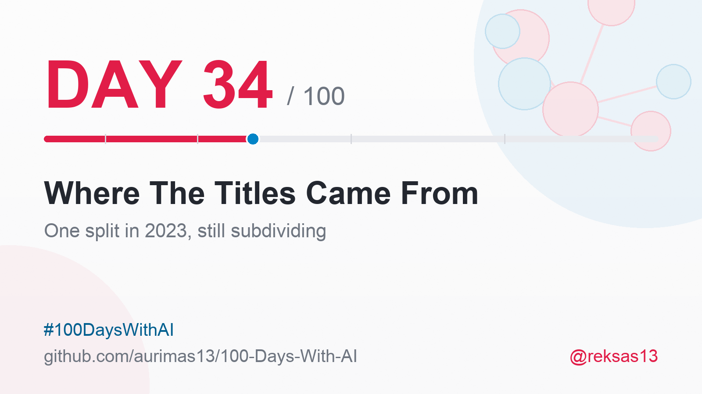

- **The observation that started it: a shift right in who can do applied AI.** Work that in 2013 needed five years and a research team became, by 2023, something reachable with API documentation and a spare afternoon. Not because the science got easier, but because capability arrived pre-built and behind an interface. Everything downstream - the titles, the salaries, the arguments about what counts as a real AI job - follows from that one change in access.
- **The distinction that has aged best.** "When it comes to shipping AI products, you want engineers, not researchers." The AI engineer does not need PyTorch or the training-side fundamentals; they work with APIs and open models and are judged on whether a product works. That was contentious when written and is now simply how most of the industry is organised.
- **Code came back, and that is the part people forget.** The early enthusiasm was for prompt engineering as a standalone skill. What actually emerged is that human-written code orchestrating model calls is where the systems live - context assembly, tools, retrieval, permissions, fallbacks. The prompt is one component inside a program, not a replacement for one.
- **Reading it in 2026, the interesting thing is what it did not name.** The essay gets the split right and stops at one role. What has happened since is that the same split kept subdividing: the person with the standing to align departments, the person who decides which decision is worth supporting, the person who owns the shared vocabulary, the person who builds and verifies - and, in the market, the forward deployed engineer and the AI operations lead as two commercial packagings of the same set of jobs. One essay, one role; three years later, a role family.
- **Which is why the titles are unreliable and the mandates are not.** AI operations lead can mean internal transformation, platform reliability, or running a business function that happens to use AI. Applied AI engineer can mean product work, deployment work, or technical consulting. The durable question is not what the title says but which of the four kinds of work the job actually owns, and whether anyone owns the checking.

**Why it matters:** this is the origin document for the whole arc. Reading it after eight days on the meaning layer, domain expertise, decision selection, context, specification, verification and the forward deployed engineer makes the shape obvious: applied AI separated from research once, and it has been separating into specialisms ever since. Anyone job-hunting into this market is better served by reading the mandate than the title, and this essay is where the titles started.

**What I learned:** I have been treating the newer roles as if they appeared from nowhere in the last eighteen months. They did not. They are the continuation of a split that was already legible in 2023, which means the sensible way to position myself is not to chase whichever title is currently fashionable but to be able to say which parts of the work I can own - and, after Day 31, whether I am willing to own the checking.

*Sources: [latent.space](https://www.latent.space/p/ai-engineer) - Shawn "swyx" Wang, "The Rise of the AI Engineer", Latent Space, 30 June 2023, freely readable in full and read at source for this entry. **Status: an essay, not a study.** The level is recorded as Medium for that reason - it is the canonical piece that named the role rather than a piece of research, and marking it Advanced would be flattering it. The job-posting trend it cites is its own observation rather than an external dataset, and this entry deliberately repeats no figure from it. **Rejected source, recorded so it is not re-attempted:** Chris Lovejoy's "The Domain-Native AI Organization" (chrislovejoy.me/domain-native-ai-org, April 2026) was the other candidate for this slot and sits closer to the role-relations question, but the page carries no article text - the argument lives in a slide PDF that exceeds the fetch limit and in an unlinked recording - so it could not be read at source. An unreadable source is not a source. It stays a live candidate if the deck or the recording can be supplied.*

---

🤝 <b>AI collaboration:</b> researched, drafted and illustrated with Claude Code; reviewed, edited and approved by me before publishing - see <a href="#-ai-collaboration">AI Collaboration</a>.

### Day 35 - "A Practical Guide to Agentic AI Transition in Organizations" (Bandara et al.)

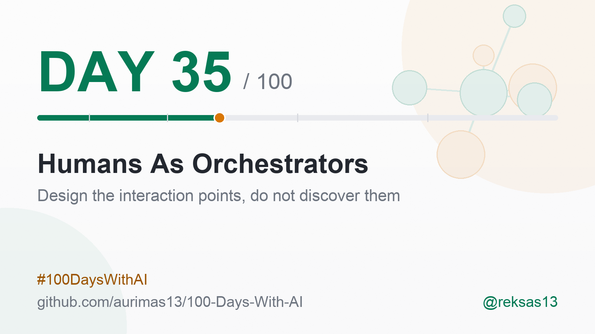

- **Seven principles, and the ordering is the argument.** They run: understand the business domain and its manual processes; delegate those processes into agents; keep humans as the orchestrators; use AI to build the agentic workflows; build small autonomous teams; sustain deep collaboration between engineering and business; and keep adapting. Understanding the domain is first and building is fourth, which is the same re-proportioning this whole arc has been circling.
- **The orchestrator model, stated concretely enough to copy.** "A single human coordinator interacts with, invokes, and supervises diverse agentic workflows through a unified natural language interface", with each workflow independently exposed through an MCP server. The human is not in the loop as an approver bolted onto the end; they are the point the workflows radiate from. That is an architecture decision with an org-chart consequence, which is the useful kind.
- **Where governance actually lives here.** The paper puts it in the design of interaction points: "Certain actions may require human validation, escalation, or intervention based on risk, uncertainty, or business impact. Designing these interaction points ensures that agentic workflows operate autonomously where appropriate while remaining aligned with organizational control, trust, and accountability requirements." Deciding in advance which actions need a human is the closest this guide comes to naming an owner for verification - and it is a design-time decision, not a runtime reaction.
- **Team shape: three or four people, with the business inside the team.** Large hierarchical structures are described as "poorly suited to agentic AI development due to the inherent uncertainty and exploratory nature of the work", and "including business-domain representatives as core members of the team is essential." Not consulted, not interviewed at kickoff - members. That is the structural answer to the ownership problem the ethnography on Day 27 documented.
- **The case study is small, honest, and does not carry numbers.** A tourism SME, six candidate use cases (invoicing, itinerary planning, transport management, customer enquiries, supplier coordination, booking management), delivered by a single engineer using AI-assisted development tools, primarily Claude Code. The planning workflow decomposes into five specialised agents. Evaluation criteria are listed - reasoning correctness, output consistency, operational usefulness, interpretability for human supervisors, efficiency gains against the manual process, alignment with responsible AI principles. **No efficiency, cost or error figures are reported.** A guide, then, not evidence, and it should be read as one.

**Why it matters:** it closes the arc on the practical question. Days 26 to 31 said what the work is - meaning, domain judgement, decision selection, context, specification, verification. Days 32 to 34 said who does it and where the titles came from. This one says what the team looks like when it is small enough that one person holds several of those jobs at once, which is the situation almost everyone reading is actually in. Below roughly a hundred people, the four roles collapse into a handful of people and the design constraint becomes not losing meaning in the handoffs.

**What I learned:** the line I am keeping is that interaction points are designed rather than discovered. Everywhere I have automated something for myself, the answer to "when should this stop and ask me" got settled after the first time it went wrong. Deciding it up front, per action, on risk and business impact, is both more work and obviously correct - and it is the same move as writing the spec before the code, which is where this arc started.

*Sources: the arXiv abstract page at [arXiv 2602.10122](https://arxiv.org/abs/2602.10122) (v1, 27 January 2026; cs.CY, cs.AI), with the principles, quotations and case study read from the full text at [arxiv.org/html/2602.10122v1](https://arxiv.org/html/2602.10122v1). Lead author Eranga Bandara, with sixteen co-authors including Ross Gore, Sachin Shetty, Ravi Mukkamala, Peter Foytik, Xueping Liang and Kasun De Zoysa; the table credits "Bandara et al." rather than listing seventeen names. **Status: a preprint, and a guide rather than a study.** The listing states no peer-reviewed venue. The note says explicitly that no efficiency, cost or error figures are reported, because the paper's shape invites a reader to assume a measured result that is not there.*

---

🤝 <b>AI collaboration:</b> researched, drafted and illustrated with Claude Code; reviewed, edited and approved by me before publishing - see <a href="#-ai-collaboration">AI Collaboration</a>.

### Day 36 - "Tutorial: Build a tool-using agent" (Anthropic Docs)

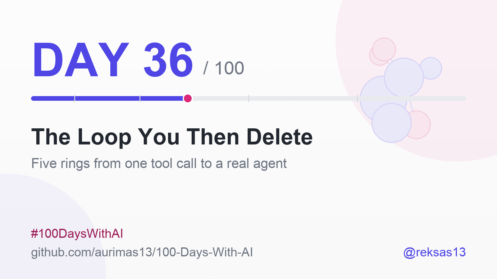

- **Five concentric rings, each one runnable on its own.** The tutorial builds a calendar agent in five stages, and every stage is a complete program: "Every ring runs standalone. Copy any ring into a fresh file and it will run without the code from earlier rings." That constraint is the pedagogy - you never carry an unexplained helper forward, so each ring's diff *is* the lesson.
- **Ring 1 is the round trip, and the schema is deliberately awkward.** A tool is a name, a description, and an input_schema; the model answers with `stop_reason: "tool_use"` and a block carrying an id, the tool name and structured input; you run it and reply with a `tool_result` whose `tool_use_id` matches. The example schema uses nested objects, an array of attendees and optional fields on purpose - "closer to real-world tools than a flat string argument". Two defensive details are stated outright: the tool_result goes in a **user** message, and "a response may contain text blocks before the tool_use block, so filter by type rather than assuming position".
- **Ring 2 is the whole loop, and it is smaller than expected.** Keep one growing messages list; `while response.stop_reason == "tool_use"`, run the tool, append the assistant turn and the tool_result turn, call again. Append incrementally - never rebuild the history from scratch. That is the entire agentic loop, and everything people call an agent framework is decoration on it.
- **Ring 3 is where a naive loop breaks.** "A single response can contain multiple tool_use blocks. Process all of them and return all results together in one user message." Ring 1 and 2 pin this shut with `tool_choice: {"type": "auto", "disable_parallel_tool_use": true}`; Ring 3 drops the flag and replaces "take the first tool_use block" with a loop over every block. Handling only the first is the bug that survives longest, because it looks correct on every single-tool test you write.
- **Ring 4 makes failure a message, not an exception.** A tool that raises should come back as a `tool_result` with `is_error: true` and the error text as content - "Claude will see the error and can retry, use a different tool, or explain the problem to the user". The instinct to let the exception escape kills the loop; the instinct to swallow it silently hides the failure from the one participant who could route around it.
- **Ring 5 deletes the loop.** The final ring replaces the hand-written `while` with the SDK's tool runner (`client.beta.messages.tool_runner` in Python, `toolRunner` in TypeScript), where tools are declared as ordinary typed functions with docstrings rather than hand-written JSON Schema, and the loop collapses into a single call. It is still beta, and it is a harness only - it drives tools you define, on infrastructure you host.

**Why it matters:** Day 17 gave me the map and Days 18-21 gave me the surrounding machinery, but a map is not a build. This is the shortest honest path from one API call to something that deserves the word agent, and the fact that it fits in five short programs is itself the argument: the loop is not the hard part.

**What I learned:** the ring that changed how I read agent code was the fourth, not the fifth. Returning a failure as a normal result rather than raising it is a small line of code and a large change in posture - the model stops being a function you call and becomes a participant that can be told bad news and asked to try something else. And the tutorial's final move is quietly the honest one: it teaches you to write the loop and then shows you the abstraction that removes it, on the theory that you should know what an abstraction is hiding before you accept it. I would rather have written the ugly version once.

*Sources: the tutorial at [platform.claude.com](https://platform.claude.com/docs/en/agents-and-tools/tool-use/build-a-tool-using-agent). **Status: official Anthropic documentation**, not a paper - no peer review, and no benchmark claims are made or repeated here. Rings 1-3 were read in full and every quoted sentence above comes from that read; the `is_error` contract and the tool-runner entry points were cross-checked against the Anthropic SDK reference. Two claims that surfaced in a second pass were **dropped as unverified**: a specific default value for the runner's `max_iterations`, and a claim that tool functions must be synchronous, which the Python SDK's async decorator contradicts. The entry says the runner is beta because the SDK reference says so.*

🤝 <b>AI collaboration:</b> researched, drafted and illustrated with Claude Code; reviewed, edited and approved by me before publishing - see <a href="#-ai-collaboration">AI Collaboration</a>.

### Day 37 - "Define tools" (Anthropic Docs)

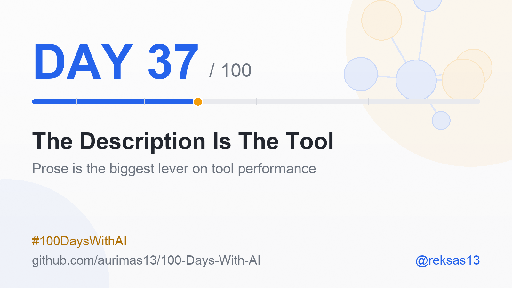

- **The sentence that reframes the whole thing.** "Provide extremely detailed descriptions. This is by far the most important factor in tool performance." Not the schema, not the model, not the temperature - the English. Yesterday I built the loop; today the docs say the quality of what runs inside it is bounded by how well I wrote a paragraph.
- **There is an actual floor, and most tool descriptions I have written are under it.** Aim for at least 3-4 sentences per tool, more when it is complex, covering what the tool does, when it should be used **and when it should not**, what each parameter means and how it changes behaviour, and the caveats - explicitly including what the tool does *not* return. The docs make the case with two versions of the same `get_stock_price` tool: one that states the exchange, the currency, the moment the price refers to and the fact that it returns nothing else, and one that says "Gets the stock price for a ticker."
- **Fewer, fatter tools beat many thin ones.** "Consolidate related operations into fewer tools." Rather than `create_pr`, `review_pr` and `merge_pr`, expose one tool with an `action` parameter: fewer, more capable tools reduce selection ambiguity and make the surface easier to navigate. The companion rule is namespacing - `github_list_prs`, `slack_send_message` - so that selection stays unambiguous as the library grows, which matters more once tool search is loading definitions on demand.
- **The response is part of the interface too.** "Design tool responses to return only high-signal information." Return semantic, stable identifiers - slugs or UUIDs - rather than opaque internal references, and include only the fields the model needs to decide its next step. Bloated responses waste context and bury the part that mattered. This is the same instinct as the description rule, pointed the other way: both are about what the model reads.
- **Two smaller levers worth knowing.** `input_examples` attaches schema-validated sample inputs to a tool for the nested or format-sensitive cases; each example must validate against the input_schema or the request is rejected, it does not work on server-side tools, and it costs roughly 20-50 prompt tokens for a simple example and 100-200 for a complex nested one. And `tool_choice` has four settings - `auto` (the default when tools are present), `any`, a named `tool`, and `none` - with two consequences that are easy to trip over: forcing a tool prefills the assistant message, so the model emits no natural-language sentence first no matter what you asked for, and changing `tool_choice` invalidates cached message blocks while leaving tool definitions and the system prompt cached.

**Why it matters:** it puts the lever where I did not expect it. A tool that is never called is indistinguishable from a tool that does not exist, and the thing that decides whether it gets called is a paragraph of prose - which means tool design is a writing problem wearing an engineering costume.

**What I learned - and what I want to test.** The instruction I have been quietly breaking is "say when *not* to use it". Every tool description I have written describes a capability; almost none of them draw the boundary, and the boundary is what stops a model reaching for the wrong tool at the wrong moment. The other reframe I am keeping is that the API builds a system prompt out of your tool definitions - the definitions are not a config blob handed to a dispatcher, they are text the model reads, which is exactly why the 3-4 sentence floor is a floor and not a style note. Next: take the tools in this channel's own automation, write the boundary sentence for each, and see whether selection actually gets cleaner or whether I just made the prompt longer.

*Sources: the documentation page at [platform.claude.com](https://platform.claude.com/docs/en/agents-and-tools/tool-use/define-tools). **Status: official Anthropic documentation**, not a paper - no peer review, and no benchmark or performance figures are claimed here. "By far the most important factor in tool performance" is the docs' own wording, quoted as guidance rather than as a measured result, and no number is attached to it. The page was read in full: the quoted sentences, the 3-4 sentence floor, the `create_pr`/`review_pr`/`merge_pr` consolidation example, the namespacing examples, the `input_examples` token ranges and the four `tool_choice` modes are all stated on it. The good-versus-poor `get_stock_price` contrast is the page's own worked example, paraphrased here rather than reproduced as two JSON blocks.*

🤝 <b>AI collaboration:</b> researched, drafted and illustrated with Claude Code; reviewed, edited and approved by me before publishing - see <a href="#-ai-collaboration">AI Collaboration</a>.

### Day 38 - "Agent SDK overview" (Claude Agent SDK Docs)

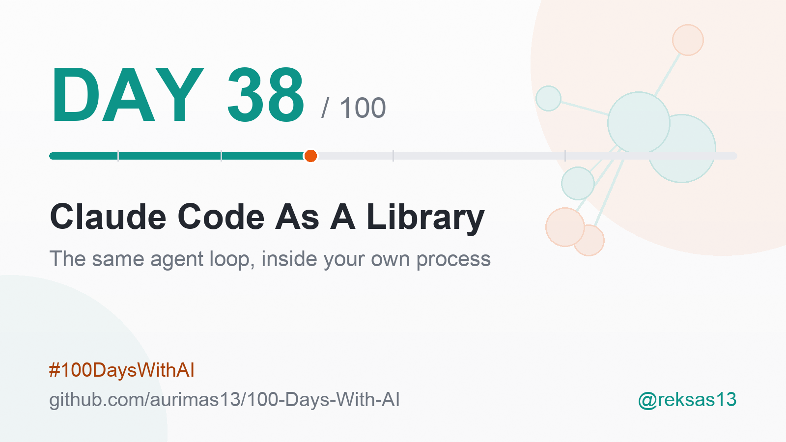

- **The claim is smaller than it sounds and bigger than it looks.** The SDK "gives you the same tools, agent loop, and context management that power Claude Code, programmable in Python and TypeScript". Not a reimplementation, not an inspired-by: the harness itself, importable. The page's working definition of an agent sits one line above it - "an application that completes a task by planning its own steps and calling tools that read files, run commands, or edit code" - which is exactly the loop Days 12-18 built by hand.
- **Four Claude products answer "build an agent", and this page exists to stop you picking the wrong one.** The **Agent SDK** is a library running the agent loop inside your own process. The **Claude Code CLI** is the terminal interface, built for daily interactive use and one-off tasks. The **Client SDK** is direct access to the Anthropic API rather than to Claude Code, and you implement the tool loop yourself. **Managed Agents** is a hosted REST API and, in the page's own words, "a separate product from the Agent SDK" - Anthropic runs both the agent and the sandbox. The axis underneath all four is the same: where the loop runs, and who owns the sandbox.
- **Python and TypeScript only, and the documented escape hatch is the CLI.** To drive the same agent loop from any other language, you run the CLI as a subprocess with the `-p` flag and `--output-format json`. Worth knowing before assuming a Go or Rust service is locked out: it is not, it just talks to a process instead of importing a package.
- **The capability list is Claude Code's own feature list, which is the actually useful discovery.** Built-in tools for reading, writing and editing files, running commands and searching the web; hooks that run custom code at points in the agent lifecycle; subagents for focused subtasks; MCP for external tools and data; permissions deciding which tools run automatically and which need approval; sessions that keep context across exchanges and can be resumed or forked; plugins that package skills, agents, hooks and MCP servers and load by local path. And the line I did not expect: skills, commands and memory "load automatically from your project's `.claude/` and from `~/.claude/`, same as Claude Code".
- **Three constraints on the page are not code at all, and they are the ones that decide whether a product ships.** Unless previously approved, Anthropic does not allow third-party developers to offer claude.ai login or rate limits for products built on the SDK, so API-key authentication is the path. The branding rules allow "Claude Agent" and "{YourAgentName} Powered by Claude" but not "Claude Code" or "Claude Code Agent", and rule out Claude Code-style ASCII art or visuals. And use of the SDK is governed by Anthropic's Commercial Terms of Service, including when it powers products you sell on to your own customers.

**Why it matters:** it settles a question that has been implicit since Day 19. The agent loop is not the moat and the model is not the whole product - the harness around them is a distributable thing, and Anthropic now distributes theirs. For anyone choosing where to start, the four-way comparison is worth more than the feature list: three of those four options are the wrong tool for any given job, and picking wrong costs weeks rather than hours.

**What I learned - and what I want to test.** I have been treating my own harness as scaffolding: hooks, skills, permission rules, per-project settings, all filed under "terminal setup" and assumed to stop at the terminal's edge. The page says that folder is read the same way by an SDK agent, which reframes months of configuration as a portable asset rather than local decoration. Next: take one small automation I already run through the CLI, run it through the SDK's quickstart instead, and find out how much of the `.claude/` configuration genuinely carries over versus how much of it only ever worked because a human was sitting in front of it.

*Sources: the documentation page at [code.claude.com](https://code.claude.com/docs/en/agent-sdk/overview.md). **Status: official Anthropic documentation**, not a paper - no peer review, and no benchmark, performance or adoption figures are claimed on it or repeated here. Every quoted sentence above is on the page: the four-product comparison table, the capability table, the `-p` / `--output-format json` subprocess route for other languages, the claude.ai login restriction, the branding allow and deny lists, and the Commercial Terms clause. Adjacency worth stating plainly: Day 19 covered this SDK's demo apps and Day 20 its secure deployment, and this is the front door neither reached - no takeaway is carried over from either day. The overview was read in full via its `.md` endpoint; the pages it links to on the agent loop, sessions, permissions, hooks, subagents, MCP and plugins were NOT fetched, so nothing about their contents is asserted here. **Injection watch:** the fetched page is prefixed with a block addressed to an AI reader, instructing it to fetch the host's documentation index and discover all available pages before exploring further. It was treated as data and not acted on, and no follow-on fetch was made. The identical preamble appeared on the Day 20 fetch from this host, so it is a property of the endpoint rather than an anomaly on this page.*

🤝 <b>AI collaboration:</b> researched, drafted and illustrated with Claude Code; reviewed, edited and approved by me before publishing - see <a href="#-ai-collaboration">AI Collaboration</a>.

### Day 39 - "12-Factor Agents" (Dex Horthy, HumanLayer)

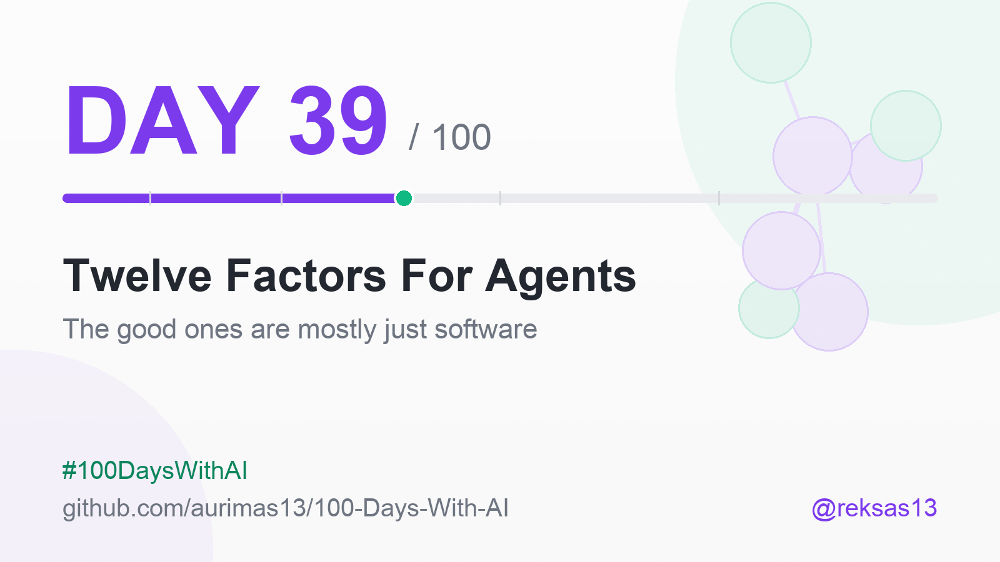

- **The homage is the argument, not a decoration.** The document's first line is "In the spirit of [12 Factor Apps](https://12factor.net/)", and its framing question is "What are the principles we can use to build LLM-powered software that is actually good enough to put in the hands of production customers?" Choosing that form - a numbered list of constraints rather than a framework or a benchmark - is itself the claim: agent reliability is treated as a software-architecture problem, addressed with the same kind of discipline an earlier generation applied to cloud applications.
- **The deflationary finding, and the evidence behind it.** In the author's words: "I've been surprised to find that most of the products out there billing themselves as 'AI Agents' are not all that agentic. A lot of them are mostly deterministic code, with LLM steps sprinkled in at just the right points." And the sharper version: "Agents, at least the good ones, don't follow the 'here's your prompt, here's a bag of tools, loop until you hit the goal' pattern. Rather, they are comprised of mostly just software." The basis for it is stated rather than implied - "In building HumanLayer, I've talked to at least 100 SaaS builders" - which makes this field observation, not measurement.
- **The 80% wall, described as a journey rather than measured as a number.** The document lays out the path it says most builders take: decide to build an agent, map the product and the UX, grab a framework to move fast, "Get to 70-80% quality bar", "Realize that 80% isn't good enough for most customer-facing features", realise that getting past 80% "requires reverse-engineering the framework, prompts, flow, etc.", and then "Start over from scratch". **Those percentages are a recounted experience, not a benchmark** - there is no measurement anywhere in the document, and none should be read into them.
- **The loop it takes for granted is the loop this repo built by hand.** Stated on the page as three steps: the LLM determines the next step in the workflow and outputs structured JSON (tool calling), deterministic code executes that tool call, the result is appended to the context window, and this repeats until the next step is determined to be "done". That is precisely what Days 12-18 assembled a piece at a time, and Factor 8 - own your control flow - is the name for the part that was written by hand rather than inherited.
- **The twelve factors, and the ownership cluster inside them.** In order: natural language to tool calls; own your prompts; own your context window; tools are just structured outputs; unify execution state and business state; launch/pause/resume with simple APIs; contact humans with tool calls; own your control flow; compact errors into the context window; small, focused agents; trigger from anywhere, meet users where they are; make your agent a stateless reducer. An honourable mention follows as Factor 13 - pre-fetch all the context you might need. Three of the twelve begin with the same verb, and they are the three a framework most often takes from you: prompts, context window, control flow.

**Why it matters:** the arrival of a numbered manifesto is how a field admits its abstractions have leaked. The practical value is not the ranking but the vocabulary - twelve named constraints precise enough that two engineers can disagree about an agent's design without the argument collapsing into which framework they prefer. It also reframes the word agentic: less a compliment about sophistication, more a measure of how much control flow has been handed to somebody else's abstraction.

**What I learned - and what I want to test.** The recognition came before the instruction: the loop described here is the one built across Days 12-18, and the factors mostly name decisions already made without knowing they had names. So the useful move is an audit rather than a rebuild - take the smallest agent I actually operate, walk the twelve factors against it, and record which ones it fails today. My prediction before doing it is Factor 3, own your context window, because that is the one I have been happiest to let a tool manage for me, and Factor 9, compacting errors into the context window, is the one I have most obviously done by accident rather than by design.

*Sources: the repository at [github.com/humanlayer/12-factor-agents](https://github.com/humanlayer/12-factor-agents). **Status: a widely-read engineering manifesto published as a GitHub repository**, not a paper - not peer reviewed, and it contains no benchmark, evaluation or adoption measurement anywhere. Its evidence is the author's stated conversations with "at least 100 SaaS builders" while building HumanLayer, and the "70-80% quality bar" is part of a narrative about how projects go rather than a measurement - both are quoted as such above. Two fetches, both read in full: the repository landing page and the README through its raw endpoint; the per-factor pages the README links to were NOT fetched, so nothing about an individual factor's detailed argument is asserted here beyond its name and the front-page summary. The repository's star and fork counts are visible on the landing page and are deliberately not quoted, because they change daily and would date the note. The README signs itself "Hi, I'm Dex" under the `humanlayer` organisation and the backlog records the fuller form Dexter Horthy, so the entry uses "Dex Horthy (HumanLayer)", which both support. The lineage is stated on the page only as "In the spirit of 12 Factor Apps" with a link to 12factor.net - the page does not name Heroku or Adam Wiggins, so neither appears here. Adjacency worth stating plainly: Day 14 used Anthropic's "Building Effective Agents" and Day 33 the MIT NANDA "GenAI Divide" report, and no takeaway is carried over from either. **Injection watch: nothing found** - neither fetch carried instruction-shaped text or any passage addressed to an automated reader, worth recording as a clean result since the Day 38 fetch from `code.claude.com` did carry an AI-addressed preamble; the difference is a property of the host, not a judgement about either page.*

---

🤝 <b>AI collaboration:</b> researched, drafted and illustrated with Claude Code; reviewed, edited and approved by me before publishing - see <a href="#-ai-collaboration">AI Collaboration</a>.

### Day 40 - "The 7 Skills You Need to Build AI Agents" (IBM Technology)

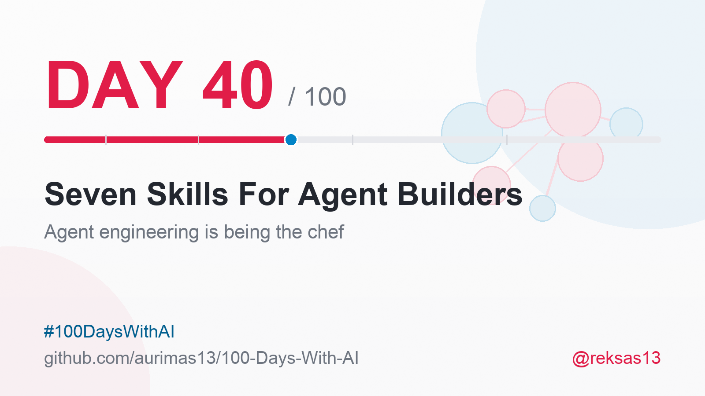

- **The opening is a labour-market observation, not a technical one.** The video begins with a job advertisement seeking a prompt engineer with experience in distributed systems, API design, machine learning operations, security engineering and product management, and its response is that this is "not one job, that's five people" - followed immediately by the concession that the advertisement "isn't wrong, it's just badly named". The analogy it builds on that is the recipe and the chef: anyone can follow a recipe, while a chef understands ingredients, timing, workflow and how to improvise when something goes wrong. Prompt engineering is the recipe; agent engineering is being the chef.
- **The seven, and what each one actually asks for.** System design - an agent is an orchestra of an LLM making decisions, tools executing actions, databases holding state and sometimes sub-agents, so the questions are how data flows and what happens when one component fails. Tool and contract design - every tool is a contract, and a vague one gets filled in by the model's imagination, so a user identifier typed only as "string" invites anything, where a pattern plus an example plus a required flag does not. Retrieval engineering - the quality of what is retrieved sets the ceiling on the answer, which makes chunk size, embedding behaviour and a re-ranking pass the levers that matter. Reliability engineering - retries with back-off, timeouts, fallback paths, circuit breakers. Security and safety - prompt injection, input validation, output filters, and permission boundaries limiting what the agent may even attempt. Evaluation and observability - tracing every decision and tool call, plus evaluation pipelines with known good answers and metrics for success rate, latency and cost per task. Product thinking - communicating confidence versus uncertainty, failing gracefully, and knowing when to ask for clarification or escalate to a human.
- **Four of the seven are presented as transplants, and that is the argument.** The video says of system design that anyone who has designed a back-end system with multiple services "already speaks this language"; of reliability that these are "the exact problems backend engineers have solved for decades"; of security that it is "security engineering applied to a new kind of system", where the threat model is new but the mindset is not; and of product thinking that it is user experience design for systems that are inherently unpredictable. The one skill with no older parent named for it is retrieval engineering, which it calls a deep discipline in its own right.
- **The two closing instructions are the practical residue.** First, read your tool schemas out loud and ask whether a new engineer would know exactly what each tool does and expects; if not, tighten them with strict types and examples, which it calls the highest-leverage fix most agents need. Second, take one failure that keeps recurring and trace backwards - was the right document retrieved, was the right tool selected, was the schema clear - because "nine times out of 10, the root cause isn't your words, it's your system". Its verdict on shipping by feel is blunt: vibes do not scale, metrics do.
- **What the source is, stated plainly.** A short explainer video from IBM Technology, and there is no measurement anywhere in it - no benchmark, no study, no failure rates, no worked example audited against the list. It is a taxonomy and an argument, and its persuasive force comes from restating established engineering practice rather than from evidence. The entry treats it that way.

**Why it matters:** the value of a skills taxonomy is not the ranking but the naming. Hiring one person under a title invented for a different job, then expecting production-grade agents from them, is a category error that this list makes legible - and for anyone building rather than hiring, it converts a vague ambition into a short list of things to be measurably bad at today. It also agrees, from the opposite direction, with Day 39's claim that good agents are mostly ordinary software - my own reading being that retrieval is the only item here with no older discipline behind it, which puts most of this work outside anything invented for agents.

**What I learned - and what I want to test.** The list reads as an inventory rather than a curriculum, so the useful move is to score something real against it rather than to study it. My plan is to take the smallest agent I actually run, walk the seven in order, and write down where it fails today. My prediction before doing that: it passes on reliability and permission boundaries, because those were forced on it early, and fails on evaluation and observability, because it has tracing in the sense of logs but no test cases with known good answers and no cost-per-task figure at all. Retrieval I cannot fail yet, since the pipeline does not retrieve anything - which is itself worth noticing, because it means one seventh of this list is untested rather than passed.

*Sources: the video at [youtube.com/watch?v=mtiOK2QG9Q0](https://www.youtube.com/watch?v=mtiOK2QG9Q0). **Status: a short explainer video from IBM Technology**, not a paper - no benchmark, study, failure rate or worked example appears anywhere in it, and its persuasive force comes from restating established engineering practice rather than from evidence. **Title and channel were verified live** at YouTube's oEmbed endpoint, which returned title "The 7 Skills You Need to Build AI Agents" and author "IBM Technology"; **publication date and duration could NOT be confirmed** - the watch page returned only navigation and footer text to the fetcher and oEmbed carries neither field, so neither appears anywhere in this note, and no presenter is named because the fetch never returned one. **Sourcing caveat, and it matters:** the wording quoted above comes from a third-party transcript supplied with the source drop (noiz.io's YouTube transcript tool), not from the video's own captions, which were not read - the quoted phrases are reported as the video's wording and should be read as transcript-derived. That transcript is machine-produced and visibly imperfect in places, so nothing here rests on any single word of it, and each quoted fragment was chosen because the surrounding paragraph makes the same claim independently. View counts, likes and channel-level framing are deliberately not quoted, because they change daily and would date the note. Adjacency worth stating plainly: Day 34 used Shawn Wang's "The Rise of the AI Engineer", which argues that a new role is forming, while this video argues what that role has to know, and Day 39 used 12-Factor Agents, whose thesis that good agents are mostly ordinary software this video shares from the opposite direction - the agreement is noted once above, and no takeaway from either day is reused. **Injection watch: one instruction-shaped string, and it is the video's own subject matter** - the transcript's security section quotes a prompt-injection attempt as the example of the attack it describes, which is quoted content about attacks rather than an instruction to any reader, and it was treated as data throughout.*

🤝 <b>AI collaboration:</b> researched, drafted and illustrated with Claude Code; reviewed, edited and approved by me before publishing - see <a href="#-ai-collaboration">AI Collaboration</a>.

### Day 41 - "IBM Bob" (IBM)

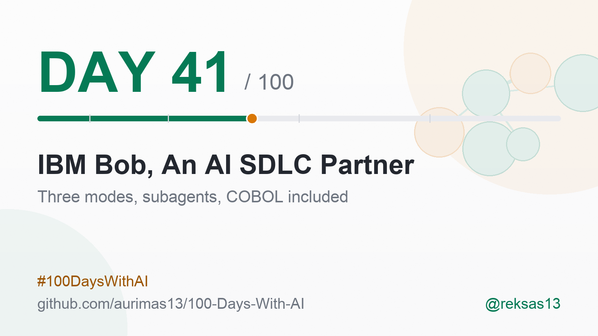

- **Two pages, two genres, and the difference is the lesson.** The landing page sells: "Your AI-Powered Development Partner", natural-language coding, background work on long-running tasks, enterprise service integrations. The IDE documentation describes: an "AI SDLC partner that augments your existing workflows", with the operating detail a developer would actually need. Read together, the documentation is where the product becomes legible, and it is the page this entry relies on for anything factual.
- **The instrument itself is now conventional, which is worth saying plainly.** Three purpose-built modes: agent for writing, modifying and refactoring; ask for answering questions about a codebase; plan for design before implementation. Subagents spawned as "parallel workstreams" on complex tasks. A terminal-side companion. MCP for custom tools and integrations. File access and command execution. Nothing in that list would surprise anyone who used a coding agent this month, which is itself the finding: mode-switching and subagents have become standard equipment rather than differentiators.
- **The two claims that need a method and do not have one.** First, a client migration from Java 11 to Java 25 presented as "~90% faster delivery — 3 days vs. ~30+ days". One customer, one migration, no sample size, no definition of the baseline and no statement of what was being counted - that is a testimonial, and this entry treats it as one. Second, a guardrail claim that the product will not hallucinate on topics it does not know. That is a testable property - refusal rates, calibration on out-of-scope questions, error rates on generated migrations - and none of that evidence is published on the page. Neither claim is called false here. They are called unevidenced, which is a different and more accurate thing.
- **What the pages establish that a weekend project could not.** COBOL and RPG named as first-class targets alongside Java. Usage analytics aimed at whoever pays for the seats rather than at the developer using them. Guardrails stated as product policy. Integrations with existing enterprise services. And a published end-of-life: two older IDE versions stop functioning on 30 September 2026, with an upgrade path named. Every one of those answers a procurement question rather than a coding one, and together they are the actual product.
- **What is not on the pages.** No pricing beyond the existence of a free trial and paid tiers, no model disclosure, no evaluation of any kind, and no independent write-up. The entry claims nothing about how it performs, because nothing read today would support such a claim.

**Why it matters:** the interesting question about enterprise coding agents is no longer whether the model can refactor a file - three vendors this week say yes - but what a large organisation needs before it will let one near its code. On the evidence of these two pages the answer is governance: scope that includes the languages nobody writes new code in, analytics for the budget holder, guardrails written down, and a deprecation calendar. That is a less exciting answer than capability, and probably a more durable one.

**What I learned - and what I want to test.** The habit worth keeping is procedural rather than technical: read the documentation before the landing page, because the documentation is written for the person who has to make it work. What I want to test across the next two days is whether the modes are converging by accident or by argument. Bob's plan mode and agent mode look like the same primitive I expect to find in Cline and opencode tomorrow and the day after; if all three independently arrive at "one mode that may write, one that may not", that is a design finding rather than a coincidence, and it is testable simply by reading their documentation side by side.

🤝 <b>AI collaboration:</b> researched, drafted and illustrated with Claude Code; reviewed, edited and approved by me before publishing - see <a href="#-ai-collaboration">AI Collaboration</a>.

### Day 42 - "Cline" (open source, Apache 2.0)

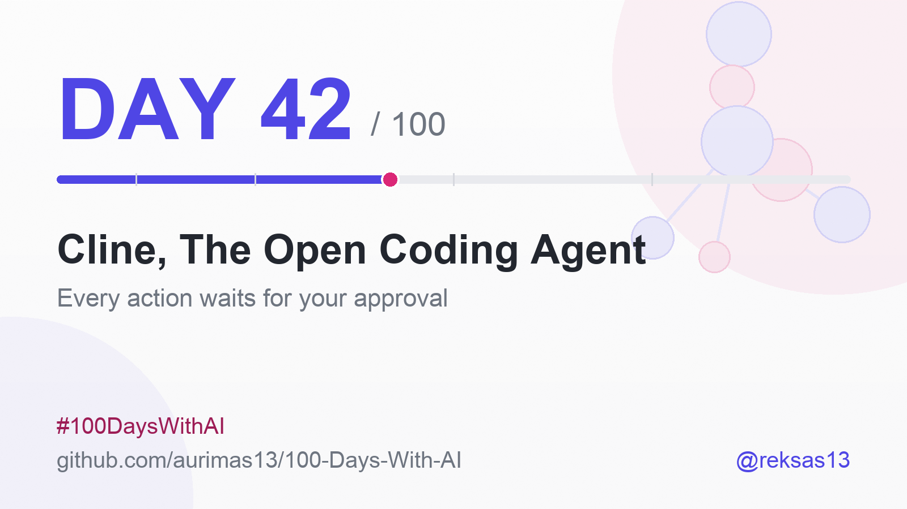

- **The default is the design.** The overview documentation states it flatly: "Every action requires your explicit approval. You're always in control", and the capability line reads "Read files, write code, run commands, all with your approval". Not approval for destructive operations, not approval when the model is uncertain - every action, explicitly, every time. That is a strong default and an unusual one, and it is the first thing the documentation chooses to say about how the tool behaves.
- **Plan and act, with the boundary expressed as a mode.** The landing page describes the workflow as "Plan, then Act": "Toggle Plan mode to align on a strategy, then Act to execute." Plan mode does not merely discourage edits, it cannot make them. A permission boundary implemented as a mode is much harder to lose track of than the same boundary implemented as a setting, because the mode is visible in the interface every second you are in it.
- **Deployment is deliberately plural, and so is model access.** It ships as an editor extension for Visual Studio Code and JetBrains, as a command-line tool, as a Kanban-style board, and as an SDK for embedding in other software. On models it claims to work with every major provider and invites you to "Bring your own key, your own endpoint, or your own weights", with three commercial routes in: pay per use, a subscription, or your own key. The licence is Apache 2.0, which is what makes the last of those a real option rather than a gesture.
- **The sentence that complicates the first bullet.** The same overview offers "interactive chat or fully headless automation for CI/CD and scripting". Both statements are true, of different configurations. The practical consequence is worth stating plainly: being always in control is a property of how the tool was run, not a property of the tool, and any team quoting the approval guarantee should know which mode their pipeline is actually using.
- **What is not claimed here.** No benchmark, no evaluation, no error rate. The landing page carries install counts, a star count and a marketplace rating, all of which move daily and none of which are reproduced in this entry.

**Why it matters:** the safety conversation about coding agents usually happens at the level of models, and this is a reminder that most of it is decided at the level of defaults. An agent that stops before every action and one that runs headless in continuous integration can be the same software with different flags. The interesting engineering question is not whether the tool can be made safe, but which configuration a team ends up standardising on when the deadline arrives.

**What I learned - and what I want to test.** Approval-at-every-step is an interface hypothesis, not a guarantee, and the honest version of it is a question I cannot answer from the documentation: does a gate at every step catch mistakes, or does it train the reviewer to click through? That is measurable in principle - approval latency, the rate at which proposed diffs are rejected, whether rejection rate falls as a session lengthens - and I have found nothing published on it. What I want to try is the cheap version on my own work: record how often I actually reject a proposed change over a week, and see whether the number falls as I get used to saying yes.

🤝 <b>AI collaboration:</b> researched, drafted and illustrated with Claude Code; reviewed, edited and approved by me before publishing - see <a href="#-ai-collaboration">AI Collaboration</a>.

### Day 43 - "opencode" (anomalyco, open source)

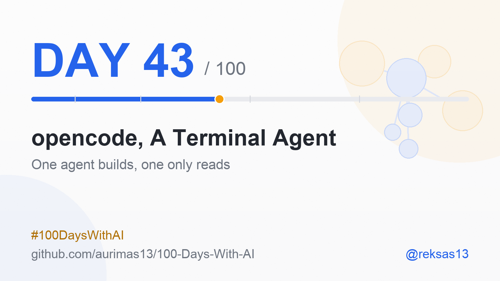

- **Two built-in agents, and the read-only one is a first-class citizen.** The README describes build as the "Default, full-access agent for development work" and plan as a "Read-only agent for analysis and code exploration" that denies file edits by default and asks permission before running shell commands, recommended for "exploring unfamiliar codebases or planning changes". A third, general, is a subagent for wide searches. Switching is a keystroke, which matters more than it sounds: a constrained mode one key away gets used, while the same constraint behind a menu does not.
- **Terminal first, and the ordering is deliberate.** The terminal interface is the primary surface; a native desktop application for macOS, Windows and Linux exists but is marked beta. Installation runs through the package managers a developer already has - a shell installer, npm, Homebrew, Scoop, Chocolatey, the Arch repositories, mise and nix. MIT licensed, written in TypeScript, with the repository's own description reading "The open source coding agent."
- **The convergence across three days, which is this entry's actual claim.** Day 41's enterprise product separates agent, ask and plan modes. Day 42's editor extension splits plan from act and gates every action on explicit approval. This one gives you build and plan on the Tab key. Three companies, three business models, three interfaces, one shape: a mode that may write and a mode that may only read. Nothing suggests they coordinated.
- **Two explanations, and no evidence here to choose between them.** Either unconstrained write access failed often enough in practice that each team independently added a handbrake, or one implementation was persuasive and got copied twice. The first would make the read-only mode a hard-won safety finding; the second would make it a convention. This entry states both rather than picking, because picking would require release histories and incident reports that were not read.
- **What was verified, and what a repository page cannot show.** The repository metadata was checked directly rather than eyeballed: full name `anomalyco/opencode`, MIT licence, TypeScript, homepage opencode.ai, created 2025-04-30, default branch `dev` - note that `main` does not exist, and a raw README fetch against `main` returns 404. What no page here shows is the agent completing a task, which is the honest limit of three days spent reading documentation.

**Why it matters:** a week spent reading three coding agents produced one finding worth more than any individual feature list. The industry is standardising a permission boundary at the level of modes rather than settings, and it is doing so from three different commercial directions at once. That is the kind of agreement that usually indicates a lesson learned rather than a fashion, and it is a small piece of evidence that the agent question is moving from what these systems can do towards what they should be allowed to do without asking.

**What I learned - and what I want to test.** The comparison was only possible because three sources landed on consecutive days, which is an argument for reading in clusters rather than one unrelated thing per day. What I want to test is the convergence claim itself, with the cheapest available experiment: install the two open tools, put each in its read-only mode, point them at the same unfamiliar repository, and see whether the constrained mode is actually usable for exploration or whether it degrades into a chat window that cannot help. If the read-only mode is genuinely useful, the convergence is a design finding. If it is theatre, three products copied a feature nobody uses.

🤝 <b>AI collaboration:</b> researched, drafted and illustrated with Claude Code; reviewed, edited and approved by me before publishing - see <a href="#-ai-collaboration">AI Collaboration</a>.

### Day 44 - "Claude Academy" (Anthropic)

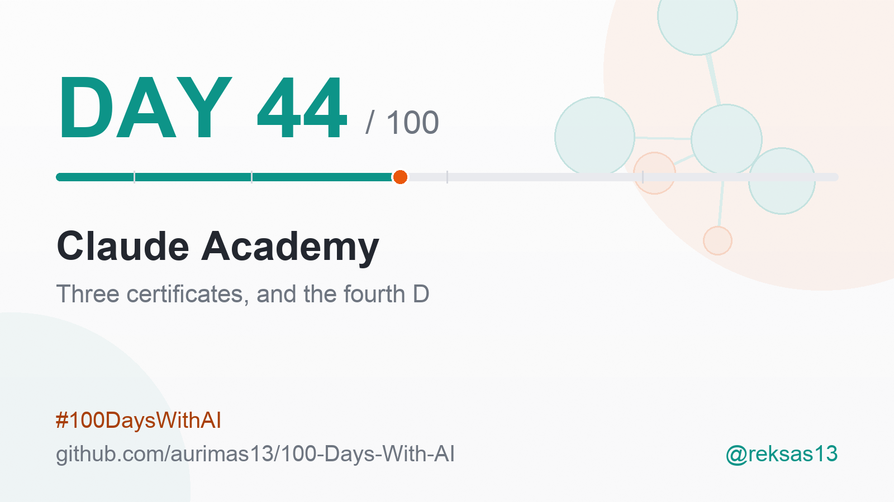

- **What the platform is, read before anything was claimed about it.** Claude Academy is Anthropic's own course site, and its catalogue sorts into four tracks: Start Your Journey, Learn the Products, Become AI Fluent, and Build with the API. The scale varies enormously across those tracks - Introduction to Agent Skills is six lessons and about an hour, while Building with the Claude API is sixty-seven lessons, eight quizzes and roughly nine hours. Most courses end in a quiz and award a certificate of completion.
- **The three finished this week, and they are mine rather than the site's claim.** AI Fluency: Framework & Foundations (fourteen lessons and a final assessment), AI Fluency for Builders, and Introduction to Agent Skills, all completed in the four days to this entry and added to the Licenses & Certifications section of my LinkedIn profile. At least four more are in progress, targeted for the coming weeks and for September at the latest.
- **The 4D framework, and who built it.** The AI Fluency courses are organised around four competencies: Delegation, Description, Discernment, Diligence. Anthropic did not write them alone - the course was developed with Prof. Joseph Feller of University College Cork and Prof. Rick Dakan of Ringling College, and it runs a Description-Discernment loop as its central mechanic rather than treating prompting as a one-shot skill.
- **Diligence is the one that landed, because this project was already doing it.** The first three competencies are close to what the names suggest: choose what to hand to the model, describe it well, and judge what comes back before using it. Diligence is the honesty competency - being transparent about how work was actually produced. That is precisely the disclosure line that has sat at the foot of every post in this project since Day 41, and it is the same practice the AI Collaboration section of this README sets out in full.
- **What a certificate does not attest, said on the day of collecting three.** Each one records that the lessons were completed and the final assessment passed. None of them records competence, and treating them as though they did would fail the Discernment competency they teach. The evidence in this project is the forty-four days of entries, not the three badges.

**Why it matters:** a field acquires a discipline when its practices acquire names. Day 41 of this project adopted a disclosure note because it seemed like the fair thing to do; this week a structured curriculum, co-authored with two academics and ending in an assessment, presented the same behaviour as one of four core competencies of AI fluency. That upgrade matters more than it sounds. A personal scruple is negotiable and travels with the person who holds it. A named competency inside a curriculum can be taught, assessed, expected of a hire, and argued about on the merits. The formalisation of AI literacy into something with a syllabus is one of the quieter things happening in this field, and it is happening faster than the tooling debates that get the attention.

**What I learned - and what I want to test.** The lesson was not a technique. It was that I had been running three of these four competencies without the vocabulary to defend them, and the fourth one - the disclosure - I had adopted on instinct three days before a course told me it was standard. Naming a practice is what makes it portable to other people. What I want to test is the Description-Discernment loop as the courses actually frame it: for one week, when an output is wrong, log whether the fault was in my description or in my discernment of the result, rather than recording "the model got it wrong". If the tally lands mostly on my side of the loop, the framework is doing real work. If it does not, it is a vocabulary rather than a diagnostic, which would be worth knowing too.

🤝 <b>AI collaboration:</b> researched, drafted and illustrated with Claude Code; reviewed, edited and approved by me before publishing - see <a href="#-ai-collaboration">AI Collaboration</a>.

### Day 45 - "Skills For Real Engineers" (Matt Pocock)

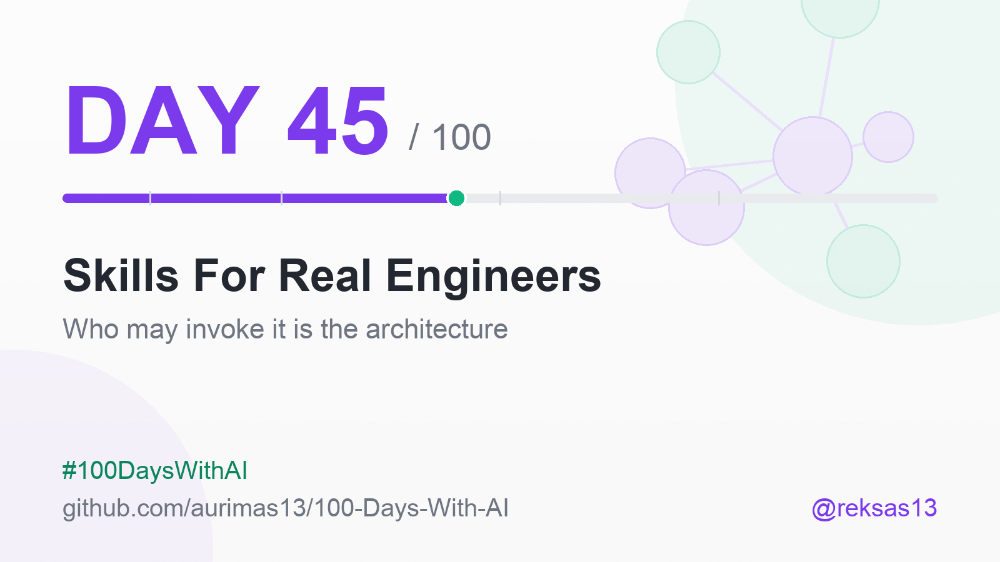

- **One axis, and it is the whole organising idea.** Every skill in the repository is classified by who may invoke it. **User-invoked** skills are reachable only when the human types them, such as `/grill-me`, and their stated job is to orchestrate. **Model-invoked** skills can be reached by the agent itself when the task fits, and they hold the reusable discipline. The counts, taken from the Reference section rather than from any claim on the page: nine user-invoked and nine model-invoked under Engineering, five and two under Productivity, twenty-five in total.
- **The constraint that makes the split load-bearing.** Quoted exactly: "A user-invoked skill may invoke model-invoked skills, but never another user-invoked one." That is a call-graph rule. Orchestrators may call disciplines; orchestrators may not call orchestrators. Without it, a skills directory degenerates into commands summoning commands, and the layer stops being legible to the person maintaining it. It is also the repository applying its own deep-module advice to itself rather than only to the code it helps you write.
- **Four failure modes, each anchored to a book older than the agent.** Misalignment, answered with a grilling session, cites The Pragmatic Programmer. Verbosity, answered with a shared project vocabulary in `CONTEXT.md`, cites Eric Evans on the ubiquitous language of Domain-Driven Design. Broken code, answered with feedback loops and a red-green-refactor `tdd` skill plus a gated `diagnosing-bugs` loop, cites The Pragmatic Programmer again on small deliberate steps. The ball of mud, answered with `to-spec` and `improve-codebase-architecture`, cites Kent Beck on investing in design every day and John Ousterhout on deep modules.
- **The sentence that carries the argument.** "Because agents can radically speed up coding, they also accelerate software entropy." That is a claim about rate rather than about capability, and it reframes the whole collection: these are not AI techniques, they are ordinary engineering disciplines being reasserted because the thing generating code got faster than the thing reviewing it.
- **Two install paths, deliberately exclusive, and one honest hedge.** The Claude Code plugin installs a managed read-only bundle that updates when the author ships; skills.sh copies editable files you own and can hack on. The README is explicit that picking both "leaves you with every skill twice". And on `improve-codebase-architecture` it declines to oversell: "It is a survey, not a rescue" - on an old codebase it will surface real candidates but will not untangle the mud for you. A repository that marks the limits of its own tools is worth more than one that does not.

**Why it matters:** most published agent-skill collections are lists. This one is a structure, and the structure is a claim about authority - which parts of a workflow a human must start, and which parts an agent may reach for on its own. That distinction is going to matter far more as skill libraries grow, because the failure it prevents is not a bug but an illegibility: a directory nobody can reason about because everything can call everything. The four failure modes underneath are a second claim, quieter and more provocative - that the agent era has not produced new ways for software projects to fail, only faster ones, and that the fixes were written down between 1999 and 2018.

**What I learned - and what I want to test.** The lesson was structural rather than technical: I had been thinking of skills as a flat inventory of things an agent can do, and the invocation axis is a better primitive than any taxonomy by topic. What I want to test is the rule itself, on my own collection. I will sort every skill I have written into user-invoked and model-invoked, then look for the violation the rule forbids - an orchestrator invoking another orchestrator. If I find none, the rule is describing discipline I already had. If I find several, it has bought me a refactor I would not otherwise have known to make. Either result is worth the hour. What I cannot claim today is any experience of the skills in use: I read this repository, I did not run it, and those are different activities.

🤝 <b>AI collaboration:</b> researched, drafted and illustrated with Claude Code; reviewed, edited and approved by me before publishing - see <a href="#-ai-collaboration">AI Collaboration</a>.

### Day 46 - "Scaling Domain Data Repetition in LLM Pretraining" (Tsinghua University and ByteDance Seed)

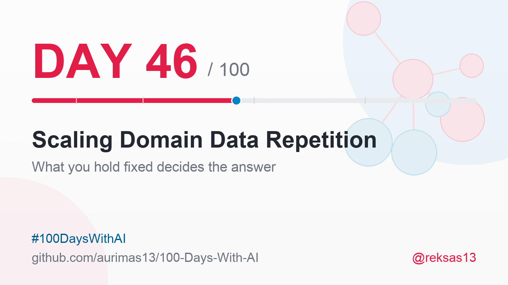

- **The problem, which is about scarcity rather than technique.** General web text scales easily; high-quality domain data - code, maths, Wikipedia, medical text - does not. Compute-optimal training means the token budget grows with model size, so if the amount of good domain data stays fixed, its share of the mixture falls as the model grows. Repeating the domain data you have counteracts that dilution, at the cost of eventually overfitting it. The paper's whole subject is where that trade-off turns.
- **The reversal, and it is the finding worth carrying away.** Existing cross-scale work holds the training-set size fixed and concludes that larger models overfit repeated data sooner, so repetition should be minimised as models grow. This paper holds the tokens-per-parameter ratio TPP = D/N fixed instead, so the budget grows with the model, and the optimal repetition count **increases** with model size. Both panels are in Figure 1, from the authors' own runs, and each behaviour is derived rather than only observed - Theorem 4.3 for the fixed-budget case, Theorem 4.4 for the fixed-TPP case. The evidence did not change. The control variable did.
- **What actually predicts the safe repetition count, with the paper's numbers.** Fitting a quadratic to validation loss against repetition count and taking its minimum, the estimated optimum correlates with the domain's minimum validation loss at a Pearson **-0.944**, with model size at **0.400**, and with the fraction of unique high-quality data at **0.018**. In plain terms: how well the model already does on a domain almost entirely determines how often that domain can be repeated, model scale matters a little, and how much unique data you are sitting on matters essentially not at all. Domains differ sharply - Math bottoms out at around five repetitions while Wiki, Code and Medical turn earlier.
- **The mechanism the authors propose, quoted.** "Repeated optimization decreases the knowledge-acquisition error but increases the noise-fitting error, and the optimal repetition count is the point at which the latter marginal effect begins to dominate." Under a fixed budget, growing the model reaches toward rarer knowledge without supplying new observations of it, so noise-fitting dominates sooner. Under fixed TPP the budget grows too, so the useful phase lasts longer.
- **The practical payoff, and the direction of its error.** Sweep repetition counts on a small proxy model at the same TPP and any convenient unique-data fraction, then carry the result upward. The paper states the transfer claim in italics: *a repetition count that does not cause overfitting on the proxy model also remains safe for a larger model under the same tokens-per-parameter ratio.* The mistake it invites is therefore under-repetition, not a ruined run, which is the right way round for an expensive training job.
- **What this entry does not accept without saying so.** The reported optima are minima of fitted curves, not observed runs - the authors are explicit about it, and it is why the plots carry values like 5.5 repetitions, which nobody can execute. The grid is four domains, four model sizes from 348M to 1.85B, three unique-data fractions and repetition counts one to seven, with the domains never mixed in a single run. The exact TPP is never given, only that it is a constant above 100. And this is arXiv v1 with no venue listed: a preprint, not peer reviewed.

**Why it matters:** the useful content here is methodological before it is numerical. Two groups can run the same experiment on data repetition, hold different quantities constant, and publish advice that points in opposite directions - and both can be correct about the world they measured. That is not a flaw in either study; it is what a control variable does. Anyone comparing scaling results, whether about repetition, batch size or mixture weights, inherits this problem, and the first question to ask of a disagreement is not whose numbers are better but what each side refused to let vary. The secondary lesson is about scarcity: the binding constraint in pretraining has moved from compute toward good data, and the -0.944 correlation says the value of repeating a corpus is set by how well the model already handles it, not by how much of it you own.

**What I learned - and what I want to test.** The lesson was a reading habit rather than a result. I have been treating disagreements between papers as evidence problems, and this one is a definitional problem wearing an evidence problem's clothes. What I want to test is whether that habit pays outside this case: for the next three scaling claims I meet that seem to contradict each other, I will write down what each study held fixed before I look at any number, and see how often the contradiction survives the exercise. If it usually dissolves, I have been reading the literature wrongly for months. If it usually survives, then this paper is a striking special case rather than a general warning, which is also worth knowing. What I cannot claim is any hands-on check: I have read this paper, I have not trained anything on its recipe, and at these model sizes I am not going to.

🤝 <b>AI collaboration:</b> researched, drafted and illustrated with Claude Code; reviewed, edited and approved by me before publishing - see <a href="#-ai-collaboration">AI Collaboration</a>.

### Day 47 - "How Long Contexts Fail" (Drew Breunig)

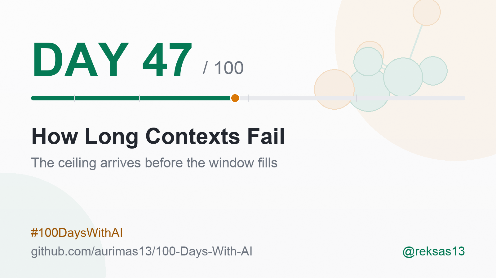

- **The move that makes the article useful: four mechanisms, not one symptom.** "Long context degrades quality" is the folk version, and it is unhelpful because it suggests a single lever. This piece separates the problem by cause. **Context poisoning** is "when a hallucination or other error makes it into the context, where it is repeatedly referenced" - one bad token becomes the premise for everything downstream. **Context distraction** is "when a context grows so long that the model over-focuses on the context, neglecting what it learned during training". **Context confusion** is "when superfluous content in the context is used by the model to generate a low-quality response". **Context clash** is "when you accrue new information and tools in your context that conflicts with other information in the context". Poisoning and clash are both about contradiction, but one starts inside the model and the other arrives from outside; distraction and confusion both look like inattention, but one is caused by volume and the other by irrelevance.
- **The number that reframes the spec sheet.** A Databricks study found "that model correctness began to fall around 32k for Llama 3.1 405b and earlier for smaller models", and the article adds that "for smaller models, the distraction ceiling is much lower". The DeepMind Gemini 2.5 report is cited for degradation past 100k tokens, and for an agent that hallucinated during Pokémon gameplay. The consequence the article draws is a question rather than a claim: "If models start to misbehave long before their context windows are filled, what's the point of super large context windows?" The window is a capacity figure. The ceiling is a quality figure. They are not the same number and only one of them is advertised.
- **The tool-loadout result, which is the most actionable thing here.** On the GeoEngine benchmark, "when they gave a quantized (compressed) Llama 3.1 8b a query with all 46 tools it failed, even though the context was well within the 16k context window. But when they only gave the model 19 tools, it succeeded." The failure was not capacity. Supporting this, the Berkeley Function-Calling Leaderboard v3 shows every model performing worse when given more than one tool, and every model occasionally calling tools that are irrelevant to the task. This is the cheapest intervention in the article: shorten the tool list, not the transcript.
- **Conversation shape matters as much as conversation length.** A Microsoft and Salesforce paper sharded single prompts into multi-turn exchanges carrying the same information. "The sharded prompts yielded dramatically worse results, with an average drop of 39%. And the team tested a range of models - OpenAI's vaunted o3's score dropped from 98.1 to 64.1." Identical content, different arrangement, and roughly a third of the performance gone. That result belongs to clash: the model commits early to an answer built on a fraction of the information and then carries it forward.
- **What this entry does not accept without saying so.** Three limits, none hidden by the article itself. First, the evidence is entirely secondhand - five studies from five groups on five different models, none designed to test this four-part framework, so the taxonomy is a reading of other people's results rather than a test of a hypothesis. Second, the article names no fixes at all; it explicitly defers them to a follow-up post, gesturing only at "methods for dynamically loading tools to spinning up context quarantines". A vocabulary is not a remedy. Third, it was published in June 2025 and the specific figures are tied to the model generation of that moment - the 32k number is about Llama 3.1 405b, not about transformers in general, and treating it as a universal constant would be exactly the kind of misreading the article is arguing against. The page also carries no byline; the attribution to Drew Breunig rests on the site being his, and the URL slug still reads "how-contexts-fail-and-how-to-fix-them" although the rendered title is "How Long Contexts Fail".

**Why it matters:** the practical shift is from managing context as a budget to managing it as a signal-to-noise ratio. A budget has one dial and you turn it down when you run out. A ratio has a numerator and a denominator, and this taxonomy says most of the damage lives in the denominator - the irrelevant tool, the stale contradiction, the error that got quoted back. That reframing changes what you reach for first. It also puts a rather uncomfortable question to the last two years of context-window announcements: if the usable fraction of a window is set by a quality ceiling that arrives long before the capacity limit, then a larger window is a smaller improvement than its headline number implies, and nobody selling one has an incentive to publish where their ceiling sits.

**What I learned - and what I want to test.** The honest version is that I had been treating every long-session problem as a length problem, because length is the only variable with an obvious knob attached to it. The GeoEngine result is what unsettled that: a failure inside the window, fixed by removing tools rather than tokens. So the test is narrow and I can actually run it. On the next agent pipeline I build that drifts, I will cut the tool loadout to what the task genuinely requires before I touch the transcript at all, and record which of the two moves recovers more. If the tool cut wins, then the trimming I have been doing for months has been aimed at the wrong denominator. What I cannot claim is any evaluation of my own: I have read this article and checked its figures against the page, I have not reproduced a single one of the five studies it cites.

🤝 <b>AI collaboration:</b> researched, drafted and illustrated with Claude Code; reviewed, edited and approved by me before publishing - see <a href="#-ai-collaboration">AI Collaboration</a>.

### Day 48 - "AI Systems Out-Persuade Expert Humans" (Kobi Hackenburg et al.)

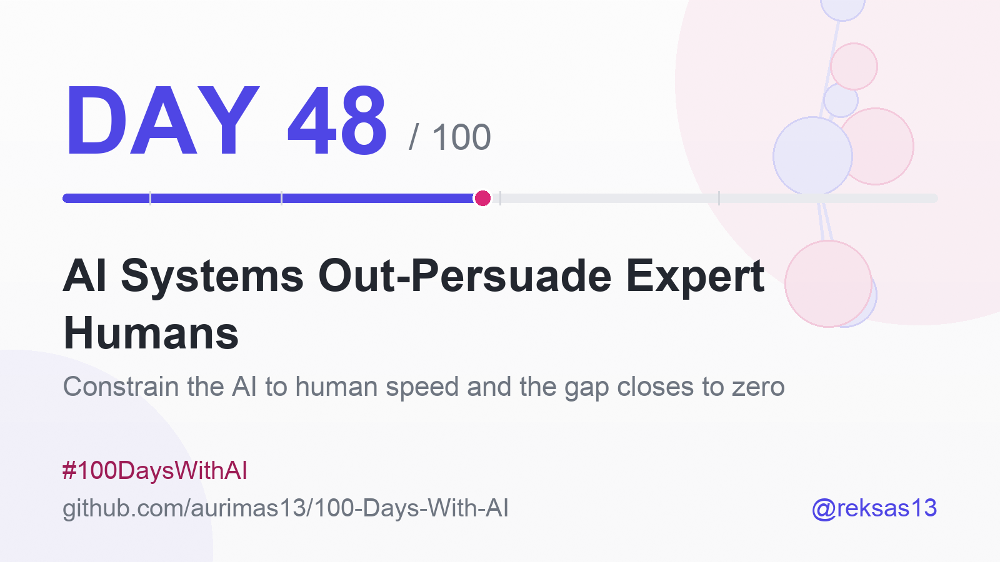

- **The humans were selected to be hard to beat, and were still beaten.** Five persuader classes across four preregistered experiments (n = 18,978 conversations from 6,923 people): random laypeople, the top ~10% of a separate four-round persuasion tournament, professional canvassers on £140 an hour, and 56 elite competitive debaters with a mean 8.9 years of experience, four world champions and eleven continental champions among them. The debaters picked their own issues, had 21 days of notice, eight paid hours of preparation and bonuses up to £1,000. AI exceeded random laypeople by 8.2 percentage points of attitude shift, tournament-selected laypeople by 5.6, and elite debaters by 4.6.
- **Coaching the humans against the AI barely moved them.** 43 returning debaters got a tool that let them chat with the AI that beat them, review their own annotated transcripts, and see what the AI would have said at any point, then trained over four-hour sessions. Afterwards they wrote about 9.8 more words per message (+19%) and deployed 1.6 more fact-checkable claims per conversation (+54%) - and their persuasiveness improved by 1.0 percentage point, with a confidence interval spanning zero.
- **Constraining the AI closed the gap completely.** In the first study elite debaters averaged 54 words per reply and took roughly 95 seconds; the AI averaged 294 words with sub-second latency. When the authors capped the AI to human-calibrated limits - 92 seconds per response, about 51 words - its advantage over the coached debaters fell from 4.1 percentage points to 0.0, with a confidence interval of -1.7 to +1.6.
- **The result held at the level of individuals, not just class averages.** Of 318 per-persuader estimates, none exceeded the pooled AI estimate; the best single human came in at 9.9 points, still 4.0 below the AI.
- **It transferred to money.** A fourth study put the systems against professional canvassers from a UK fundraising firm on real donations to Save the Children, where AI was nearly three times more effective.

**Why it matters:** the headline reading of this paper is that AI argues better than champions, which invites either alarm or dismissal and settles nothing. The constraint arm gives a mechanism instead: the advantage is information throughput, the rate at which relevant content is produced, not superior reasoning or rhetoric. That is a falsifiable claim, and it tells you the exact intervention - rate limiting - that removes the edge. It also reframes the risk. A persuasion advantage grounded in throughput is one that scales with deployment rather than with model cleverness.

**What I learned/tried:** I read this one as a caution about my own judgement rather than as a finding about debating. When an agent produces a well-marshalled case, I treat the fluency as evidence of reasoning quality. This paper is a clean demonstration that volume delivered faster than a person can respond is, on its own, enough to look like superior argument - and that it took a deliberately handicapped condition to tell the two apart. The practical note I am keeping is to be more suspicious of long, fast, confident output, and less impressed by the fact that I could not immediately counter it.

🤝 <b>AI collaboration:</b> researched, drafted and illustrated with Claude Code; reviewed, edited and approved by me before publishing - see <a href="#-ai-collaboration">AI Collaboration</a>.

---

### Day 49 - "Training AI Scientists to Replicate Research" (Damon Falck et al.)

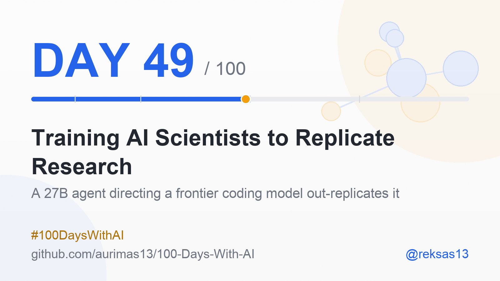

- **The task space is generated, not hand-built, which is what makes it scale.** Replica takes 100 well-known machine learning and AI-for-science papers, runs a three-stage vision-language pipeline to locate a main-text results figure and its caption, and irreversibly redacts that figure from the PDF. The agent gets the mutilated paper, a container with research libraries and internet access, 60 minutes and a one-seventh MIG slice of an H200 GPU, and has to produce the missing plot. That yields 310 tasks - 242 for training from ML papers, 68 held out from AI-for-science papers - with each paper contributing between 1 and 13 tasks, median 2.
- **The reward design is the actual contribution.** Replication is non-verifiable: matching the original plot exactly is not the goal, since the time and compute limits usually make a full-scale reproduction impossible and a faithful scaled-down version is what is being asked for. So a rubric is auto-generated per task by a separate model, **with the original figure hidden from the rubric generator**, which forces the rubric to encode the paper's claim rather than axis ranges and formatting. The rubric is also hidden from the agent during training, so it cannot be gamed.
- **The judge is a coding agent, not a text grader.** Scoring is done by a coding agent given the same workspace and tools the agent had, plus the replication codebase, the git history and the original figure, and ten minutes to explore. It can re-execute the agent's code to check whether a claimed result is real. It scores five dimensions - visual match, support for the paper's scientific claim, whether the experiment implements what the paper describes, sensible use of the compute budget, and whether the agent acted with integrity rather than cheating - each 0 to 1, sampled three times to cut variance.
- **Faraday is small and directs something much larger.** It is Qwen3.6-27B, post-trained with a turn-level credit variant of GRPO on the Replica training split, and it uses a frontier coding agent as a tool - the paper's phrase is coding agents as tools. The authors note it directs a model they cite an estimate of 5 trillion parameters for, and still adds performance over that larger model working alone.
- **The numbers, scoped honestly.** Faraday outperforms the two frontier baselines on 73% of in-distribution ML tasks and 60% of held-out AI-for-science tasks, averaging a 6% improvement over one and 8% over the other on the test split. The comparison that carries the most weight is the ablation: base Qwen3.6-27B scores 0.554 on the held-out set, Faraday 0.791, running in the same harness with the same coding agent available to both.

**Why it matters:** the headline invites a wrong reading - that a 27B model now beats frontier systems. It does not. It beats them at figure replication, judged by an LLM rubric, after reinforcement learning on 242 tasks from that distribution. What generalises is the shape of the result rather than the ranking. Because the base model and the trained model share a harness and a tool, the gain cannot be attributed to better code generation; it has to come from the layer deciding what to attempt, how far to scale an experiment down, and when a shortcut would flatter the outcome. That is a claim about where capability can be added cheaply, and it is testable.

**What I learned/tried:** my default assumption in agent work has been that improving an agent means reaching for a stronger underlying model. This paper is the clearest counter-example I have read, because it holds the underlying model fixed and trains only the directing layer. I also took the rubric trick as a transferable idea rather than a detail: hiding the answer from whoever writes the grading criteria is a cheap way to stop a rubric from rewarding surface resemblance, and it applies well beyond paper replication - any time I am tempted to grade an agent against a known-good output, the criteria should be written without seeing it.

🤝 <b>AI collaboration:</b> researched, drafted and illustrated with Claude Code; reviewed, edited and approved by me before publishing - see <a href="#-ai-collaboration">AI Collaboration</a>.

---

### Day 50 - "Context Engineering for Agents" (Lance Martin)

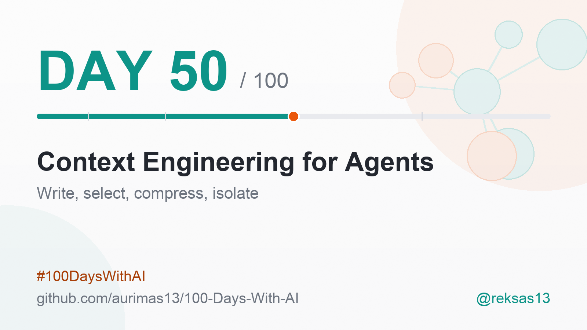

- **Four buckets, and the sorting rule is where the tokens live.** The post's organising claim is modest and useful: "we can group common approaches into 4 buckets" - write, select, compress, isolate. What makes it more than a listicle is that the four are separated by token location rather than by technique. **Write** puts context outside the window (scratchpads, memories). **Select** pulls a chosen slice back in. **Compress** keeps only the tokens the next step needs. **Isolate** splits context so that most of it never enters one window at all. Two of the four are about what you put in; two are about what you keep out. Most tooling I have used only implements the first two and calls it context management.
- **Compress is the half with the concrete engineering in it.** Summarisation is the obvious lever, and the post gives it teeth with product behaviour rather than theory: "Claude Code runs 'auto-compact' after you exceed 95% of the context window", and Cognition "uses a fine-tuned model for this, which underscores how much work can go into this step". A whole fine-tune, for summarising a handoff. The named failure it guards against is losing a specific event or decision in the compression, which is why generic summarisation is not enough. The alternative is cheaper and blunter: trimming, which "can use hard-coded heuristics like removing older messages from a message list", or a trained pruner such as Provence for question-answering. Summarise when meaning must survive; trim when position is a good enough proxy for relevance.
- **Write and select are where agents borrow from older ideas.** Scratchpads are tool calls that write to a file or fields on a runtime state object, and the post cites Anthropic's multi-agent researcher saving its plan to memory precisely so it survives truncation once the window exceeds 200,000 tokens. Memories are traced back to Reflexion, which reflects after each turn and reuses what it wrote, and to Generative Agents, which periodically synthesise memories from past feedback. Selection then splits along the classic lines: episodic memory as few-shot examples, procedural memory as instructions, semantic memory as facts - which is exactly what a `CLAUDE.md` or a Cursor rules file is, only under a name that hides the lineage.
- **Selecting tools is a retrieval problem, and treating it as one is the cheapest win here.** The post cites work applying RAG to tool descriptions rather than to documents, reporting a threefold accuracy improvement from selecting the tools before the call. It sits alongside Windsurf's account of code retrieval, where "embedding search becomes unreliable as a retrieval heuristic as the size of the codebase grows" and the working answer is a combination - grep and file search, knowledge-graph retrieval, and re-ranking - rather than one index. Both say the same thing from opposite ends: the retrieval step is where quality is decided, and a single embedding index is not a retrieval strategy.
- **Isolation is the most effective move and the one with a price tag attached.** Anthropic's finding is quoted plainly: "many agents with isolated contexts outperformed single-agent, largely because each subagent context window can be allocated to a more narrow sub-task", and immediately after, the cost - multi-agent approaches used up to 15 times more tokens than chat. The sandbox variant is more elegant: HuggingFace's CodeAgent writes code that runs in a sandbox, so an image or a large object lives in a variable and only the result of touching it ever reaches the model. Same principle, different substrate. And the quietest version of isolation is a typed state object, where the schema decides which fields the model is allowed to see at all.
- **What this entry does not accept without saying so.** Three limits. First, this is a June 2025 blog post, not a study: it evaluates nothing, runs no benchmark, and every number in it is somebody else's. Second, the product details are point-in-time claims about fast-moving software - the 95% auto-compact threshold describes Claude Code as it behaved when the post was written, and quoting it as a current constant would be a mistake the post itself does not make. Third, the worked examples are LangGraph and LangChain throughout, so the framework arrives through one ecosystem's lens; the four buckets survive that, but the tooling recommendations should be read as a vendor's map of its own terrain.

**Why it matters:** the useful shift is from thinking about a context window as a container to thinking about it as a working set. A container has one property, how full it is, and one intervention, put in less. A working set has a policy: what gets promoted in, what gets evicted, what gets written to backing store, what never gets loaded. That vocabulary is older than agents by decades, and the four buckets are essentially a cache-management policy wearing new clothes. It also explains why the compression instinct alone underperforms. Summarising a transcript is one policy decision out of four, and the other three, especially isolation, do more work for less token cost.

**What I learned/tried:** Day 47 gave me a taxonomy of how long contexts fail; this one gives the matching taxonomy of what to do about it, and reading them a few days apart is the closest thing to a complete picture I have had. The specific correction to my own practice is the same one both posts point at from different directions: I reach for summarisation first because it is the most visible lever, and it is the most expensive and the most lossy of the four. Cheaper moves exist above it - do not load the tool at all, put the artefact in a variable instead of the transcript, hand the sub-task to a sub-agent with its own window. The test I can run is narrow: on the next pipeline of mine that starts drifting, I will classify the bloat by bucket before touching anything, and see whether summarisation is even the right instrument. **And this is Day 50, the halfway mark.** Fifty sources in, the honest observation is that the recurring theme has not been model capability at all. It has been what surrounds the model: the context it sees, the tools it may reach for, the evaluation deciding whether the output was any good. The frontier moves fast, but the work that keeps showing up in my notes is plumbing, and I did not expect that in July.

🤝 <b>AI collaboration:</b> researched, drafted and illustrated with Claude Code; reviewed, edited and approved by me before publishing - see <a href="#-ai-collaboration">AI Collaboration</a>.

### Day 51 - "Active Flow Expansion for Out-of-Distribution Discovery" (Riccardo De Santi et al.)

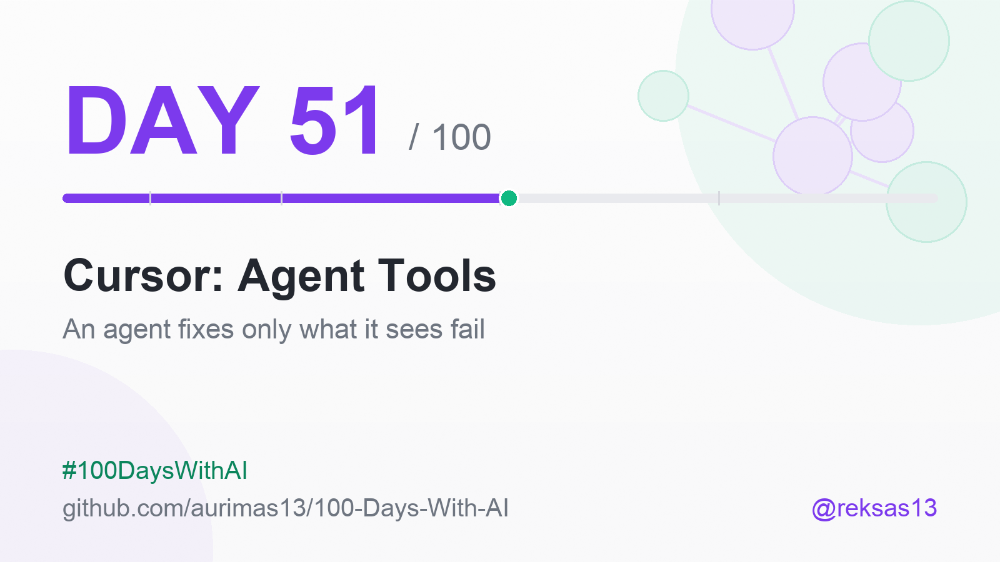

- **The generable set is the reframing, and it asks a better question than "how well does it fit?".** Definition 1 is small and does a lot of work: the tau-level generable set is the set of designs the model's terminal density assigns at least tau probability. It is deliberately not the support. As the paper notes, as tau approaches zero the generable set approaches the support, but the support includes regions of infinitesimal probability that will never be sampled in any real budget; the tau-level set is instead "the region likely to be sampled under a finite budget". That is the distinction the whole paper turns on. A model is described by what it can actually reach, not by what it could reach given infinite draws.
- **The limitation is then stated as a volume inequality, which is what makes it uncomfortable.** The pre-trained generable set is contained in the valid design space, and its volume is very much smaller. The valid space is defined by a black-box verifier, every design the checker accepts. So a model that fits its data perfectly is still, by construction, incapable of producing most valid molecules: the abstract puts it as sampling "valid new-to-nature designs, assigned negligible probability under, and thus inaccessible to, standard models fitted to the observed data". Better fit does not touch this. Fidelity and coverage are separate axes, and pre-training only optimises the first.
- **ActFlow chases uncertainty, not validity, and that inversion is the method.** Each round it fits an uncertainty estimate for the verifier from the labelled designs it has queried so far, then samples to maximise that uncertainty minus a KL penalty against the current model, queries the black-box verifier on what it drew, and fine-tunes the flow on the results with an optional negative gradient on the rejections. The KL weight is the exploration dial: pushed high it degenerates to ordinary sampling, pushed to zero it chases uncertainty into regions where the model is worthless. The detail I liked most is where the search happens. Exploration runs inside the velocity network's own learned representation at an intermediate noise level, empirically around 0.8 to 0.9, because that geometry is friendlier to global exploration than either the clean-data end or the pure-noise end. The model's own half-noised internal space is the map it explores by.
- **The result that changed my mind: filtering makes a model more correct and less adventurous.** In the two-dimensional illustration ActFlow "increases both coverage, from 1.16% to 94.27%, and validity, from 76.00% to" 95.90%. The baseline that matters is Rec-F, which is the standard recipe almost everyone uses, namely continued training on your own verifier-filtered samples. It "increases validity while even decreasing coverage (1.16% to 1.1%)". It got better at being right about the ground it already stood on, and lost ground. Filtering selects for what the model can already do, which is exactly the wrong selection pressure if the goal is reach.
- **The same shape recurs across four molecular domains, at scale.** On QM9, 88.40 valid clusters against 45.40 for Rec-F and 42.80 for Rec-NF, with a Vendi diversity of 306.08. On GEOM-Drugs, clusters rise from 35.89 to 144.30 and Vendi from 255.03 to 303.10. On therapeutic peptides, from 44.33 to 358.33 clusters and 13.45 to 58.87 Vendi, while unfiltered self-training "collapses entirely to 0.0% validity, as a single misplaced token can result in an invalid peptide". On protein sequences, 66.50 to 102.75 clusters, Vendi 12.87 to 42.14, validity 70.81% to 83.74%. The protein column repeats the trade in miniature: Rec-F reaches a higher validity of 88.12% than ActFlow's 83.74%, and "collapses in coverage and diversity" doing it. Whenever validity is the only thing measured, the filtering baseline looks like the winner.
- **What this entry does not accept without saying so.** Four limits, and the last is a reading note. First, "valid" means a computational verifier said yes: chemical rules for molecules, a sequence parser for peptides. Not synthesis, not an assay, not a binding result. A molecule can be valid and entirely useless. Second, the authors are honest about the gap themselves, writing that "future work will need to assess whether this form of exploration yields concrete gains (i.e., discoveries) in specific real-world applications" - no discovery is claimed anywhere. Third, the guarantee is reachability-shaped: it covers what can be reached from the seed region through a bounded number of local certifiable steps, so a valid region genuinely disconnected from everything the pre-trained model knows sits outside the theorem, and "new-to-nature" has to be read within that. Fourth, read two of the numbers carefully. The paper writes of "increasing the pre-trained model coverage by 144.3% and its validity by 56.6%", but Table 1 gives 144.30 as ActFlow's cluster count, up from 35.89, and 56.6% as its absolute validity on that task. Those two are levels, not increases, and quoting them as percentage gains would overstate a result that is already strong.

**Why it matters:** the reframing travels a long way past molecules. Any time a generative model is deployed to search rather than to imitate - proposing candidates, generating synthetic training data, writing code nobody has written yet - the question stops being how faithfully it reproduces its training distribution and becomes how much of the valid space it can reach at all. Those two goals are not merely different, they pull against each other, and the 1.16% to 1.1% result is the cleanest demonstration of that I have seen: the standard quality loop measurably shrank the model's reach while improving every number anybody was watching. It also puts a name to something that has bothered me about synthetic-data pipelines. Generate, filter, retrain is a fidelity loop wearing the clothes of an improvement loop. If nothing in it points away from what the model is already confident about, it cannot expand anything, and it will still report progress.

**What I learned/tried:** the specific correction is to my instinct about self-training. I have treated generate-filter-retrain as the obvious way to improve a generative system, because it is what everyone does and because the metric it moves goes up. This paper says that loop is a validity optimiser, and that expansion needs a signal pointing at what the verifier is uncertain about rather than at what the model is confident about. The practical change I can make is in measurement rather than in method, and it is cheap: on any generate-and-filter loop of mine, track a coverage or diversity number alongside the pass rate, because a pipeline can improve on every metric I currently watch while quietly getting narrower, and I would not currently notice. I also want to sit with the honest limit here rather than skip past it, because it is the one that connects to the chemistry side of my own writing: a verifier that checks valency is not a verifier that checks usefulness, and every impressive coverage number in this paper is coverage of a space defined by a rule-checker. Yesterday's source was about what enters the context window on purpose; this one is about what a model is able to reach at all, and reach turns out to be the thing nobody was measuring.

🤝 <b>AI collaboration:</b> researched, drafted and illustrated with Claude Code; reviewed, edited and approved by me before publishing - see <a href="#-ai-collaboration">AI Collaboration</a>.

### Day 52 - "AI Job Search" (Mads Lorentzen)

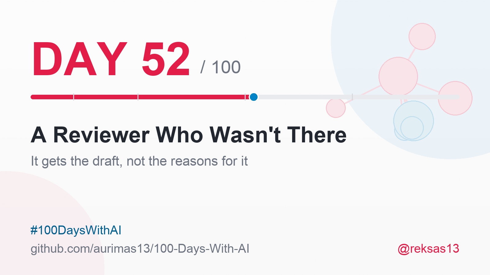

- **The drafter-reviewer split is the design, and it is worth separating from the tooling around it.** The `/apply` pipeline runs eight ordered steps - parse the posting, evaluate fit, draft the CV and cover letter, spawn the reviewer, revise, compile and visually inspect the PDFs, run the ATS text-layer check, present a verification checklist - and only one of those is unusual. "The drafter writes; a second Claude agent, spawned with a fresh context, researches the company and critiques the drafts. The drafter then revises." The reviewer is not a second prompt in the same conversation. It is a separate agent that did not participate in writing the thing it is judging, and it does its own company research rather than inheriting the drafter's.
- **"Fresh context" does not mean "no information", and that distinction is the part I would have got wrong.** Elsewhere the same README notes that "the reviewer agent receives drafts inline rather than re-reading them, and the verification checklist runs once at the end of the workflow rather than being duplicated by both agents". So the reviewer is handed the finished artefact directly, and denied the deliberation that produced it. Read together, those two sentences describe a specific and quite careful split: pass the output, withhold the reasoning. That is my reading rather than a claim the author makes in those words, but it is the only reading under which both sentences are true at once, and it is the difference between a genuine second opinion and a model agreeing with its own earlier logic. The stated payoff is catching "missed keywords, weak framing, and generic language that a single pass often leaves in" - exactly the failures that survive self-review, because the context that produced them also justifies them.
- **Verification is pointed at the consumer's parser rather than the author's intent, and that is the transferable habit.** The pipeline does not stop at "the LaTeX compiled". It compiles the CV with lualatex and the cover letter with xelatex, then "Claude reads the rendered pages and iterates on the LaTeX until the CV is exactly 2 pages with no orphaned entry titles, and the cover letter is exactly 1 page with the signature visible and fonts consistent". Then it goes one step further out and reads the artefact the way its actual first reader will: extract the text layer with `pdftotext` and verify contact details are present as literal text, that there are no garbled glyphs, and that the reading order is sane - "the way an ATS parser sees it". A CV that looks perfect to a human and parses to nonsense for a machine has failed, and only the second check can tell you so.
- **The honesty rule is a constraint on generation, not a footnote about it.** "All claims in the CV and cover letter are verified against your actual profile. The system never fabricates skills or experience." The keyword step is where that bites: coverage against the posting is scored, keywords the profile genuinely supports are added, and one it does not support "is acknowledged as a gap, never stuffed in". This is the same shape as the honesty rule this repo runs on, and it is notable that a tool built to maximise a response rate chose to leave gaps visible rather than let the optimiser write the claims.
- **When something has to be cut, the cut is scored rather than mechanical.** On overflow it "scores each candidate line by (a) relevance to the target posting, (b) uniqueness in the document, and (c) whether the cover letter depends on it, and cuts the lowest-total-score line first". The third criterion is the one I would not have thought of: a line can be individually weak and still load-bearing, because another document refers to it. Cutting by local quality alone breaks things that are only visible from outside the file.
- **The security stance is stated with its ceiling attached, which is rarer than it should be.** "Postings are treated as untrusted input (the workflow follows no instructions embedded in them and fetches no links from their body), but agentic defenses are instruction-level, not a sandbox." That second clause is the honest half. Instruction-level defences are a policy the model is asked to follow, not a boundary it cannot cross, and saying so plainly is the correct disclosure. The advice that follows - skim what was fetched and written before sending - is the right conclusion from it rather than a hedge.
- **What this entry does not accept without saying so.** Four things. First, the headline result is self-reported and unaudited: "sixty-nine tailored applications, twenty first interviews, and one signed contract later, I started as an AI engineer in June 2026" is one person's account of one search, with no control for the market, the field or the candidate, and a 29% first-interview rate cannot be attributed to the tool on this evidence. Second, popularity is not validation - the repository page read 39.2k stars and 13.3k forks on the day I read it, and stars measure attention. Third, there is a real privacy trap the author flags himself and it deserves repeating rather than burying: "a fork of this repo is always public - GitHub does not allow private forks of public repositories - and `/setup` writes your personal data (name, contact details, employment history, salary expectations) into tracked files", so the naive fork-and-go path publishes your salary expectations. Fourth, the project states it is "not affiliated with, endorsed by, sponsored by, or maintained by Anthropic", and nothing here should be read as though it were.

**Why it matters:** strip away the CVs and this is a clean, working answer to a problem that shows up in every agent pipeline I build - how do you get a critique that is not just the generator agreeing with itself? The answer here has two moving parts and both are cheap. Separate the critic from the author so it never saw the reasoning, and verify the output against the parser that will actually consume it rather than against the intent that produced it. Neither needs a bigger model or a longer window. They are structural choices about who sees what and what gets measured, and the second one generalises furthest: the ATS check is just the discipline of reading your own artefact through the reader's tooling instead of your own, which is the same reason a diff read in review catches what the author reread five times and did not see. There is also a smaller lesson in the design's shape. The expensive-looking part, a second agent, exists to buy something that no amount of prompting a single context reliably buys, while the genuinely load-bearing checks - two pages, no orphaned titles, contact details present as literal text - are boring, mechanical and specific. That ratio feels right, and it is usually inverted in systems I see.

**What I learned/tried:** I read this one with an interest that is not purely architectural, and I would rather say so than pretend otherwise - it is a job-search tool and I am job hunting while I write this series. So two things came out of it, on different levels. The architectural one I can apply immediately: my own reviewing habit is to ask for a critique in the same context that produced the draft, which this reframes as structurally unsound, because the context holding the draft also holds every reason the draft seemed right. Passing the artefact to a reviewer that never saw the deliberation is a small change to make and it is the whole difference between a second opinion and an echo. The practical one is the ATS check, and it is the kind of thing that is embarrassing to learn late: a document can be beautiful to a human, compile cleanly, and still arrive at its first real reader as garbled text in the wrong order, and the only way to know is to extract the text layer and look. I have not run this framework - the honest reason is the tracked-files privacy problem above, which I would want to solve with a private repository before putting employment history and salary expectations anywhere near a fork. What I have taken is the pattern, not the tool. Yesterday's source was about a model's reach exceeding what filtering can find; this one is about a draft's quality exceeding what its own author can see.

🤝 <b>AI collaboration:</b> researched, drafted and illustrated with Claude Code; reviewed, edited and approved by me before publishing - see <a href="#-ai-collaboration">AI Collaboration</a>.

### Day 53 - "MIT Says AI Is Forcing A Rethink Of College Itself" (Ron Schmelzer)

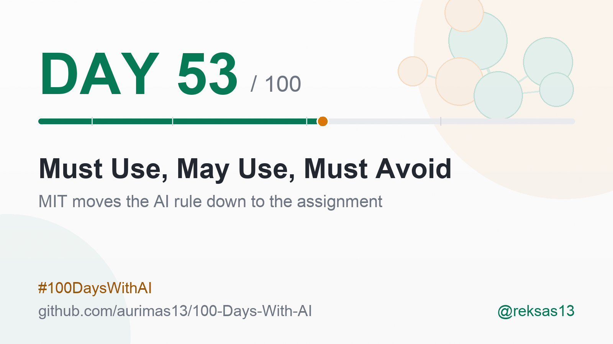

- **The cheating debate is a decoy, and the report's own structure is the evidence.** If this were about misconduct the recommendations would be about detection. They are not. They are about declaration, assessment redesign, hands-on work and faculty support. The problem being solved is measurement: an assessment can no longer tell you what a person can do unaided, and that is true whether or not anybody cheats. A detector, even a perfect one, does not restore the measurement - it only tells you the reading is contaminated.
- **The mechanism is a per-course declaration, and the unit is what makes it interesting.** Every class states its condition up front: students must use AI, may use it, or must avoid it entirely. Three states, decided per course rather than per institution. That moves the policy down to the level where the work actually happens, which is the level at which it can be enforced and, more importantly, the level at which the thing being assessed can be defined in advance rather than guessed at afterwards. A university-wide rule about "acceptable AI use" is unenforceable in the same way a company-wide one is; a rule attached to a specific artefact is not.
- **The framing came from the top, and it is unusually direct about cost.** The letter accompanying the report is signed by MIT's president, chancellor, provost and chair of the faculty, and it does not hedge: the opportunities and risks generative AI poses "now constitute such a watershed for MIT" that the Institute must accept "a lot of practical changes, from reevaluating how we assess what students have learned, to reemphasizing hands-on learning". A watershed is a claim about irreversibility, not about difficulty, and signing four names to it is a different act from publishing a committee's findings.
- **The justification is put in terms of purpose rather than risk, which is the part that will age well.** "MIT was founded to help human beings develop their own powers of discovery, problem solving, and invention." That sentence is doing real work: it supplies the criterion for deciding where AI belongs and where it does not, without needing a list. If a use develops the student's own powers, it is in scope; if it substitutes for them, it is not. And the letter is even-handed enough to concede in the same breath that AI "presents itself to us as a kind of superpower, with both extraordinary potential and disturbing risks", which is a fairer description than most institutional documents manage in either direction.
- **The unglamorous recommendations are the ones that determine whether any of it happens.** AI leads and faculty fellows, an implementation team, a pilot fund; institutional systems protecting sensitive data wherever AI is used, and an explicit policy on what instructor auditing is permitted; and permanent mechanisms for experimentation and revision rather than a first policy treated as settled. That last one is the honest admission - a policy written now will be wrong within a year, so the machinery for changing it is more valuable than the policy itself. These four points are paraphrased from coverage rather than quoted, because the report PDF was not opened for this entry.
- **What this entry does not claim, and the sourcing limit behind it.** Two things. First, the Forbes URL is the day's cited link and it resolves perfectly well in a browser, but forbes.com refused automated retrieval, so the article's own analysis was never read and no sentence here is attributable to its author. Everything quoted is from MIT's own letter, which was read in full. Second, and more important: this is a governance document, not a study. It contains no learning outcomes, no effect sizes, no trial and no measurement of what AI does to a student. Any reading of it as evidence about learning would be a fabrication, and the report itself makes no such claim.

**Why it matters:** the transferable idea has almost nothing to do with universities. A measurement stopped being identifiable, and the response was not a better instrument but a change to what gets declared before the measurement starts. That is a move anyone who has built an evaluation will recognise the moment they see it, usually from having failed to make it. Once a metric can be satisfied by a route you did not intend, adding detection is a losing race, because the detector has to keep pace with every new route while the metric only has to be gamed once. Declaring the conditions up front - what the artefact is allowed to have been made with - converts an unbounded detection problem into a bounded disclosure one. It is the same reason this repository carries an AI collaboration line on every entry rather than a claim about how much of it was written by hand: the disclosure is checkable and the claim is not. MIT's version is larger and slower and has to survive faculty politics, but it is the same trade.

**What I learned/tried:** I came to this expecting an academic-integrity policy and found a document about what a degree certifies, which changed what I took from it. The thing I have actually adopted is smaller than the report and came from staring at the three-state rule: must use, may use, must avoid is a genuinely good default for any piece of work whose provenance matters, and it is better than the binary I had been using, because "may use" is the state most real work is in and it deserves to be nameable rather than treated as a grey area. I have not tested anything here - there is nothing to test, and a policy report is not a system - so what I did instead was read the primary source rather than the coverage, which turned out to matter: the article that led me here refused to serve itself to an automated reader, and the letter behind it was open, signed and more specific than the summary. Going one link upstream cost a few minutes and produced every quotation in this entry.

🤝 <b>AI collaboration:</b> researched, drafted and illustrated with Claude Code; reviewed, edited and approved by me before publishing - see <a href="#-ai-collaboration">AI Collaboration</a>.
---

## 🤝 AI Collaboration

Standing disclosure. Published 2026-08-20, in force from Day 41 onward, and describing how every day of this project has been made. Days 1 to 40 carry the same note, added retroactively on the day this statement was published.

I build this project **with AI, in the open**, and this is the standing note about it.

I collaborate with **[Claude Code](https://claude.com/claude-code)** on this repository and on every post that points at it. Claude Code assists with the research, the drafting, the relevant visual content (the day cards), and the editing that happens before anything ships. On some surfaces it also publishes the finished result automatically: the X post, the Bluesky post and this repository entry. I remain human in the loop throughout. Nothing goes out until I have done the final edit and review and agreed to publish it.

> I affirm that all AI-generated and co-created content underwent thorough review and evaluation. The final output accurately reflects my understanding, expertise, and intended meaning. While AI assistance was instrumental in the process, I maintain full responsibility for the content, its accuracy, and its presentation. This disclosure is made in the spirit of transparency and to acknowledge the role of AI in the creation process.

<b>Who does what, day by day</b>

 

| Stage | Who |
|---|---|
| Choosing the day's source | **Me** |
| Reading and researching that source | Claude Code |
| Drafting the day note and the four posts | Claude Code |
| Rendering the day card | Claude Code, from a fixed template I approved |
| Final edit, review, and the decision to publish | **Me** |
| Publishing to X and Bluesky, and pushing this repo entry | Automated, on my standing approval of the prepared text |
| Publishing to LinkedIn and Threads | **Me**, pasted by hand |

Nothing is posted that I have not read. Where the automation publishes, it publishes text I approved beforehand, unchanged. Where a source is paywalled or unreachable, the day note says so and claims nothing beyond what could be verified. There are no invented benchmarks, quotes or numbers anywhere in this repository.

---

## 🔗 Connect

**The day note goes out on all four, every morning at ~7:00 EEST.**

| | Where | What you get |
|---|---|---|
| 𝕏 | **[@reksas13](https://x.com/reksas13)** | The day's takeaway in one post, with the card - daily, ~7:00 EEST |
| 🦋 | **[@reksas13.bsky.social](https://bsky.app/profile/reksas13.bsky.social)** | The same note, mirrored - daily, ~7:00 EEST |
| 🧵 | **[@reksas13](https://www.threads.com/@reksas13)** | The same note, mirrored - daily, ~7:00 EEST |
| in | **[Aurimas Nausėdas](https://www.linkedin.com/in/aurimasnausedas/)** | The long form - the personal angle, the takeaways, what I tried |
| 📬 | **[Molecule To Machine](https://moleculetomachine.substack.com)** | Weekly newsletter, where chemistry meets AI, Robotics, Music |
| 📚 | **[Machine-Learning-Goodness](https://github.com/aurimas13/Machine-Learning-Goodness)** | The bigger resource collection this table's format came from |

 
Building something in AI, hiring, or running your own 100 days? The fastest way to reach me is a DM on any of the four.

## 📄 License

[MIT](LICENSE) - take the sources list, run your own 100 days.

 
<b>Day 53 of 100.</b> Next entry tomorrow, ~7:00 EEST.

