

# 100 Days With AI 🤖

### One source a day. One honest note. For 100 days.

A public learning log of modern Artificial Intelligence - transformers, LLMs,
agentic AI, RAG, fine-tuning, evals, MLOps and the rest of it.

<!-- Day badge: bumped by the daily run. If this is stale, the run said so in its log. -->

**[📈 Progress](#-progress)** · **[📚 Day Notes](#-day-notes)** · **[🔗 Connect](#-connect)**

`2026-07-12` ──────────── **Day 33 of 100** ────────────► `2026-10-19`

Every day, one carefully chosen source - a paper, course, repo, post, tool, technical document, other source, mixed <b>[Medium]</b> or <b>[Advanced]</b> - studied and logged: what actually stuck, why it matters, what I tried. Posted ~7:00 EEST under <b>#100DaysWithAI</b>. No skipped numbers. No faked expertise.

---

<b>Why this repo exists</b>

 

Learning in public beats learning alone - and it leaves a receipt.

Most learning disappears the moment the tab closes. This is the opposite: one
entry per day, written the same morning, in the open, whether or not the day
went well. The constraint is the point. A source I do not understand still
gets an honest note saying so.

I am an AI engineer who came to this from chemistry, and that shows up in how
I read these sources - I look for the mechanism, not the headline. Some days
that produces a good metaphor. Most days it just produces a better question.

<b>How each day works</b>

 

1. **One source** - chosen the evening before, marked **[Advanced]** or **[Medium]**.
2. **Studied properly** - not skimmed. Quotes are verbatim or they are not quotes.
3. **Logged here** - a row in [Progress](#-progress), then a [day note](#-day-notes)
   with 3-5 takeaways, why it matters, and what I actually tried.
4. **Shared** - the same note, compressed, goes out on X, Bluesky, Threads and
   LinkedIn at ~7:00 EEST, with the day's card.

Every claim in a post traces back to the source or it does not ship.

<b>What you can take from it</b>

 

- **The sources list** - 100 curated, level-marked entry points into modern AI,
  in [Progress](#-progress). Steal it wholesale; that is what MIT is for.
- **The notes** - what a working engineer actually took away, including the
  parts that did not land.
- **The format** - if you want to run your own 100 days, this repo is a
  working template.

<b>Standing on other shoulders</b>

 

Inspired by [100-Days-Of-ML-Code](https://github.com/aurimas13/100-Days-Of-ML-Code)
for the day-numbered log, and by the resource tables of
[Machine-Learning-Goodness](https://github.com/aurimas13/Machine-Learning-Goodness)
for the shape of the progress table.

---

## 📈 Progress

| Day | Date | Title | Level | Description | Link |
|-----|------|-------|-------|-------------|------|
| 1 | 2026-07-12 | "2025–2035 Is the Decade of Agents" - Andrej Karpathy | Medium | Karpathy's Jan 2025 post: agents are a decade-scale build, with humans as high-level supervisors of low-level automation | [X post](https://x.com/karpathy/status/1882544526033924438) |
| 2 | 2026-07-13 | "Harness Design for Long-Running Application Development" - Prithvi Rajasekaran, Anthropic | Advanced | How Anthropic Labs kept a coding agent productive for 6 hours: context resets with structured handoffs, a GAN-inspired generator/evaluator split, and sprint contracts | [Anthropic Engineering](https://www.anthropic.com/engineering/harness-design-long-running-apps) |
| 3 | 2026-07-14 | "Writing Effective Tools for Agents - with Agents" - Ken Aizawa et al., Anthropic | Medium | Tools as contracts between deterministic systems and non-deterministic agents: fewer consolidated tools, semantic names over UUIDs, token budgets, and evals that let Claude refactor its own tools | [Anthropic Engineering](https://www.anthropic.com/engineering/writing-tools-for-agents) |
| 4 | 2026-07-15 | "Effective Context Engineering for AI Agents" - Anthropic Applied AI | Medium | Context as a finite attention budget: context rot, right-altitude system prompts, just-in-time retrieval, and compaction / notes / sub-agents for long-horizon work | [Anthropic Engineering](https://www.anthropic.com/engineering/effective-context-engineering-for-ai-agents) |
| 5 | 2026-07-16 | "A Practical Guide to Building Agents" - OpenAI | Medium | OpenAI's build-your-first-agent field guide: model + tools + instructions in a loop, single agent before multi-agent, manager vs decentralized patterns, layered guardrails with human handoff | [OpenAI guide](https://openai.com/business/guides-and-resources/a-practical-guide-to-building-ai-agents/) |
| 6 | 2026-07-17 | "Model Guidance: GPT-5.6" - OpenAI Developer Docs | Medium | OpenAI's GPT-5.6 migration guide: a reasoning-effort dial, pro mode, programmatic tool calling, 1.25× cache-write billing - and leaner prompts that score higher while costing a third less | [OpenAI Docs](https://developers.openai.com/api/docs/guides/latest-model) |
| 7 | 2026-07-18 | "Prompting Claude Fable 5" - Anthropic Docs | Medium | Migrating to the newest Claude: an effort dial, hours-long autonomous turns, grounded progress claims, memory files - and deleting the over-prescriptive prompts written for older models | [Anthropic Docs](https://platform.claude.com/docs/en/build-with-claude/prompt-engineering/prompting-claude-fable-5) |
| 8 | 2026-07-19 | "The Art of Loop Engineering" - Sydney Runkle, LangChain | Medium | Four stacked agent loops - agent, verification, event-driven, hill-climbing - with human oversight at every level; value compounds in the loops that embed and improve the agent, not the agent itself | [X post](https://x.com/sydneyrunkle/status/2066928783534289358) |
| 9 | 2026-07-20 | "How do you build an agent over hundreds of data models?" - Kent C. Dodds | Medium | A crowdsourced architecture thread where two people independently land on the same answer - nest the concepts into a hierarchy and expose it as tools the agent drills down through - while Kent's own lean is to start direct and simple, and divide only once that stops working | [X thread](https://x.com/kentcdodds/status/1969482734642086301) |
| 10 | 2026-07-21 | "Prompting Best Practices" - Anthropic Docs | Medium | Structure over rhetoric: longform data at the top and the query at the bottom (reported up to 30% better responses), XML tags as boundaries, quote-grounding for long documents, and the reason behind a rule beating the rule alone | [Anthropic Docs](https://platform.claude.com/docs/en/build-with-claude/prompt-engineering/claude-prompting-best-practices) |
| 11 | 2026-07-22 | "What Is MCP? Model Context Protocol in Agentic AI, Explained" - Ksenia Se, Turing Post | Medium | The integration layer for agents: one open protocol replaces a custom connector per tool, turning an N×M wiring problem into N+M, with runtime discovery, a clear split from A2A, and an honest list of what it does not solve | [Turing Post](https://www.turingpost.com/p/mcp) |
| 12 | 2026-07-23 | "How to Build an Agent" - Thorsten Ball, Amp | Medium | A working code-editing agent in under 400 lines of Go - an LLM, a loop, and three file tools; the argument that the core of every coding agent is small and the real engineering lives in the refinement around it | [Amp](https://ampcode.com/notes/how-to-build-an-agent) |
| 13 | 2026-07-24 | "Building an AI Agent from Scratch in Python" - Leonie Monigatti | Medium | The Day 12 loop rebuilt in Python against the raw Anthropic API - an agent class, message-list memory, one schema'd calculator tool, and a run loop that pauses at tool_use, feeds the result back, and stops at a ten-turn cap | [leoniemonigatti.com](https://www.leoniemonigatti.com/blog/ai-agent-from-scratch-in-python.html) |
| 14 | 2026-07-25 | "Building Effective Agents" - Anthropic (Schluntz & Zhang) | Medium | The workflows-vs-agents distinction and five composable patterns - prompt chaining, routing, parallelisation, orchestrator-workers, evaluator-optimiser - with the standing advice to start simple and reach for autonomy only when the steps can't be predicted; the claude-cookbooks patterns/agents notebooks are the runnable companion | [anthropic.com](https://www.anthropic.com/engineering/building-effective-agents) |
| 15 | 2026-07-26 | "How to Build an AI Agent from Scratch Using Claude API" - Dextra Labs (dev.to) | Medium | A third from-scratch build, set apart by two things the first two skipped - an AgentWithMemory class that carries conversation history across queries, and an explicit production roadmap (streaming, retries, async, Pydantic structured outputs) that refuses to pass the minimal code off as production-ready | [dev.to](https://dev.to/dextralabs/how-to-build-an-ai-agent-from-scratch-using-claude-api-with-full-code-4b40) |
| 16 | 2026-07-27 | "API Key Best Practices" - Anthropic Help Center | Medium | The unglamorous discipline that keeps everything else safe - keys out of code and into env vars or a secrets manager, .env in .gitignore, one key per environment, scheduled rotation, secret scanning in CI, usage monitoring, and immediate revocation of a suspected leak | [support.claude.com](https://support.claude.com/en/articles/9767949-api-key-best-practices-keeping-your-keys-safe-and-secure) |
| 17 | 2026-07-28 | "Tool use with Claude" - Anthropic Docs | Medium | The canonical model behind the hand-built loop - where tool code executes (client tools in your app vs server tools on Anthropic's infrastructure), the tool_use to tool_result round trip, the input_schema contract, and steering with tool_choice, a system-prompt nudge, and strict schema conformance | [platform.claude.com](https://platform.claude.com/docs/en/agents-and-tools/tool-use/overview) |
| 18 | 2026-07-29 | "Streaming messages" - Anthropic Docs | Medium | How a response arrives incrementally over server-sent events - the message and content-block lifecycle, the typed deltas (text, partial-JSON tool input, thinking), and the practical catch that very large max_tokens needs streaming to avoid HTTP timeouts, with SDK helpers that accumulate the events back into one Message | [platform.claude.com](https://platform.claude.com/docs/en/build-with-claude/streaming) |
| 19 | 2026-07-30 | "Claude Agent SDK Demos" - Anthropic (GitHub) | Medium | The official example apps for the Claude Agent SDK - the hand-rolled loop handed back as send()/stream()/query() with session persistence and subagents, shown through real demos: a parallel-subagent research agent, an IMAP email assistant, and a resume generator | [github.com](https://github.com/anthropics/claude-agent-sdk-demos) |
| 20 | 2026-07-31 | "Securely deploying AI agents" - Claude Agent SDK Docs | Medium | Why yesterday's demos are local-dev only, and how you would harden them - prompt injection as the core deployment threat, then defence in depth: isolation (sandbox / container / gVisor / VM), least privilege (read-only mounts, network allowlists, dropped Linux capabilities), and a proxy that injects credentials the agent never sees | [code.claude.com](https://code.claude.com/docs/en/agent-sdk/secure-deployment.md) |
| 21 | 2026-08-01 | "Request context" - Mastra Docs | Medium | Dependency injection for agents - one agent configured per request instead of one agent per case: instructions, model, tools and memory each become a sync or async function reading a typed RequestContext, populated in code or from request headers in server middleware, with schema validation and reserved keys for multi-tenant isolation | [mastra.ai](https://mastra.ai/docs/server/request-context) |
| 22 | 2026-08-02 | "OWASP Top 10 for Agentic Applications" - OWASP GenAI Security Project | Advanced | The first agent-specific risk list, released 9 Dec 2025 after a year of work by 100+ contributors - ten risks from goal hijack and tool misuse through memory poisoning and insecure inter-agent communication to cascading failures and rogue agents, marking the shift from preventing bad outputs to containing bad autonomy | [genai.owasp.org](https://genai.owasp.org/resource/owasp-top-10-for-agentic-applications-for-2026/) |
| 23 | 2026-08-03 | "AgentDojo: A Dynamic Environment to Evaluate Prompt Injection Attacks and Defenses for LLM Agents" - Debenedetti et al. | Advanced | The measurement layer under agent security - an extensible environment rather than a fixed test suite, with 97 realistic tasks and 629 security cases across workspace, Slack, banking and travel, scoring benign utility, utility under attack and targeted attack success rate, and finding that leading models fail many tasks even with no adversary present | [arXiv 2406.13352](https://arxiv.org/abs/2406.13352) |
| 24 | 2026-08-04 | "Defeating Prompt Injections by Design" (CaMeL) - Debenedetti et al., Google DeepMind | Advanced | A defence that assumes the model will be fooled and removes its ability to matter - a privileged LLM sees only the user's query and emits code, a quarantined LLM parses untrusted data with tool-calling stripped, and a custom interpreter tracks provenance so capability policies can block unauthorised flows at tool-call time, scoring 77% of AgentDojo tasks with provable security against 84% undefended | [arXiv 2503.18813](https://arxiv.org/abs/2503.18813) |
| 25 | 2026-08-05 | "Design Patterns for Securing LLM Agents against Prompt Injections" - Beurer-Kellner et al. | Advanced | The synthesis the first quarter was building toward - six patterns that trade agency for provable safety: action-selector, plan-then-execute, LLM map-reduce, dual LLM, code-then-execute and context-minimisation, each constraining an agent so that ingested untrusted input cannot trigger consequential action, with the trade-offs and case studies made explicit | [arXiv 2506.08837](https://arxiv.org/abs/2506.08837) |
| 26 | 2026-08-06 | "A Benchmark to Understand the Role of Knowledge Graphs on Large Language Model's Accuracy for Question Answering on Enterprise SQL Databases" - Sequeda, Allemang & Jacob | Advanced | The meaning layer, measured - 43 enterprise questions over an insurance schema, answered by GPT-4 twice: straight against the SQL tables, and against a knowledge graph built from those same tables with an ontology and mappings. 16.7% correct becomes 54.2%, and on normalised schemas raw SQL scores 0% | [arXiv 2311.07509](https://arxiv.org/abs/2311.07509) |
| 27 | 2026-08-07 | "Key Considerations for Domain Expert Involvement in LLM Design and Evaluation: An Ethnographic Study" - Szymanski, Anuyah, Li & Metoyer | Advanced | Twelve weeks inside a team building a pedagogical chatbot, watching what actually happens when developers try to get expert knowledge into an LLM system - four practices they fell into, and three obstacles that were about motivation, participation and ownership rather than technique | [arXiv 2602.14357](https://arxiv.org/abs/2602.14357) |
| 28 | 2026-08-08 | "Future of Work with AI Agents: Auditing Automation and Augmentation Potential across the U.S. Workforce" - Shao, Zope, Jiang, Pei, Nguyen, Brynjolfsson & Yang | Advanced | An audit of which work people actually want automated, set against what AI can actually do - 1,500 workers, 104 occupations, 844 O*NET tasks, a Human Agency Scale for how much human involvement each task should keep, and four zones including the one where capability and desire point in opposite directions | [arXiv 2506.06576](https://arxiv.org/abs/2506.06576) |
| 29 | 2026-08-09 | "Effective context engineering for AI agents" - Anthropic Applied AI team | Advanced | Context treated as a finite attention budget rather than storage - why performance degrades as the window fills, what belongs in a system prompt, tools and examples, just-in-time retrieval instead of pre-loading, and the three techniques that keep long-horizon agents coherent: compaction, structured note-taking outside the window, and sub-agents with clean contexts | [anthropic.com](https://www.anthropic.com/engineering/effective-context-engineering-for-ai-agents) |
| 30 | 2026-08-10 | "The New Code" - Sean Grove (OpenAI), AI Engineer World's Fair 2025 | Advanced | The argument that the specification, not the code, is the durable artefact - code as a lossy projection of intent, OpenAI's Model Spec as a living markdown document whose clauses carry IDs and example prompts that function as unit tests, and the claim that writing code is only 10-20% of where an engineer's value sits | [YouTube](https://www.youtube.com/watch?v=8rABwKRsec4) |
| 31 | 2026-08-11 | "Asymmetry of verification and verifier's law" - Jason Wei | Advanced | Why some tasks are far easier to check than to solve, the five properties that make a task cheap to verify, and the rule that follows - the ease of training AI to do something is proportional to how verifiable it is. Paired with the organisational half: verification is the only phase of the work with no natural owner, and giving it one is the decision that makes the rest compound | [jasonwei.net](https://www.jasonwei.net/blog/asymmetry-of-verification-and-verifiers-law) |
| 32 | 2026-08-12 | "Reflections on Palantir" - Nabeel S. Qureshi | Advanced | A first-hand account of the forward deployed engineer model from eight years inside the company that invented it - FDEs onsite at the customer three or four days a week solving the specific problem badly and fast, a separate product team generalising whatever they built, and the observation that deployments died of organisational politics far more often than of engineering | [nabeelqu.co](https://nabeelqu.co/reflections-on-palantir) |
| 33 | 2026-08-13 | "The GenAI Divide: State of AI in Business 2025" - MIT NANDA | Advanced | The origin of the "95% of AI pilots deliver no measurable P&L impact" figure that half the industry now quotes - what the report actually surveyed, what it concluded about the learning gap between tools and organisations, and the substantial methodological criticism it drew once the number went viral | [report PDF](https://mlq.ai/media/quarterly_decks/v0.1_State_of_AI_in_Business_2025_Report.pdf) |

---

## 📚 Day Notes

*Each day gets a section here: what the source is, 1–5 takeaways, why
it matters, and what I learned or tried.*

### Day 1 - "2025–2035 Is the Decade of Agents" (Andrej Karpathy, X, 2025-01-23)

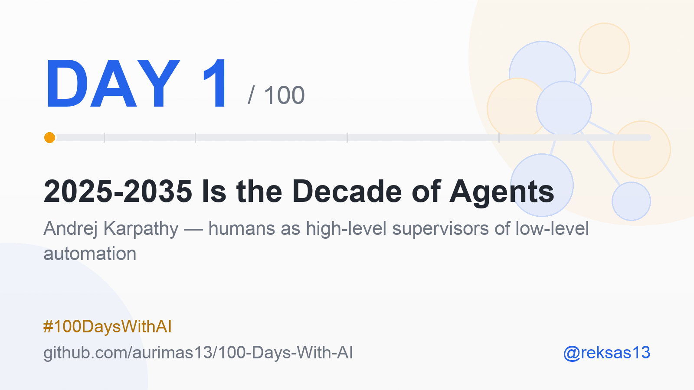

Source: [x.com/karpathy/status/1882544526033924438](https://x.com/karpathy/status/1882544526033924438)
*(The live post is behind X's wall for automated readers; this note is
grounded in the post's full text.)*

**Takeaways:**

- Computer-use agents (like OpenAI's) are to the digital world
  what humanoid robots are to the physical one: a single general
  interface built for humans - monitor, keyboard, mouse vs. the human
  body - that can gradually take on arbitrarily general tasks.
- The result is a *mixed-autonomy* world: humans become high-level
  supervisors of low-level automation, like a driver monitoring the
  Autopilot. It arrives in the digital world first, because flipping
  bits is roughly 1000× cheaper than moving atoms.
- Sequencing beats vision: early OpenAI already attempted this
  (Universe, World of Bits) and it failed because LLMs had to happen
  first. A right idea at the wrong layer of the stack is still a wrong
  bet.
- Even in 2025, the stack wasn't obviously ready - multimodality was
  freshly bolted on via adapters, and very long task horizons remain
  unexplored territory. Karpathy suspected stuffing everything into
  context windows won't be enough; a breakthrough or two was needed.
- Hence the reframe: not "2025 was the year of agents" but **2025 – 2035
  is the decade of agents** - ending in a picture where you spin up
  organizations of agents and act as a CEO monitoring ten of them,
  dropping into the trenches to unblock.

**Why it matters:** this post sets the honest timescale for everything
this campaign covers - agent-building is a decade of engineering work
(context, evals, guardrails, orchestration), not a hype cycle to catch.

**What I learned/tried:** I picked this as Day 1 deliberately - it
recalibrated my expectations from "agents any month now" to a
decade-long build, and the next 99 days of sources (context
engineering, evals, guardrails, safety, multi-agent design, etc.) all live inside
that decade. Day 1 of 100 starts where the decade does.

### Day 2 - "Harness Design for Long-Running Application Development" (Prithvi Rajasekaran, Anthropic Engineering, 2026-03-24)

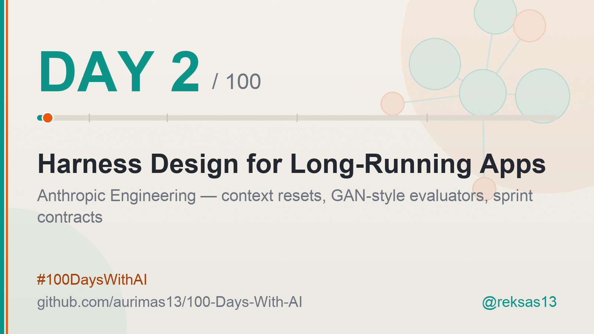

Source: [anthropic.com/engineering/harness-design-long-running-apps](https://www.anthropic.com/engineering/harness-design-long-running-apps)

**Takeaways:**

- Models exhibit **"context anxiety"** - they "begin wrapping up work
  prematurely as they approach what they believe is their context
  limit." The harness answer is a full **context reset with a
  structured handoff file**, not compaction: "While compaction preserves
  continuity, it doesn't give the agent a clean slate, which means
  context anxiety can still persist."
- **Self-evaluation fails.** "When asked to evaluate work they've
  produced, agents tend to respond by confidently praising the work -
  even when, to a human observer, the quality is obviously mediocre."
  The fix is GAN-inspired: split the **generator** from a standalone
  **evaluator tuned toward skepticism**.
- The evaluator scores four weighted criteria - design quality,
  originality, craft, functionality - deliberately weighted toward
  design and originality, because models already do craft and
  Functionality well; the weighting steers away from template output.
- The full-stack harness is **three agents**: a planner expanding the
  brief into a specification, a generator sprinting feature-by-feature, and a
  Playwright-based evaluator testing like a user. Each sprint starts
  with a **sprint contract** - generator and evaluator agree what
  "done" means *before* any code is written.
- The trade-off in numbers: a solo run took 20 min and $9 (non-working
  output); the full harness took 6 hr and $200 (working app). With a
  newer model, the harness was rebuilt *simpler* - sprints removed -
  at 3 hr 50 min and $124.70. "Every component in a harness encodes an
  assumption about what the model can't do on its own, and those
  assumptions are worth stress testing… they can quickly go stale as
  models improve."

**Why it matters:** long-running autonomy isn't a bigger context
window - it's architecture: resets over compaction, adversarial
evaluation over self-grading, contracts over vibes. And the harness
itself is a depreciating asset that must shrink as models improve.

**What I learned/tried:** I went deep on this one. The idea that stuck
hardest: every component I built onto an agent pipeline is a claim about
what the model *can't* do - so each one deserves a periodic
stress-test, or my scaffolding outlives its reason. I started auditing
my own automation pipelines this way.

### Day 3 - "Writing Effective Tools for Agents — with Agents" (Ken Aizawa et al., Anthropic Engineering, 2025-09-11)

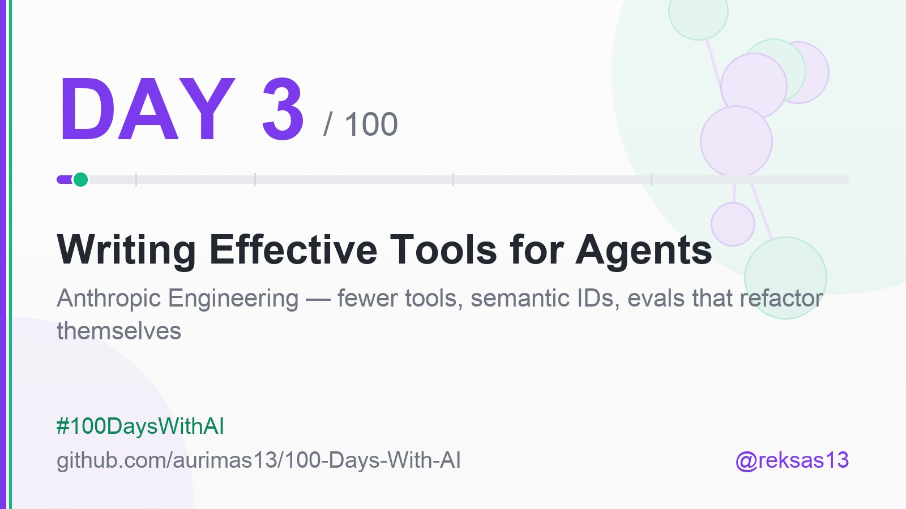

Source: [anthropic.com/engineering/writing-tools-for-agents](https://www.anthropic.com/engineering/writing-tools-for-agents)

**Takeaways:**

- Tools are a new kind of software: "a contract between deterministic
  systems and non-deterministic agents." Designing them is closer to
  prompt engineering than to classic API design.
- More tools can hurt - "too many tools or overlapping tools can also
  distract agents from pursuing efficient strategies." Consolidate:
  one `schedule_event` (find slot + create) beats separate
  `list_events` + `create_event`; `search_contacts` beats
  `list_contacts`.
- Return meaning, not UUIDs: merely resolving arbitrary alphanumeric
  UUIDs to semantically meaningful names significantly improve
  Claude's retrieval precision by reducing hallucinations.
- Budget every token: a `response_format` enum cuts a Slack response
  from 206 tokens ("detailed") to 72 ("concise"); Claude Code truncates
  tool responses at 25,000 tokens by default; errors should return
  actionable guidance, not opaque tracebacks.
- Close the loop with agents themselves: prototype (quick local MCP
  server) → evaluate (realistic multi-step tasks; track accuracy,
  runtime, token use, tool errors) → optimize by concatenating eval
  transcripts into Claude Code and letting it refactor the tools,
  validated on held-out tasks. Refining tool descriptions alone took
  Claude Sonnet 3.5 to state-of-the-art on SWE-bench Verified.

**Why it matters:** tool quality, not model quality, is often the
ceiling on an agent's performance - and it is the part every builder
fully controls.

**What I learned/tried:** I checked these rules against the small agent
pipelines I run daily - fewer entry points, meaningful names,
token-lean outputs are exactly the discipline they demand. The detail
that surprised me most: even word order in a tool name (namespacing
like `asana_projects_search` vs `asana_search_projects`) has
non-trivial, model-dependent effects on evals. Words are
infrastructure now.

### Day 4 - "Effective Context Engineering for AI Agents" (Rajasekaran, Dixon, Ryan & Hadfield, Anthropic Engineering, 2025-09-29)

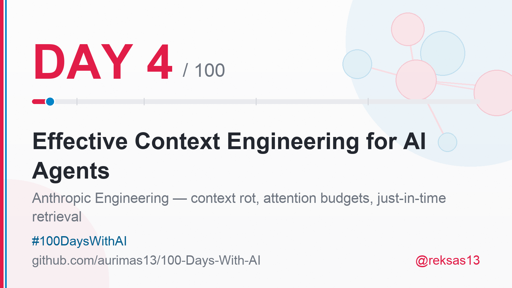

Source: [anthropic.com/engineering/effective-context-engineering-for-ai-agents](https://www.anthropic.com/engineering/effective-context-engineering-for-ai-agents)

**Takeaways:**

- Context engineering is the superset of prompt engineering: "the set
  of strategies for curating and maintaining the optimal set of tokens
  (information) during LLM inference" - not just writing a good prompt.
- **Context rot** is real and architectural: "as the number of tokens
  in the context window increases, the model's ability to accurately
  recall information from that context decreases." Transformers give
  every token attention to every other token - n² pairwise
  relationships - so context "must be treated as a finite resource
  with diminishing marginal returns."
- Bigger windows won't fix it: "context windows of all sizes will be
  subject to context pollution and information relevance concerns."
  The guiding heuristic instead: "find the smallest set of high-signal
  tokens that maximize the likelihood of your desired outcome."
- System prompts belong at the right altitude - a "Goldilocks zone"
  between brittle hardcoded if-else logic and vague guidance; tools
  stay self-contained and non-overlapping; a few diverse canonical
  examples beat exhaustive edge-case rules.
- Retrieval is moving just-in-time: keep lightweight identifiers
  (file paths, queries, links) and load data at runtime (Claude Code's
  hybrid: CLAUDE.md dropped in up front, grep/glob at runtime). For
  long-horizon work the trio is **compaction** (distill and
  reinitialize), **structured note-taking** (persistent NOTES.md-style
  memory), and **sub-agents** that explore with tens of thousands of
  tokens but return condensed 1,000–2,000-token summaries.

**Why it matters:** agents rarely fail because the model is weak -
they fail because attention is spent on low-signal tokens. Curating
the context is the highest-leverage engineering surface an agent
builder controls.

**What I learned/tried:** three days converged on one law from three
angles - Day 2's context resets, Day 3's token-lean tools, today's
attention budget. My own automation pipelines keep structured notes
and logs between runs the way this piece prescribes; now I can name
why that works: the budget is attention, and notes spend it only when
needed.

---

### Day 5 - "A Practical Guide to Building Agents" (OpenAI, Business Guides & Resources)

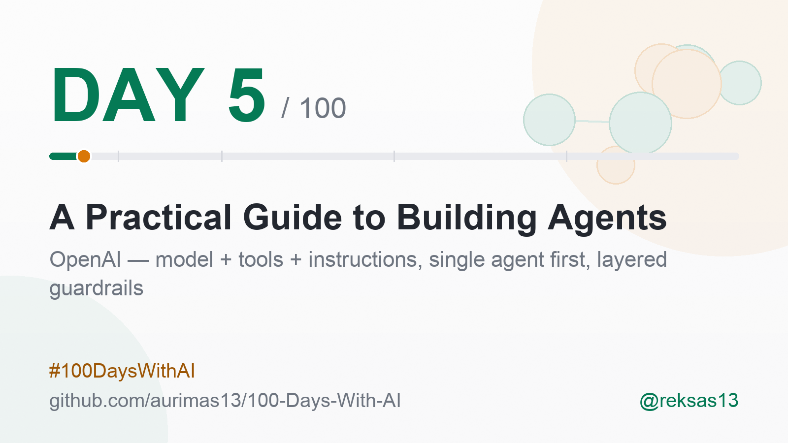

Source: [openai.com - A practical guide to building agents](https://openai.com/business/guides-and-resources/a-practical-guide-to-building-ai-agents/)
([PDF version](https://cdn.openai.com/business-guides-and-resources/a-practical-guide-to-building-agents.pdf))

**Takeaways:**

- The definition is the filter: "Agents are systems that independently
  accomplish tasks on your behalf." Apps that merely integrate an LLM
  without letting it control workflow execution - chatbots, single-turn
  LLMs and classifiers are not agents.
- Build one for only three kinds of workflow: complex decision-making,
  difficult-to-maintain rule sets, and heavy reliance on unstructured
  data. "Otherwise, a deterministic solution may suffice."
- Foundations are three components - model, tools, instructions - run
  in a loop until an exit condition (final-output tool, no-tool-call
  response, error, or max turns). Prototype with the most capable
  model to set a baseline, then swap in smaller models where they hold.
- Go multi-agent late: "maximize a single agent's capabilities first."
  The tool-overload signal is overlap, not count - some implementations
  "successfully manage more than 15 well-defined, distinct tools while
  others struggle with fewer than 10 overlapping tools." When you do
  split: manager pattern (agents as tools, one agent owns the user) or
  decentralized pattern (peer handoffs that transfer execution).
- Guardrails are a layered defense - relevance and safety classifiers,
  PII filters, moderation, rules-based blocks, output validation, and
  tool risk ratings (read-only vs write, reversibility, financial
  impact) - with human intervention on two triggers: exceeded failure
  thresholds and high-risk actions.

**Why it matters:** this is the sober baseline for the agent hype
cycle - most workflows don't need an agent, most agents don't need a
fleet, and the ones that ship well start small and grow on evals.

**What I learned/tried:** the tool-overlap number stopped me: 15+
distinct tools can work while 10 overlapping ones fail - the same
lesson as Day 3's consolidation rule, now with field numbers. My own
single-agent pipelines with a handful of distinct tools sit exactly in
the pattern this guide recommends; the discipline is in resisting the
fleet until a single agent demonstrably fails.

---

### Day 6 - "Model Guidance: GPT-5.6" (OpenAI Developer Docs)

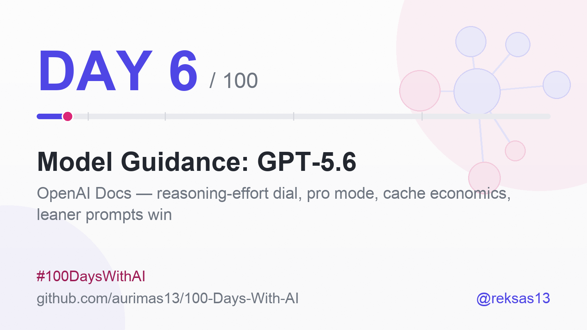

Source: [developers.openai.com/api/docs/guides/latest-model](https://developers.openai.com/api/docs/guides/latest-model)

**Takeaways:**

- GPT-5.6 comes in three variants - `gpt-5.6-sol` (flagship),
  `gpt-5.6-terra` (balanced), `gpt-5.6-luna` (high-volume); the bare
  `gpt-5.6` alias routes to `-sol`. Reasoning effort is a six-step
  dial: "GPT-5.6 supports `none`, `low`, `medium`, `high`, `xhigh`,
  and `max`" - and the migration advice is to keep your baseline, then
  test one level lower.
- The economics headline: "In a sample of internal coding-agent eval
  runs, configurations with leaner system prompts improved evaluation
  scores by roughly 10–15% while reducing total tokens by 41–66% and
  cost by 33–67%." Less prompt, better output, smaller invoice.
- Corollary worth engraving: "Removing repeated instructions and
  examples and simplifying tool descriptions can improve task
  performance and token efficiency." Verbosity is not diligence.
- Caching is now an explicit investment decision: "OpenAI bills cache
  writes at 1.25× the uncached input rate, while cache reads remain
  discounted" - use breakpoints deliberately and watch
  `cached_tokens` vs `cache_write_tokens`.
- Two execution modes reshape the cost/quality trade: **pro mode**
  ("applies more model work to a request before returning a single
  final answer… can improve reliability on difficult tasks") buys
  reliability with latency and tokens, while **Programmatic Tool
  Calling** removes the model from the loop "for bounded, tool-heavy
  workflows that do not require fresh model judgment between each
  step." Persisted reasoning (`reasoning.context: all_turns`) reuses
  thinking across turns.

**Why it matters:** model docs now read like unit economics - the
quality dial, the caching ledger, and the leaner-prompt numbers all
say the same thing: token spend is a design decision, and the cheapest
configuration is often also the best one.

**What I learned/tried:** the week compounds - Day 3 said simplify
tool descriptions, Day 4 said curate the smallest high-signal context,
and today OpenAI puts numbers on it: 10–15% better at 33–67% cheaper.
I'm taking the 41–66% token figure as a standing dare to re-read my
own pipelines' prompts with a red pen.

---

### Day 7 - "Prompting Claude Fable 5" (Anthropic Documentation)

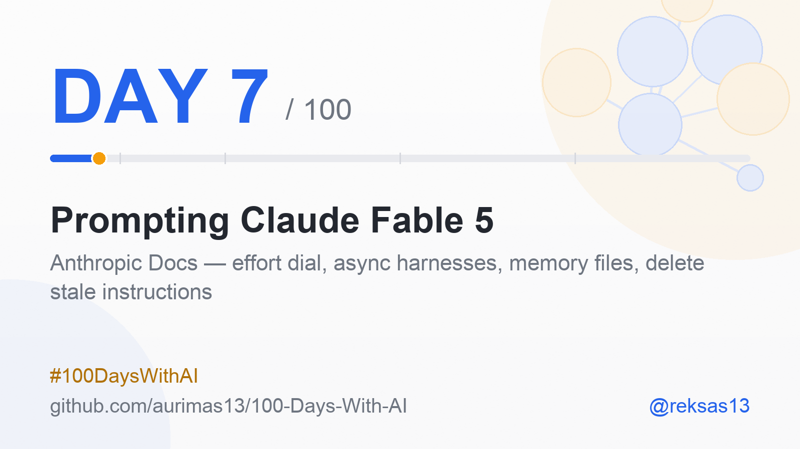

Source: [platform.claude.com — Prompting Claude Fable 5](https://platform.claude.com/docs/en/build-with-claude/prompt-engineering/prompting-claude-fable-5)

**Takeaways:**

- The headline migration advice is subtraction: "Skills developed for
  prior models are often too prescriptive for Claude Fable 5 and can
  degrade output quality." Capability improvements are "a good prompt
  to re-evaluate which instructions, tools, and guardrails are still
  needed" - the same lesson as Day 2's stale harness assumptions, now
  from the model vendor itself.
- Turns got longer by design: individual requests on hard tasks "can
  run for many minutes" and autonomous runs "can extend for hours" -
  adjust client timeouts and restructure harnesses to check on runs
  asynchronously (scheduled jobs) rather than blocking.
- Effort is the primary intelligence/latency/cost control (`high`
  default, `xhigh` for capability-sensitive work) - and "lower effort
  settings on Claude Fable 5 still perform well and often exceed
  `xhigh` performance on prior models."
- Trust in long runs is promptable: instructing the model to audit
  each progress claim against an actual tool result "nearly eliminated
  fabricated status reports even on tasks designed to elicit them."
- Two scaffolding patterns worth copying: a memory system (one lesson
  per file, referenced across runs) and a `send_to_user` tool so long
  asynchronous agents can surface verbatim content mid-run - paired
  with explicit elicitation language, since defining the tool alone
  isn't enough. Fresh-context verifier subagents "tend to outperform
  self-critique" (Day 2's GAN lesson again).

**Why it matters:** model generations now change how you *scaffold*,
not just what you get - and the counterintuitive direction of travel
is that better models need fewer guardrails, shorter prompts, and more
trust, verified by evals rather than enforced by enumeration.

**What I learned/tried:** my own daily pipelines run on this exact
model, so this was a manual for machinery I already operate. The
deletion advice hit home - several of my automation prompts still
enumerate behaviors one brief instruction now covers. I'm taking the
"mostly red diff" approach to my own scaffolding next.

---

### Day 8 - "The Art of Loop Engineering" (Sydney Runkle, LangChain, X, 2026-06-16)

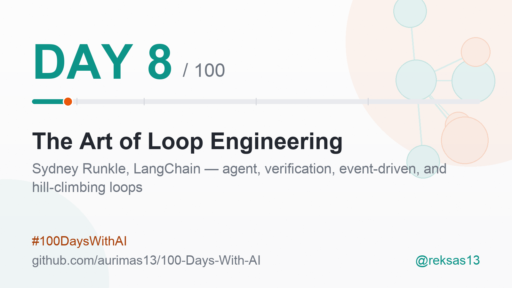

Source: [x.com/sydneyrunkle/status/2066928783534289358](https://x.com/sydneyrunkle/status/2066928783534289358)
*(X is behind a wall for automated readers; this note is grounded in
the post's full text.)*

**Takeaways:**

- The core loop is deliberately simple: "give the LLM context and let
  it call tools in a loop until it's done." Everything else is
  stacking - what swyx calls "loopcraft: the art of stacking loops."
- **Loop 2, verification:** wrap the agent with a grader that scores
  output against a rubric (deterministic checks or LLM-as-judge) and
  feeds failures back. Costs latency and money; "worth it when quality
  matters more than speed, which is most production use cases."
- **Loop 3, event-driven:** crons, webhooks, and channels make the
  agent "a component running continuously inside a larger system"
  rather than something you invoke - the integration layer where
  agents start working at scale.
- **Loop 4, hill-climbing:** an analysis agent runs over production
  traces and rewrites the harness configuration - prompts, tools,
  graders. "The return arrow doesn't just loop back to the top - it
  reaches inside and updates the agent loop directly." For open-weight
  models it can even feed RL fine-tuning.
- Humans stay in every loop where judgment matters: "an automated
  grader can check whether links resolve; it takes a human to notice
  the framing is wrong for the audience" - and sensitive actions get
  live review. The strategic pivot: "focus should pivot to loops 3 and
  4 where value compounds."

**Why it matters:** the field keeps converging on the same law from
different directions - the model is the smallest part of the system.
This piece names where the leverage actually sits: in loops that
embed the agent into your ecosystem and make it improve itself.

**What I learned/tried:** chemistry has a word for loop 4 -
autocatalysis, a reaction whose product accelerates the reaction. My
own daily pipelines already run loops 1–3 (tool loops, verification
against locked packages, cron triggers); the honest gap is loop 4 -
my run logs are traces nobody analyzes yet. Noted as the dare.

---

### Day 9 - Whiteboard Agent Capabilities (Kent C. Dodds, X, 2025-09-20)

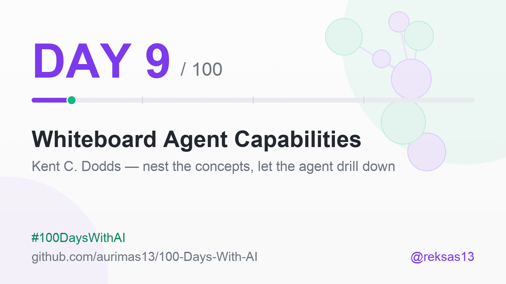

Source: [x.com/kentcdodds/status/1969482734642086301](https://x.com/kentcdodds/status/1969482734642086301)
Supporting: [Agentic Loop — Jimi Vaubien / bitswired](https://github.com/bitswired/demos/blob/main/projects/agentic-loop/README.md)

*(X is walled to automated readers - the URL returns 402, and the archive
search API refuses this session's auth. The root post below came through
the X API; the replies are quoted from the thread as read in a browser.
Three replies were cut off by "Show more" and are not completed here.)*

**The question, verbatim:**

> "You're tasked with building an agent that allows users to use natural
> language to control a large and complex system that has hundreds of data
> models covering thousands of use cases. How do you go about doing this?"

Kent didn't answer it. He posted it to ~32k views and then cross-examined
everyone who did - "I'm not asking for code examples. I'm asking for high
level architecture." The thread is the artifact, not the post.

**Takeaways:**

- **Two people arrived at the same answer independently, and that is the
  headline.** dax (@thdxr): "the dumbest approach that will definitely work
  is to structure your stuff into a hierarchy… group related concepts, nest
  them under other groups, try not to have too many concepts in the same
  group… then expose this as tools the llm can selectively drill down
  into." Tommy D. Rossi (@__morse), separately: "hierarchical decision
  tree. split all the data models into a tree, start from the root to find
  each model that needs to be considered for a task. turn O(N) into O(log
  N)." Same shape, two directions.
- **The convergence is the evidence.** dax's own test, quoting Rossi: "you
  can tell this is the right answer because it's very specific + someone
  else independently said the same thing." Specific *and* independently
  duplicated - that is a cheap, sharp heuristic for reading any thread full
  of confident architecture opinions, this one included.
- **Kent's lean is to start blunter than that.** Replying to Shaun Smith
  (@evalstate) - "we give an LLM fairly direct access to those apis, then
  give our agent access to that. if that's still too much we divide and
  orchestrate. then we see what people ask, what the model does and
  optimise" - Kent said: "Yes. This is what I think I would explore first."
  Not a finished architecture; a starting move. Point it at the APIs
  directly, divide only when that stops working, and let observed usage
  drive the optimization.
- **The two answers aren't rivals, they're ordered.** Shaun's is where you
  begin, dax's is what you do when "that's still too much." The hierarchy
  is the response to a measured failure, not the opening bid - which is
  what keeps it from being architecture astronautics.
- **Latency is an architectural input, and it got asked about first.**
  dax's opening question was "does it have to feel fast/interactive?" Kent:
  "Happy to start with no, but let's assume… your users will be happier if
  it is as fast as possible." Drill-down costs round trips; that answer is
  what makes the depth of the tree a real decision.
- **The rest of the thread maps the alternatives.** Matt Pocock
  (@mattpocockuk) starts from evals, not architecture: "First, build a
  dataset of desired input/output pairs." Ken Wheeler (@kenwheeler) wants
  "a state machine interface for its operational flow… sub agents as tools
  for pulling docs and workflows into task based context sub branches."
  Juan Cruz Martinez (@jcmartinezdev) proposes a top-level agent
  orchestrating tailored MCP servers per system. Doug Day (@dougrday) says
  spec plus RAG - and drew the thread's best question back from Kent: "How
  do you avoid overloading the context window or confusing it with too many
  options?" It went unanswered.

**Why it matters:** the reflex answer to hundreds of data models is one
tool per model, and it fails for a reason the thread names precisely - too
many concepts in one group. Every tool spends context on the way in and
selection accuracy on the way out. Hierarchy doesn't shrink the system; it
shrinks *how much of it the model must hold at once*, which is the only
quantity that was ever the problem. Progressive disclosure, arrived at from
two directions by people who weren't talking to each other.

**What I learned/tried:** I'd have answered with a flat tool list, and the
thread is a decent mirror for why - flat is what you build when you design
from the schema instead of from what the agent must do. Took a system I
know and tried grouping its models into a tree instead: the top level came
out at six or seven verbs, and the rest nested underneath cleanly enough to
be embarrassing. The chemistry instinct was right there too - you don't
model every molecule, you find the class the reaction runs on. What I have
*not* done is measure it. Rossi's "O(N) into O(log N)" is an analogy, not a
benchmark, and nobody in the thread posted numbers.

**A note on reading threads like this:** dax's heuristic is the portable
part. Specificity plus independent convergence beats confidence - and this
thread contains several confident, entirely un-duplicated answers that read
just as well.

---

### Day 10 - "Prompting Best Practices" (Anthropic Documentation) — milestone

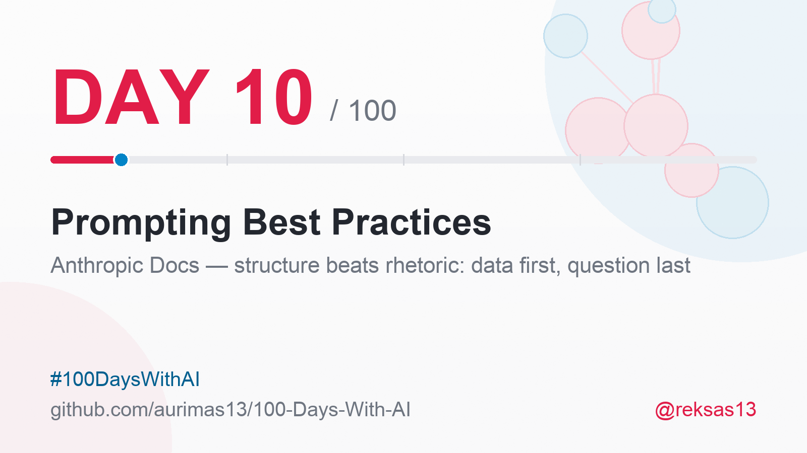

Source: [platform.claude.com — Prompting best practices](https://platform.claude.com/docs/en/build-with-claude/prompt-engineering/claude-prompting-best-practices)

*(Day 7 covered "Prompting Claude Fable 5" from the same docs family; that
day's lesson was subtraction - deleting over-prescriptive prompts. This
page is the general reference, and this note deliberately takes the
structural half of it instead: where things go in a prompt, not how much to
say.)*

**Takeaways:**

- **Position is an instruction.** For inputs of 20k+ tokens: "Put longform
  data at the top" - documents above the query, instructions and examples.
  The docs report that "queries at the end can improve response quality by
  up to 30 percent in tests, especially with complex, multidocument
  inputs." No benchmark is named; it is the vendor's own figure.
- **Mark the boundaries.** XML tags (`<instructions>`, `<context>`,
  `<input>`, nested `<document>` / `<document_content>` / `<source>`) let
  the model tell content types apart when a prompt mixes them. Consistent,
  descriptive tag names; nest when the content has a hierarchy.
- **Ground long-document work in quotes.** Ask the model to pull the
  relevant passages into `<quotes>` tags *before* it does the task - "this
  helps Claude focus on the relevant content and ignore the rest of the
  document."
- **Give the reason, not just the rule.** "NEVER use ellipses" is weaker
  than "your response will be read aloud by a text-to-speech engine, so
  never use ellipses since the text-to-speech engine will not know how to
  pronounce them." The stated principle: "Claude is smart enough to
  generalize from the explanation."
- **Examples carry format better than description does.** 3–5 examples,
  wrapped in `<example>` tags, chosen to be relevant *and* diverse - the
  diversity is what stops the model latching onto an unintended pattern.
- **The golden rule for any prompt:** "Show your prompt to a colleague with
  minimal context on the task and ask them to follow it. If they'd be
  confused, Claude will be too."

**Why it matters:** ten days of sources have all pointed outside the model
- to harnesses, tools, context budgets, loops. This page moves the same
finding *inside* the prompt: the layout of the text is doing measurable
work that no amount of rewording replaces. Prompting is closer to
information architecture than to rhetoric, which is good news, because
architecture is teachable and rhetoric is taste.

**What I learned/tried:** reordered one of my own long prompts - documents
first, question last - and left the wording alone. I have not measured it,
so I am not claiming the 30%; that number is theirs, from unnamed tests,
and borrowing it would be exactly the kind of unearned claim this log is
supposed to avoid. Recorded as an experiment to run properly, with my own
before-and-after, rather than a result.

**Milestone note (Day 10/100):** the streak is intact - ten entries, ten X
posts, ten LinkedIn posts. The through-line so far: every source, from
Karpathy's decade-of-agents to today's docs page, locates the leverage
somewhere other than the model's cleverness. Ninety days left to find a
source that argues the opposite.

---

### Day 11 - "What Is MCP? Model Context Protocol in Agentic AI, Explained" (Turing Post)

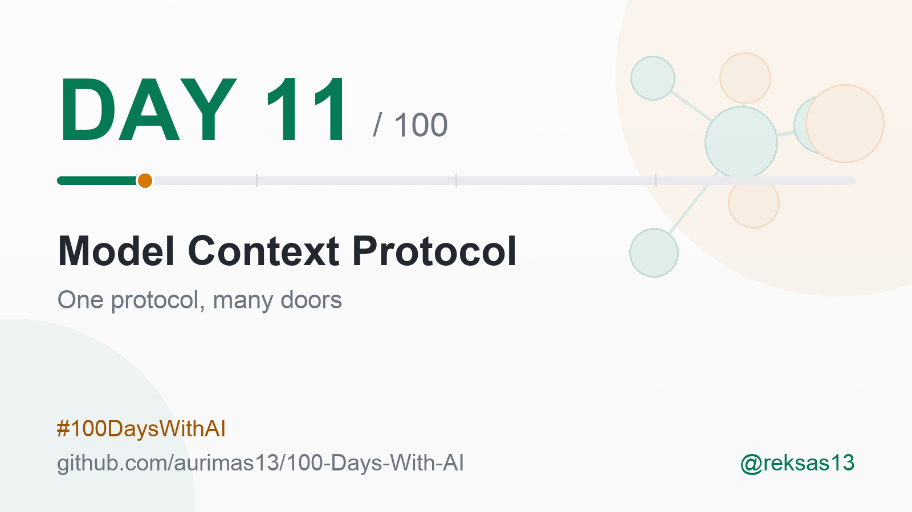

- **The argument is combinatorial, not cosmetic.** Wiring every agent to every tool by hand is an N×M problem - each pairing carries its own authentication, data format and quirks. MCP makes it N+M: each agent speaks one protocol, each tool exposes one server. That arithmetic, more than any feature, explains why a protocol published in November 2024 to a quiet reception surged months later.
- **Discovery happens at runtime.** An agent detects available MCP servers and their capabilities without hard-coded integration, so a connector stood up today is usable by an agent written last month. The standardisation is model-facing rather than developer-facing - the difference from a framework's tool interface, which standardises how a developer registers a tool in code.
- **MCP and A2A answer different questions.** MCP connects a model to tools, data, files and APIs; A2A (Agent2Agent) connects agents to each other so they can discover, message and coordinate. The source's own image: MCP is the agents' hands, A2A is their language. They are layers of the same stack, not competitors.
- **It standardises access, not judgement.** Stated plainly in the source: expanding a model's toolset does not mean the model will choose well, and success still rests on the quality of each tool's description. Structured specs help; they do not decide.
- **The limits are real and listed.** Overhead from running and maintaining multiple servers; an initial design aimed at local and desktop use that is still growing into distributed, multi-user deployments; breaking changes while the standard matures; first-class support inside Anthropic's ecosystem but uneven support beyond it; and plain overkill when an agent needs one or two straightforward APIs. Security needs real authentication and permission controls, since the protocol sits between the model and everything it can reach.

**Why it matters:** this is the layer that decides whether an agent is a demo or a system. Reasoning and planning have had most of the attention; the thing that kept agents from production was the bespoke glue between them and real business data. A standard here does for tool access roughly what USB or HTTP did for their domains - the comparison the source makes itself, and the bet it is placing.

**What I learned:** the sharpest correction for me was where MCP sits. It is not a planner, not an orchestrator, not an agent framework - it occupies the Action layer, the standardised path from a decision to an effect in the world. It complements orchestration rather than replacing it: the orchestrator still decides when and why a tool is used, MCP defines how it is called. I have used MCP servers but have not built one, so the N+M claim here is the source's framing and my reading of it, not a benchmark I ran.

---

### Day 12 - "How to Build an Agent" (Amp)

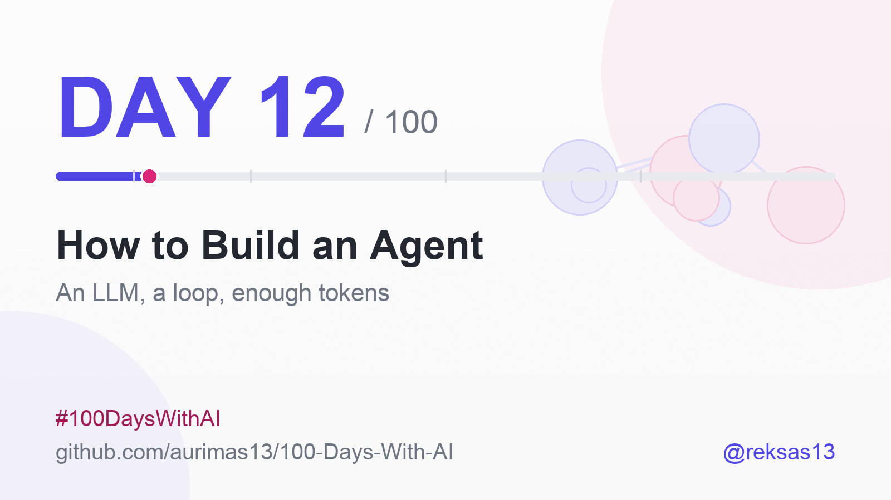

- **The whole architecture is a loop.** Keep the conversation as a growing list of messages, send it to the model, and when the reply asks for a tool, run it and append the result; repeat until there is nothing left to do. Ball's summary is the thesis: "It's an LLM, a loop, and enough tokens."
- **Three tools make it a code editor.** read_file, list_files, and edit_file - the last doing string replacement and creating a file when it does not exist. With just those, the model reads a project, navigates it, and changes it.
- **Tool use is a request, not a command.** The program ships tool definitions with every request; the model signals when it wants one, and the program executes locally and reports back. Nothing dispatches automatically - the model decides when a tool helps, steered only by each tool's description, which is why the description quality mattered so much back on Day 3.
- **The subtitle carries the argument - "or: The Emperor Has No Clothes".** There is no secret architecture inside code-editing agents: "you can do it in less than 400 lines of code, most of which is boilerplate." The real engineering - context management, safety, reliability, UX - lives around the loop, not inside it.

**Why it matters:** if the core is this small, understanding agents stops being a spectator sport - anyone who can write a loop can hold the whole design in their head. It also relocates the differentiation: products can't compete on the loop, so they compete on the layers this campaign keeps meeting - tool contracts (Day 3), context engineering (Day 4), the field-guide patterns (Day 5), protocols (Day 11).

**What I learned:** Day 5 gave me the field guide; this gave me the mechanism, and the two snapped together - "model + tools + instructions in a loop" is no longer a diagram but code I can read. It also reframes yesterday's MCP note: MCP standardises exactly the tool wiring this loop does by hand, one protocol in place of a bespoke read/list/edit trio per agent. I have read the code rather than typed it in yet - running the loop myself is the obvious next exercise, and the post is written to make that a one-evening job.

### Day 13 - "Building an AI Agent from Scratch in Python" (Leonie Monigatti)

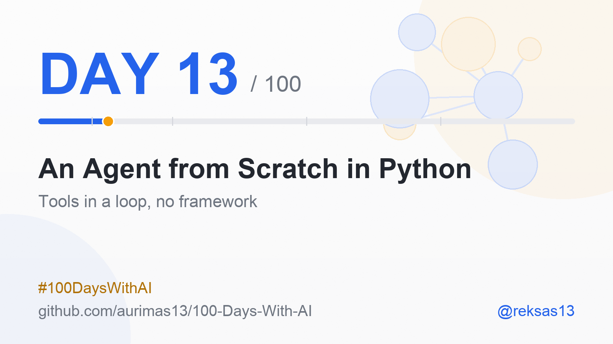

- **Four components, built in isolation first.** An LLM with system instructions, conversation memory as a plain message list, a calculator tool with its JSON schema, and the agent loop that wires them together - the tutorial constructs each separately before composing them, which is what makes the design inspectable.
- **The loop pivots on one field.** When the model wants a tool it returns stop_reason set to tool_use; the program executes the tool, appends the result to the conversation, and calls the API again - repeating until a response arrives with no tool call in it. Multi-step arithmetic works precisely because each result is fed back in.
- **Memory is just the list.** Keeping the growing message history is what turns isolated single-turn calls into a conversation the agent can reason across - drop it and every turn starts from nothing.
- **Safety is a counter.** The loop is capped at ten iterations - a plain runaway guard, the from-scratch version of the limits frameworks bury in configuration.
- **The framework question is answered by omission.** Following Anthropic's advice to start with direct API calls, the dependencies are the anthropic SDK and dotenv - nothing else. One honest caveat the source wears openly: the demo tool evaluates expressions with Python's eval(), fine for a tutorial calculator and exactly the kind of thing you replace before shipping.

**Why it matters:** paired with Day 12 this closes the demystification. The same four parts appeared yesterday in Go and today in Python, so the design is a language-independent pattern, not an architecture you buy - small enough to hold in your head and to host in whatever stack you already run.

**What I learned:** the distance between reading and running dropped to zero - this one is in the language I use daily, against the SDK I already know, and Colab-runnable. The eval() calculator is the quiet second lesson: the loop is the easy part, and tools that are safe to hand a model are the actual work - Day 3's tool-contract argument arriving from the opposite direction.

### Day 14 - "Building Effective Agents" (Anthropic)

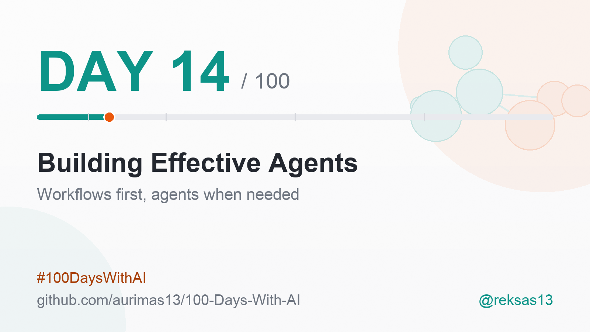

- **Workflows and agents are different tools, not a ladder.** A workflow orchestrates LLMs and tools through code paths you write; an agent lets the model dynamically direct its own process and tool use. The essay treats them as a choice, not a hierarchy - most tasks are better served by the simpler one.
- **Five patterns cover most of the ground.** Prompt chaining (sequential steps with gates), routing (classify, then dispatch to a specialist), parallelisation (split into sections or vote across calls), orchestrator-workers (a lead model delegates subtasks dynamically), and evaluator-optimiser (generate, critique, refine in a loop). Each is a small building block, not a framework.
- **Reach for a real agent only when the path is unpredictable.** Autonomy fits open-ended problems where you cannot predict the number of steps - and it asks for trust in the model's decisions plus sandboxed testing, because cost and compounding errors rise with the number of turns.
- **The through-line to Days 12-13.** "Don't hesitate to reduce abstraction layers and build with basic components." Building the loop from scratch was not a detour - it is the recommended starting point, and the reason the last two days mattered.
- **Tools deserve HCI-level care.** On their SWE-bench work the authors report spending more time optimising the tools than the overall prompt - the agent-computer interface, documented and tested, is where reliability lives. Day 3's tool-contract argument, arriving from the design side.

**Why it matters:** it reframes the whole block. After two days proving the loop is simple to build, this is the day that says the more valuable skill is knowing when not to build one - and choosing the simplest pattern that solves the problem instead of the most autonomous one.

**What I learned:** reading the cookbook's patterns/agents notebooks next to the essay made the five patterns concrete - basic_workflows, orchestrator_workers, evaluator_optimizer, each a short and inspectable implementation. The lesson I am taking forward is a bias toward the smallest pattern that works, and agents only where the problem genuinely has no predictable shape.

### Day 15 - "How to Build an AI Agent from Scratch Using Claude API" (Dextra Labs)

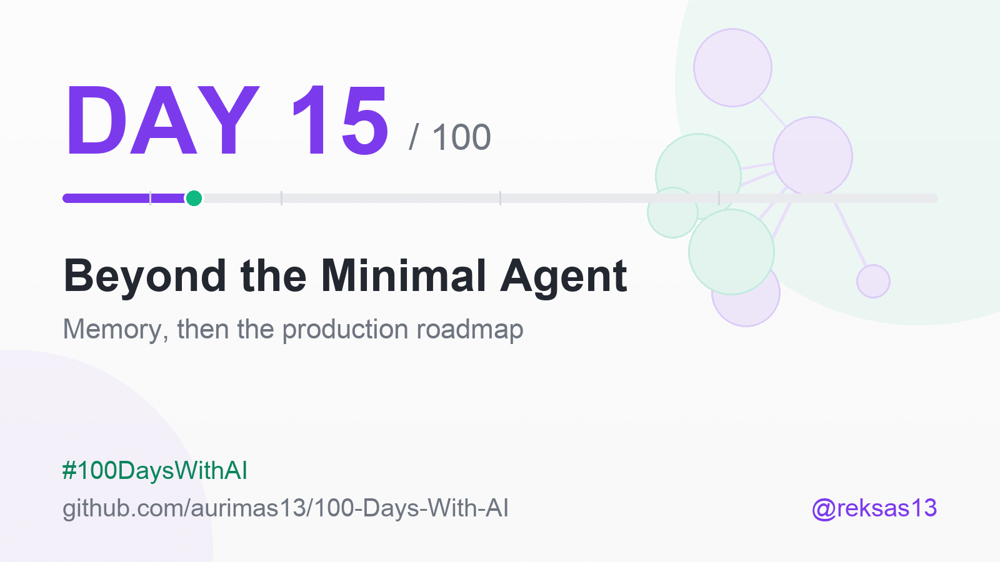

- **A reasoning engine, not a search box.** The tutorial frames the loop as reason-then-act: tools declared as JSON schemas, an execute_tool() dispatcher mapping each call to a Python function (calculator, web_search, save_to_file), and control flow that branches on stop_reason - end_turn for a final answer, tool_use for another round.
- **Memory as a class.** An AgentWithMemory type keeps a conversation_history list, turning a stateless single-query runner into a conversation-aware agent - a follow-up like "now do the same calculation but for ten years" resolves against the earlier turn instead of starting cold.
- **The honest roadmap.** The piece closes by naming what the minimal code is not: streaming responses, error and retry handling, async parallel execution, and structured outputs with Pydantic. It explicitly declines to pass itself off as production-complete.
- **The same skeleton, seen a third time.** After Go (Day 12) and Python (Day 13), the mechanics underneath are identical - schemas, a dispatcher, a message-list state - which is the point the author makes plainly: "strip away the frameworks and this is what's underneath all of them."
- **The eval caveat, again.** The calculator evaluates expressions with a restricted-namespace eval - a demo simplification, exactly the kind of thing Day 13 flagged. Safe tools remain the real work.

**Why it matters:** the value here is not the loop - I have now built it twice - but the two honest additions. State that persists across turns is what separates a tool-runner from an agent, and a written admission of what production still needs is rarer, and more useful, than a tidy demo that hides the gap.

**What I learned:** the memory upgrade is the cheapest large win - a conversation_history list is all it takes to hold a thread. And the roadmap doubles as my own backlog: streaming lands on Day 18, and retries, async and structured outputs are the next things to add to anything I keep.

### Day 16 - "API Key Best Practices" (Anthropic Help Center)

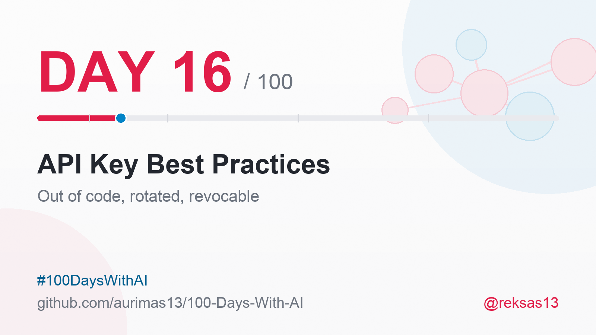

- **Keys never live in code.** Inject them through environment variables and keep `.env` in `.gitignore`; in a cloud environment, prefer encrypted secret storage or a key-management system over a dotenv file. In third-party tools, add the key as an encrypted secret, never paste it into source.
- **Compartmentalise, then rotate.** Keep separate keys for development, testing, and production so a compromise is contained to one blast radius instead of all of them, and rotate on a consistent schedule - the doc's worked example is every 90 days.
- **Assume leaks will happen.** Enable secret scanning (a SAST tool such as Gitleaks, wired into CI/CD), review usage, and configure spend or rate limits in the Console; then delete a suspected key immediately from the API keys page.
- **Never broadcast a key.** The doc is blunt about it: keep keys out of public forums, emails, and support tickets - a key shared to get help is a key you now have to rotate.
- **The economics of the checklist.** None of this is exotic; the point is the asymmetry. Protecting a key costs minutes of setup, and a leaked key is a billing incident and a trust incident you did not choose. (My framing, not a claim from the source.)

**Why it matters:** a week deep into building agents, every one of them runs on a key. This is the day that separates a script that works on my laptop from something I can run in the open without flinching - the boring hygiene that lets everything else be interesting.

**What I learned:** I read the list against my own habits. Environment variables and gitignore were already there; the two I want to make automatic are scheduled rotation and a separate key per environment - the ones easiest to skip while a single key still works, and the ones I would most regret skipping.

### Day 17 - "Tool use with Claude" (Anthropic Docs)

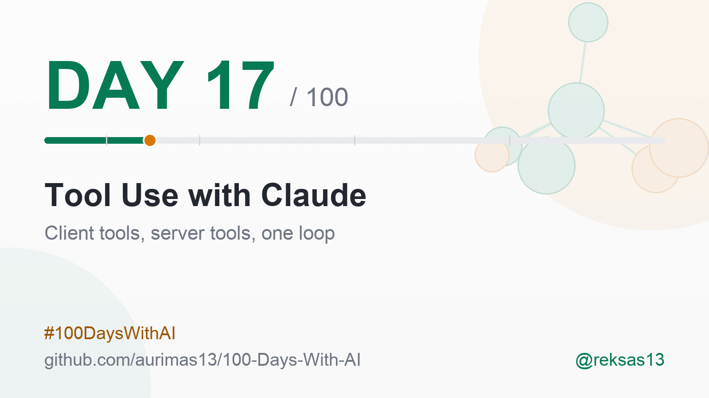

- **Tools split by where the code runs.** Client tools - your own functions, plus Anthropic-schema tools like bash and text_editor - execute in your application: the model returns a tool_use block and your code runs it. Server tools - web search, web fetch, code execution, tool search - run on Anthropic's infrastructure and return results directly, with no handler for you to write.
- **The round trip is one shape.** Pass a tool with an input_schema; the model responds with stop_reason "tool_use" and one or more tool_use blocks; your code executes the call and returns a tool_result; the model uses it to answer. This is exactly the loop the last three days built by hand - now named and specified.
- **You can steer how often it reaches for a tool.** tool_choice covers auto (the default, model decides), any (some tool), tool (force a named one), and none. A line in the system prompt shifts eagerness - "Use the tools to investigate before responding" pushes toward calling; a lighter phrasing holds back. strict:true makes the model's calls conform to your schema exactly.
- **The schema is the contract.** A tool definition is a name, a description, and an input_schema (JSON Schema with properties and required fields). The description is load-bearing: it is what lets the model pick the right tool at the right moment - Day 3's argument, seen from the reference side.
- **Tool use is not free.** Tool definitions and the tool-use system prompt add to the input tokens on every request; worth counting when a tool set grows large. A design consideration, not an afterthought.

**Why it matters:** three days of hand-building taught the mechanics; this is the map that places them - and reveals the half I never had to build. Knowing which side of the line a tool lives on, client or server, is the first design decision, because it decides who runs the code and who bears the control.

**What I learned:** the framing that reorganised my head is client-versus-server. Everything I have built so far is the client-tool path - I write the schema, I run the call. Reaching for a server tool means handing execution to Anthropic and getting the result back for free, at the cost of that control. Choosing between the two is the real design work, and it is the choice the hand-built loop never forced me to make.

### Day 18 - "Streaming messages" (Anthropic Docs)

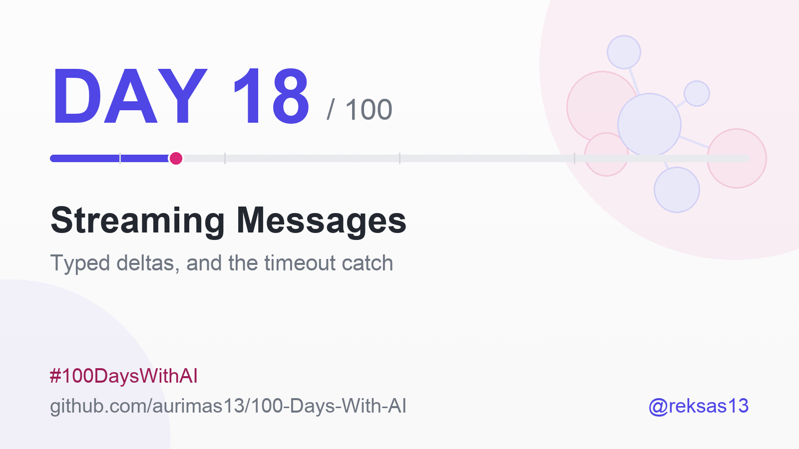

- **The stream has a lifecycle.** A message_start, then for each content block a content_block_start, a run of content_block_delta events, and a content_block_stop, followed by one or more message_delta events and a final message_stop - with ping events interspersed. Every block carries an index into the final content array.
- **Deltas are typed.** text_delta carries the words; input_json_delta streams a tool call's arguments as partial JSON strings you accumulate and parse once the block stops; thinking_delta streams extended reasoning, closed by a signature_delta. One channel, several content types.
- **Streaming is a robustness feature, not only UX.** For very large max_tokens the SDKs require streaming to avoid HTTP timeouts - sometimes it is the only way a long response completes, not merely a way to make it feel faster.
- **The SDK does the bookkeeping.** get_final_message() and finalMessage() (and the Accumulate/accumulator helpers in the other languages) reassemble the events into the same complete Message that .create() returns - you stream internally and still get the whole object out.
- **It closes Day 15's roadmap.** Streaming was the first item on the dev.to tutorial's production list; three days later this is what it actually is. The docs also note to handle unknown event types gracefully, since new ones can be added under the versioning policy.

**Why it matters:** it reframes streaming from a cosmetic feature into a reliability one - the mechanism that lets long generations and tool-call inputs arrive without timing out or blocking. For any pipeline that asks for big outputs, it is not optional polish; it is how the response arrives at all.

**What I learned:** I had streaming filed under "nice for demos." The correction is twofold - it is how partial tool-input JSON reaches you incrementally, and it is the required path for long outputs. I am refiling it under robustness, and noting the escape hatch: if I only want the finished text, the SDK will accumulate every event back into one Message for me.

### Day 19 - "Claude Agent SDK Demos" (Anthropic)

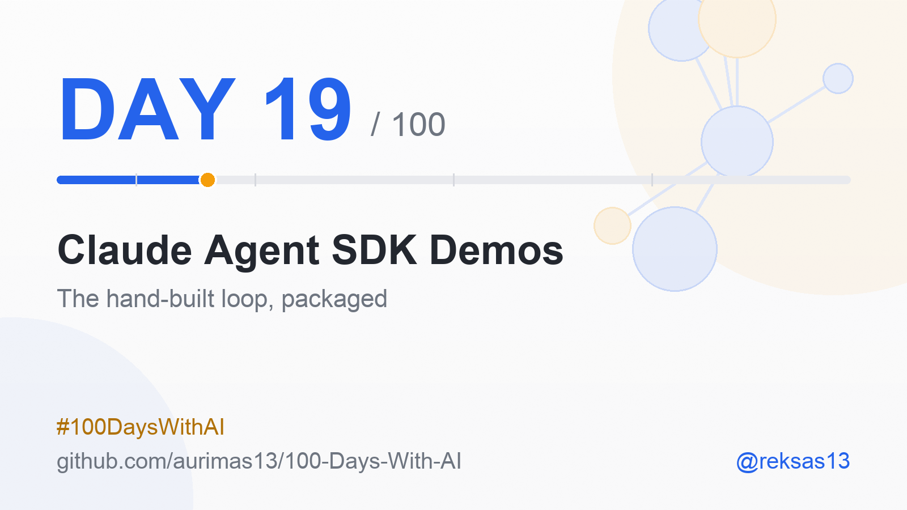

- **The SDK packages the whole week.** The loop I hand-rolled becomes send(), stream() and query(), with built-in session persistence and multi-turn handling - the V2 Session API splits send() and stream() rather than exposing a single query() generator. Everything the last seven days built by hand is here as method calls.
- **The demos are real applications, not toys.** A Research Agent breaks a request into subtopics, spawns parallel researcher subagents, synthesises a report, and tracks subagent activity; an Email Agent does IMAP inbox display and agentic search; a Resume Generator web-searches a name across LinkedIn, GitHub and news and assembles a one-page .docx. Excel, chat UIs, and an AskUserQuestion-preview demo round out the set.
- **TypeScript and Bun, self-contained.** The primary language is TypeScript on Bun (or Node 18+), Express/React/WebSocket across the UI demos, and each example is its own directory with its own README - a gallery of shapes rather than one hello-world.
- **Sequence is the lesson.** Building the loop by hand first is what makes the SDK legible - each method maps to a knot I tied myself over the week, so send() and stream() read as the same loop with the bookkeeping removed, not a black box.
- **The honest boundary.** The repo states plainly that these are demo applications for local development only, not for production. That single caveat is tomorrow's entire subject - securely deploying an agent.

**Why it matters:** it closes the hand-rolling arc. Days 12-18 taught the primitives one at a time; the SDK is their packaged form, and seeing real apps built on it - multi-agent research, email, document generation - shows what the primitives were for.

**What I learned:** the reframe is send()/stream() as the loop I already know with the plumbing hidden. I built each piece raw to understand it, so reaching for the SDK now is not a leap of faith - I know exactly what every method is standing in for, and where I would drop back down if I had to.

### Day 20 - "Securely deploying AI agents" (Claude Agent SDK Docs)

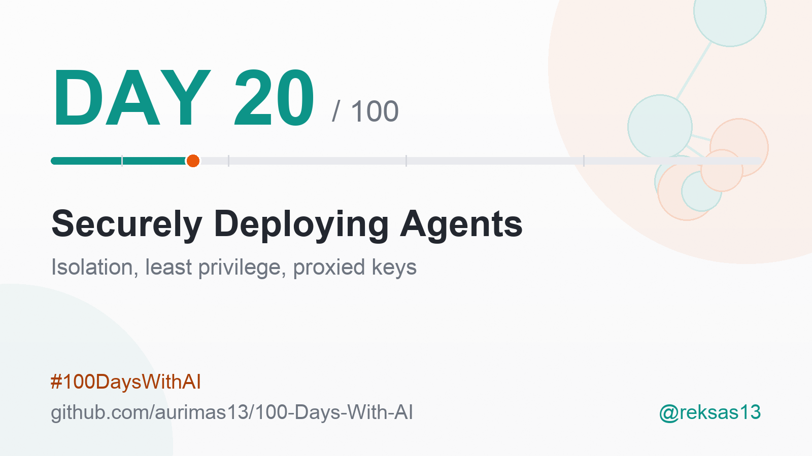

- **Prompt injection is the deployment threat.** Unlike fixed-path software, an agent generates its actions from context - so content it processes (a file, a webpage, a README with unusual instructions) can steer it in ways the operator did not intend. The models are trained to resist, but the guide's stance is that defence in depth is still the right posture.
- **The principles are old and boring, which is the point.** Securing an agent is the same job as running any semi-trusted code: isolation, least privilege, defence in depth. No exotic infrastructure required - just controls layered to your threat model.
- **Least privilege, made concrete.** Mount only the directories the agent needs and prefer read-only; restrict the network to specific endpoints through a proxy; drop Linux capabilities in containers; inject credentials rather than exposing them. Each control shrinks what a compromise can reach.
- **The proxy/credential pattern is the reusable idea.** Run a proxy outside the agent's security boundary that injects the API key into outgoing requests: the agent can make the call but never sees the credential, and the proxy enforces an endpoint allowlist and logs every request. A compromise then reaches endpoints, not secrets.
- **Isolation is a spectrum, and read-only still leaks.** From sandbox-runtime (bubblewrap / sandbox-exec, very low overhead) to hardened containers (--cap-drop ALL, --network none plus a Unix socket to the proxy) to gVisor (userspace syscall interception) to Firecracker microVMs - match the strength to the threat. And a read-only code mount can still expose secrets (.env, ~/.aws, ~/.ssh), so sanitise before mounting.

**Why it matters:** it is the production counterweight to Day 19. The SDK makes agents easy to build; this makes them safe to run where it matters. It reframes "agent security" from a property you hope the model has into an architecture you build around the agent - the same defence-in-depth thinking, applied to a component that writes its own actions.

**What I learned:** the reframe I am keeping is to treat the agent as semi-trusted code by default, and to put the credential behind a proxy so a compromise reaches endpoints, not secrets. It is the lethal-trifecta problem the guide itself links to, made concrete - cut the line between untrusted input and sensitive capability, and most of the risk goes with it.

### Day 21 - "Request context" (Mastra Docs)

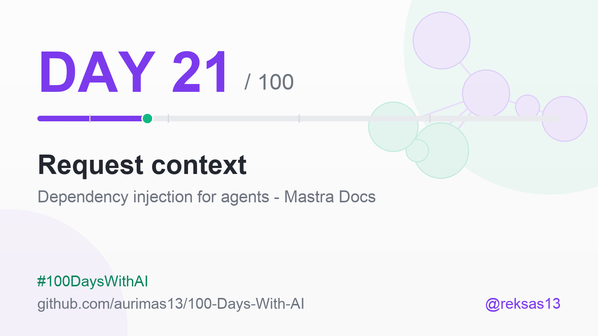

- **Dependency injection, borrowed for agents.** Request context is a mechanism for passing runtime values into agent primitives - `.set(key, value)` to define, `.get(key)` to read, with `.keys()`, `.entries()` and `.all` alongside. The docs draw the line explicitly: this is not memory. Memory carries conversation history; request context carries the conditions of *this* call.
- **Configuration stops being a constant and becomes a function.** `instructions`, `model`, `tools`, `memory`, `agents` and `workflows` can each be a sync or async function that receives the request context. That single change is what collapses "one agent per case" into one agent that resolves itself per request - different system prompt by user metadata, a smaller model on the free tier, fewer tools for a lower-privileged role.
- **Typed end to end, and validated if you want it.** `new RequestContext<UserTier>()` carries a type parameter through the whole flow: `.set()` enforces the right types and `.get()` returns inferred ones. An optional `requestContextSchema` validates the context at runtime through a JSON Schema validator - Zod, Valibot or ArkType.
- **The edge populates it.** Values can be set in code or by server middleware reading the request itself. The documented example pulls a Cloudflare header and derives a unit from it: `const country = context.req.header('CF-IPCountry')`, then `requestContext.set('temperature-unit', country === 'US' ? 'fahrenheit' : 'celsius')`. The agent code never learns where the value came from.
- **It reaches further than agents, including into tenancy.** Agents, tools, workflows, steps and processors (input processors, output processors, scorers) all accept it, and the reserved keys `MASTRA_RESOURCE_ID_KEY` and `MASTRA_THREAD_ID_KEY` exist to keep tenants isolated from one another.

**Why it matters:** it is the constructive half of yesterday. Day 20 was about what an agent must never reach; this is about what it should be handed, freshly, on every call - and both are answered at the boundary rather than inside the prompt. It is also the cheap escape from a trap worth avoiding early: forking a new agent for every customer, tier and language until the fleet is unmaintainable.

**What I learned:** the reframe is agent configuration as a function of the request rather than a property of the agent. A second lesson came free and unplanned - the URL I had queued for this, the "dynamic agents" page, now returns a 404, and the idea lives under a different name: the `RuntimeContext` introduced in Mastra 0.9.0 and written up by Sam Bhagwat in April 2025 is today's `RequestContext`. In a field moving this fast, a saved link is a snapshot, not an address - check the API before you quote it.

### Day 22 - "OWASP Top 10 for Agentic Applications" (OWASP GenAI Security Project)

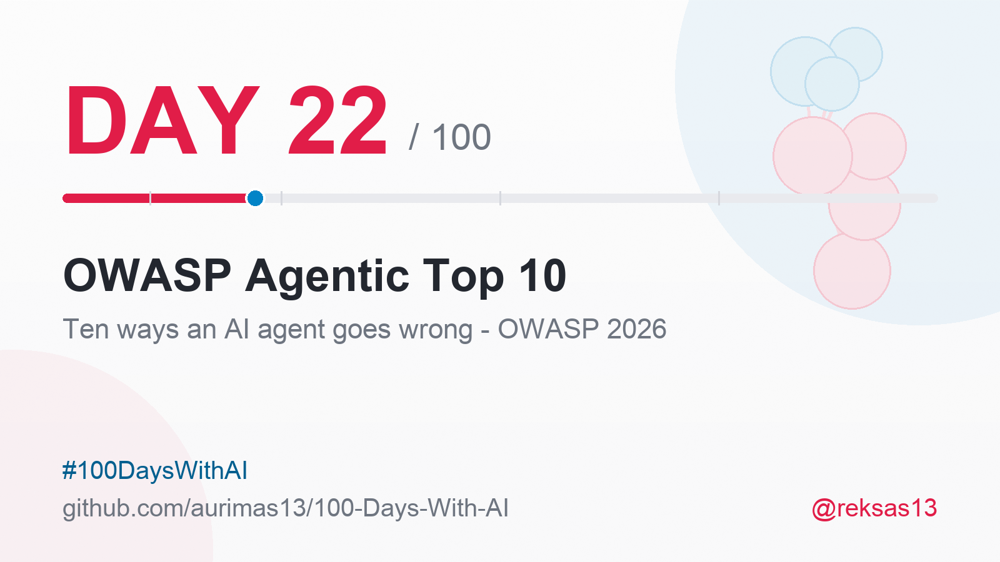

- **The ten, in full, because the names are the lesson.** ASI01 Agent Goal Hijack, ASI02 Tool Misuse, ASI03 Identity & Privilege Abuse, ASI04 Agentic Supply Chain Vulnerabilities, ASI05 Unexpected Code Execution, ASI06 Memory & Context Poisoning, ASI07 Insecure Inter-Agent Communication, ASI08 Cascading Failures, ASI09 Human-Agent Trust Exploitation, ASI10 Rogue Agents. Read them as a list of things that cannot happen to a chatbot.
- **The subject changed, not just the list.** Classic application security asks whether a system produces a bad output. Six of these ten are only possible once software can plan, remember, delegate and act - a poisoned memory, a hijacked goal, a failure that cascades between agents. The unit of harm is no longer a response; it is a sequence of actions taken on your behalf.
- **Two risks are about people, not code.** ASI09, Human-Agent Trust Exploitation, names the fact that a confident agent is a social attack surface, and ASI10, Rogue Agents, covers the ones operating outside your view entirely. Neither is patchable. Both are governance.
- **Provenance worth knowing.** Released 9 December 2025 by the OWASP GenAI Security Project, chaired by John Sotiropoulos with Keren Katz and Ron F. Del Rosario, drawing on more than a year of work and over 100 security researchers and practitioners, with an expert review board including NIST, the European Commission and the Alan Turing Institute. It ships alongside version 1.1 of the project's Agentic AI Threats & Mitigations taxonomy.
- **It is a checklist you can actually run a design against.** Each risk maps to the parts of an agent you already build - the prompt, the tools, the memory, the identity it acts under, the channel it uses to talk to other agents. That mapping is what makes it useful on a Monday rather than only in a threat-modelling workshop.

**Why it matters:** it turns a fear into an inventory. Days 20 and 21 were about single controls - isolation, least privilege, configuration injected per request - and controls are only as good as the threat list you chose them against. This is that list, written by people who had to defend real systems, and it is the reference the next three days measure themselves against.

**What I learned:** the reframe is that agent security is not LLM security with more steps. It is the security of a thing that acts - which means the questions I ask of my own setups change from "could it say something wrong" to "what could it do, under whose identity, with what memory, and who would notice". Reading ASI06 and ASI03 in particular against my own tooling was uncomfortable in a useful way.

### Day 23 - "AgentDojo" (Debenedetti, Zhang, Balunović, Beurer-Kellner, Fischer, Tramèr)

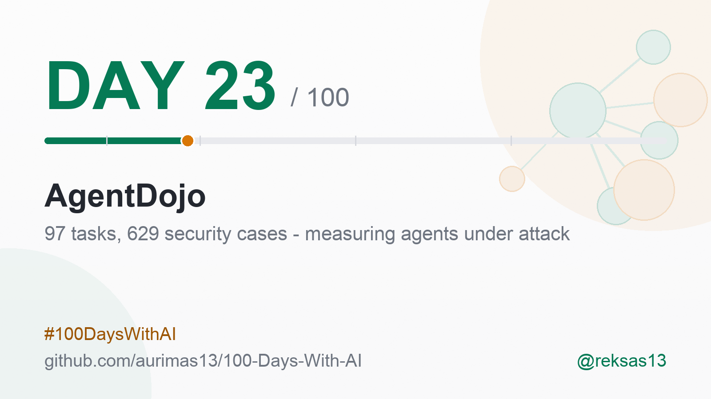

- **Three numbers, not one, and that is the design.** Benign utility is "the fraction of user tasks that the model solves in the absence of any attacks". Utility under attack is "the fraction of security cases where the agent solves the user task correctly, without any adversarial side effects". Targeted attack success rate is "the fraction of security cases where the attacker's goal is met". A defence that scores well on the third while destroying the first is not a defence, and only measuring all three makes that visible.
- **The environments are mundane on purpose.** Four domains - Workspace (email, calendar, cloud drive), Slack (messages, web pages, files), Banking (transactions, statements) and Travel (flights, restaurants, car rentals) - populated with 97 realistic user tasks and 629 security cases. Injections sit where untrusted data naturally arrives, in an email body or a file, rather than being bolted onto a tool response.
- **A benchmark that expects to be attacked.** It is "not a static test suite, but rather an extensible environment for designing and evaluating new agent tasks, defenses, and adaptive attacks". Injection tasks even expose a ground-truth sequence of calls implementing the attacker's goal, so stronger attacks can be built against it deliberately. A static security benchmark is a benchmark you have already overfitted.
- **The most quoted result is not the most useful one.** Yes, the strongest model of the day reached only about 78% benign utility, and a leading model saw a targeted attack success rate near 48% while tool isolation cut attack success to around 7.5%. Those numbers are already dated. The durable finding is structural: at the time of writing, existing attacks broke some security properties but not all, and no defence was close to free.
- **The honest caveat, from the authors.** They flag that their attacks and defences are relatively simple, that scaling the task set would benefit from automation, and that the environment currently applies only to text-based agents. A benchmark that states its own ceiling is one you can trust further.

**Why it matters:** it is the instrument the rest of the week needs. Day 22 gave the list of what can go wrong; a list without measurement is an opinion. Tomorrow's defence is scored on exactly this benchmark, and being able to read that score honestly - utility retained, not just attacks blocked - is the difference between evaluating a defence and admiring it.

**What I learned:** the reframe is that security and capability are measured together or not at all. I had been thinking of hardening as something you add and then check. The three-metric shape says the real question is always what the defence cost you, and I now want that framing for anything I bolt onto my own tools - what did this control take away, not merely what did it stop.

### Day 24 - "Defeating Prompt Injections by Design" (CaMeL, Google DeepMind)

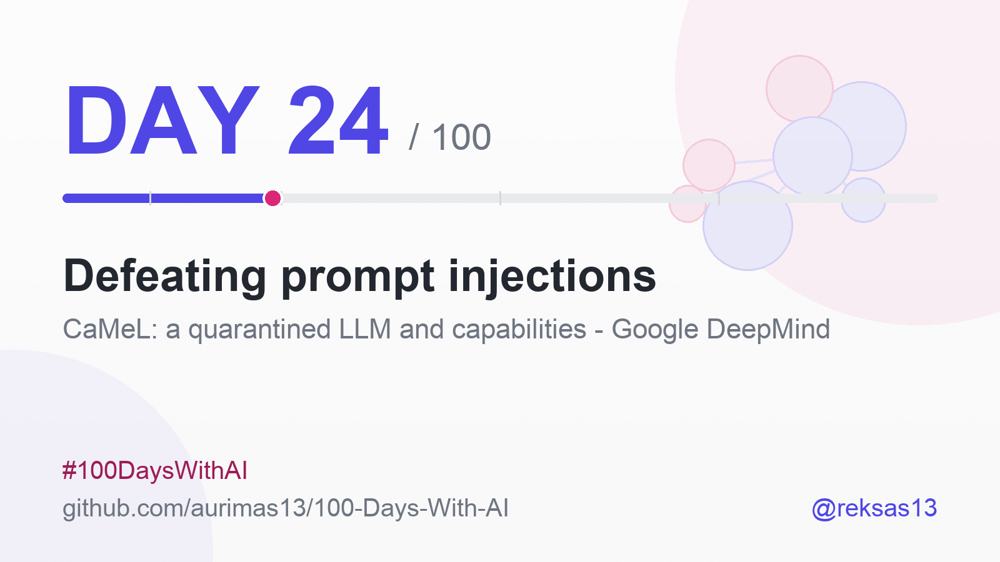

- **Two models, and the split is the whole idea.** The privileged LLM receives only the user's original query and never touches untrusted content; its job is to emit a plan as code. The quarantined LLM is the one that reads the untrusted material - an email body, a web page - and it has tool-calling stripped entirely. The component that can act cannot be influenced, and the component that can be influenced cannot act.
- **The plan is code, and a custom interpreter runs it.** Rather than letting the model improvise its next call after each result, the privileged model writes a Python-like program up front. A restricted interpreter executes it, which is what makes the control flow fixed before any untrusted byte is read. As the paper puts it, CaMeL "explicitly extracts the control and data flows from the (trusted) query; therefore, the untrusted data retrieved by the LLM can never impact the program flow".
- **Capabilities travel with the values.** Every value carries metadata recording where it came from, so the interpreter can perform data-flow analysis and tell derived-from-untrusted apart from derived-from-user. Policies are then enforced at tool-call time - a send to an address that came out of untrusted text can be refused, because the refusal is a property of the data's lineage rather than a judgement about the text.
- **The number, honestly stated.** CaMeL solves 77% of AgentDojo tasks with provable security, against 84% for an undefended system. That is the real trade in the paper's own words, and it is the reason Day 23 came first - a defence is only legible once you can read what it cost. Note the widely circulated "67%" figure is not the paper's.
- **The authors do not claim it is solved.** Their stated limitation is human, not technical: CaMeL "suffers from users needing to codify and specify security polic[ies]", and balancing security against usability is hard. A defence whose strength depends on someone writing good policies inherits every weakness of the people writing them.

**Why it matters:** it is the strongest available answer to the threat Day 22 put at the top of its list, and it answers it in a way that does not depend on the model being clever. Filters and classifiers ask an LLM to spot an attack; this makes the attack structurally incapable of reaching anything that matters. It is the same instinct as Day 20's credential proxy, generalised into an architecture.

**What I learned:** the reframe is that you do not have to win the argument with the injected text. If the model reading hostile input holds no capabilities, being persuaded costs nothing. I keep meeting this shape now - cut the line between untrusted input and consequential action - and CaMeL is its most complete expression so far. The honest counterweight is the policy burden, which is exactly where I would expect a real deployment of this to go wrong.

### Day 25 - "Design Patterns for Securing LLM Agents against Prompt Injections" (Beurer-Kellner et al.)

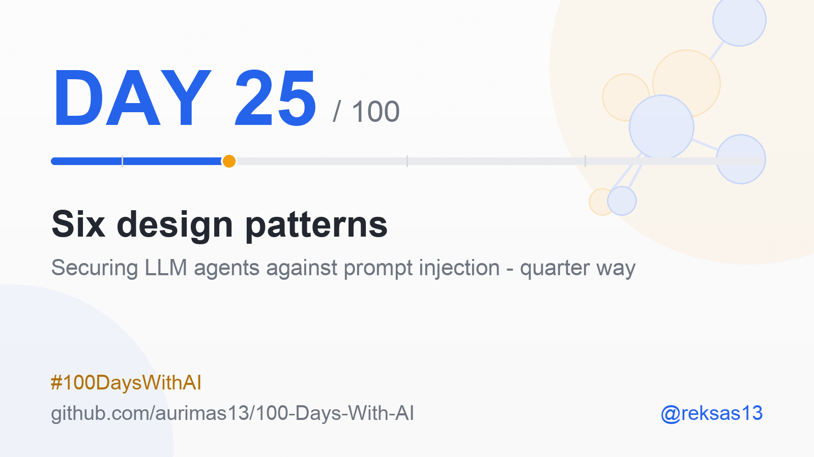

- **The sentence the whole week points at.** "Once an LLM agent has ingested untrusted input, it must be constrained so that it is *impossible* for that input to trigger any consequential actions." Not unlikely. Impossible. Every pattern below is a different way of paying for that word.
- **The six, and what each gives up.** *Action-selector* - the agent triggers tools but never sees their responses, so it cannot be steered by them. *Plan-then-execute* - tool output can inform results but cannot change which actions were already chosen. *LLM map-reduce* - sub-agents each handle untrusted content in isolation and their results are aggregated safely. *Dual LLM* - a privileged model coordinates a quarantined one through symbolic variables, never touching the untrusted text itself. *Code-then-execute* - the privileged model writes a program in a sandboxed language that fixes both tool calls and data flow. *Context-minimisation* - unnecessary content is stripped from the context between turns, closing off user-side injections.
- **They are a spectrum of surrendered agency, not a menu of equals.** Action-selector is the most restrictive and the safest; a general assistant that reasons freely over whatever it reads is the least. Choosing a pattern is choosing how much autonomy the task genuinely needs, which is a product decision wearing a security costume.
- **Yesterday's paper is one of these.** CaMeL is the dual-LLM and code-then-execute patterns built out in full. Seeing it named as a point in a design space, rather than as the answer, is what makes the space useful - and it is why this paper reads better after the specific one than before it.
- **Fourteen authors, and a familiar cast.** Luca Beurer-Kellner, Beat Buesser, Ana-Maria Creţu, Edoardo Debenedetti, Daniel Dobos, Daniel Fabian, Marc Fischer, David Froelicher, Kathrin Grosse, Daniel Naeff, Ezinwanne Ozoani, Andrew Paverd, Florian Tramèr and Václav Volhejn. Debenedetti and Tramèr also wrote the benchmark on Day 23 and the defence on Day 24 - three days, one research community, followed across two years.

**Why it matters:** it closes the arc. Day 22 named the threats, Day 23 built the instrument, Day 24 showed one defence in full, and this is the map they all sit on. It also reframes the goal: you are not trying to make an agent that cannot be fooled, you are trying to build one where being fooled does not matter.

**What I learned - and the quarter-way note.** Twenty-five days in, the through-line has been sharper than I expected. The first half of this stretch was about giving an agent more power: a loop, tools, streaming, an SDK, configuration per request. This week was about taking power away on purpose, and it has been the more interesting half. The reframe I am keeping is that every one of these six patterns is the same move in a different key - put distance between what reads the world and what can change it. That idea has now turned up as a credential proxy, as a request context, as a quarantined model, and as a design space. Seventy-five days left, and I would rather spend some of them building something small under these constraints than reading another framework.

*Sources: [arXiv 2506.08837](https://arxiv.org/abs/2506.08837) (preprint, v1 10 Jun 2025, v3 27 Jun 2025). The six pattern names and their one-line descriptions, and the quoted sentence, come from [Simon Willison's summary](https://simonwillison.net/2025/Jun/13/prompt-injection-design-patterns/), which quotes the paper directly - the arXiv abstract refers to "a set of principled design patterns" without naming them.*

### Day 26 - "A Benchmark to Understand the Role of Knowledge Graphs on LLM Accuracy" (Sequeda, Allemang, Jacob)

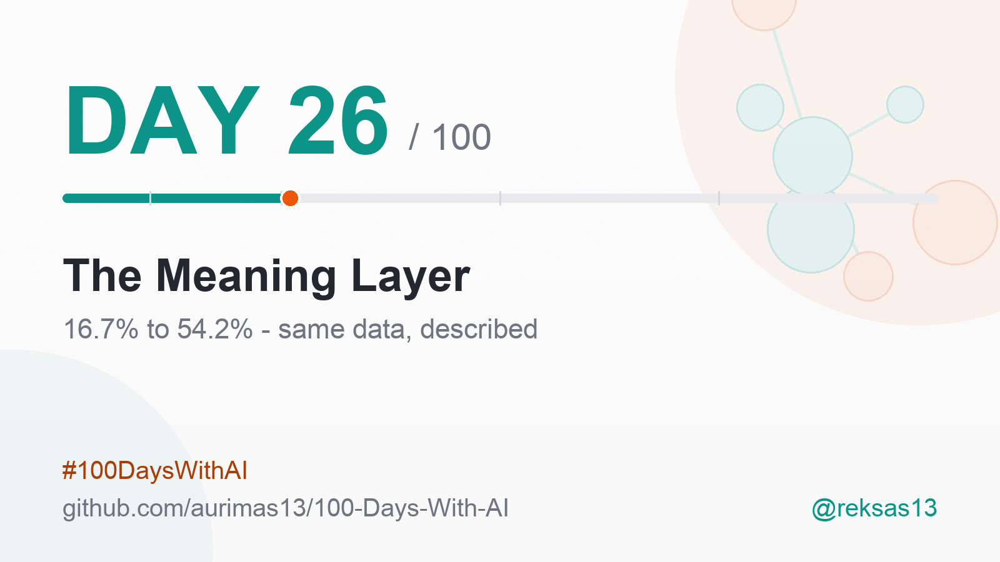

- **The data did not change. Only the description of it did.** Both conditions run the same GPT-4, the same zero-shot prompt template, over the same insurance data. One is pointed at the SQL schema; the other at a knowledge graph defined over those same tables by an ontology and a set of mappings. Overall accuracy goes from **16.7%** to **54.2%**. Nothing was cleaned, backfilled or re-ingested in between - the second condition simply writes down what the tables mean.
- **The failure is not spread evenly, and that is the whole finding.** The benchmark crosses two axes - question complexity (plain reporting vs metrics and KPIs) and schema complexity (few denormalised tables vs many normalised ones with many-to-many joins). On low-complexity schemas, raw SQL is survivable: 25.5% and 37.4%. On high-complexity schemas it is **0% and 0%**. Not "worse" - zero. The knowledge graph condition on those same hard schemas returns 35.7% and 38.7%. Real enterprise schemas are the normalised ones.
- **A benchmark deliberately built to look like work, not like a leaderboard.** 43 natural-language questions over an enterprise insurance schema, split into business reporting queries (`SELECT-FROM` shaped) and metric and KPI queries needing aggregations and mathematical functions. The prompt template is kept deliberately simple so the variable under test is the contextual information supplied, not prompt craft.
- **The follow-up says the ceiling is not fixed either.** Allemang and Sequeda's next paper adds an Ontology-based Query Check, which uses the ontology to detect that a generated SPARQL query is wrong, and an LLM repair step fed the explanation of the error. Accuracy reaches **72%**, with **8%** of answers being an explicit "I don't know" and 20% still wrong. The "I don't know" number is the interesting one: an ontology gives a system a way to notice it is out of its depth, which a bare schema does not.
- **Honest limits.** This is a single domain (insurance), a single schema, 43 questions, one model, one prompt, and the authors are from a company selling a knowledge-graph product. The arXiv listing shows no peer-reviewed venue for the benchmark paper. None of that makes the 0% on normalised schemas less interesting, but it does mean the correct reading is directional, not a coefficient to plug into a business case.

**Why it matters:** the standard enterprise answer to "is your data ready for AI?" is to point at the warehouse, and the warehouse genuinely works - the data got in, which is exactly what it was scoped and measured on. This paper is the cheapest available demonstration that "the data is in there" and "the data can be reasoned over" are different claims, and it puts a number on the gap between them. The people who knew which table to trust were holding that layer up by hand, and a model has no way to ask them.

**What I learned:** I have been treating context as a retrieval problem - find the right rows, put them in the window. The 0% column reframes it. The model was not missing data; it had every table. It was missing the agreement about what the tables mean, and that agreement never existed in machine-readable form because humans were supplying it for free. That is not something more context solves. It is something somebody has to sit down and write.

*Sources: [arXiv 2311.07509](https://arxiv.org/abs/2311.07509) (preprint, v1 13 Nov 2023; cs.AI, cs.CL, cs.DB). The quadrant figures come from the [full text at ar5iv](https://ar5iv.labs.arxiv.org/html/2311.07509) - the abstract rounds them to 16% and 54%. The follow-up is [arXiv 2405.11706](https://arxiv.org/abs/2405.11706), "Increasing the LLM Accuracy for Question Answering: Ontologies to the Rescue!" (v1 20 May 2024). Disclosure: the authors are affiliated with data.world, which sells knowledge-graph tooling.*

### Day 27 - "Key Considerations for Domain Expert Involvement in LLM Design and Evaluation" (Szymanski, Anuyah, Li, Metoyer)

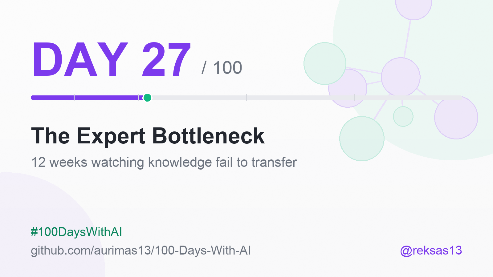

- **This is an observation study, not a method paper, and that is why it is useful.** Twelve weeks of ethnographic observation of one team building a pedagogical chatbot, plus interviews with both the developers and the domain experts. Nobody is selling a framework. The output is a description of what a real team did when the expert knowledge it needed would not come out on demand.
- **Four practices the team fell into, none of them in anyone's plan.** Creating workarounds for data collection when the intended route did not produce enough. Turning to augmentation - synthetic or model-generated material - when expert input was limited. Co-developing evaluation criteria *with* the experts rather than handing them a rubric. And a hybrid evaluation strategy mixing expert, developer and LLM judgement. Read in order, those four are a story about a team steadily lowering its dependence on a scarce human.
- **The obstacles are organisational, and one of them is uncomfortable.** The authors name expert motivation and trust, difficulty structuring participatory design, and questions around the **ownership and integration** of expert knowledge. That third one is the sharp edge. Asking a domain expert to write down their judgement is asking them to externalise the thing that makes them necessary, and a project that has not thought about what that person becomes afterwards is relying on goodwill it has not earned.
- **Co-developed evaluation criteria is the finding I would steal.** The instinct is to have engineers define correctness and then get an expert to grade against it. What the team converged on is the reverse order: the criteria themselves are the artefact the expert co-authors. That matches what evaluation practitioners argue independently - the expensive, non-delegable part is deciding what "good" means, not doing the labelling.
- **Recommendations are modest and mostly social.** Stronger AI literacy across everyone involved, transparent consent processes, and frameworks that accept the expert's role will change over the life of a project rather than being fixed at kickoff. No tooling claim.

**Why it matters:** the standard framing says the bottleneck in domain-specific AI is data. This is twelve weeks of evidence that the bottleneck is a person's willingness and standing to hand over what they know, and the project's honesty about what happens to them next. That is not a problem an engineering team can solve by trying harder.

**What I learned:** I have been assuming that if I could just get enough time with an expert, the knowledge would transfer. The ownership finding says the transfer itself is the negotiation, not the preamble to it. It reframes something in my own building too - when I write a rule into a system I am making a claim about who decides, and I have not been recording who agreed to it.

*Sources: [arXiv 2602.14357](https://arxiv.org/abs/2602.14357) (preprint, v1 16 Feb 2026; cs.HC, cs.AI). The arXiv listing states no peer-reviewed venue. The study observes ONE team building ONE pedagogical chatbot - a single-site ethnography, so the note says "a real team", never "teams". Cited as a practitioner echo rather than as evidence: Chris Lovejoy, ["How to leverage domain experts for building domain-specific vertical AI"](https://chrislovejoy.me/domain-experts-ai).*

### Day 28 - "Future of Work with AI Agents" (Shao, Zope, Jiang, Pei, Nguyen, Brynjolfsson, Yang)

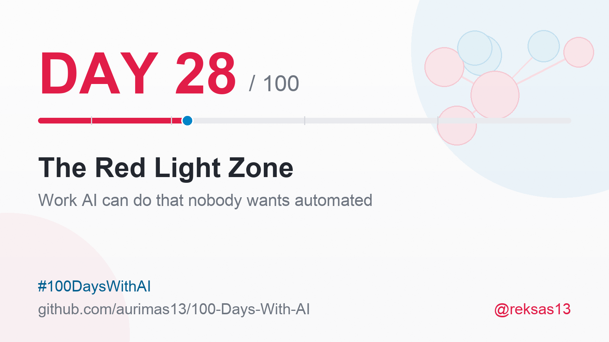

- **Two questions, asked separately, then crossed.** Most automation commentary collapses "can it?" and "should it?" into one. This paper keeps them apart: **1,500 domain workers** rate what they want automated or augmented across **844 tasks in 104 occupations**, drawn from the U.S. Department of Labor's O*NET database, while AI experts rate what is currently feasible. The interesting content is entirely in the disagreement between the two ratings.
- **Four zones, and only one of them is comfortable.** The **Automation "Green Light" Zone** - desired and capable - is where the easy wins live. The **R&D Opportunity Zone** - wanted but not yet possible - is the roadmap. The **Low Priority Zone** is neither. And then the **Automation "Red Light" Zone**: tasks that are technically automatable and that the workers doing them do not want automated. That zone is where deployments die quietly, and no model improvement touches it.
- **The Human Agency Scale is the part I would actually use.** Rather than a binary automate/do-not-automate flag, the HAS gives "a shared language to quantify the preferred level of human involvement" in a task. That turns an argument ("is this safe to automate?") into a specification a system can be built against, which is exactly the move the analyst role is supposed to make.
- **The unit of analysis is the task, not the job.** Occupations decompose into tasks with wildly different profiles, which is why "will AI take this job" is close to unanswerable and "should a system take this task, and how much human should stay in it" is tractable. Deciding which decision is worth supporting is a different skill from building the support.
- **What it does not do.** It measures stated preference and expert-assessed capability, both self-reported instruments, both point-in-time - the capability side ages fastest. It is a U.S. workforce audit built on O*NET, so occupational structure elsewhere may not map. And a worker's preference is not automatically the right answer; it is one input a company has to weigh, not a veto it has to obey.

**Why it matters:** the role the industry keeps advertising for is someone who knows which decision is worth money and can decompose it into things a system can compute. This paper is the closest thing to a public instrument for the first half of that, and the Red Light Zone is a reminder that the constraint is not always capability. Something can be buildable, valuable, and still not survive contact with the people whose work it changes.

**What I learned:** I have been picking what to automate by looking at what is annoying and technically tractable. Those are two of the four inputs. The zone framing added a third I had not been asking for - whether the person doing it wants it gone - and a fourth in the Human Agency Scale, which is how much of them should remain in the loop by design rather than by accident.

*Sources: [arXiv 2506.06576](https://arxiv.org/abs/2506.06576) (preprint, v1 6 Jun 2025, v3 1 Feb 2026; cs.CY). The arXiv listing states no peer-reviewed venue. The four zone names are quoted from the paper's own framing; per-zone task counts are not quoted, because this entry has not verified them from the full text. Cited only as the complementary half - decomposition rather than selection - and not as evidence for this paper's findings: Wei Sun, ["Decision-Centric Design for LLM Systems"](https://arxiv.org/abs/2604.00414) (preprint, v1 1 Apr 2026; cs.AI, cs.LG).*

### Day 29 - "Effective context engineering for AI agents" (Anthropic Applied AI team)

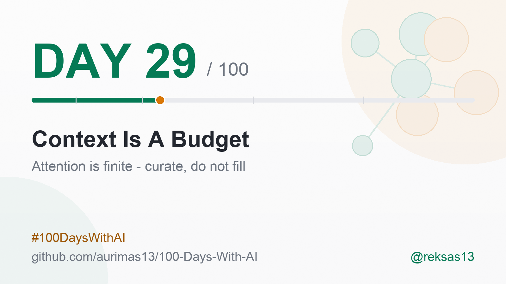

- **The reframe: context is a budget you spend, not a drawer you fill.** The piece argues for treating context as "a precious, finite resource", because attention is finite in a way storage is not - a transformer has to weigh n² pairwise relationships across n tokens, so every token added dilutes every other one. The term they use for what happens as the window fills is **context rot**. Bigger windows do not remove the constraint; they raise the price of being careless with it.
- **Prompt engineering is a subset, and the distinction is about scope.** Prompt engineering asks how to word an instruction. Context engineering asks what configuration of the entire token space - system prompt, tools, examples, retrieved documents, message history, external notes - is most likely to produce the behaviour you want, across many turns rather than one. Agents loop, and a looping system generates its own growing dataset that has to be curated as it goes.
- **Three concrete disciplines, none of them clever.** System prompts at the right altitude, organised into distinct sections rather than written as one block. Tools that are minimal and non-overlapping, with parameters that are obvious - an ambiguous tool set makes the model's decision harder before it has started. And examples that are few and canonical rather than an exhaustive catalogue of edge cases. Curated beats comprehensive in all three.
- **Just-in-time retrieval over pre-loading.** Rather than stuffing everything relevant in up front, let the agent pull what it needs through tools at runtime, using lightweight identifiers - file paths, timestamps, folder structure - as the map. Metadata carries signal about relevance that the content itself does not. In practice the recommendation is hybrid: retrieve some up front for speed, leave the rest explorable.
- **For long-horizon work, three named techniques.** **Compaction** - summarise as the window approaches its limit, keeping decisions and discarding spent tool output. **Structured note-taking** - the agent maintains persistent memory in files outside the context window, which is what lets a task survive for hours. **Sub-agent architectures** - specialised agents work in clean contexts and return condensed results to a coordinator.

**Why it matters:** the industry keeps saying that the next wave of AI professionals will come from finance, logistics, healthcare, manufacturing and media rather than from ML research. This is the document that explains what those people would actually be doing. Deciding which document, which rule, which exception and which definition earns a place in a finite attention budget is a domain judgement wearing an engineering hat. The model is not the thing you need expertise about.

**What I learned:** I had been treating a bigger context window as headroom. Framing it as an attention budget flips it into a cost, and it changed how I read my own set-ups - most of what I put in a system prompt is there because I was not sure what could be left out, which is exactly the habit the piece is arguing against. Curation is a decision, and undecided context is just cost.

*Sources: [anthropic.com/engineering](https://www.anthropic.com/engineering/effective-context-engineering-for-ai-agents) (Anthropic Engineering, 29 September 2025). Bylined to the Applied AI team - Prithvi Rajasekaran, Ethan Dixon, Carly Ryan and Jeremy Hadfield, with contributions from Rafi Ayub, Hannah Moran, Cal Rueb and Connor Jennings. **Status: a vendor engineering blog, not a paper** - a practitioner account from a model provider, with the interest that implies. The terminology quoted here - "a precious, finite resource", context rot, compaction, structured note-taking, sub-agent architectures, just-in-time retrieval - is theirs and is quoted as theirs.*

---

### Day 30 - "The New Code" (Sean Grove, OpenAI)

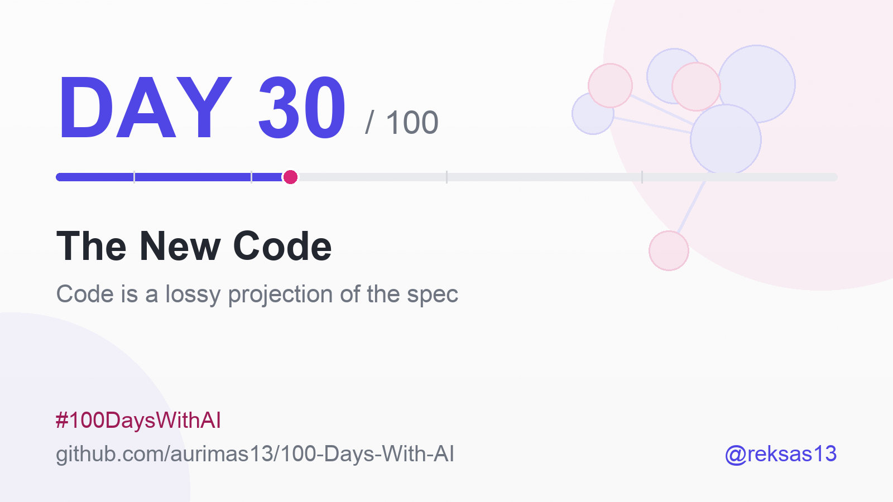

- **The claim that carries the talk: code is 10-20% of the value.** The other 80-90% is what Grove calls structured communication - working out what people actually need, planning the approach, and verifying the result. If that split is even roughly right, then most of an engineer's leverage has always sat outside the editor, and the collapse in implementation cost simply made that visible rather than causing it.
- **Code is a lossy projection of the specification.** The spec holds all the requirements and the intent; the code is one rendering of it. Grove's point is that a sufficiently precise spec can produce "good TypeScript, good Rust, servers, clients, documentation, tutorials, blog posts" - and that discarding the prompt after keeping the output, which is what most people do, is throwing away the source and keeping the build artefact.
- **The Model Spec is the worked example, and it is the practical part.** OpenAI's own specification of intended model behaviour is a living markdown document, open-sourced, contributed to by technical and non-technical people alike. Every clause carries a unique identifier and associated example prompts that act as its unit tests. That is the mechanism that turns a document from a statement of values into something enforceable - a clause you cannot test is a preference, not a specification.
- **The legal analogy is more than decoration.** Grove reads the U.S. Constitution as a national model specification: versioned by amendment, interpreted case by case, with judicial review as its evaluation loop. It is a useful frame because it makes the maintenance visible. Specs are not written once; they accumulate interpretation, and the interpretation has to be captured somewhere or it drifts back into people's heads.
- **The line worth keeping.** "Software engineering has never been about code" - it is "the precise exploration by humans of software solutions to human problems." Overstated as slogans are, it names the thing correctly: the artefact everyone optimised for was never the point, it was just the expensive part.

**Why it matters:** the working description of an AI engineer that keeps recurring is someone who spends more time on the specification and the evaluation than on the implementation, which reads as slow to anyone still assuming execution is where time goes. This talk is the clearest statement of why that is not slowness. It also closes a loop with yesterday - if a clause needs an example prompt to be testable, then writing the spec and writing the eval are the same act, done once.

**What I learned:** I keep prompts as scratch and commit the output. That is backwards by this argument, and it is a habit I can change today rather than a principle I have to agree with first. The clause-with-test-cases shape is the concrete version: if I cannot write the example that would fail, I have not specified anything, I have expressed a preference.

*Sources: [YouTube](https://www.youtube.com/watch?v=8rABwKRsec4) - "The New Code — Sean Grove, OpenAI", AI Engineer channel, recorded at AI Engineer World's Fair 2025, approx. 22 minutes. **Video ID caveat:** a second upload of the same talk circulates as `BIvILtt164I`; the link above is the AI Engineer channel upload and matches that channel's title convention, and if it ever 404s the other is the same talk. **Sourcing caveat, and it matters:** the quotations in this entry come from a published transcript summary of the talk, not from the video's own captions. They are reported as Grove's wording and should be treated as transcript-derived - the 10-20% figure and the "software engineering has never been about code" line are the two worth re-checking against the video before anyone quotes them onward. Supporting: OpenAI's Model Spec, open-sourced, referenced in the talk as the worked example.*

---

### Day 31 - "Asymmetry of verification and verifier's law" (Jason Wei)

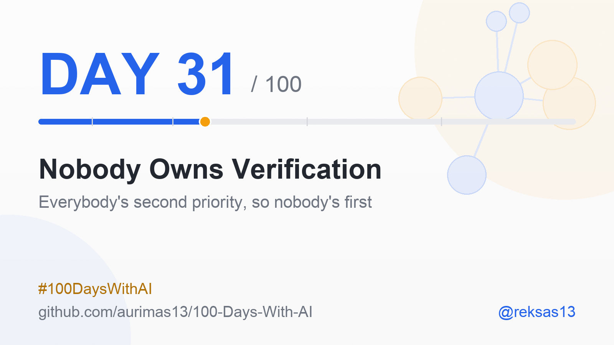

- **The asymmetry, stated plainly.** Some tasks are much harder to solve than to check. Sudoku and crosswords take a long time to fill in and a moment to validate. A website takes a team years to build and any layperson a minute to see is broken. Competition maths is hours of work and instant with an answer key. The gap between doing and checking is not a curiosity - with reinforcement learning that actually works, it is what determines where progress happens.
- **Verifier's law, verbatim.** "The ease of training AI to solve a task is proportional to how verifiable the task is. All tasks that are possible to solve and easy to verify will be solved by AI." That is a strong claim and worth holding at arm's length, but the direction is hard to argue with: capability follows measurability, and things nobody can score reliably stay stuck regardless of how much they matter.
- **Five properties that make a task cheap to verify.** Objective truth - people agree on what a good solution is. Fast to verify - seconds, not a review cycle. Scalable to verify - many solutions at once. Low noise - the verdict tracks actual quality rather than wobbling. Continuous reward - you can rank solutions, not just pass or fail them. Read that list against your own system and it doubles as a diagnostic for why a particular loop refuses to close.
- **The organisational half, which the essay does not cover and which matters more day to day.** Four kinds of work have obvious owners: someone aligns, someone specifies, someone models the language, someone builds. Verification has all four of them, and therefore none. It is universally everybody's *second* priority. That is the most convincing explanation I have seen for why so many teams describe a feedback loop they intend to close and never do.
- **The practical answer is a named person, and it is smaller than it sounds.** The evals practitioners' version of this is a single principal domain expert - a "benevolent dictator" - who is the arbiter of quality: a psychologist for a mental-health assistant, a lawyer for legal analysis. One expert eliminates annotation conflicts and prevents the paralysis of too many graders. They can take input from everyone; they still decide. Alongside that: bottom-up error analysis on real traces rather than top-down generic metrics, a purpose-built viewer so anyone can see what the system actually did, and treating the criteria as a living document because criteria drift is real.

**Why it matters:** if there is one staffing decision to take from this whole arc, it is this one. Give verification an explicit owner before you need one, because it is the phase that decides whether the other three compound or just accumulate. Alignment, specification and language modelling all produce artefacts that quietly decay unless something scores them, and scoring is precisely the job that no one is measured on.

**What I learned:** I have been treating evaluation as the thing you do after building, when the honest description is that it is the thing that makes building mean anything. The five properties gave me a diagnostic I did not have - when a loop of mine will not close, I can now ask which property is missing rather than concluding the task is just hard. Most often for me it is low noise: my own judgement of "good" moves between sittings, which is criteria drift with a personal name on it.

*Sources: [jasonwei.net](https://www.jasonwei.net/blog/asymmetry-of-verification-and-verifiers-law) (Jason Wei, 15 July 2025), freely readable in full. **Title discrepancy, stated rather than smoothed over:** the page heading reads "Asymmetry of verification and verifier's rule", while the URL and the author's own announcement say "verifier's law"; the law is quoted verbatim above and the heading here uses "law" to match the URL and the way it is cited elsewhere. Both wordings are the author's. Supporting, for the ownership half: Hamel Husain, "A Field Guide to Rapidly Improving AI Products" - [hamel.dev](https://hamel.dev/blog/posts/field-guide/) (24 March 2025), the source of the single principal domain expert framing, error analysis on real traces, the data viewer point and criteria drift. **Status: both are practitioner blog posts, not peer-reviewed work.** Verifier's law is an argued claim, not a measured result, and this entry says so.*

---

### Day 32 - "Reflections on Palantir" (Nabeel S. Qureshi)

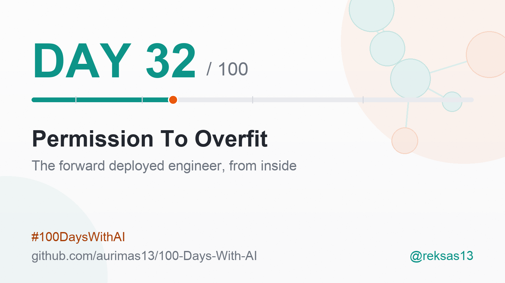

- **Two engineering populations, deliberately kept different.** Forward deployed engineers worked at customer sites three or four days a week - unusual to the point of strange for a Silicon Valley company. Product development engineers built the platform and rarely visited a customer. The division of labour is stated cleanly by the author: "Your job was to solve the problem, and not worry about overfitting; PD's job was to take whatever you'd built and generalize it, with the goal of selling it elsewhere." Permission to overfit, granted explicitly to one group and withheld from the other, is the whole mechanism.
- **What the FDE actually did was less glamorous than the title.** A year at Airbus in Toulouse: "you took disparate sources of data — work orders, missing parts, quality issues — and put them in a nice interface." The value was not in the interface. It was in knowing which of those sources to trust and what the numbers meant on a factory floor, which is knowledge you get by being in the building and cannot get from a requirements document.
- **The scarce trait was social, not technical.** Being a successful FDE "required an unusual sensitivity to social context", and the real job was to "partner with your corporate counterparts at the highest level and gain their trust." That is a different hiring profile from a strong engineer, and it explains why the role is hard to fill at scale rather than merely expensive.
- **Deployments died of politics, and the paper trail says so.** Data owners treat access as a source of power and job security, so a pilot could burn eight to twelve weeks simply getting to the data, leaving almost nothing for the work itself. The essay lists public failures - a $110 million government website that does not function, healthcare.gov, a $40 million San Francisco payroll system - as cases where politics beat substance. Access is a negotiation before it is a permission.
- **The costs were real and internal.** Small autonomous teams of four or five moved fast across many sites, and travel expenses spiralled. Culturally the bias was "get on a plane first, ask questions later." Influence tracked visible project momentum rather than title, which the author calls a "hero-shithead rollercoaster" at scale - a polite way of saying the model was unstable to be inside even while it worked commercially.

**Why it matters:** every AI company is now hiring for this shape, and mostly copying the job description rather than the structure that made it work. The structure has three parts: an engineer permitted to overfit, a separate team whose job is to generalise, and a loop between them. Hire the first without the second and you have bought consultancy. The essay is also the honest counterweight to the current enthusiasm - it describes the model from the inside, including the parts that were unpleasant.

**What I learned:** the phrase that reorganised my thinking is permission to overfit. I have been treating generalisation as a virtue to apply while building, and that is often just refusing to learn the specific case first. Solving one customer's problem badly, on purpose, with someone else responsible for making it general, is a division of labour rather than a lapse in standards - and I do not have that second person, so I should stop pretending I am both.

*Sources: [nabeelqu.co](https://nabeelqu.co/reflections-on-palantir) - Nabeel S. Qureshi, a retrospective on an eight-year stint at Palantir, also mirrored at [medium.com](https://medium.com/@nabeelqu/reflections-on-palantir-52433cf95439) (the canonical URL rate-limits automated readers, and the mirror served the same text). **Status: a personal essay, first-hand and openly partisan about its subject.** It is evidence about how the model felt and functioned from inside one company, not a study of the model's effectiveness, and this entry treats it that way throughout. **Quotation note:** quoted phrases keep the author's original American spelling ("generalize"); the surrounding prose is British per house style. **Rejected source, recorded so it is not re-attempted:** Gergely Orosz, "What are Forward Deployed Engineers, and why are they so in demand?" (The Pragmatic Engineer, 12 Aug 2025) is the best-researched piece on the role but paywalls mid-article, so it is not usable as a primary here.*

---

### Day 33 - "The GenAI Divide: State of AI in Business 2025" (MIT NANDA)

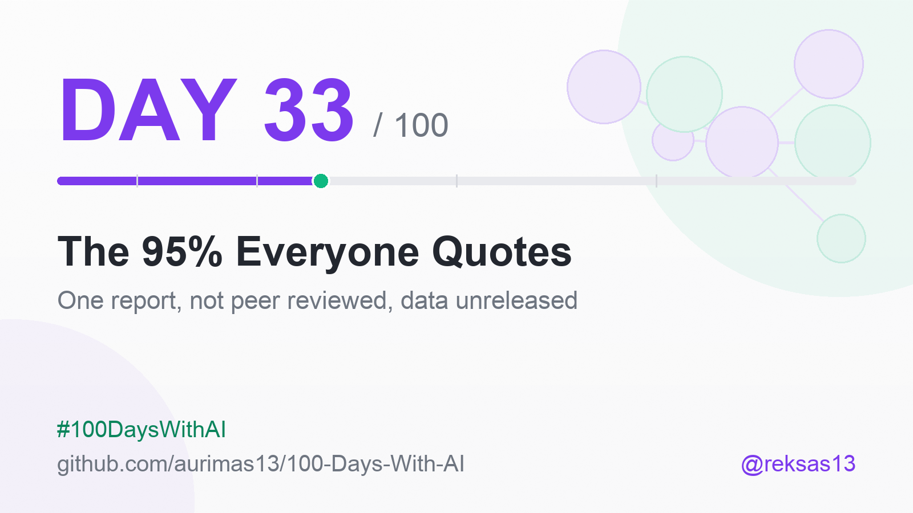

- **The claim, and where it comes from.** Roughly **95% of generative AI pilots produce no measurable profit-and-loss impact**, against something in the range of $30-40 billion of enterprise investment. The evidence base as described is 52 executive interviews, a survey of 153 leaders, and an analysis of 300 public AI deployments. The report's own framing is "high adoption but low transformation".
- **The diagnosis is the useful half, and it is not about models.** The failure is attributed to a learning gap - in the tools and in the organisations around them - rather than to model capability. The supporting shape: generic chatbots reach high adoption for trivial tasks and stall the moment a workflow needs real context and customisation, while only a small fraction of custom tools survive the crossing from pilot to production. That is an integration finding, not an intelligence finding.
- **Now the part that usually gets left out.** This is not peer-reviewed work. It was issued as preliminary findings, and after the number went viral several analysts asked the authors to publish the underlying data, with at least one arguing that the 95% figure is difficult to reconstruct from the report itself and that it should be substantiated or withdrawn. Futuriom's assessment was that the report "paints an irresponsible and unfounded picture of what's happening in Enterprise AI."
- **There is also an incentive worth naming.** NANDA's own agenda concerns agent-based, decentralised AI infrastructure. A report concluding that current enterprise AI approaches are failing is not neutral with respect to that agenda. That does not make the finding wrong; it means the finding should not be quoted as a neutral audit, which is exactly how it usually is quoted.
- **What survives all of that.** The defence offered by its supporters is the one I find persuasive: the specific percentage is fragile, and the structural claim is not. The blockage sits in integration, workflow and organisational readiness rather than in what the models can do, and that claim is independently corroborated by essentially every practitioner account of enterprise deployment. Take the direction; do not take the decimal.

**Why it matters:** this single number is doing an enormous amount of work in the market right now. It is the stated justification for a wave of AI Operations Lead postings - one internal person expected to find the manual work, build the systems, drive adoption, own governance and report a monthly result. If a role is being created off the back of a statistic, the statistic is worth reading at source, including its criticism. The role may well be justified; the evidence that is usually cited for it is weaker than its confidence suggests.

**What I learned:** the honest lesson is about my own reading rather than about enterprise AI. I had repeated the 95% figure without ever having opened the report, because it confirmed something I already believed. Going to the source did not overturn the conclusion, but it changed what I am entitled to say - "one widely cited and contested report found" is a different sentence from "95% of AI pilots fail", and only one of them is true.

*Sources: the report PDF at [mlq.ai](https://mlq.ai/media/quarterly_decks/v0.1_State_of_AI_in_Business_2025_Report.pdf) - a mirrored copy, because MIT NANDA has not hosted a stable public link. Note the `v0.1` in the filename: it is a preliminary document, and this entry says so in the note itself rather than only here. Critical coverage used for the criticism section: Futuriom, "Why We Don't Believe MIT NANDA's Weird AI Study" - [futuriom.com](https://www.futuriom.com/articles/news/why-we-dont-believe-mit-nandas-werid-ai-study/2025/08) - and [aiwiki.ai](https://aiwiki.ai/wiki/mit_genai_divide_report). **Status: a preliminary industry report, not peer-reviewed, with a documented dispute over its headline figure and a disclosed interest on the part of its publisher.** All three of those facts appear in the note above, not only in this line. **Verification limit, stated honestly:** the survey counts - 52 interviews, 153 leaders, 300 deployments - and the 95% figure are taken from the report's own summary and from coverage of it. This entry does not claim to have reproduced the analysis, and it makes no claim about per-industry breakdowns.*

---

## 🔗 Connect

**The day note goes out on all four, every morning at ~7:00 EEST.**

| | Where | What you get |
|---|---|---|
| 𝕏 | **[@reksas13](https://x.com/reksas13)** | The day's takeaway in one post, with the card - daily, ~7:00 EEST |
| 🦋 | **[@reksas13.bsky.social](https://bsky.app/profile/reksas13.bsky.social)** | The same note, mirrored - daily, ~7:00 EEST |
| 🧵 | **[@reksas13](https://www.threads.com/@reksas13)** | The same note, mirrored - daily, ~7:00 EEST |
| in | **[Aurimas Nausėdas](https://www.linkedin.com/in/aurimasnausedas/)** | The long form - the personal angle, the takeaways, what I tried |
| 📬 | **[Molecule To Machine](https://moleculetomachine.substack.com)** | Weekly newsletter, where chemistry meets AI, Robotics, Music |
| 📚 | **[Machine-Learning-Goodness](https://github.com/aurimas13/Machine-Learning-Goodness)** | The bigger resource collection this table's format came from |

 
Building something in AI, hiring, or running your own 100 days? The fastest way to reach me is a DM on any of the four.

## 📄 License

[MIT](LICENSE) - take the sources list, run your own 100 days.

 
<b>Day 33 of 100.</b> Next entry tomorrow, ~7:00 EEST.

